<p align="center">
    <strong>Universidad Peruana de Ciencias Aplicadas</strong><br>
    </img><br>
    <strong>Ingeniería de Software</strong><br>
    <strong>Desarrollo de Aplicaciones Open Source - 7357</strong><br>
    <strong>Profesor: Rafael Oswaldo Castro Veramendi </strong><br>
    <br>INFORME TRABAJO FINAL
</p>


**Project Management**


#### Startup: **IoTracker**
#### Product: **ThermaTrace**


| Member                       | Code       |
|------------------------------|------------|
| Axel Ordoñez Ricaldi         | U202216827 |
| Fabrizio Martin Panta Castro | U20231A810 |
| Jean Pierre Grandez Mansilla | U202212484 |
| Oscar Espinoza Quijandria    | u202311842 |
| Frezzia Eldaa Isabel Espinoza Paredes |  |


<br> Setiembre 2025
</center>  


| Version | Fecha      | Autor                                 | Descripcion de Modificacion                                                                                                                                                                                                                                                                                            |
|---------|------------|---------------------------------------|--------------------------------------------------------------------------------------------------------------------------------------------------------------------------------------------------------------------------------------------------------------------------------------------------------|
| 0.0     | 28/08/2025 | IoTrack                               | Se crea el documento.                                                                                                                                                                                                                                                                                              |
| 0.1     | 30/08/2025 | Axel Ordoñez Ricaldi                  | Se agregaron las imágenes y se elaboró la descripción de cada participante, junto con una presentación general de la startup dentro del perfil.                                                                                                                          |  
| 0.2     | 01/09/2025 | Axel Ordoñez Ricaldi                  | Se realizó el primer avance del Capítulo 1, que abarca el desarrollo inicial de los antecedentes y la problemática, junto con la elaboración del Lean UX Problem Statement, el registro de Assumptions y la formulación de los Hypothesis Statements.                                                                                                                      |
| 0.3     | 05/09/2025 | Oscar Leonardo Espinoza Quijandria    | Se revisó y actualizó el Capítulo 1, incorporando la sección del Lean UX Process y asegurando coherencia y claridad en el contenido. Asimismo, se integraron los aportes de los colaboradores y finalmente se subió el informe a la rama develop.                                                                                                                         |
| 0.4     | 08/09/2025 | Oscar Leonardo Espinoza Quijandria    | Se avanzó en el desarrollo del Capítulo 2, incorporando el análisis competitivo y la documentación de las entrevistas, que incluyó su diseño, registro y análisis. Además, se dejó constancia del progreso en el needfinding dentro del informe.                                                                                                                         |
| 0.5     | 12/09/2025 | Frezzia Eldaa Isabel Espinoza Paredes | Se completó el Capítulo 2 con la finalización del needfinding, el desarrollo del Big Picture EventStorming y la creación del Ubiquitous Language. Posteriormente, se revisó y editó todo el capítulo para garantizar coherencia y claridad. Finalmente, el informe actualizado fue subido a la rama develop.                                                                                        |
| 0.6     | 15/09/2025 | Frezzia Eldaa Isabel Espinoza Paredes | Se avanzó en el desarrollo del Capítulo 3, identificando las épicas que servirán de base para las user stories. Además, se registró el progreso de dichas historias de usuario y se incorporó el impact map correspondiente.                                                                                                                 |
| 0.7     | 17/09/2025 | Jean Pierre Grandez Mansilla          | Se completó el desarrollo del Capítulo 3, integrando el avance del product backlog y el trabajo colaborativo realizado en Trello. Asimismo, se fusionó la rama correspondiente al Capítulo 3 con la rama develop.                                                                                                                         |
| 0.8     | 18/09/2025 | Fabrizio Panta Castro                 | Se avanzó en el desarrollo del Capítulo 4, enfocado en el diseño del producto a través de lineamientos visuales, arquitectura de información y propuestas UI/UX. Este trabajo incluyó guías de estilo, wireframes, mock-ups y flujos de interacción que garantizan consistencia, usabilidad y coherencia en la solución tecnológica.                                                     |
| 0.9     | 20/09/2025 | Fabrizio Panta Castro                 | Se completó el desarrollo del Capítulo 4, consolidando el diseño del producto a través de prototipos, arquitectura de software, diagramas orientados a objetos y diseño de base de datos, asegurando coherencia estructural y soporte técnico para la implementación de la solución. Finalmente, se fusionó la rama correspondiente al Capítulo 4 con la rama develop.                                      |
| 1.0     | 21/09/2025 | Jean Pierre Grandez Mansilla          | Se avanzó y concluyó el desarrollo del Capítulo 5, abarcando la configuración del entorno de desarrollo, la gestión del código fuente y el despliegue de la solución tecnológica. Asimismo, se documentó el progreso de los sprints, junto con las evidencias de desarrollo, pruebas y despliegue del software. Finalmente, se fusionó la rama correspondiente al Capítulo 5 con la rama develop. |


# Project Report Collaboration Insights
[URL del repositorio](https://www.example.com)

(Imagenes de los commits cada entrega)


# Contenido


[Registro de Versiones del Informe](#registro-de-versiones-del-informe)

[Project Report Collaboration Insights](#project-report-collaboration-insights)

[Student Outcome](#student-outcome)

[Capítulo I: Introducción](#capítulo-i-introducción)

[1.1 Startup Profile](#11-startup-profile)  
[1.1.1. Descripción de la Startup](#111-descripción-de-la-startup)  
[1.1.2. Perfiles de integrantes del equipo](#112-perfiles-de-integrantes-del-equipo)  

[1.2. Solution Profile](#12-solution-profile)  
[1.2.1 Antecedentes y problemática](#121-antecedentes-y-problemática)  
[1.2.2 Lean UX Process.](#122-lean-ux-process)  
[1.2.2.1. Lean UX Problem Statements.](#1221-lean-ux-problem-statements)  
[1.2.2.2. Lean UX Assumptions.](#1222-lean-ux-assumptions)  
[1.2.2.3. Lean UX Hypothesis Statements.](#1223-lean-ux-hypothesis-statements)  
[1.2.2.4. Lean UX Canvas.](#1224-lean-ux-canvas)  

[1.3. Segmentos objetivo.](#13-segmentos-objetivo)  

[2.3. Needfinding](#23-needfinding)  
[2.3.1. User Personas](#231-user-personas)  
[2.3.2. User Task Matrix](#232-user-task-matrix)  
[2.3.3. User Journey Mapping](#233-user-journey-mapping)  
[2.3.4. Empathy Mapping](#234-empathy-mapping)  
[2.3.5. As-is Scenario Mapping](#235-as-is-scenario-mapping) 

[2.4. Ubiquitous Language](#24-ubiquitous-language)  

[Capítulo III: Requirements Specificatio](#capítulo-iii-requirements-specification)  

[3.1. To-Be Scenario Mapping](#31-to-be-scenario-mapping)    
[3.2. User Stories](#32-user-stories)  
[3.3. Impact Mapping](#33-impact-mapping)  
[3.4. Product Backlog](#34-product-backlog)  

[Capítulo IV: Product Desig](#capítulo-iv-product-design)  

[4.1. Style Guidelines](#41-style-guidelines)  
[4.1.1. General Style Guidelines](#411-general-style-guidelines)  
[4.1.2. Web Style Guidelines](#412-web-style-guidelines)  

[4.2. Information Architecture](#42-information-architecture)  
[4.2.1. Organization Systems](#421-organization-systems)  
[4.2.2. Labeling Systems](#422-labeling-systems)  
[4.2.3. SEO Tags and Meta Tag](#423-seo-tags-and-meta-tags)  
[4.2.4. Searching Systems](#424-searching-systems)   
[4.2.5. Navigation Systems](#425-navigation-systems)  

[4.3. Landing Page UI Design](#43-landing-page-ui-design)   
[4.3.1. Landing Page Wireframe](#431-landing-page-wireframe)  
[4.3.2. Landing Page Mock-up](#432-landing-page-mock-up) 

[4.4. Web Applications UX/UI Design](#44-web-applications-uxui-design)  
[4.4.1. Web Applications Wireframes](#441-web-applications-wireframes)  
[4.4.2. Web Applications Wireflow Diagrams](#442-web-applications-wireflow-diagrams)  
[4.4.2. Web Applications Mock-ups](#442-web-applications-mock-ups)   
[4.4.3. Web Applications User Flow Diagrams](#443-web-applications-user-flow-diagrams)  

[4.5. Web Applications Prototyping](#45-web-applications-prototyping)  

[4.6. Domain-Driven Software Architecture](#46-domain-driven-software-architecture)  
[4.6.1. Software Architecture Context Diagram](#461-software-architecture-context-diagram)  
[4.6.2. Software Architecture Container Diagrams](#462-software-architecture-container-diagrams)  
[4.6.3. Software Architecture Components Diagrams](#463-software-architecture-components-diagrams)  

[4.7. Software Object-Oriented Design](#47-software-object-oriented-design)  
[4.7.1. Class Diagrams](#471-class-diagrams)  
[4.7.2. Class Dictionary](#472-class-dictionary)  

[4.8. Database Design](#48-database-design)  
[4.8.1. Database Diagram](#481-database-diagram)  

[Capítulo V: Product Implementation, Validation & Deploymen](#capítulo-v-product-implementation-validation--deployment)  

[5.1. Software Configuration Management](#51-software-configuration-management)  
[5.1.1. Software Development Environment Configuration](#511-software-development-environment-configuration)  
[5.1.2. Source Code Management](#512-source-code-management)  
[5.1.3. Source Code Style Guide & Conventions](#513-source-code-style-guide--conventions)  
[5.1.4. Software Deployment Configuration](#514-software-deployment-configuration)  

[5.2. Landing Page, Services & Applications Implementation](#52-landing-page-services--applications-implementation)  
[5.2.X. Sprint ](#52x-sprint-n)  
[5.2.X.1. Sprint Planning n](#52x1-sprint-planning-n)  
[5.2.X.2. Sprint Backlog n](#52x2-sprint-backlog-n)  
[5.2.X.3. Development Evidence for Sprint Review](#52x3-development-evidence-for-sprint-review)  
[5.2.X.4. Testing Suite Evidence for Sprint Review](#52x4-testing-suite-evidence-for-sprint-review)  
[5.2.X.5. Execution Evidence for Sprint Review](#52x5-execution-evidence-for-sprint-review)  
[5.2.X.6. Services Documentation Evidence for Sprint Review](#52x6-services-documentation-evidence-for-sprint-review)  
[5.2.X.7. Software Deployment Evidence for Sprint Review](#52x7-software-deployment-evidence-for-sprint-review)  
[5.2.X.8. Team Collaboration Insights during Sprint](#52x8-team-collaboration-insights-during-sprint)  

[5.3. Validation Interviews](#53-validation-interviews)  
[5.3.1. Diseño de Entrevistas](#531-diseño-de-entrevistas)  
[5.3.2. Registro de Entrevistas](#532-registro-de-entrevistas)  
[5.3.3. Evaluaciones según heurísticas](#533-evaluaciones-según-heurísticas)  

[5.4. Video About-the-Product](#54-video-about-the-product)  

[Conclusiones](#conclusiones)  
[Conclusiones y recomendaciones](#conclusiones-y-recomendaciones)  
[Video About-the-Team](#video-about-the-team)  
[Bibliografía](#bibliografía)  
[Anexos](#anexos)  

# Student Outcome
|Criterio Especifico|Acciones Realizadas|Conclusiones|
|-|-|-|
|Participa en equipos multidisciplinarios con eficacia, eficiencia y objetividad, en el marco de un proyecto en soluciones de ingeniería de software.|Compañero1:<br> *TB1:*  Su texto *TB2:* texto etc.. |Su texto de conclusion|
|Conoce al menos un sector empresarial o dominio de aplicación de soluciones de software.|Compañero1:<br> *TB1:*  Su texto<br> *TB2:* texto etc.. |Su texto de conclusion|
# Capítulo I: Introducción
## 1.1. Startup Profile
### 1.1.1. Descripción de la Startup

Nuestra startup nace con un propósito claro: garantizar que los medicamentos sensibles se conserven siempre en las condiciones adecuadas, evitando riesgos para la salud y pérdidas económicas por fallas en la cadena de frío. Creemos que el acceso a tratamientos seguros no debe depender de controles manuales poco fiables, sino de herramientas tecnológicas simples y confiables.
Nuestra plataforma digital ofrece un sistema intuitivo para monitorear, registrar y recibir alertas sobre la temperatura de refrigeración de medicamentos en tiempo real. A través de una experiencia visual y clara, los usuarios pueden supervisar el estado de sus equipos de refrigeración desde cualquier lugar, detectar desviaciones a tiempo y contar con reportes automáticos para auditorías y cumplimiento normativo.
El sistema está diseñado pensando en farmacias, hospitales, clínicas y cadenas de distribución, que requieren un control constante y trazable de sus inventarios médicos. Inicialmente, ofrecemos una versión web con datos simulados para demostrar la experiencia de uso y el valor de la solución, con la visión de integrar sensores IoT, aplicaciones móviles y tecnologías adicionales en fases posteriores.
Nuestra propuesta de valor combina seguridad, simplicidad y confiabilidad. Queremos que supervisar la cadena de frío sea tan fácil como abrir una aplicación, reduciendo riesgos, mejorando la eficiencia operativa y fortaleciendo la confianza de pacientes e instituciones.

**Misión:** Democratizar el acceso a sistemas de monitoreo avanzados que aseguren la conservación óptima de medicamentos, protegiendo la salud de las personas y reduciendo pérdidas en el sector salud.

**Visión:** Convertirnos en un referente global en soluciones de trazabilidad y monitoreo inteligente, impulsando un modelo de salud más seguro, eficiente y tecnológicamente conectado.

Más que una plataforma, queremos ser un aliado estratégico para las instituciones de salud, construyendo un ecosistema donde la tecnología no sea un lujo, sino una garantía de confianza y bienestar para todos.


#### 1.1.2. Perfiles de integrantes del equipo
| Miembros del equipo                                                                                                                                                                                                                    | Codigo Estudiante | Carrera                | Conocimientos / Habilidades                                                                                                                                                                                                      |
|----------------------------------------------------------------------------------------------------------------------------------------------------------------------------------------------------------------------------------------|-------------------|------------------------|----------------------------------------------------------------------------------------------------------------------------------------------------------------------------------------------------------------------------------|
| Axel Randall Ordoñez Ricaldi 	                                      | U202216827        | Ingenieria de software | C++, React, Vue, Angular, C#, SQL, MongoDB, Python. Paciencia y buen trabajo en equipo                                                                                                                                           |
| Panta Castro, Fabrizio Martin   | U20231A810        | Ingeniería de Software | SQL, Python, Flutter, Vue, C++. Compañerismo y responsable con las entregas.                                                                                                                                                     |
| Oscar Espinoza Quijandria                                                                            | U202311842        | Ing. Software          | Lenguajes: js py c# c++ pearl. Base de datos : SqlServer, Mysql, Sqlite, Mongodb . Frameworks: Angular, Vue, .net Core, Django. Soy alguien al que le gusta trabajar en equipo, soy perceverante y me gusta dar todo de mi mismo |
| Jean Pierre Grandez Mansilla                                                            | U202212484        | Ing. de Software       | JS, Python, React, C#, SQL, AWS, NextJ, MongoDB. Entusiasta por la tecnología y dispuesto a aprender.                                                                                                                            |
|                                                                                                                                                                                                                                        |                   |                        |                                                                                                                                                                                                                                  |

## 1.2. Solution Profile
### 1.2.1 Antecedentes y problemática
En los últimos años, el sector salud ha enfrentado crecientes desafíos relacionados con la conservación y distribución segura de medicamentos sensibles, especialmente aquellos que requieren estrictos controles de temperatura, como vacunas, insulinas y productos biológicos. La pandemia de COVID-19 puso de relieve la importancia de la cadena de frío, evidenciando que un fallo en el control de condiciones de almacenamiento puede tener consecuencias graves en la efectividad de los tratamientos y en la seguridad de los pacientes.

A nivel global, las tecnologías de monitoreo en tiempo real y trazabilidad mediante IoT han comenzado a consolidarse como herramientas clave para garantizar la calidad de los fármacos y cumplir con las normativas sanitarias. Sin embargo, en gran parte de Latinoamérica —y particularmente en el Perú—, la adopción de estas soluciones sigue siendo limitada. Los factores que explican esta brecha son la dependencia de controles manuales poco confiables, los altos costos de implementación de sistemas avanzados y la falta de plataformas intuitivas que simplifiquen el proceso para farmacias, hospitales y centros de distribución.

Actualmente, muchas instituciones del sector salud carecen de mecanismos integrados para monitorear la temperatura en tiempo real. Cuando existen, suelen estar restringidos a grandes cadenas farmacéuticas o clínicas privadas con mayor presupuesto, dejando de lado a la mayoría de farmacias independientes, boticas locales y clínicas de menor escala. Esto genera un riesgo constante: pérdidas económicas por medicamentos dañados, incumplimiento de normativas y, lo más crítico, amenazas directas a la salud de los pacientes.

La problematica se puede resumir en los siguientes puntos:

- **Dependencia de controles manuales poco confiables:** la mayoría de farmacias, hospitales y clínicas registran temperaturas en planillas físicas o sistemas aislados, lo que incrementa el riesgo de errores humanos y fallos de supervisión.

- **Accesibilidad limitada:** las soluciones tecnológicas de monitoreo existentes suelen estar dirigidas a grandes instituciones con alta capacidad de inversión, dejando excluidas a farmacias y centros pequeños.

- **Falta de trazabilidad y reportes automáticos:** los sistemas tradicionales no permiten generar registros auditables ni reportes en tiempo real, dificultando el cumplimiento de normas regulatorias y procesos de fiscalización sanitaria.

- **Altos costos de implementación:** integrar sensores avanzados o plataformas propietarias implica inversiones significativas en hardware, licencias y soporte técnico especializado, lo que limita su adopción masiva.

- **Impacto en la salud y en la economía:** las fallas en la cadena de frío no solo provocan pérdidas económicas por medicamentos dañados, sino que también pueden poner en riesgo la seguridad de los pacientes al administrar productos en mal estado.

En este contexto surge la necesidad de contar con soluciones accesibles, seguras y confiables que permitan democratizar el monitoreo de la cadena de frío, ofreciendo a las instituciones de salud herramientas simples para garantizar la trazabilidad y seguridad en el almacenamiento de medicamentos.

**1. What (¿Qué?)**

El sector salud enfrenta dificultades para garantizar la correcta conservación de medicamentos sensibles que requieren cadena de frío. Actualmente, muchas farmacias, hospitales, clínicas y centros de distribución dependen de controles manuales poco confiables, como registros en planillas o verificaciones esporádicas, que no permiten un monitoreo continuo ni la detección oportuna de desviaciones de temperatura. Las soluciones existentes suelen ser complejas o costosas, restringidas a grandes instituciones, dejando sin alternativas accesibles a la mayoría de actores del sistema.

**2. Why (¿Por qué?)**

Esto ocurre porque los métodos tradicionales presentan limitaciones significativas: los registros manuales son propensos a errores humanos, las soluciones de monitoreo actuales implican altos costos de hardware, licencias y soporte, y la mayoría carece de automatización para emitir alertas en tiempo real o generar reportes auditables. Como consecuencia, las instituciones del sector salud quedan expuestas a pérdidas económicas por medicamentos dañados y, lo más grave, a riesgos sanitarios para los pacientes.

**3. Who (¿Quién?)**

El problema afecta directamente a farmacias y boticas, que requieren monitoreo constante de inventarios pequeños pero sensibles; a hospitales y clínicas, que manejan grandes volúmenes de medicamentos críticos bajo presión de auditorías; y a centros de distribución y laboratorios farmacéuticos, que necesitan trazabilidad durante transporte y almacenamiento. De forma indirecta, impacta también en los pacientes, quienes pueden recibir tratamientos comprometidos por fallas en la cadena de frío.

**4. Where (¿Dónde?)**

La problemática se manifiesta en toda la cadena de suministro y almacenamiento de medicamentos: en farmacias locales con recursos limitados para implementar tecnología, en hospitales y clínicas que deben cumplir protocolos de bioseguridad y auditorías regulatorias, y en centros de distribución que requieren garantizar condiciones adecuadas desde el origen hasta la entrega final.

**5. When (¿Cuándo?)**

Este problema es actual y cada vez más urgente, ya que la demanda de medicamentos biológicos y tratamientos refrigerados crece constantemente. La pandemia de COVID-19 visibilizó la necesidad de cadenas de frío confiables y trazables, y hoy, en un contexto donde la digitalización y la seguridad del paciente son prioridades, seguir dependiendo de controles manuales representa un riesgo inaceptable.

**6. How (¿Cómo?)**

La situación se refleja en errores frecuentes por registros manuales incompletos o tardíos, en la ausencia de alertas en tiempo real que permitan acciones preventivas, en las dificultades para cumplir auditorías sanitarias por falta de reportes históricos confiables y en la exclusión de pequeños actores del sector, que no pueden acceder a soluciones diseñadas para instituciones de gran escala y alto presupuesto.

**7. How much (¿Cuánto?)**

El costo de esta problemática es elevado: la Organización Mundial de la Salud estima que más del 25 % de las vacunas a nivel global se pierde por fallas en la cadena de frío; una desviación de temperatura puede significar pérdidas de miles de dólares en inventario para una farmacia u hospital; y los sistemas de monitoreo actuales requieren inversiones que ascienden a decenas de miles de dólares, inaccesibles para instituciones pequeñas o medianas, sin garantizar siempre escalabilidad ni simplicidad en su uso.


### 1.2.2 Lean UX Process.
#### 1.2.2.1. Lean UX Problem Statements.
Nuestra startup es una plataforma digital que permite a farmacias, hospitales, clínicas y centros de distribución garantizar la conservación adecuada de medicamentos sensibles mediante un sistema de monitoreo en tiempo real, accesible e intuitivo. Buscamos democratizar el acceso a tecnologías de cadena de frío seguras y confiables, reduciendo riesgos para la salud, pérdidas económicas y barreras técnicas en el sector salud.

**Contexto:** Nuestra plataforma está diseñada para supervisar equipos de refrigeración de forma remota, generando alertas inmediatas ante desviaciones de temperatura y reportes automáticos para auditorías. El objetivo es ofrecer una herramienta sencilla y confiable que ayude a instituciones de salud a cumplir normativas sanitarias y a proteger la calidad de sus inventarios médicos.

**Observación del problema:** Sin embargo, hemos identificado que muchas instituciones aún dependen de controles manuales poco confiables o de soluciones tecnológicas costosas y complejas, lo que limita la adopción de sistemas efectivos. Farmacias pequeñas y clínicas locales carecen de opciones accesibles, mientras que hospitales y centros de distribución enfrentan dificultades para garantizar trazabilidad y auditoría en toda la cadena de frío. Estas observaciones provienen de estudios del sector, organismos internacionales y entrevistas con actores de salud, quienes señalan la necesidad de soluciones simples y adaptables.

**Impacto:** Esta situación genera pérdidas económicas considerables por medicamentos dañados, incumplimiento de requisitos regulatorios y, lo más grave, riesgos para la salud de los pacientes al administrar tratamientos comprometidos. Además, la falta de accesibilidad tecnológica profundiza la brecha entre instituciones grandes y pequeñas, afectando la equidad en el acceso a medicamentos seguros y disminuyendo la confianza en los servicios de salud.

**Necesidad insatisfecha:** Actualmente, las instituciones requieren soluciones integradas, accesibles y fáciles de implementar que permitan monitorear y auditar la cadena de frío de manera continua y confiable. Al mismo tiempo, necesitan plataformas intuitivas que reduzcan la dependencia de registros manuales y soporte técnico especializado, optimizando la eficiencia operativa y garantizando la seguridad de los medicamentos.

**Pregunta de mejora:** ¿Cómo podríamos simplificar y democratizar el monitoreo de la cadena de frío en el sector salud para que farmacias y hospitales adopten estas soluciones de forma accesible, incrementando así la seguridad de los pacientes, la eficiencia operativa y la confiabilidad en la conservación de medicamentos?

#### 1.2.2.2. Lean UX Assumptions.
En la fase inicial de desarrollo de nuestra plataforma para el sector salud, hemos identificado y estructurado un conjunto de supuestos siguiendo la metodología Lean UX. Estos supuestos representan nuestras creencias iniciales sobre quiénes son nuestros usuarios, cuáles son sus necesidades prioritarias, cómo funcionará el modelo de negocio, qué resultados esperamos alcanzar y cuáles son las funcionalidades clave que permitirán validar la propuesta de valor. Formalizar estas creencias nos permitirá enfocar el diseño y desarrollo en la validación temprana, minimizar riesgos y garantizar que la estrategia del producto esté alineada con las necesidades reales de farmacias, hospitales, clínicas y centros de distribución.

Los supuestos se han clasificado en cinco categorías principales para una mejor estructuración:

- **User Assumptions:** Nuestras creencias sobre las necesidades, motivaciones y comportamientos de farmacias, hospitales, clínicas y centros de distribución al buscar soluciones de monitoreo de cadena de frío accesibles, confiables y fáciles de usar.

- **User Outcome Assumptions:** Los beneficios tangibles y mejoras en eficiencia, seguridad, cumplimiento regulatorio y satisfacción que anticipamos que experimenten los usuarios al integrar la plataforma en sus procesos.

- **Business Assumptions:** Hipótesis sobre la viabilidad y escalabilidad del modelo de negocio en el sector salud, considerando dinámicas de adopción tecnológica, regulaciones y alianzas estratégicas.

- **Business Outcome Assumptions:** Los resultados medibles que proyectamos generar para la startup, como aumento de ingresos recurrentes, reducción de costos operativos, diferenciación en el mercado y fortalecimiento de la retención de clientes.

- **Feature Assumptions:** Nuestras creencias sobre cómo funcionalidades específicas de la plataforma (ej. monitoreo en tiempo real, alertas automáticas, reportes para auditorías, integración con IoT) resolverán problemas críticos de los usuarios y validarán nuestras hipótesis de negocio.

Estos supuestos formarán la base de nuestra estrategia de diseño y validación continua, guiando la evolución de la plataforma hacia una solución que realmente democratice el acceso a tecnologías de conservación segura de medicamentos.

**User Assumptions**
- Creemos que el 70% de las farmacias pequeñas y clínicas locales buscan soluciones de monitoreo accesibles y fáciles de usar, porque actualmente carecen de alternativas tecnológicas confiables que no requieran inversión elevada.

- Creemos que el 85% de los hospitales y centros de distribución valoran la trazabilidad completa de la cadena de frío, porque el cumplimiento normativo y la auditoría son críticos en sus operaciones.

- Creemos que el 60% de los responsables de farmacia priorizan recibir alertas inmediatas ante desviaciones de temperatura, ya que los controles manuales generan errores humanos y pérdidas.

- Creemos que el 75% de los usuarios no técnicos (farmacéuticos, asistentes, personal de enfermería) necesitan interfaces simples e intuitivas, porque no cuentan con formación en sistemas tecnológicos avanzados.

- Creemos que el 50% de las instituciones medianas y grandes están dispuestas a migrar de sistemas manuales a plataformas digitales si estas reducen el riesgo de sanciones regulatorias y pérdidas económicas.

**User Outcome Assumptions**
- Creemos que si los usuarios tienen un sistema de monitoreo en tiempo real, entonces reducirán en al menos 30% las pérdidas por medicamentos dañados durante los primeros seis meses.

- Creemos que si la plataforma genera reportes automáticos de cumplimiento, entonces al menos el 65 % de las instituciones los usarán como evidencia principal en auditorías.

- Creemos que si los usuarios reciben alertas preventivas, entonces la confianza en la seguridad de sus inventarios médicos aumentará en un 40% en encuestas de satisfacción.

- Creemos que si las farmacias pequeñas tienen acceso a una solución accesible, entonces su adopción de monitoreo digital se incrementará en un 50% en el primer año.

**Business Assumptions**
- Creemos que el 60% de los ingresos provendrá de suscripciones mensuales de farmacias, clínicas y hospitales, mientras que el 40% vendrá de contratos con centros de distribución y alianzas con proveedores de salud.

- Creemos que la demanda inicial se concentrará en farmacias y clínicas pequeñas, porque son las más afectadas por pérdidas y la falta de cumplimiento regulatorio.

- Creemos que un modelo SaaS con planes escalonados (básico, profesional y enterprise) será viable, ya que permite adaptarse a las necesidades de diferentes tamaños de instituciones.

- Creemos que las regulaciones sanitarias cada vez más estrictas impulsarán la adopción de nuestra plataforma como una herramienta necesaria para el sector salud.

- Creemos que podremos establecer al menos 5 alianzas estratégicas con distribuidores de equipos de refrigeración e IoT, lo que nos permitirá acelerar la penetración de mercado.

**Business Outcome Assumptions**
- Creemos que si la plataforma es adoptada por al menos 100 farmacias y clínicas en el primer año, entonces generaremos un flujo recurrente de ingresos que garantizará la sostenibilidad inicial.

- Creemos que si reducimos los incidentes de pérdida de medicamentos en al menos un 30%, entonces aumentaremos la retención de clientes en un 70% tras el primer año.

- Creemos que si las instituciones logran cumplir más fácilmente con normativas, entonces incrementaremos nuestra tasa de conversión de pruebas piloto a contratos pagos en un 25%.

- Creemos que si cerramos alianzas con distribuidores de equipos, entonces reduciremos el costo de adquisición de clientes (CAC) en un 20% gracias a ventas indirectas.

**Feature Assumptions**
- Creemos que un panel de monitoreo en tiempo real permitirá a los usuarios supervisar fácilmente múltiples equipos, logrando que el 80 % lo consulte diariamente en el primer mes.

- Creemos que la funcionalidad de alertas automáticas reducirá incidentes críticos, con el 70% de los usuarios configurando alertas personalizadas en los primeros 30 días.

- Creemos que los reportes automáticos descargables serán usados como evidencia en auditorías, alcanzando al 60% de uso en instituciones con regulaciones estrictas.

- Creemos que la integración con sensores IoT mejorará la confiabilidad del sistema, logrando que el 50% de los clientes adopten esta opción en el primer año.

- Creemos que una interfaz intuitiva y multiusuario reducirá la dependencia de soporte técnico, alcanzando que el 40% de los problemas se resuelvan vía autoservicio (FAQs o chatbot).
#### 1.2.2.3. Lean UX Hypothesis Statements.

- **Accesibilidad para pequeñas farmacias y clínicas**
Creemos que las farmacias y clínicas pequeñas adoptarán nuestra plataforma porque podrán monitorear la cadena de frío de manera accesible y sin necesidad de personal especializado en TI. Sabremos que hemos tenido éxito cuando al menos el 50% de los clientes iniciales sean instituciones pequeñas que antes usaban controles manuales.

- **Confianza y reducción de riesgos en hospitales y centros de distribución**
Creemos que los hospitales y centros de distribución valorarán la plataforma porque les permitirá garantizar trazabilidad y auditoría en todo momento. Sabremos que hemos tenido éxito cuando al menos el 70% de los usuarios indiquen en encuestas que confían más en la conservación de medicamentos tras tres meses de uso

- **Ahorro de tiempo en gestión operativa**
Creemos que la automatización de reportes reducirá significativamente el tiempo invertido en controles manuales. Sabremos que hemos tenido éxito cuando los usuarios reporten una reducción del 40% en el tiempo destinado a registros manuales en las primeras 6 semanas.

- **Prevención de pérdidas económicas**
Creemos que las alertas en tiempo real disminuirán las pérdidas de medicamentos dañados. Sabremos que hemos tenido éxito cuando los usuarios reporten al menos un 30% de reducción en pérdidas por fallas de conservación tras seis meses de uso.

- **Democratización de la tecnología**
Creemos que un modelo de precios flexible permitirá que instituciones pequeñas y grandes adopten la plataforma sin barreras económicas significativas.
Sabremos que hemos tenido éxito cuando al menos el 60% de nuestros clientes correspondan a instituciones con presupuestos reducidos.

- **Escalabilidad en el sector salud**
Creemos que nuestra solución podrá ser escalada desde farmacias hasta hospitales y cadenas de distribución sin necesidad de personalización costosa. Sabremos que hemos tenido éxito cuando logremos contratos con al menos tres tipos de instituciones diferentes en el primer año.

- **Crecimiento sostenido en la adopción**
Creemos que al ofrecer una solución accesible y confiable, lograremos un crecimiento continuo en clientes. Sabremos que hemos tenido éxito cuando alcancemos una tasa de retención superior al 70% y un crecimiento mensual del 15% en usuarios activos durante el primer año.

- **Generación de confianza en el mercado**
Creemos que ser percibidos como una herramienta que facilita el cumplimiento normativo aumentará nuestra credibilidad en el sector salud. Sabremos que hemos tenido éxito cuando al menos el 50% de los clientes indiquen que nos eligieron por apoyo en auditorías y normativas.

- **Alertas inmediatas como diferenciador**
Creemos que las notificaciones en tiempo real serán el factor clave de diferenciación frente a controles manuales o sistemas costosos. Sabremos que hemos tenido éxito cuando al menos el 80% de los usuarios configuren y respondan a una alerta en el primer mes.

- **Reportes automáticos para auditorías**
Creemos que la generación de reportes automáticos simplificará la preparación para auditorías sanitarias. Sabremos que hemos tenido éxito cuando el 70% de los usuarios utilicen los reportes generados por la plataforma en auditorías reales.

- **Interfaz intuitiva**
Creemos que una interfaz simple permitirá que personal no técnico pueda manejar el sistema sin capacitaciones extensas. Sabremos que hemos tenido éxito cuando al menos el 60% de los nuevos usuarios logren configurar un equipo de refrigeración sin solicitar soporte.

#### 1.2.2.4. Lean UX Canvas.


## 1.3. Segmentos objetivo.
| | Segmento 1 | Segmento 2  |
| - | - |-|
| Variables                 | Hospitales | Farmacias |
| Geográfica                | Principalmente en áreas urbanas y semiurbanas de Perú y Latinoamérica, donde existe mayor concentración de hospitales públicos y privados que manejan altos volúmenes de medicamentos sensibles. | Ubicadas en zonas urbanas y suburbanas, incluyendo distritos céntricos y barrios residenciales con alta demanda de medicamentos, especialmente en farmacias independientes y cadenas locales. |
| Demográfica               | Edad de directores y responsables: 35-60 años; Género: Mixto; Educación: Profesionales con estudios en medicina, farmacia o gestión hospitalaria; Ingresos: Institucionales (presupuestos medios y altos); Estado civil variado. | Propietarios o administradores de farmacias de 28-50 años; Género: Mixto; Educación: Técnicos en farmacia, farmacéuticos o administradores; Ingresos: Medio; Estado civil variado; generalmente familias o negocios familiares. |
| Psicológica               | Orientados al cumplimiento normativo y la seguridad del paciente. Valoran soluciones confiables, escalables y auditables que garanticen trazabilidad completa. Personalidad práctica, orientada a procesos y resultados, con alta responsabilidad en la gestión de inventarios. | Buscan accesibilidad y simplicidad en la gestión. Valoran la facilidad de uso, el ahorro de tiempo y la reducción de pérdidas económicas. Prefieren soluciones intuitivas y de bajo costo que no requieran conocimientos técnicos avanzados. |
| Función de comportamiento | Alta frecuencia en la necesidad de generar reportes auditables, trazabilidad completa de inventarios y cumplir protocolos regulatorios estrictos. Fidelidad a soluciones que reduzcan riesgos de sanciones y mejoren eficiencia operativa. Barreras: costos de integración tecnológica y resistencia al cambio organizacional. | Uso frecuente de herramientas básicas de control. Adoptan nuevas tecnologías si son intuitivas y económicas. Alta motivación por prevenir pérdidas y mejorar la rentabilidad. Barreras: limitaciones presupuestarias y escasa capacitación tecnológica del personal. |

---

# Capítulo II: Requirements Elicitation & Analysis
## 2.1. Competidores.

Se han identificado los siguientes competidores en el mercado de soluciones de monitoreo de cadena de frío para el sector salud:

- **Competidor 1: Sensitech**
  - **Descripción:** Sensitech es una empresa global que ofrece dispositivos de monitoreo en tiempo real, dataloggers desechables y reutilizables, y una plataforma de visibilidad llamada ColdStream®, que integra datos tanto en almacenamiento como en transporte.
- **Competidor 2: Exolinked**
  - **Descripción:** Exolinked es una empresa latinoamericana enfocada en soluciones IoT de cadena de frío. Su plataforma digital permite monitorear en tiempo real temperatura, humedad y consumo energético, centralizando los datos en la nube y generando alarmas automáticas cuando se detectan desviaciones predefinidas.
- **Competidor 3: Netux**
  - **Descripción:** Netux se especializa en tecnologías para el sector salud. Desarrolla un sistema de monitoreo en tiempo real que recopila variables críticas en refrigeración de medicamentos y vacunas, integrando datos en la nube para ofrecer trazabilidad completa, reportes automáticos e informes auditables.
### 2.1.1. Análisis competitivo.

| Competitive Analysis Landscape                          |                                                                                                                                                                                                                                                                                                                                                                                                                                 |
| ------------------------------------------------------- |---------------------------------------------------------------------------------------------------------------------------------------------------------------------------------------------------------------------------------------------------------------------------------------------------------------------------------------------------------------------------------------------------------------------------------|
| ¿Por qué llevar a cabo este análisis?                   | Este análisis nos permite identificar a nuestros principales competidores que ya ofrecen soluciones digitales e IoT de monitoreo de la cadena de frío farmacéutica en Latinoamérica y a nivel global.<br/> Así podemos contrastar nuestra propuesta de valor, sobre el segmento objetivo y el posicionamiento local para poder desarrollar una solución que se destaque en el mercado y se diferencie de nuestros competidores. |


|                         |                             | **Nuestra Startup**                                                                                                                                                            | **Exolinked (LatAm)**                                                                                                 | **Netux (Col/LatAm)**                                                                                                             | **Sensitech (Global)**                                                                                                                          | 
|-------------------------|-----------------------------|--------------------------------------------------------------------------------------------------------------------------------------------------------------------------------|-----------------------------------------------------------------------------------------------------------------------|-----------------------------------------------------------------------------------------------------------------------------------|-------------------------------------------------------------------------------------------------------------------------------------------------|
| **PERFIL**              | Overview                    | Plataforma **web** para monitoreo en tiempo real de medicamentos, con **alertas** y **reportes automáticos**. Foco inicial: **Perú/LatAm**, farmacias y clínicas subatendidas. | Empresa IoT de LatAm que ofrece **monitoreo de cadena de frío** (T°, HR, energía) con datos en la nube y **alarmas**. | Empresa colombiana especializada en **salud**, con **sistema de monitoreo** de T° para vacunas, medicamentos y bancos de sangre.  | Multinacional Carrier con soluciones **end-to-end** para farma, usando **monitores en tiempo real** y plataforma **ColdStream®**.               |
| **PERFIL**              | Ventaja competitiva (valor) | **Simplicidad + accesibilidad**. Reportes alineados a **auditorías** y precios bajos.                                                                                          | **Protocolos de implementación claros**, escalabilidad IoT, consultoría en integración HW+SW.                         | **Vertical en salud**, reportes auditables listos para farmacias, clínicas y hospitales.                                          | **Cumplimiento global (GxP, 21 CFR, EU)** y trazabilidad **integral** en transporte y almacenamiento.                                           |
| **Perfil de Marketing** | Mercado objetivo            | Farmacias, boticas, clínicas, hospitales, centros de distribución.                                                                                                             | Sectores de logística, retail y salud que requieren trazabilidad.                                                     | Hospitales, clínicas, farmacias y bancos de sangre en LatAm.                                                                      | Empresas farmacéuticas, distribuidoras y operadores logísticos a nivel global.                                                                  |
| **Perfil de Marketing** | Estrategia de marketing     | Go-to-market local con **alianzas en Perú**, inbound con foco en **cumplimiento MINSA y DIGEMID**.                                                                             | Marketing consultivo y B2B, con **casos de uso** y servicios personalizados.                                          | Marketing orientado a **salud** (vacunas, medicamentos), casos clínicos y regulación.                                             | **Enterprise marketing** con whitepapers, casos globales y venta corporativa.                                                                   |
| **Perfil de Producto**  | Productos & servicios       | Plataforma SaaS (dashboard, alertas, reportes). Roadmap IoT y app móvil.                                                                                                       | Monitoreo de T°, HR, consumo energético. Plataforma cloud + alarmas.                                                  | Monitoreo T° en tiempo real, trazabilidad, geolocalización, reportes automáticos.                                                 | Monitores/dataloggers en tiempo real, **ColdStream®**, reportes de cumplimiento.                                                                |
| **Perfil de Producto**  | Precios & costos            | Modelo SaaS accesible para presupuestos limitados de farmacias y hospitales peruanos                                                                                           | SaaS + HW bajo cotización.                                                                                            | SaaS + HW bajo cotización.                                                                                                        | Enterprise HW + SaaS, bajo cotización.                                                                                                          |
| **Perfil de Producto**  | Canales (Web/Móvil)         | Web responsive, app móvil futura, distribución directa + alianzas farmacéuticas locales.                                                                                       | Web (cloud) + IoT.                                                                                                    | Web (nube), apps y módulos en salud.                                                                                              | Web (plataforma enterprise).                                                                                                                    |
| **Análisis SWOT**       | Fortalezas                  | Nuestra solución se enfoca cubrir las necesidades del sector farmaceutico Peruano sin competencia directa.                                                                     | Experiencia en IoT multisector, protocolos claros de implementación, escalabilidad en variables (T°, HR, energía).    | Cuentan con un enfoque total en salud, casos reales en vacunas y medicamentos, además de reportes auditables .                    | Son una solución consolidada y reconocida a nivel global además de contar con mas de 20 años en el mercado.                                     |
| **Análisis SWOT**       | Debilidades                 | Recursos limitados para poder realizar un MVP con hardware propio y sin financiamiento para generar campañas para atraer usuarios de interés.                                  | Menor especialización 100% en farma (se reparte entre logística y retail).                                            | No son tan accesibles de cara a sus clientes dado que tiene un enfoque en farmaceuticas grandes ajustadas a cada tipo de cliente. | Costos elevados y una complejidad elevada para la integración en la mayoría de su público objetivo.                                             |
| **Análisis SWOT**       | Oportunidades               | Un potencial crecimiento en la transformación digital en el sector salud y sin competencia directa que abarque el mercado Peruano.                                             | Expandir oferta verticalizada a salud; consolidar presencia regional con partners.                                    | Expandir su cobertura a farmacias y clínicas pequeñas para ofrecerles soluciones más asequibles y ganando gran parte del mercado. | Contratos directos con ministerios de salud o partnerships con clínicas reconocidas.                                                            |  
| **Análisis SWOT**       | Amenazas                    | El ingreso de competidores consolidados en el rubro al sector peruano, modificaciones en la normativa del sector farmaceutico en el Perú.                                      | Nuevas startups especializadas en farmacia que ofrezcan soluciones más simples y económicas.                          | Soluciones con mayor acercamiento a un público menor pero con propuestas de menor costo para estandarizarse en el mercado.        | Soluciones más ligeras pero más faciles de integrar a sus clientes y con un costo menor con las mismas funcionalidades o propuesta de solución. |


### 2.1.2. Estrategias y tácticas frente a competidores.

Para destacar nuestra startup en el competitivo mercado de soluciones de monitoreo de cadena de frío para el sector salud, hemos desarrollado una serie de estrategias y tácticas específicas que nos permitirán diferenciarnos efectivamente de nuestros competidores. Estas acciones están diseñadas para resaltar nuestras fortalezas, abordar nuestras debilidades, aprovechar las oportunidades del mercado y mitigar las amenazas potenciales.

- **Diferenciación por Simplicidad y Accesibilidad**
  - Desarrollar una plataforma intuitiva y fácil de usar, con un enfoque en la experiencia del usuario (UX) que permita a personal no técnico gestionar el monitoreo sin necesidad de capacitación extensa.
  - Implementar un modelo de precios escalonado que ofrezca planes accesibles para pequeñas farmacias y clínicas, facilitando la adopción inicial y reduciendo barreras económicas.

- **Enfoque en el Mercado Local**
  - Establecer alianzas estratégicas con asociaciones farmacéuticas y proveedores de salud locales para aumentar la visibilidad y credibilidad en el mercado peruano.
  - Adaptar la plataforma para cumplir con las normativas locales del MINSA y DIGEMID, asegurando que nuestra solución esté alineada con los requisitos regulatorios específicos del sector salud en Perú.

- **Valor Añadido a través de Funcionalidades Clave**
    - Desarrollar funcionalidades específicas como alertas en tiempo real y reportes automáticos alineados a auditorías, que respondan directamente a las necesidades críticas de nuestros usuarios.
    - Integrar capacidades de monitoreo IoT en el roadmap de desarrollo, permitiendo una escalabilidad futura que pueda competir con soluciones más complejas.

## 2.2. Entrevistas.

En esta sección se detallan las entrevistas realizadas a los segmentos objetivo identificados previamente, con el fin de comprender mejor sus necesidades, comportamientos y expectativas respecto a soluciones de monitoreo de cadena de frío en el sector salud.
### 2.2.1. Diseño de entrevistas.

Se han diseñado entrevistas semiestructuradas para dos segmentos objetivo principales, con el objetivo de profundizar con sus necesidades y validar nuestras hipótesis iniciales.

- Segmento 1 (Hospitales):
  - Jefe/a de Farmacia Hospitalaria 
  - Responsable de Almacén/Logística Farmacéutica 
  - Ing. Biomédico / Mantenimiento (frío)

- Segmento 2 (Farmacias):
  - Propietario/a o Administrador/a de farmacia/bótica 
  - Químico Farmacéutico/a responsable 
  - Asistente de farmacia (usuario operativo)

**Preguntas generales:**

1. ¿Cuál es su nombre? 
2. ¿Qué edad tiene? 
3. ¿A qué se dedica? 
4. ¿[Opinion de idea de propuesta]? 

**Entrevistas usuario segmento objetivo 1 (Hospitales)**

1. ¿Cómo gestionan actualmente el monitoreo de la cadena de frío en su institución?
2. ¿Con qué frecuencia enfrentan problemas relacionados con la conservación de medicamentos sensibles?
3. ¿Qué tan importante es para ustedes contar con reportes automáticos para auditorías regulatorias?
4. ¿Estarían dispuestos a adoptar una solución digital si fuera accesible y fácil de usar?
5. ¿Cuáles son las principales barreras que enfrentan para implementar nuevas tecnologías en su institución?
6. ¿Han tenido experiencias previas con soluciones de monitoreo digital? Si es así, ¿cuáles fueron los principales desafíos?
7. ¿De qué manera una solución de monitoreo en tiempo real podría mejorar sus operaciones diarias?
8. ¿Qué características consideran imprescindibles en una plataforma de este tipo?
9. ¿Cómo manejan las alertas o desviaciones en la temperatura actualmente?
10. ¿Qué tan relevante es para ustedes la integración con dispositivos IoT?
   
**Entrevistas usuario segmento objetivo 2 (Farmacias)**

1. ¿Cómo realizan el control de la cadena de frío en su farmacia?
2. ¿Con qué frecuencia enfrentan pérdidas de medicamentos debido a fallas en la conservación?
3. ¿Consideran que una solución digital podría ayudar a reducir estas pérdidas?
4. ¿Qué tan fácil o difícil sería para su personal adoptar una nueva tecnología?
5. ¿Cuáles son las principales preocupaciones al implementar un sistema de monitoreo digital?
6. ¿Han utilizado alguna vez soluciones tecnológicas para el monitoreo de temperatura?
7. ¿Qué beneficios esperarían obtener de una plataforma de monitoreo en tiempo real?
8. ¿Qué características serían esenciales para que consideren usar dicha plataforma?
9. ¿Cómo reaccionarían ante alertas automáticas de desviaciones de temperatura?
10. ¿Estarían interesados en una solución que ofrezca reportes automáticos para auditorías?

### 2.2.2. Registro de entrevistas.


**Segmento 1**  

Nombre: Daniel del Castillo

Edad: 26 años

Ocupación: Enfermero

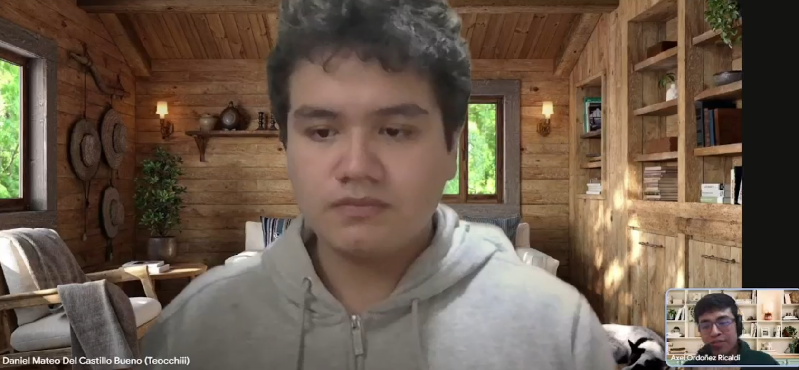  
[Entrevista Eduardo](https://upcedupe-my.sharepoint.com/:v:/g/personal/u202212484_upc_edu_pe/EdVUKA-zVg9Js4EQocCBz7cBZ_RROWHLt8e-DzDUZFek4g?e=ewaU61)

**Resumen de la entrevista:**

Daniel nos comenta que en el hospital que trabaja ellos se abastecen de un cuarto de almacen frío que es compartido con otros departamentos, y que ellos no gestionan el control de la temperatura directamente dado que cuentan con un térmostato que les proporciona el área de mantenimiento. Nos comenta que no tienen un registro formal de las temperaturas, y que en caso de una desviación, ellos mismos se encargan de reportarlo al área de mantenimiento para que puedan revisar el equipo.
Nos menciona que generalmente no tienen problemas con los equipos de frío, pero que en una ocasión tuvieron un problema con un congelador que afectó a las vacunas, y que tuvieron que desechar todo el lote. Nos comenta que no tienen reportes formales para auditorías, y que en caso de una inspección, ellos mismos se encargan de proporcionar la información necesaria.
También nos comenta que él está dispuesto a optar por una solución digital si es accesible y fácil de usar, pero que le preocupa la resistencia al cambio del personal y la falta de capacitación técnica. Nos menciona que una solución de monitoreo en tiempo real podría mejorar sus operaciones diarias al reducir el riesgo de pérdidas y garantizar la seguridad de los medicamentos.
Además, comenta que anteriormente intentaron implementar un sistema de monitoreo digital, pero que tuvieron problemas con la integración y el costo, y que finalmente decidieron no continuar con el proyecto. Nos menciona que las características imprescindibles para una plataforma de este tipo serían la facilidad de uso, la generación automática de reportes y sobre todo que era demasiado general respecto a lo que debería ser una solución específica para el sector salud.
Daniel considera que la integración con dispositivos IoT sería relevante, pero que dependería del costo y la facilidad de implementación, sobre las funcionalidades clave, el nos menciona que el servicio debe ser funcional las 24 horas dado que ellos trabajan en turnos y necesitan monitorear la cadena de frío en todo momento, incluso preferiría no tener que acercarse al equipo de frío para revisar la temperatura, y que le gustaría recibir alertas automáticas en caso de desviaciones para poder actuar rápidamente.


**Segmento 1**  
Nombre: Eduardo Ventura
Edad: 23 años 
Ocupación: Responsable de almacén de farmacia hospitalaria
  
[Entrevista Eduardo](https://upcedupe-my.sharepoint.com/:v:/g/personal/u202212484_upc_edu_pe/EdVUKA-zVg9Js4EQocCBz7cBZ_RROWHLt8e-DzDUZFek4g?e=ewaU61)

**Resumen de la entrevista:**
Eduardo nos menciona que actualmente ellos realizan el monitoreo de la cadena de frío de manera manual, utilizando termómetros y registros en papel. Nos comenta que enfrentan problemas ocasionales con la conservación de medicamentos sensibles, especialmente durante los fines de semana cuando el personal es reducido.
Considera que los reportes automaticos serían muy útiles para facilitar las auditorías regulatorias, ya que actualmente dedican mucho tiempo a preparar la documentación necesaria. Nos menciona que estarían dispuestos a adoptar una solución digital si fuera accesible y fácil de usar, pero que les preocupa la resistencia al cambio del personal y la falta de capacitación técnica.
Sin embargo, nos comenta que han tenido experiencias previas con soluciones de monitoreo digital, pero que enfrentaron desafíos relacionados con la integración con sus sistemas existentes y el costo de implementación. Nos menciona que una solución de monitoreo en tiempo real podría mejorar sus operaciones diarias al reducir el riesgo de pérdidas y garantizar la seguridad de los medicamentos.
Considera que se implementaran alertas via SMS o correo electrónico para notificar desviaciones de temperatura, lo que les permitiría actuar rápidamente y minimizar el impacto en la conservación de los medicamentos.


**Segmento 2**  
Nombre: Fernando Zamora
Edad: 26 años 
Ocupación: Administrador de farmacia

[Entrevista Fernando](https://upcedupe-my.sharepoint.com/:v:/g/personal/u202212484_upc_edu_pe/EdVUKA-zVg9Js4EQocCBz7cBZ_RROWHLt8e-DzDUZFek4g?e=ewaU61)

**Resumen de la entrevista:**

Fernando nos comenta que en su farmacia ellos realizan el control de la cadena de frío utilizando termómetros y registros en papel. Fernando cree que los reportes automáticos serían muy útiles para facilitar las auditorías regulatorias, ya que actualmente dedican mucho tiempo a preparar la documentación necesaria.
Nos menciona que estarían dispuestos a adoptar una solución digital si fuera accesible y fácil de usar, pero que les preocupa la resistencia al cambio del personal y la falta de capacitación técnica.
Sin embargo, nos comenta que no han tenido experiencias previas con soluciones de monitoreo digital, pero que están abiertos a explorar nuevas tecnologías si pueden demostrar un valor claro para su operación.
Pero está abierto a explorar nuevas tecnologías si pueden demostrar un valor claro para su operación. Nos menciona que una solución de monitoreo en tiempo real podría mejorar sus operaciones diarias al reducir el riesgo de pérdidas y garantizar la seguridad de los medicamentos.

**Segmento 2**  
Nombre: Mateo Casa
Edad: 30 años
Ocupación: Técnico en farmacia
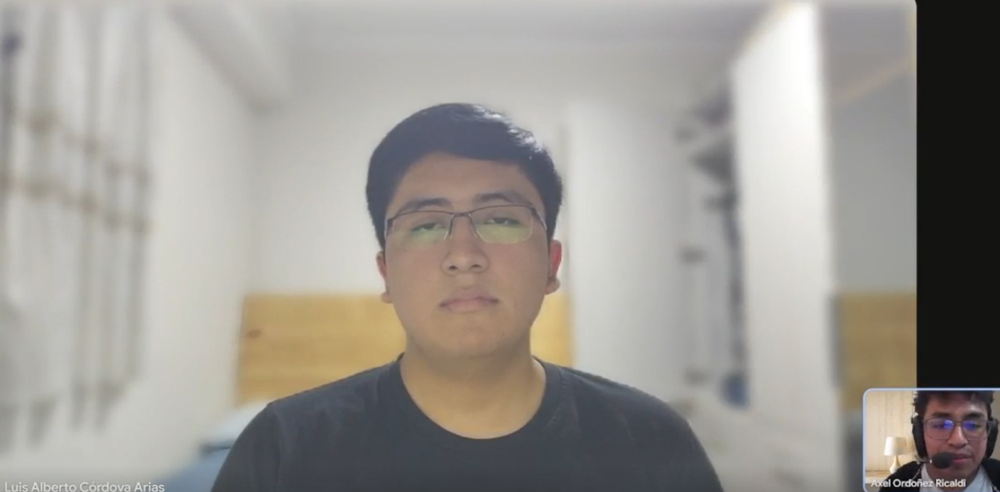
[Entrevista Fernando](https://upcedupe-my.sharepoint.com/:v:/g/personal/u202212484_upc_edu_pe/EdVUKA-zVg9Js4EQocCBz7cBZ_RROWHLt8e-DzDUZFek4g?e=ewaU61)

**Resumen de la entrevista:**
Mateo al ser un técnico en farmacia, nos comenta que él es el encargado de realizar el control de la cadena de frío en la farmacia donde trabaja. Nos menciona que actualmente utilizan termómetros y registros en papel para monitorear la temperatura de los equipos de frío.
Nos comenta que enfrentan problemas ocasionales con la conservación de medicamentos sensibles, especialmente durante los fines de semana cuando el personal es reducido.
Opina que la propuesta de valor de la plataforma es interesante, pero que le preocupa la resistencia al cambio del personal y la falta de capacitación técnica. Nos menciona que una solución de monitoreo en tiempo real podría mejorar sus operaciones diarias al reducir el riesgo de pérdidas y garantizar la seguridad de los medicamentos.


**Segmento 2**  
Nombre: Joseph Pillaca
Edad: 26 años
Ocupación: Químico farmacéutico

[Entrevista Fernando](https://upcedupe-my.sharepoint.com/:v:/g/personal/u202212484_upc_edu_pe/EdVUKA-zVg9Js4EQocCBz7cBZ_RROWHLt8e-DzDUZFek4g?e=ewaU61)

**Resumen de la entrevista:**
Joseph nos dice que hacen controles manuales para su cadena de frío, pero que son calibrados y que cumplen con las normativas del sector salud. Nos comenta que enfrentan problemas ocasionales con la conservación de medicamentos sensibles, especialmente durante los fines de semana cuando el personal es reducido.
Los controles se hacen al inicio de la jornada y al final, y que en caso de una desviación, ellos mismos se encargan de reportarlo al área de mantenimiento para que puedan revisar el equipo.
Nos menciona que una solución de monitoreo en tiempo real podría mejorar sus operaciones diarias al reducir el riesgo de pérdidas y garantizar la seguridad de los medicamentos.
Él usa un control digital, pero que no está conectado a internet, y que le gustaría recibir alertas automáticas en caso de desviaciones para poder actuar rápidamente.
Usa equipos de frío que son alquilados, y que le gustaría que la solución sea compatible con los equipos que ellos usan actualmente.


### 2.2.3. Análisis de entrevistas.
En este apartado se presenta un análisis detallado de las entrevistas realizadas a los segmentos objetivo, identificando patrones, necesidades comunes y diferencias clave entre los grupos entrevistados.

**Segmento 1 – Hospitales (Jefe de Farmacia, Responsable de Almacén, Enfermería)**


- **Método actual:** Predominan los controles manuales (termómetros, planillas en papel o Excel). La responsabilidad recae en áreas de farmacia, almacén o mantenimiento.
- **Problemas recurrentes:**
    - Reportes manuales no estandarizados, que consumen tiempo y dificultan auditorías.
    - Resistencia al cambio y falta de capacitación técnica en el personal.
    - Eventos críticos como fallas en congeladores han llevado a pérdidas de vacunas y medicamentos sensibles.
- **Necesidades:**
    - Reportes automáticos para auditorías regulatorias (DIGEMID/MINSA).
    - **Alertas en tiempo real (SMS, correo o notificaciones) que permitan actuar de inmediato.
    - Monitoreo 24/7, sin depender de turnos o presencia física frente al equipo.
- **Apertura tecnológica:** Disposición a adoptar soluciones digitales si son accesibles, fáciles de usar y específicas para el sector salud (no genéricas).

**Segmento 2 – Farmacias Independientes (Administrador, Técnico, Químico Farmacéutico)**


- **Método actual:** Uso de registros manuales en papel o Excel; algunos cuentan con controles digitales, pero no conectados a internet.
- **Problemas recurrentes:**
    - Pérdidas económicas por medicamentos dañados o vencidos.
    - Dependencia de proveedores locales para reponer inventario.
    - **Reclamos de clientes que afectan la reputación.
    - Falta de reportes auditables para SUNAT u otras inspecciones.
- **Necesidades:**
    - Una plataforma sencilla que automatice registros y genere reportes de forma clara.
    - Compatibilidad con equipos de refrigeración existentes, incluso alquilados.
    - Alertas inmediatas para evitar pérdidas y reforzar confianza con clientes.
- **Apertura tecnológica:** Mayor cautela al invertir en nuevas soluciones, pero reconocen el valor si se traduce en reducción de pérdidas y eficiencia operativa.


**Patrones comunes entre ambos segmentos**

- Fuerte dependencia de procesos manuales, con riesgo de errores humanos.
- Alta carga administrativa para preparar reportes en auditorías.
- Reconocimiento de que un sistema digital con alertas en tiempo real y reportes automáticos puede mejorar sus operaciones.
- Preocupación por la capacitación y la resistencia del personal frente a nuevas tecnologías.


**Principales diferencias**

- **Hospitales:** Se enfocan en cumplimiento normativo y trazabilidad, con énfasis en auditorías y reportes para DIGEMID/MINSA.
- **Farmacias:** Se enfocan en la reducción de pérdidas económicas y satisfacción del cliente, con reportes más orientados a SUNAT y gestión operativa.
- **Hospitales:** Tienen experiencias previas con soluciones digitales, pero enfrentaron problemas de integración y costos.
- **Farmacias:** Menor exposición a tecnologías de monitoreo, aunque muestran interés si la solución es compatible con sus equipos actuales y fácil de adoptar.


**Conclusión del análisis:**  
Ambos segmentos coinciden en que una solución digital de monitoreo en tiempo real, con alertas inmediatas y generación automática de reportes, sería de alto valor. Sin embargo, las motivaciones difieren: en **hospitales**, el foco está en **cumplimiento normativo y seguridad clínica**, mientras que en **farmacias**, el énfasis está en **reducir pérdidas económicas y mejorar la confianza del cliente**.


## 2.3. Needfinding.

En esta sección se presentan las herramientas y técnicas utilizadas para identificar y comprender las necesidades de los usuarios en relación con la solución propuesta.

### 2.3.1. User Personas.

Se han desarrollado dos user personas representativas de los segmentos objetivo identificados previamente, basadas en la información recopilada durante las entrevistas y el análisis de mercado.

**Segmento 1 (Jefe de Farmacia Hospitalaria):**  
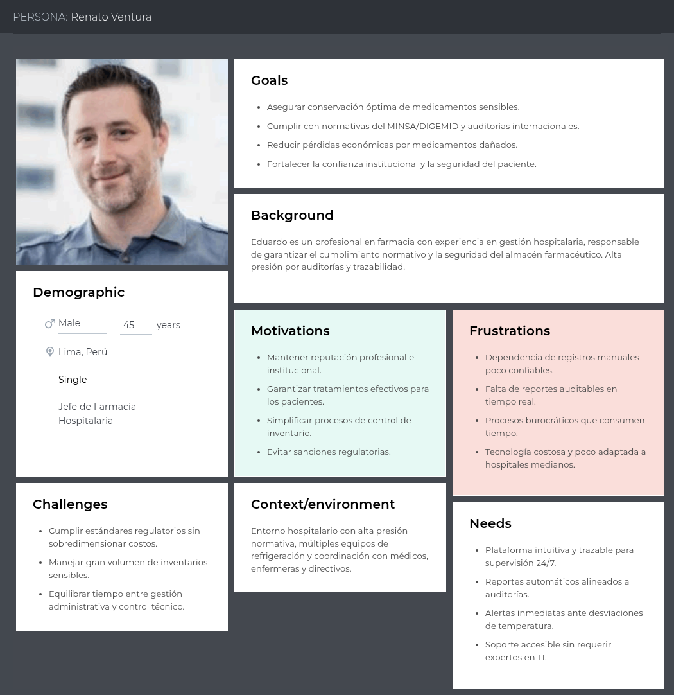


**Segmento 2(Administrador de una Farmacia independiente):**
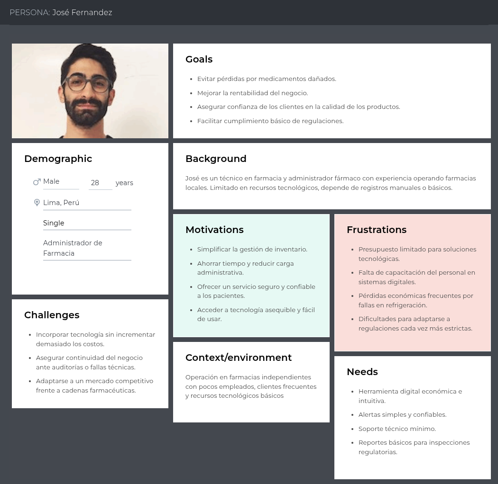


### 2.3.2. User Task Matrix.
| --- | ------                                  | Segmento 1  | Jefe de Farmacia Hospitalaria    | Segmento 2  | Administrador de Farmacia Independiente    |
| --- | --------------------------------------- | ----------- | -------------------------------- | ----------- | ------------------------------------------ |
| ID  | Título                                  | Importancia | Frecuencia                       | Importancia | Frecuencia                                 |
| U01 | Planificar & configurar equipos de frío | Alta        | Media (mensual/trimestral)       | Media       | Baja (al inicio, luego esporádico)         |
| U02 | Medir & registrar T°/HR                 | Alta        | Alta (varias veces al día)       | Alta        | Alta (2–3 veces al día)                    |
| U03 | Revisar registros & detectar desvíos    | Alta        | Alta (diaria)                    | Alta        | Media (cuando hay sospechas)               |
| U04 | Responder a alertas de desviación       | Alta        | Media (eventual pero crítica)    | Alta        | Media (eventual pero crítica)              |
| U05 | Documentar incidentes                   | Alta        | Media (cada incidente/auditoría) | Media       | Baja (solo en inspecciones puntuales)      |
| U06 | Preparar reportes para auditorías       | Alta        | Media (mensual/trimestral)       | Media       | Baja (ocasional, en inspecciones)          |
| U07 | Mantener equipos / calibración          | Media       | Media (programado por biomédico) | Baja        | Baja (cuando falla el equipo)              |
| U08 | Capacitar personal                      | Media       | Baja (semestral/anual)           | Baja        | Baja (informal, al ingresar personal)      |
| U09 | Coordinar compras                       | Media       | Media (mensual)                  | Alta        | Media (mensual, impacto directo en costos) |
| U10 | Gestionar inspecciones                  | Alta        | Media (varias veces al año)      | Alta        | Media (DIGEMID u otras inspecciones)       |

### 2.3.3. User Journey Mapping.

**Segmento 1:**
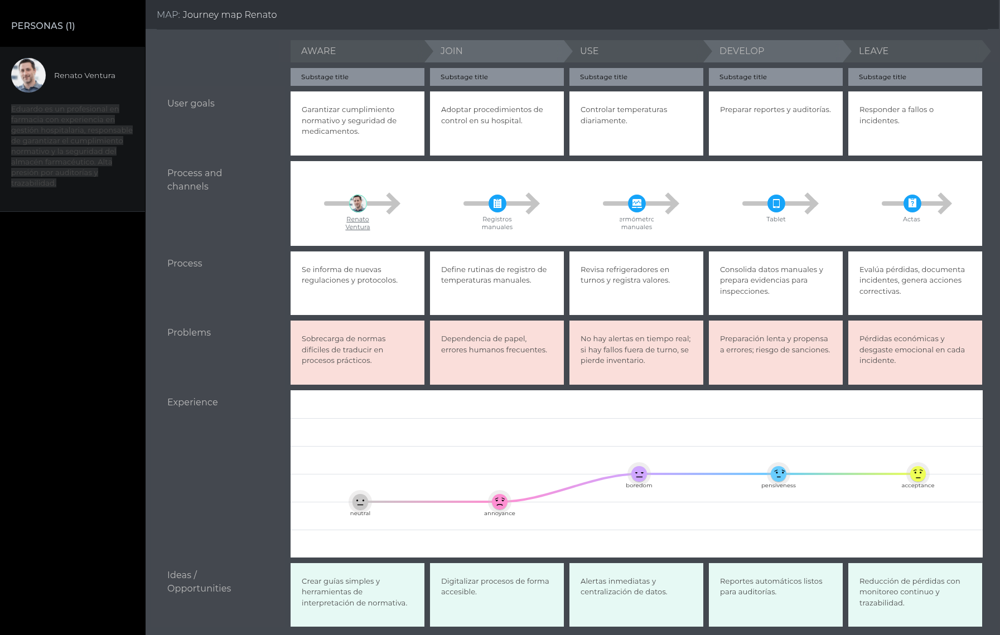

**Segmento 2:**
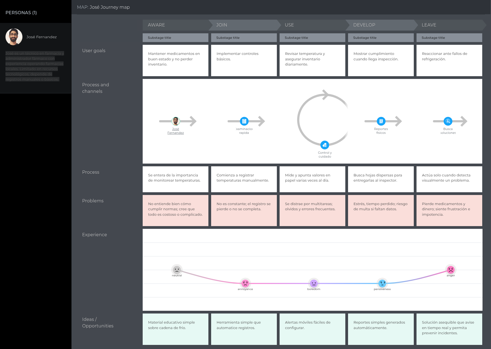


### 2.3.4. Empathy Mapping.
**Segmento 1:**
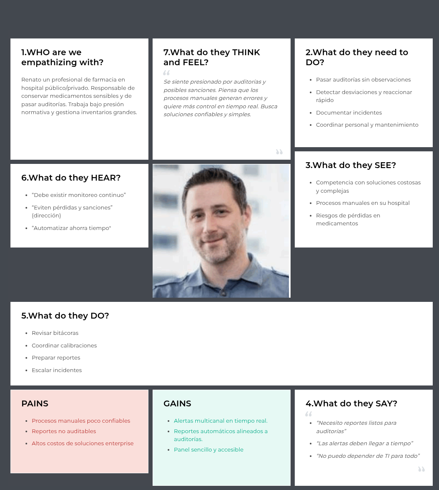

**Segmento 2:**
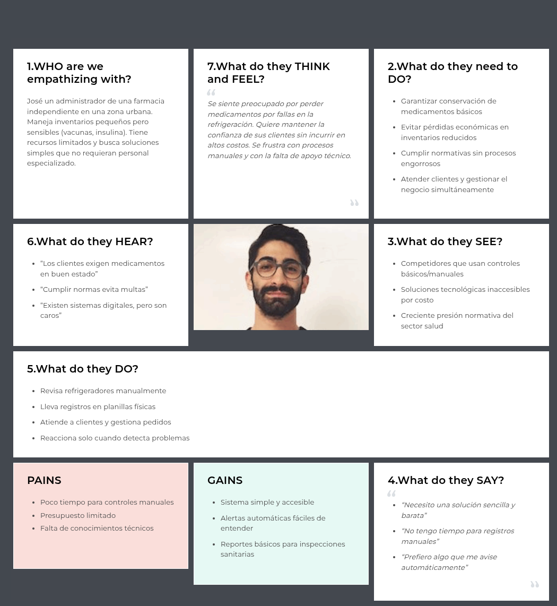
### 2.4 Big Picture Event Storming.

En esta sección se presenta el Big Picture Event Storming, una técnica colaborativa utilizada para mapear y comprender los procesos clave y eventos relacionados con la solución propuesta.


- **Big Picture Event Storming del Segmento 1:**
    - Etapas del proceso:
    - Domains Events
    - Actors
    - Actions/Commands
    - Risks
    - External Systems
    - Opportunities

**Identificación de los Domain Events:**
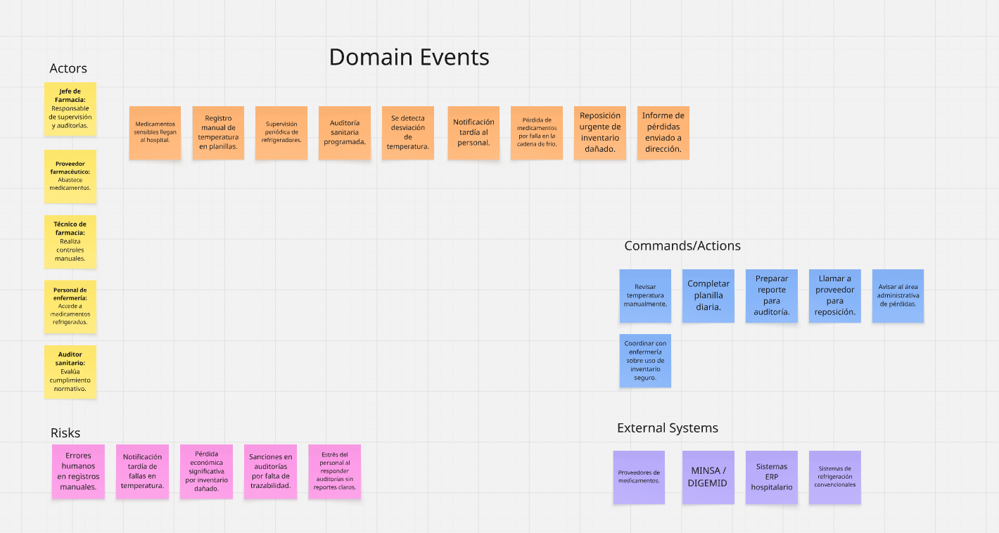

**Asociación de Actores:**
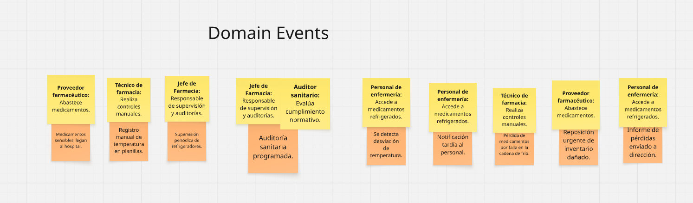

**Definición de Actions/Commands:**
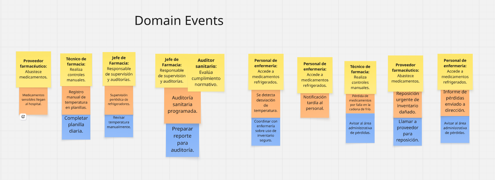

**Mapeo de External Systems:**
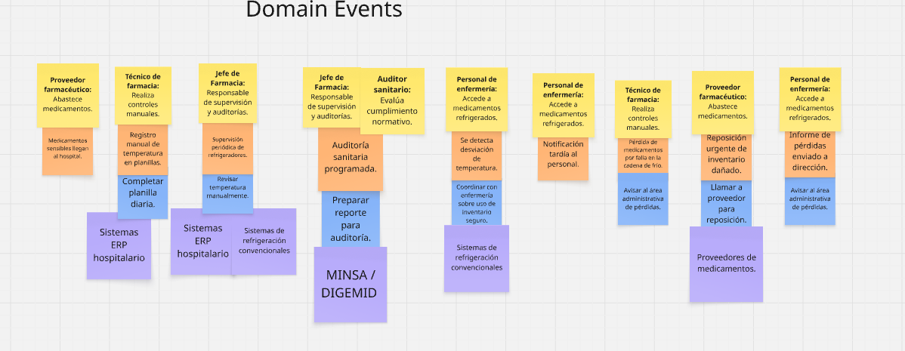

**Identificación de Riesgos:**
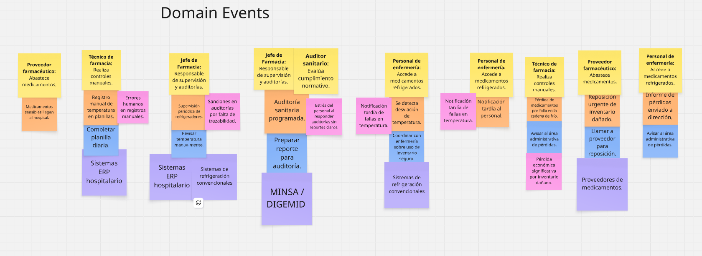

**Detección de Oportunidades:**
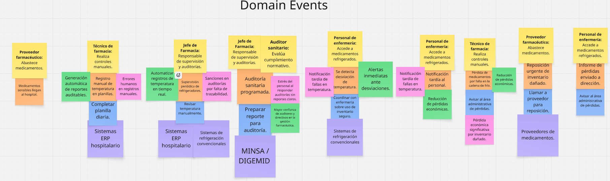


- **Big Picture Event Storming del Segmento 2:**
    - Etapas del proceso:
    - Domains Events
    - Actors
    - Actions/Commands
    - Risks
    - External Systems
    - Opportunities

**Identificación de los Domain Events:**
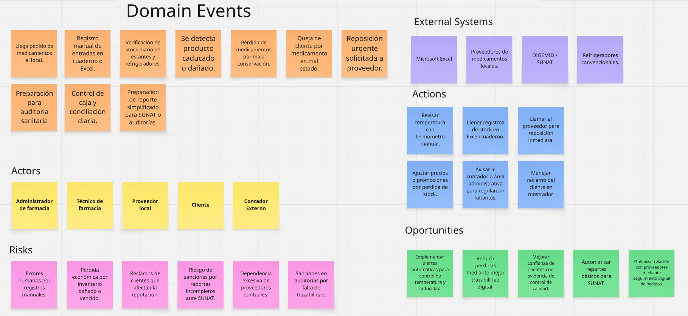

**Asociación de Actores:**
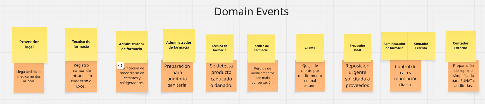

**Definición de Actions/Commands:**
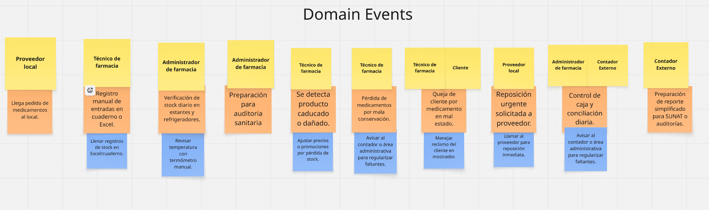

**Mapeo de External Systems:**
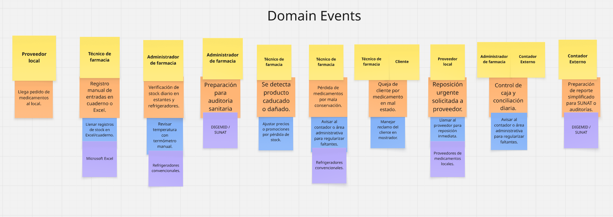

**Identificación de Riesgos:**
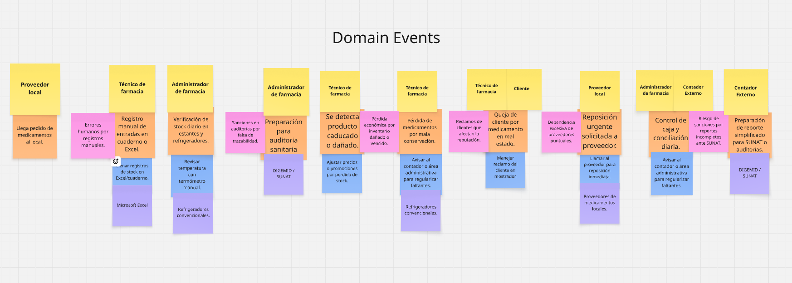

**Detección de Oportunidades:**
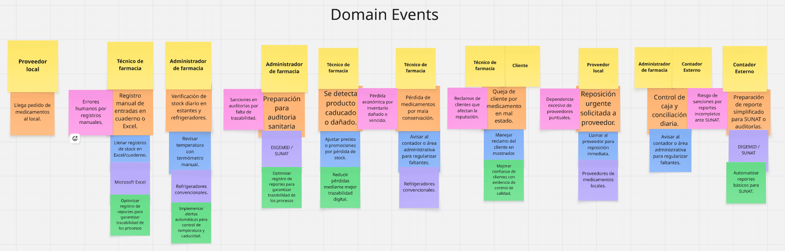


## 2.5. Ubiquitous Language.

El lenguaje ubicuo nos permite que todos los miembros del equipo, clientes y actores del sector salud se comuniquen utilizando un mismo vocabulario sin ambigüedad. Este glosario recoge los términos clave del dominio de la cadena de frío farmacéutica y del monitoreo digital, asegurando claridad en el diseño, desarrollo y uso de la plataforma.

```
Cadena de frío: Conjunto de procesos que aseguran que medicamentos sensibles se mantengan en rangos de temperatura adecuados desde la producción hasta su administración al paciente.

Datalogger: Dispositivo electrónico que registra datos de temperatura y humedad en intervalos regulares, utilizado para monitorear condiciones ambientales.

Reporte de cumplimiento: Documento generado automáticamente que registra y evidencia las condiciones de conservación de medicamentos, utilizado en auditorías y fiscalizaciones.

Temperatura crítica: Rango específico de temperatura que debe mantenerse para garantizar la eficacia y seguridad de ciertos medicamentos y vacunas.

Seguridad del inventario: Estado en el que los medicamentos se mantienen en condiciones óptimas, garantizando que son seguros y eficaces para los pacientes.

Sensor IoT: Dispositivo electrónico conectado a internet que mide variables como temperatura y humedad, transmitiendo datos en tiempo real a la plataforma.

Registro de incidentes: Documento o historial que recoge todas las desviaciones de temperatura, acciones correctivas y resultados de las mismas.

Acción preventiva: Medida tomada para evitar pérdidas de medicamentos o sanciones regulatorias ante una alerta temprana de desviación.

Acción correctiva: Medida tomada después de un incidente para mitigar sus consecuencias, como transferir medicamentos a otro equipo de frío.

Autoridad regulatoria: Entidad encargada de fiscalizar el cumplimiento de las normativas sanitarias (ej. MINSA, DIGEMID en Perú).

```

---

# Capítulo III: Requirements Specification
## 3.1. User Stories.

| Epic/Story ID | Titulo                                         | "Descripcion"                                                                                                                                               | Criterios de Aceptación                                                                                                                                                                                                                                                                                                                                                                                                                                                                                                                                                                                                                                                                                                                                                                                                         | Relacionado con (Epic ID) |
|---------------|------------------------------------------------|-------------------------------------------------------------------------------------------------------------------------------------------------------------|---------------------------------------------------------------------------------------------------------------------------------------------------------------------------------------------------------------------------------------------------------------------------------------------------------------------------------------------------------------------------------------------------------------------------------------------------------------------------------------------------------------------------------------------------------------------------------------------------------------------------------------------------------------------------------------------------------------------------------------------------------------------------------------------------------------------------------|---------------------------|
| E01           | Monitoreo en tiempo real                       | Como farmaceutico del sistema, quiero supervisar la temperatura de los refrigeradores en tiempo real, para asegurar la conservación adecuada de los medicamentos. |                                                                                                                                                                                                                                                                                                                                                                                                                                                                                                                                                                                                                                                                                                                                                                                                                                 |                           |
| E02           | Alertas y notificaciones                       | Como farmaceutico del sistema, quiero recibir alertas inmediatas ante desviaciones de temperatura, para reaccionar a tiempo y evitar pérdidas o riesgos.    |                                                                                                                                                                                                                                                                                                                                                                                                                                                                                                                                                                                                                                                                                                                                                                                                                                 |                           |
| E03           | Reportes y cumplimiento                        | Como personal de hospital, quiero generar reportes automáticos, para cumplir con auditorías y normativa sanitaria.                                          |                                                                                                                                                                                                                                                                                                                                                                                                                                                                                                                                                                                                                                                                                                                                                                                                                                 |                           |
| E04           | Experiencia de uso (UI/UX)                     | Como personal de hospital, quiero una experiencia clara y simple, para entender fácilmente el estado de mis equipos.                                        |                                                                                                                                                                                                                                                                                                                                                                                                                                                                                                                                                                                                                                                                                                                                                                                                                                 |                           |
| E05           | Landing Page                                   | Como visitante, quiero acceder a una landing page informativa, para conocer la propuesta de valor, misión y visión de la startup.                           |                                                                                                                                                                                                                                                                                                                                                                                                                                                                                                                                                                                                                                                                                                                                                                                                                                 |                           |
| E06           | API REST                                       | Como developer, quiero contar con un API REST, para integrar los datos del sistema con aplicaciones externas.                                               |                                                                                                                                                                                                                                                                                                                                                                                                                                                                                                                                                                                                                                                                                                                                                                                                                                 |                           |
| E07           | Registro en la Aplicación                      | Como visitante del sitio, quiero registrarme en la aplicación, para acceder a las funcionalidades de monitoreo de medicamentos.                             |                                                                                                                                                                                                                                                                                                                                                                                                                                                                                                                                                                                                                                                                                                                                                                                                                                 |                           |
| E08           | Internacionalización                           | Como usuario, quiero poder encontrar más de un idioma disponible, para elegir el de mi preferencia y comprender mejor los servicios de la aplicación.       |                                                                                                                                                                                                                                                                                                                                                                                                                                                                                                                                                                                                                                                                                                                                                                                                                                 |                           |
| US01          | Sección "Sobre Nosotros"                       | Como visitante del sitio, quiero acceder a la secciónde "sobre nosotros", para conocer acerca de la startup y los integrantes de la start up.               | **Escenario 1:** <br>Dado que el visitante está explorando la landing page, Cuando llega a la sección “Sobre Nosotros”, Entonces debe visualizar una descripción breve de la historia de la startup, su equipo y valores.                                                                                                                                                                                                                                                                                                                                                                                                                                                                                                                                                                                                       | E05                       |
| US02          | Sección testimonios de clientes                | Como visitante del sitio, quiero acceder a la sección de testimonios, para conocer la experiencia de otros clientes.                                        | **Escenario 1:** <br>Dado que el visitante accede al sitio web, Cuando consulta la sección de testimonios, Entonces visualiza opiniones de clientes. <br> **Escenario 2:** Dado que existen varios testimonios disponibles, Cuando el visitante desea revisar más testimonios, Entonces el sistema le muestra todos los testimonios.                                                                                                                                                                                                                                                                                                                                                                                                                                                                                            | E05                       |
| US03          | Acceso a información de contacto               | Como visitante del sitio, quiero acceder fácilmente a la información de contacto, para comunicarme en caso de dudas.                                        | **Escenario 1:** <br>Dado que el visitante accede a la landing page, Cuando consulta la sección de contacto, Entonces visualiza información clara como correo y teléfono, Y puede identificar rápidamente los medios de comunicación disponibles.                                                                                                                                                                                                                                                                                                                                                                                                                                                                                                                                                                               | E05                       |
| US04          | Visualización de servicios                     | Como visitante del sitio, quiero conocer los servicios que ofrece la startup, para entender su propuesta de valor.                                          | **Escenario 1:** <br>Dado que el visitante accede a la landing page, Cuando navega a la sección de servicios, Entonces visualiza una lista de los servicios principales. <br> **Escenario 2:** Dado que el visitante accede a la landing page, Cuando quiere conocer más sobre un servicio de su interés, Entonces selecciona la opción “ver más”, Y se muestra un texto más completo sobre el servicio seleccionado.                                                                                                                                                                                                                                                                                                                                                                                                           | E05                       |
| US05          | Opción de registro                             | Como visitante del sitio, quiero registrarme en la aplicación, para tener acceso a las funcionalidades de monitoreo de medicamentos.                        | **Escenario 1:** <br>Dado que el visitante accede a la landing page, Cuando se dirige a la parte superior de la página y selecciona la opción registrarse, Entonces la aplicación lo redirige al formulario de registro.                                                                                                                                                                                                                                                                                                                                                                                                                                                                                                                                                                                                        | E07                       |
| US06          | Preguntas frecuentes (FAQ)                     | Como visitante del sitio, quiero consultar una sección de preguntas frecuentes, para resolver dudas comunes sin necesidad de contactar a la startup.        | **Escenario 1:** <br>Dado que el visitante accede a la landing page, Cuando entra a la sección de preguntas frecuentes, Entonces puede desplegar las respuestas a cada pregunta común. <br> **Escenario 2:** Dado que el visitante accede a la sección de preguntas frecuentes, Cuando revisa la lista de preguntas disponibles, Entonces el sistema debe mostrar múltiples preguntas frecuentes, Y cada pregunta debe poder expandirse para visualizar su respuesta correspondiente.                                                                                                                                                                                                                                                                                                                                           | E05                       |
| US07          | Internacionalización landing page              | Como visitante del sitio, quiero poder encontrar más de un idioma disponible, para elegir el de mi preferencia.                                             | **Escenario 1:** <br>Dado que el visitante accede a la landing page, Cuando selecciona un idioma distinto, Entonces todo el contenido de la landing page debe mostrarse automáticamente en el idioma seleccionado. <br> **Escenario 2:** Dado que el visitante seleccionó un idioma previamente, Cuando vuelve a ingresar al sitio, Entonces la landing page debe mostrarse en el último idioma elegido, sin necesidad de volver a configurarlo.                                                                                                                                                                                                                                                                                                                                                                                | E08                       |
| US08          | Registro de cuenta                             | Como personal de hospital, quiero crear una cuenta en la plataforma, para acceder a las funcionalidades y gestionar el monitoreo de mis medicamentos.       | **Escenario 1:** <br>Dado que el personal de hospital dispone de la información requerida para registrarse, Cuando completa el proceso de registro con información válida, Entonces la cuenta se crea correctamente, Y el farmaceutico recibe confirmación de registro, Y puede iniciar sesión para acceder a la plataforma. <br> **Escenario 2:** Dado que el farmaceutico ingresa información incompleta o inválida, Cuando intenta registrar su cuenta, Entonces el sistema muestra un mensaje de error sobre los campos incorrectos, Y la cuenta no se crea hasta que la información sea válida.                                                                                                                                                                                                                            | E07                       |
| US09          | Visualización de temperatura actual            | Como farmaceutico, quiero ver la temperatura en tiempo real de cada refrigerador, para asegurar que se mantiene en el rango adecuado.                       | **Escenario 1:** <br>Dado que un refrigerador está operativo, Cuando el farmaceutico accede al panel de monitoreo, Entonces visualiza la temperatura actual registrada por el sistema.                                                                                                                                                                                                                                                                                                                                                                                                                                                                                                                                                                                                                                          | E01                       |
| US10          | Historial de temperaturas                      | Como farmaceutico, quiero consultar el historial de temperaturas, para verificar la estabilidad del almacenamiento de medicamentos.                         | **Escenario 1:** <br>Dado que existen registros históricos, Cuando el farmaceutico consulta un rango de fechas, Entonces el sistema muestra las temperaturas registradas en ese rango.                                                                                                                                                                                                                                                                                                                                                                                                                                                                                                                                                                                                                                          | E01                       |
| US11          | Alertas en tiempo real                         | Como farmaceutico, quiero recibir alertas inmediatas cuando la temperatura se sale del rango permitido, para reaccionar a tiempo.                           | **Escenario 1:** <br>Dado que un refrigerador supera el rango permitido, Cuando ocurre la desviación, Entonces el sistema envía una alerta inmediata al farmaceutico mediante notificación.                                                                                                                                                                                                                                                                                                                                                                                                                                                                                                                                                                                                                                     | E02                       |
| US12          | Generación de reportes automáticos             | Como personal de hospital, quiero generar reportes automáticos de temperaturas, para cumplir con los requisitos de auditoría.                               | **Escenario 1:** <br>Dado que existen registros de monitoreo, Cuando el farmaceutico solicita un reporte mensual, Entonces el sistema genera un archivo descargable con la información consolidada.                                                                                                                                                                                                                                                                                                                                                                                                                                                                                                                                                                                                                             | E03                       |
| US13          | Creación de cuentas de usuario                 | Como personal de hospital, quiero crear cuentas para mi personal, para que cada miembro tenga acceso con permisos adecuados.                                | **Escenario 1:** <br>Dado que el person del hospital accede al módulo de gestión, Cuando registra un nuevo farmaceutico, Entonces el sistema crea la cuenta con el rol asignado.                                                                                                                                                                                                                                                                                                                                                                                                                                                                                                                                                                                                                                                | E07                       |
| US14          | Panel de inicio intuitivo                      | Como personal de hospital, quiero un panel de inicio simple y claro, para entender rápidamente el estado de mis refrigeradores.                             | **Escenario 1:** <br>Dado que el person del hospital inicia sesión, Cuando accede al panel principal, Entonces visualiza un resumen con el estado de todos sus equipos de refrigeración.                                                                                                                                                                                                                                                                                                                                                                                                                                                                                                                                                                                                                                        | E01                       |
| US15          | Integración con sensores IoT                   | Como personal de hospital, quiero que la aplicación reciba datos automáticamente de sensores IoT, para no depender de registros manuales.                   | **Escenario 1:** <br>Dado que un sensor IoT está vinculado, Cuando transmite datos, Entonces la aplicación actualiza la temperatura automáticamente en tiempo real.                                                                                                                                                                                                                                                                                                                                                                                                                                                                                                                                                                                                                                                             | E07                       |
| US16          | Notificaciones de mantenimiento                | Como farmaceutico, quiero recibir avisos sobre mantenimientos programados, para anticipar ajustes en mis espacios.                                          | **Escenario 1:** <br>Dado que el farmaceutico tiene un mantenimiento asignado, Cuando selecciona la opción de notificaciones, Entonces se muestran los datos de la fecha del mantenimiento. <br> **Escenario 2:** Dado que el sistema registra un mantenimiento, Cuando el farmaceutico accede a sus notificaciones, Entonces recibe una alerta que incluye la fecha, hora y descripción del mantenimiento programado.                                                                                                                                                                                                                                                                                                                                                                                                          | E02                       |
| US17          | Personalización de notificaciones              | Como farmaceutico, quiero configurar qué tipo de notificaciones deseo recibir, para evitar información irrelevante.                                         | **Escenario 1:** <br>Dado que el farmaceutico accede a la sección "Preferencias de notificaciones", Cuando desmarca la opción "Notificaciones de promociones", Entonces el sistema guarda el cambio Y ya no se muestran notificaciones de promociones. <br> **Escenario 2:** Dado que el farmaceutico prefiere recibir notificaciones únicamente por correo electrónico, Cuando selecciona "Correo electrónico" y desactiva "Notificaciones", Entonces el sistema actualiza la configuración Y todas las notificaciones llegan solo por correo electrónico.                                                                                                                                                                                                                                                                     | E02                       |
| US18          | Actualización de datos personales              | Como farmaceutico, quiero modificar mi información básica, para mantener mi perfil actualizado.                                                             | **Escenario 1:** <br>Dado que el farmaceutico accede a su perfil, Cuando modifica algún detalle de su información y selecciona guardar cambios, Entonces la aplicación registra los cambios. <br> **Escenario 2:** Dado que el farmaceutico accede a su perfil, Cuando introduce un formato inválido en un campo obligatorio, Entonces la aplicación muestra un mensaje de error indicando el formato incorrecto Y no permite guardar los cambios hasta que la información sea válida.                                                                                                                                                                                                                                                                                                                                          | E04                       |
| US19          | Configuración de preferencias                  | Como farmaceutico, quiero definir mis preferencias, para personalizar mi experiencia en la plataforma.                                                      | **Escenario 1:** <br>Dado que el farmaceutico prefiere recibir notificaciones solo por correo electrónico, Cuando accede a la sección "Preferencias" y desactiva la opción "Notificaciones", Entonces el sistema guarda los cambios Y a partir de ese momento las notificaciones llegan únicamente a su correo registrado. <br> **Escenario 2:** Dado que la propietaria desea usar la plataforma en inglés, Cuando elige "Inglés" en el campo "Idioma" dentro de las preferencias, Entonces la interfaz se actualiza inmediatamente Y todo el contenido de la plataforma se muestra en inglés.                                                                                                                                                                                                                                 | E04                       |
| TS01          | Crear ruta segura y mostrar datos de monitoreo | Como desarrollador, quiero proteger la ruta del dashboard de monitoreo para que solo los farmaceuticos autenticados puedan visualizarla.                    | **Escenario 1:** <br> Dado que un cliente realiza una petición GET `/api/dashboard` sin credenciales válidas, <br> Cuando el cliente realiza la petición, <br> Entonces el sistema responde con 401 Unauthorized. <br><br> **Escenario 2:** <br> Dado que un farmaceutico autenticado con rol autorizado posee un token válido, <br> Cuando solicita GET `/api/dashboard`, <br> Entonces el sistema responde con 200 OK y devuelve un JSON con los datos de monitoreo (temperatura, timestamp, sensor_id). <br><br> **Escenario 3:** <br> Dado que un farmaceutico autenticado sin el rol requerido intenta acceder al dashboard, <br> Cuando solicita GET `/api/dashboard`, <br> Entonces el sistema responde con 403 Forbidden.                                                                                               | E06                       |
| TS02          | Registro de sensores IoT                       | Como desarrollador, quiero registrar un nuevo sensor IoT a través del API, para gestionar los dispositivos que se conectan al sistema.                      | **Escenario 1:** <br> Dado que un cliente autorizado envía POST `/api/sensors` con payload válido, <br> Cuando la API procesa la solicitud, <br> Entonces el sistema crea el sensor en la base de datos y responde con 201 Created incluyendo el id del sensor. <br><br> **Escenario 2:** <br> Dado que el payload contiene un serial ya registrado, <br> Cuando se intenta crear el sensor, <br> Entonces el sistema responde con 409 Conflict indicando duplicado. <br><br> **Escenario 3:** <br> Dado que el payload omite campos obligatorios o contiene formatos inválidos, <br> Cuando se intenta crear el sensor, <br> Entonces el sistema responde con 400 Bad Request y detalles de validación.                                                                                                                        | E06                       |
| TS03          | Modificar información de sensor                | Como desarrollador, quiero actualizar la información de un sensor IoT, para reflejar cambios en sus atributos o ubicación.                                  | **Escenario 1:** <br> Dado que existe un sensor con id `{sensorId}` y el cliente autorizado envía PATCH `/api/sensors/{sensorId}` con datos válidos, <br> Cuando la API procesa la actualización, <br> Entonces el sistema actualiza los campos correspondientes y responde con 200 OK devolviendo el recurso actualizado. <br><br> **Escenario 2:** <br> Dado que no existe un sensor con id `{sensorId}`, <br> Cuando se intenta actualizar, <br> Entonces el sistema responde con 404 Not Found. <br><br> **Escenario 3:** <br> Dado que el cliente carece de permisos para modificar el sensor, <br> Cuando envía la petición de actualización, <br> Entonces el sistema responde con 403 Forbidden.                                                                                                                        | E06                       |
| TS04          | Asignar sensores a un refrigerador             | Como desarrollador, quiero asignar un sensor IoT a un refrigerador específico, para asociar los datos al equipo correcto.                                   | **Escenario 1:** <br> Dado que existen `sensorId` y `fridgeId` válidos y el cliente autorizado envía POST `/api/fridges/{fridgeId}/assign-sensor` con `sensorId`, <br> Cuando la API procesa la solicitud, <br> Entonces el sistema crea la relación sensor→refrigerador, persiste el cambio y responde con 200 OK confirmando la asociación. <br><br> **Escenario 2 (reasignación):** <br> Dado que el `sensorId` ya está asociado a otro refrigerador, <br> Cuando se solicita asignarlo a `fridgeId` y la política permite reasignación, <br> Entonces el sistema actualiza la asociación y responde con 200 OK reflejando la nueva relación. <br><br> **Escenario 3 (IDs inválidos):** <br> Dado que `sensorId` o `fridgeId` no existen, <br> Cuando se intenta asignar, <br> Entonces el sistema responde con 404 Not Found. | E06                       |
| TS05          | Implementar endpoint de alertas                | Como desarrollador, quiero implementar un endpoint para generar y consultar alertas, para que los farmaceuticos reciban notificaciones en tiempo real.      | **Escenario 1:** <br> Dado que un evento de temperatura excede umbral y el sistema envía POST `/api/alerts` con datos válidos, <br> Cuando la API procesa la solicitud, <br> Entonces el sistema persiste la alerta y responde con 201 Created con el id de alerta. <br><br> **Escenario 2:** <br> Dado que existen alertas para `fridgeId`, <br> Cuando un cliente autorizado solicita GET `/api/alerts?fridgeId={id}`, <br> Entonces el sistema responde con 200 OK y un JSON con la lista de alertas ordenadas por fecha. <br><br> **Escenario 3:** <br> Dado que la petición de creación contiene datos inválidos, <br> Cuando se procesa la petición, <br> Entonces el sistema responde con 400 Bad Request.                                                                            | E06                       |
| TS06          | Documentar API con Swagger                     | Como desarrollador, quiero documentar todos los endpoints del sistema con Swagger, para facilitar la integración con aplicaciones externas.                 | **Escenario 1:** <br> Dado que la aplicación está desplegada en entorno de desarrollo, <br> Cuando el desarrollador accede a `/swagger` o `/swagger-ui.html`, <br> Entonces la UI de Swagger está disponible y muestra todos los endpoints documentados. <br><br> **Escenario 2 (openapi):** <br> Dado que se añade un nuevo endpoint y la documentación se actualiza, <br> Cuando se vuelve a generar la especificación OpenAPI, <br> Entonces el nuevo endpoint aparece en la documentación                                                                                                                                                                                                                                                                                                                                   | E06                       |


## 3.2. Impact Mapping.

El Impact Mapping es una metodología visual que permite conectar los objetivos estratégicos del negocio con las acciones concretas de los usuarios y las funcionalidades del producto digital. Mediante un esquema jerárquico en forma de árbol, esta técnica muestra cómo las metas comerciales se traducen en cambios de comportamiento esperados en los actores clave y en entregables que hacen posible dichos cambios.

En el caso del presente proyecto, se utilizó esta herramienta para estructurar de manera clara la relación entre los objetivos estratégicos de conservación óptima de medicamentos, los User Personas previamente definidos (Renato Ventura y José Fernández), y las funcionalidades necesarias para garantizar seguridad, cumplimiento normativo y eficiencia operativa. El trabajo incluyó:

Business Goals orientados a resultados reales en salud y operaciones: metas específicas, medibles y con impacto tangible, como reducir pérdidas económicas por fallas de temperatura, asegurar el cumplimiento regulatorio y disminuir el estrés operativo en farmacias y hospitales.
Actores principales, representados por Renato Ventura (Jefe de Farmacia Hospitalaria) y José Fernández (Administrador de Farmacia Local), definidos a partir de sus necesidades operativas, limitaciones técnicas y responsabilidades normativas dentro del ecosistema de salud.
Impactos esperados, expresados como conductas observables y medibles que cada actor debe adoptar para contribuir al objetivo central (ejemplo: “Renato genera reportes automáticos para auditoría sin intervención manual” o “José responde a alertas de temperatura en menos de 10 minutos”).
Deliverables funcionales, que son las características del producto diseñadas para provocar esos impactos: como alertas en tiempo real, dashboards intuitivos, reportes auditables con un clic, integración con sensores IoT y configuración personalizada de notificaciones.
El mapa fue diseñado siguiendo un enfoque centrado en el usuario del sector salud, priorizando simplicidad, confiabilidad y accesibilidad. Se utilizaron prácticas visuales colaborativas que facilitan la alineación entre las metas de negocio, las necesidades reales de los profesionales de la salud y el desarrollo técnico de la solución, asegurando que cada funcionalidad construida tenga un propósito claro y un impacto medible en la conservación segura de medicamentos sensibles.

**Business Goal 1:**<br> Asegurar la conservación óptima de medicamentos sensibles en hospitales y farmacias, reduciendo pérdidas económicas y cumpliendo normativas regulatorias, mediante un sistema de monitoreo accesible, confiable e intuitivo.

Este objetivo representa el núcleo estratégico y fundacional de la propuesta de valor de la startup. No se trata solo de una meta operativa, sino del propósito mismo que da sentido al producto: proteger la salud de los pacientes y la integridad de los tratamientos, evitando que medicamentos vitales se deterioren por fallas en la cadena de frío. Se centra en resolver un problema crítico del sistema de salud —la falta de monitoreo confiable y automatizado— mediante una solución tecnológica diseñada para ser adoptada sin fricción por instituciones de todos los tamaños.

Lograr este objetivo no solo es medible —a través de indicadores como reducción porcentual de medicamentos descartados, número de auditorías aprobadas sin observaciones, o tiempo promedio de respuesta a alertas— sino que también es urgente y socialmente relevante. Responde a la necesidad de transformar una tarea manual, propensa al error y con alto riesgo sanitario, en un proceso automatizado, trazable y confiable. Garantizar la conservación óptima no es un lujo: es una obligación ética y regulatoria.

Asimismo, este Business Goal está profundamente alineado con las actividades y motivaciones de los principales actores identificados —Renato Ventura (Jefe de Farmacia Hospitalaria) y José Fernández (Administrador de Farmacia Local)—, quienes, a través de comportamientos clave como supervisar en tiempo real la temperatura de sus refrigeradores, generar reportes automáticos para inspecciones, responder proactivamente a alertas y compartir resultados de eficiencia con sus equipos o colegas, se convierten en agentes activos de la seguridad del paciente y la sostenibilidad económica de sus instituciones.

En otras palabras, este objetivo busca demostrar que la tecnología, cuando está bien diseñada y centrada en el usuario real, no solo soluciona un problema operativo, sino que salva vidas, reduce costos y fortalece sistemas. Motiva a profesionales de la salud a dejar atrás los registros en papel y las revisiones manuales, para adoptar una herramienta que les da control, tranquilidad y respaldo técnico —convirtiéndose, naturalmente, en promotores de una cultura de prevención y excelencia en la gestión de medicamentos sensibles.


**Business Goal 2:**<br> Asegurar la conservación óptima de medicamentos sensibles en hospitales y farmacias, reduciendo pérdidas económicas y cumpliendo normativas regulatorias, mediante un sistema de monitoreo accesible, confiable e intuitivo.

Este objetivo representa el núcleo estratégico y fundacional de la propuesta de valor de la startup. No se trata solo de una meta operativa, sino del propósito mismo que da sentido al producto: proteger la salud de los pacientes y la integridad de los tratamientos, evitando que medicamentos vitales se deterioren por fallas en la cadena de frío. Se centra en resolver un problema crítico del sistema de salud —la falta de monitoreo confiable y automatizado— mediante una solución tecnológica diseñada para ser adoptada sin fricción por instituciones de todos los tamaños.

Lograr este objetivo no solo es medible —a través de indicadores como reducción porcentual de medicamentos descartados, número de auditorías aprobadas sin observaciones, o tiempo promedio de respuesta a alertas— sino que también es urgente y socialmente relevante. Responde a la necesidad de transformar una tarea manual, propensa al error y con alto riesgo sanitario, en un proceso automatizado, trazable y confiable. Garantizar la conservación óptima no es un lujo: es una obligación ética y regulatoria.

Asimismo, este Business Goal está profundamente alineado con las actividades y motivaciones de los principales actores identificados —Renato Ventura (Jefe de Farmacia Hospitalaria) y José Fernández (Administrador de Farmacia Local)—, quienes, a través de comportamientos clave como supervisar en tiempo real la temperatura de sus refrigeradores, generar reportes automáticos para inspecciones, responder proactivamente a alertas y compartir resultados de eficiencia con sus equipos o colegas, se convierten en agentes activos de la seguridad del paciente y la sostenibilidad económica de sus instituciones.

En otras palabras, este objetivo busca demostrar que la tecnología, cuando está bien diseñada y centrada en el usuario real, no solo soluciona un problema operativo, sino que salva vidas, reduce costos y fortalece sistemas. Motiva a profesionales de la salud a dejar atrás los registros en papel y las revisiones manuales, para adoptar una herramienta que les da control, tranquilidad y respaldo técnico —convirtiéndose, naturalmente, en promotores de una cultura de prevención y excelencia en la gestión de medicamentos sensibles.


## 3.3. Product Backlog.
A continuación, se presenta el Product Backlog del proyecto: una lista priorizada de historias de usuario y tareas técnicas para desarrollar nuestra plataforma de monitoreo de la cadena de frío farmacéutica. Cada ítem incluye identificación, descripción y estimación en puntos de historia, alineado con nuestro objetivo de proteger medicamentos mediante tecnología simple, segura y en tiempo real.

Utilizamos Trello para gestionar el backlog de forma visual y colaborativa, organizando las tareas en columnas por etapa de desarrollo. Esto nos permite mantener el foco en lo que más importa para farmacias, clínicas y distribuidores: alertas oportunas, trazabilidad y cumplimiento normativo — sin perder agilidad ni claridad en el proceso.

Link de colaboración en trello: https://goo.su/3eGJh


| #Orden | User Story ID | Titulo                                         | Descripción                                                                                                                                            | Story Points (1/2/3/5/8) |
|--------|---------------|------------------------------------------------|--------------------------------------------------------------------------------------------------------------------------------------------------------|--------------------------|
| 1      | US01          | Sección "Sobre Nosotros"                       | Como visitante del sitio, quiero acceder a la secciónde "sobre nosotros", para conocer acerca de la startup y los integrantes de la start up.          | 3                        |
| 2      | US02          | Sección testimonios de clientes                | Como visitante del sitio, quiero acceder a la sección de testimonios, para conocer la experiencia de otros clientes.                                   | 3                        |
| 3      | US03          | Acceso a información de contacto               | Como visitante del sitio, quiero acceder fácilmente a la información de contacto, para comunicarme en caso de dudas.                                   | 3                        |
| 4      | US04          | Visualización de servicios                     | Como visitante del sitio, quiero conocer los servicios que ofrece la startup, para entender su propuesta de valor.                                     | 3                        |
| 5      | US05          | Opción de registro                             | Como visitante del sitio, quiero registrarme en la aplicación, para tener acceso a las funcionalidades de monitoreo de medicamentos.                   | 3                        |
| 6      | US06          | Preguntas frecuentes (FAQ)                     | Como visitante del sitio, quiero consultar una sección de preguntas frecuentes, para resolver dudas comunes sin necesidad de contactar a la startup.   | 3                        |
| 7      | US07          | Internacionalización landing page              | Como visitante del sitio, quiero poder encontrar más de un idioma disponible, para elegir el de mi preferencia.                                        | 5                        |
| 8      | US08          | Registro de cuenta                             | Como personal de hospital, quiero crear una cuenta en la plataforma, para acceder a las funcionalidades y gestionar el monitoreo de mis medicamentos.  | 3                        |
| 9      | US09          | Visualización de temperatura actual            | Como farmaceutico, quiero ver la temperatura en tiempo real de cada refrigerador, para asegurar que se mantiene en el rango adecuado.                  | 3                        |
| 10     | US10          | Historial de temperaturas                      | Como farmaceutico, quiero consultar el historial de temperaturas, para verificar la estabilidad del almacenamiento de medicamentos.                    | 5                        |
| 11     | US11          | Alertas en tiempo real                         | Como farmaceutico, quiero recibir alertas inmediatas cuando la temperatura se sale del rango permitido, para reaccionar a tiempo.                      | 5                        |
| 12     | US12          | Generación de reportes automáticos             | Como personal de hospital, quiero generar reportes automáticos de temperaturas, para cumplir con los requisitos de auditoría.                          | 5                        |
| 13     | US13          | Creación de cuentas de usuario                 | Como personal de hospital, quiero crear cuentas para mi personal, para que cada miembro tenga acceso con permisos adecuados.                           | 5                        |
| 14     | US14          | Panel de inicio intuitivo                      | Como personal de hospital, quiero un panel de inicio simple y claro, para entender rápidamente el estado de mis refrigeradores.                        | 5                        |
| 15     | US15          | Integración con sensores IoT                   | Como personal de hospital, quiero que la aplicación reciba datos automáticamente de sensores IoT, para no depender de registros manuales.              | 3                        |
| 16     | US16          | Notificaciones de mantenimiento                | Como farmaceutico, quiero recibir avisos sobre mantenimientos programados, para anticipar ajustes en mis espacios.                                     | 3                        |
| 17     | US17          | Personalización de notificaciones              | Como farmaceutico, quiero configurar qué tipo de notificaciones deseo recibir, para evitar información irrelevante.                                    | 8                        |
| 18     | US18          | Actualización de datos personales              | Como farmaceutico, quiero modificar mi información básica, para mantener mi perfil actualizado.                                                        | 5                        |
| 19     | US19          | Configuración de preferencias                  | Como farmaceutico, quiero definir mis preferencias, para personalizar mi experiencia en la plataforma.                                                 | 3                        |
| 21     | TS01          | Crear ruta segura y mostrar datos de monitoreo | Como desarrollador, quiero proteger la ruta del dashboard de monitoreo para que solo los farmaceuticos autenticados puedan visualizarla.               | 8                        |
| 22     | TS02          | Registro de sensores IoT                       | Como desarrollador, quiero registrar un nuevo sensor IoT a través del API, para gestionar los dispositivos que se conectan al sistema.                 | 8                        |
| 23     | TS03          | Modificar información de sensor                | Como desarrollador, quiero actualizar la información de un sensor IoT, para reflejar cambios en sus atributos o ubicación.                             | 3                        |
| 24     | TS04          | Asignar sensores a un refrigerador             | Como desarrollador, quiero asignar un sensor IoT a un refrigerador específico, para asociar los datos al equipo correcto.                              | 3                        |
| 25     | TS05          | Implementar endpoint de alertas                | Como desarrollador, quiero implementar un endpoint para generar y consultar alertas, para que los farmaceuticos reciban notificaciones en tiempo real. | 8                        |
| 26     | TS06          | Documentar API con Swagger                     | Como desarrollador, quiero documentar todos los endpoints del sistema con Swagger, para facilitar la integración con aplicaciones externas.            | 5                        |

# Capítulo IV: Product Design
## 4.1. Style Guidelines.
### 4.1.1. General Style Guidelines.
Descripcion del porque estos elementos seran importantes

**Color:** (Descripcion de los colores escogidos y porque)  


**Tipografia:** (Descripcion de la tipografia escogida para el proyecto y porque)

**Branding** (Describir logotipo y porque)

### 4.1.2. Web Style Guidelines.
Descripcion de los elementos que se utilizaran en el web app

**Background:** (primary, secondary, terniary)  

**Text Styles:** (H1, H2, p, a,)  

**Button Styles:** (Button, dropdowns, Switches)

**Icons:** (Fondo blanco con los iconos que vamos a usar)

**Misc** (Cosas como nav var o slideshows que pensemos usar)

## 4.2. Information Architecture.
### 4.2.1. Organization Systems.
Descripcion corta respecto a los sistemas de organizacion que usaremos  (Escoger)
"Hierarchical. This structures advices to present the content in a way to distinguish the level of importance by making use of physical differences, such as size, colour, contrast, alignment etc.

Sequential. Guide users to follow a specific path towards their goal and provide content step-by-step based on the current step. 

Matrix. You can always give the users the option to choose the type of navigation they prefer, i.e. Alphabetical, Chronological, by topic."
### 4.2.2. Labeling Systems.
The labeling system aims at uniting the data effectively and represent them in simple way and avoid confusing great amount of information. A widely adopted way to achieve this is by creating the labels which represent loads of data in few words. 

Como decir "home, about us, etc" basicamente lo que iria en un nav var y asi
### 4.2.3. SEO Tags and Meta Tags

**Meta & SEO (Search Engine Optimization) Tags:**  sirven para que la pagina web sea encontrada facilmente es lo que sale al encontrar la pagina en el buscador (se ponen en el <"head">)
* Titulo: ```<title> ___ </title> ```
* Descripcion: ```<meta name = "description" content = "texto descipcion"/> ```
* Palabras Clave: ```<meta name = "keyword" content = "keyword1, 2 3"/> ```

### 4.2.4. Searching Systems.
**Que se busca?:** Que buscara el farmaceutico  
**Que resultados se mostraran?:** Que se mostrara  
**Interface de busqueda:** Descripcion de como ayuda a encontrar lo deseado 


### 4.2.5. Navigation Systems.
Basicamente aqui definimos como funciona la navegacion del web app
**Hierarchical Navigation System:** Main page a destination pages.
**Global Navigation Systems** (Complemento del Hierachical) Movimiento vertical (te mueves por la pagina)con nav(debe poder regresar a la principal)
**Local Navigation Systems** (vas a otras paginas) (complemento del global nav sistem sub-site) Usas otras paginas
## 4.3. Landing Page UI Design.
### 4.3.1. Landing Page Wireframe.
la pagina donde te registras y ves info del web app (te manda al web app)

Wireframe es todo lo funcional de la pagina

### 4.3.2. Landing Page Mock-up.
Mockup es todo lo relacionado al diseño de la pagina

## 4.4. Web Applications UX/UI Design.
### 4.4.1. Web Applications Wireframes.
lo funcional de cada aspecto del wireframe 

### 4.4.2. Web Applications Wireflow Diagrams.
Wireflow es como se va a navegar por la pagina (boton me lleva a esta pagina y este me regresa)

### 4.4.2. Web Applications Mock-ups.
Diseño en todo aspecto

### 4.4.3. Web Applications User Flow Diagrams.
un flow diagram de como el farmaceutico utilizara la pagina **[PARA CADA USER GOAL]** 

## 4.5. Web Applications Prototyping.
[URL del Prototipo (Hecho en figma)](https://www.example.com)
## 4.6. Domain-Driven Software Architecture.
### 4.6.1. Software Architecture Context Diagram.
1. System Context Diagram: Diagrama que muestra la relacion del aplicativo con los farmaceuticos
se incluyen servicios externos (si hay pocos bounded context se incluyen ahi)

2. Bounded Context Map: Muestra la relacion entre bounded contexts (los bounded context son como una burbuja que encapsula palabras clave en los procesos para poder diferenciarlos [Ej. Bounded context enfocado en las ventas(ventas), otro en revisar el stock(gestion) y otro enfocado en los proveedores (suministros)]) Se hace como un brainstorm y se ve en que pueden conectarse o comunicarse [se usa un circulo entre conexiones lineales (upstream o downstream) para definir comunicacion, algunos context se pueden integrar para representar por ejemplo un share model por database, tambien se mencionan los (third party context para definir los restful apis)]
   
### 4.6.2. Software Architecture Container Diagrams.
1. Bounded Context Deployable / Container Diagrams. Sirve para entender como funciona y el proceso, Se especifican DB's, indexers, Search engine, las Apis que usen los bounded context y se conectan por flechas, las cuales tienen como objetivo explicar la direcion y relacion junto a que se esta enviando/comunicando (TCP) 

### 4.6.3. Software Architecture Components Diagrams.
1. Component diagrams: Estos van a mostrar las ordenes, procesos, mensajes y componentes utilizados en el uso del aplicativo, claro se deben hacer diferentes de estos para cada bounded o USER GOALS
## 4.7. Software Object-Oriented Design.
### 4.7.1. Class Diagrams.
Esta yaselasaben (diagrama de clases)
Clases(name), objetos(nombre-objeto [como objeto]), metodos("Accion") y atributos(Correo, edad,nombre como valor, ID)
### 4.7.2. Class Dictionary.
Inherit (ave(superclase) -> (subclase)canario )
Polymorphism (Ej. funcion de persona hablar() -> Peruano hablar() , Gringo hablar() todos tienen una funcion que contiene persona y van cambiando sus formas)
Abstraction (Ej. Solo muestra el farmaceutico, pero esta su edad, correo y veces usada que uso app en la base de datos (fuera de vista))
Encapsulation (cuando tienes tus variables y metodos en la misma clase las estas encapsulando, aun mas se encapsulan en Private y Public )
## 4.8. Database Design.
### 4.8.1. Database Diagram.
Diagrama de base de datos (la relacion entre clases PK FK el Normalizar tmbn, isiyisi 🕸)


# Capítulo V: Product Implementation, Validation & Deployment
## 5.1. Software Configuration Management.
La gestion de la configuración del software es un proceso esencial para garantizar la integridad y coherencia del producto a lo largo de su ciclo de vida. En este capítulo, se detallan las prácticas y herramientas utilizadas para gestionar eficazmente la configuración del software en el proyecto ThermaTrace.

### 5.1.1. Software Development Environment Configuration.

**Project Management**

- Discord:

Se utiliza Discord como plataforma principal de comunicación y coordinación del equipo. Aquí se llevan a cabo reuniones, discusiones y se comparten actualizaciones del proyecto.

- Trello:

Trello se emplea para la gestión de tareas y seguimiento del progreso del proyecto. Se crean tableros, listas y tarjetas para organizar las actividades y asignarlas a los miembros del equipo.

**Requirements Management**
- Miro:
Utilizamos Miro para la gestión y visualización de requisitos. Esta herramienta permite crear diagramas, mapas mentales y flujos de trabajo que facilitan la comprensión y el seguimiento de los requisitos del proyecto.

- UXPressia:

Utilizamos UXPressia para crear mapas de empatía, customer journeys y otros artefactos de experiencia de usuario que ayudan a definir y gestionar los requisitos desde la perspectiva del usuario.

- Structurizr:
Utilizamos Structurizr para modelar y documentar la arquitectura del software, lo que ayuda a gestionar los requisitos técnicos y de diseño del proyecto.

**Product UX/UI Desingn**

- Figma:
Utilizamos Figma para el diseño de la interfaz de usuario y la experiencia de usuario (UX/UI). Esta herramienta permite la colaboración en tiempo real y facilita la creación de prototipos interactivos.

- LucidChart:
LucidChart se utiliza para crear diagramas de flujo, wireframes y otros elementos visuales que apoyan el diseño UX/UI del producto.

**Software Development**
- HTML5:
Usamos HTML5 como el lenguaje de marcado principal para estructurar el contenido de las páginas web del proyecto.

- CSS:
CSS se utiliza para diseñar y estilizar las páginas web, asegurando una apariencia atractiva y coherente con la identidad visual del proyecto.

- Javascript:
Utilizamos JavaScript para agregar interactividad y funcionalidades dinámicas a las páginas web del proyecto.

- WebStorm:
Utilizamos WebStorm como entorno de desarrollo integrado (IDE) para escribir, depurar y probar el código del proyecto.

### 5.1.2. Source Code Management.
El proyecto ThermaTrace, una solución digital orientada a hospitales y farmacias, se desarrolla bajo un enfoque profesional que prioriza la calidad, la seguridad de los datos y la escalabilidad del sistema. La arquitectura se fundamenta en principios de diseño modular y la metodología de Clean Architecture, lo que garantiza una separación clara de responsabilidades, la reutilización de componentes y la facilidad de mantener y evolucionar la plataforma en el tiempo. Este enfoque permite integrar nuevos módulos relacionados con el control de temperatura, gestión de inventario y trazabilidad de medicamentos sin comprometer la estabilidad general del sistema.

Para el desarrollo frontend, el equipo utiliza un entorno moderno optimizado para la creación de interfaces intuitivas y accesibles, que ofrecen a los médicos y farmaceuticos una experiencia ágil y clara. La interfaz está diseñada para priorizar la visualización de datos críticos como reportes de temperatura, estado del inventario y alertas de seguridad, aplicando principios de usabilidad y accesibilidad que garantizan su correcto uso en contextos de alta exigencia como hospitales y cadenas de farmacias. Además, la organización modular de los componentes permite mantener la coherencia visual y facilitar futuras ampliaciones en la experiencia de usuario.

En cuanto a la estructura técnica, se adoptan buenas prácticas de colaboración en equipo, control de versiones y automatización de flujos de trabajo, lo cual asegura uniformidad y calidad en el código. Se incorporan metodologías ágiles para iterar en el diseño y validación de prototipos con usuarios reales, verificando que los flujos de interacción respondan a las necesidades específicas de las instituciones de salud. Con ello, ThermaTrace no solo se consolida como una herramienta tecnológica robusta, sino también como una plataforma confiable que fortalece la seguridad en la gestión de medicamentos y optimiza los procesos internos en hospitales y farmacias.

Finalmente, se mantiene un repositorio denominado upc-pre-202520-1ASI0729-7357 (https://github.com/upc-pre-202520-1ASI0729-7357), donde se concentran versiones exploratorias y entornos de prueba orientados a hospitales y farmacias. Este repositorio funciona como espacio experimental para validar nuevas funcionalidades relacionadas con la gestión de temperatura, trazabilidad de medicamentos y optimización de inventarios, antes de su incorporación al sistema central de producción. Además, permite realizar pruebas funcionales y demostraciones internas con usuarios clave, asegurando que las mejoras propuestas respondan a las necesidades reales del sector salud.


<br>

### 5.1.3. Source Code Style Guide & Conventions.

El mantenimiento de un estilo de código estandarizado y una arquitectura bien definida es fundamental para garantizar la escalabilidad, mantenibilidad y colaboración efectiva en el desarrollo de ThermaTrace. En este proyecto se han adoptado convenciones de codificación y lineamientos de arquitectura que aseguran calidad técnica, legibilidad y consistencia en todos los módulos, alineándose con prácticas recomendadas de la industria y metodologías modernas de ingeniería de software.

**Arquitectura y organización del sistema**

Desde el punto de vista arquitectónico, se emplea el modelo C4 de Simon Brown, que permite describir el sistema en distintos niveles: contexto, contenedor, componente y código. Este enfoque facilita la comunicación entre perfiles técnicos y no técnicos, permitiendo que tanto desarrolladores como stakeholders de hospitales y farmacias comprendan la lógica del sistema. La organización sigue principios de Domain-Driven Design (DDD) y Clean Architecture, lo que asegura una clara separación entre presentación, aplicación, dominio e infraestructura. Gracias a esta estructura, se logra un bajo acoplamiento, pruebas más efectivas y flexibilidad para incorporar nuevas funcionalidades como módulos de trazabilidad, control de temperatura en tiempo real o gestión de inventarios críticos.

**Frontend: Angular**

En el frontend, se utiliza Angular como framework principal, con una arquitectura basada en módulos y componentes reutilizables. La estructura generada por el Angular CLI facilita la estandarización entre miembros del equipo. La nomenclatura sigue convenciones claras: clases en PascalCase y archivos en kebab-case. Además, se aplican prácticas recomendadas como:

- Detección de cambios con OnPush.
- Separación entre lógica y presentación.
- Inyección de dependencias vía constructor.
- Internacionalización con @angular/localize, gestionando archivos JSON de idioma.

**Alineación con guías de estilo estándar**

Aunque el detalle completo de las guías externas (como la Google HTML/CSS Style Guide o la Angular Style Guide) no se incluye de manera exhaustiva en el reporte, la organización y convenciones observadas en el código de ThermaTrace demuestran una alineación con estas prácticas. El uso del inglés en nombres de variables, funciones y componentes asegura coherencia internacional, mientras que la aplicación de linting automatizado refuerza la mantenibilidad y la calidad del sistema.

### 5.1.4. Software Deployment Configuration.
Para gestionar el desarrollo de ThermaTrace de manera colaborativa, el equipo empleó la funcionalidad de forks en GitHub. Cada integrante creó un fork del repositorio principal alojado en la cuenta oficial, asignando un nombre identificador. Esta práctica permitió a los miembros del grupo disponer de un entorno propio donde experimentar, probar nuevas funciones o realizar ajustes sin comprometer directamente la estabilidad del código base.

Una vez creado, el fork quedaba disponible en el perfil de cada colaborador como una copia independiente del repositorio original, lista para ser modificada y sincronizada según el avance del proyecto. Este flujo de trabajo garantizó la seguridad e integridad del repositorio upstream, mientras fomentaba la autonomía individual y la organización del equipo, asegurando que todas las mejoras o correcciones pasaran por un proceso de validación antes de incorporarse oficialmente al sistema central de ThermaTrace.


## 5.2. Landing Page, Services & Applications Implementation.
## 5.2.1. Sprint 1
### 5.2.1.1. Sprint Planning 1.

El Sprint Planning 1 establece la organización inicial del equipo para desarrollar el MVP de ThermaTrace. Se definen el objetivo del Sprint, las User Stories que serán trabajadas, la capacidad del equipo, y los entregables esperados. Este proceso permite una planificación clara y el alineamiento de todo el equipo hacia un mismo objetivo para la entrega de valor.

| Field | Information |
|:------|:------------|
| **Sprint #** | Sprint 1 |
| **Date** | 2025-09-05 |
| **Time** | 05:00 PM |
| **Location** | Virtual (Discord y Zoom) |
| **Prepared By** | Espinoza Quijandria, Oscar Leonardo |
| **Attendees (to planning meeting)** | Oscar Espinoza, Fabrizio Panta, Axel Ordoñez, Jean Grandez, Frezzia Espinoza |
| **Sprint n – 1 Review Summary** | Not applicable (First Sprint of the Mascota Match project) |
| **Sprint n – 1 Retrospective Summary** | Not applicable (First Sprint of the Mascota Match project). |
| **Sprint n Goal** | Finalize the first version of Therma Trace, including the sections of Home, features, precing , Team and about.<br><br>**Sprint Goal:**<br>Our focus is on launching ThermaTrace MVP.<br>We believe it delivers essential functionality and first user experience.<br>This will be confirmed when users can register, navigate, consult services, choose a plan successfully. |
| **Sprint n Velocity** | 23 Story Points |
| **Sprint Goal & User Stories** | **User Stories:**<br> HU1, HU2, HU3, HU4 , HU5, HU6, HU7 |
| **Sum of Story Points** | **23 Story Points** |

### 5.2.1.2. Aspect Leaders and Collaborators

Para asegurar una ejecución eficiente del Sprint 1, se definieron líderes y colaboradores responsables de las principales áreas del proyecto. Cada miembro del equipo lidera o apoya aspectos específicos como el desarrollo de páginas, integración de funcionalidades, diseño visual y animaciones. Esta matriz garantiza una asignación clara de tareas y fomenta el trabajo colaborativo.

| Team Member      | GitHub Username |  Index | languageSwitcher  | Layout  | Base | Components| 
|------------------|-----------------|---|---|---|---|---|
| Oscar Espinoza   | Carbocnito5443  | L | C | C | C | C | 
| Axel Ordoñez     | noomzzzzz       | C | L | C | C | C | 
| Jean Grandez     | JeanGrandez     | C | C | L | C | C | 
| Fabrizio Panta   | F4brizio24      | C | C | C | L | C | 
| Frezzia Espinoza |                 | C | C | C | C | L | 

### 5.2.1.3. Sprint Backlog 1
El Sprint Backlog 1 consolida todas las funcionalidades principales de ThermaTrace, enfocándose en completar toda la experiencia de usuario inicial: About, Home, Pricing, Team, Features.

| Historia de Usuario | Tarea ID | Descripción de la Tarea | Duración Estimada | Responsable | Estado |
|---------------------|----------|--------------------------|-------------------|-------------|--------|
| HU1 | T01 | Implementar sección **Home** con encabezado, logo y menú de navegación responsive. | 6h | Oscar | Done |
| HU2 | T02 | Desarrollar sección **About** con misión, visión, historia de la startup y valores del equipo. | 4h | Axel | Done |
| HU3 | T03 | Construir sección **Pricing** con tarjetas de planes (Basic, Pro, Enterprise), estilos y botón de registro. | 5h | Jean | Done |
| HU4 | T04 | Diseñar sección **Team** con fotos, nombres, roles y enlaces de contacto de los integrantes. | 5h | Fabrizzio | Done |
| HU5 | T05 | Crear sección **Features** listando los servicios principales con íconos, descripciones y opción “ver más”. | 4h | Frezzia | Done |
| HU6 | T06 | Implementar sección **FAQ** con acordeón desplegable para resolver dudas frecuentes. | 3h | Oscar | Done |
| HU6 | T07 | Añadir funcionalidad de **Internacionalización (i18n)** en la landing page (ES/EN), guardando preferencia de idioma. | 3h | Oscar | Done |


### 5.2.1.4. Development Evidence for Sprint Review.


| Repository   | Branch               | Commit ID | Commit Message                  | Commit Message Body | Committed on Date     |
|--------------|----------------------|-----------|----------------------------------|----------------------|------------------------|
| ThermaTrace  | feature/index             | 298c45a   | feat: add index.html         | -                    | 21 de septiembre de 2025    |
| ThermaTrace  | feature/components             | e856efe   | feat: add components.css                | -                    | 21 de septiembre de 2025    |
| ThermaTrace  | feature/layout             | d08a274   | feat: add layout.css             | -                    | 21 de septiembre de 2025    |
| ThermaTrace  | feature/base             | b8fe11d   | feat: add base.css            | -                    | 21 de septiembre de 2025    |
| ThermaTrace  | feature/LenguageSwitcher             | afe5753   | feat: add LenguageSwitcher.js                | -                    | 21 de septiembre de 2025    |
|

## Detalles
Cada feature fue desarrollado en una branch diferente siguiendo buenas prácticas de control de versiones y trabajo en equipo. Se utilizaron mensajes de commit descriptivos y cada cambio fue verificado.

### 5.2.1.5. Execution Evidence for Sprint Review.

Durante el Sprint 1, el equipo ejecutó las tareas de desarrollo de la Landing Page de MascotaMatch siguiendo el plan establecido. Se completó el objetivo de crear, implementar y desplegar la página con una estructura HTML básica, diseño UX/UI optimizado y estilos responsivos, todo dentro del plazo asignado.


-Enlace al Landing Page desplegado: <https://upc-pre-202520-1asi0729-7357.github.io/LANDING-PAGE-/>

### 5.2.1.6. Services Documentation Evidence for Sprint Review.

Durante el Sprint 1, el equipo de ThermaTrace se enfocó en el desarrollo de la Landing Page del proyecto, por lo que no se implementaron ni consumieron servicios (APIs) en esta etapa. La documentación de servicios se realizará en futuros sprints, conforme se avance en el desarrollo del backend y las funcionalidades dinámicas de la aplicación.

### 5.2.1.7. Software Deployment Evidence for Sprint Review.

En el Sprint 1 se realizó el lanzamiento de la primera versión del Landing Page, la cual fue publicada mediante GitHub Pages. A continuación, se muestran las evidencias correspondientes al despliegue.

Cómo acceder a la landing page:


### 5.2.1.8. Team Collaboration Insights during Sprint.

En el Sprint 1, el equipo se centró en el desarrollo, implementación y despliegue de la Landing Page de MascotaMatch. El trabajo se distribuyó de manera colaborativa, con cada miembro asumiendo responsabilidades en áreas clave como el desarrollo de la estructura HTML, el diseño de la interfaz y la experiencia de usuario, y la creación de estilos responsivos. Además, algunos miembros se encargaron del control de versiones y del despliegue en GitHub Pages.

La comunicación fue constante a través de plataforma usada: Discord, WhatsApp, Slack; y utilizamos herramientas como Trello, GitHub Projects para gestionar tareas y hacer seguimiento de los avances. La colaboración fue eficiente y fluida, pero se identificó la necesidad de mejorar la planificación temporal para optimizar la entrega de futuros sprints.

| Repository     | Branch     | Commit ID      | Commit Message                     | Commit Message Body                                        | Committed on Date     |
|----------------|------------|----------------|-------------------------------------|-------------------------------------------------------------|------------------------|
| ThermaTrace   | feature/index      | a1c3f4e     | feat: add landing page view                | Implementación de la vista de bienvenida personalizada       | 21 de septiembre de 2025    |
| ThermaTrace   | feature/components    | b7d8e2c     | feat: add Styles css            | Creación del módulo de edición de perfil con campos dinámicos| 21 de septiembre de 2025    |
| ThermaTrace   | feature/layout    | c2e9a8d     | feat: Styles css                 | Diseño e implementación de la sección de servicios           | 21 de septiembre de 2025    |
| ThermaTrace   | feature/base        | d4b7f3a     | feat: Styles css                | Incorporación de los tres planes de suscripción con botones  | 21 de septiembre de 2025    |
| ThermaTrace  | feature/LenguageSwitcher         | e5f6b0d     | feat: Cambio de idioma                     | Desarrollo de la sección FAQ con preguntas frecuentes        | 21 de septiembre de 2025    |
| ThermaTrace   | deploy | f9c2a1b     | chore: deploy to GitHub Pages      | Despliegue de la landing actualizada en entorno de producción| 21 de septiembre de 2025    |

### 5.2.X. Sprint n
#### 5.2.X.1. Sprint Planning n.
Explicar como vamos a plannear el sprint?
#### 5.2.X.2. Sprint Backlog n.
 Nica hago la tabla 
#### 5.2.X.3. Development Evidence for Sprint Review.

#### 5.2.X.4. Testing Suite Evidence for Sprint Review.

#### 5.2.X.5. Execution Evidence for Sprint Review.

#### 5.2.X.6. Services Documentation Evidence for Sprint Review.

#### 5.2.X.7. Software Deployment Evidence for Sprint Review.

#### 5.2.X.8. Team Collaboration Insights during Sprint.
 imagenes de colaboraciones github

## 5.3. Validation Interviews.
### 5.3.1. Diseño de Entrevistas.
**Preguntas generales:**

1. ¿Cuál es su nombre? 
2. ¿Qué edad tiene? 
3. ¿A qué se dedica? 
4. ¿[Opinion de idea de propuesta]? 

**Entrevistas farmaceutico segmento 2**
1. ¿Lorem?
2. ¿Lorem?
3. ¿Lorem?
4. ¿Lorem?  
   
**Entrevistas farmaceutico segmento 2**
1. ¿Lorem? 
2. ¿Lorem?
3. ¿Lorem?
4. ¿Lorem? 
### 5.3.2. Registro de Entrevistas.
**Segmento 1**  
Nombre: _____
Edad: _ años 
Ocupación: _____  
  
{texto mucho}

**Segmento 2**  
Nombre: _____
Edad: _ años 
Ocupación: _____  

{texto}
### 5.3.3. Evaluaciones según heurísticas.
| HEURÍSTICA   | EVALUACIÓN ✅❌ | NOTA      |
| --------------------------------------------- | ---------- | --------- |
| Visibilidad del estado del sistema            |            | {texto}   |
| Coincidencia entre el sistema y el mundo real |            | {texto}   |
| Control y libertad del farmaceutico                |            | {texto}   |
| Consistencia y estándares                     |            | {texto}   |
| Prevención de errores                         |            | {texto}   |
| Mostrar antes que recordar                    |            | {texto}   |
| Flexibilidad y eficiencia de uso              |            | {texto}   |
| Diseño estético y minimalista                 |            | {texto}   |
| Comunicar errores con facilidad               |            | {texto}   |
| Ayuda y documentación                         |            | {texto}   |
## 5.4. Video About-the-Product.
[URL del video about the product](https://www.example.com)
# Conclusiones

En el desarrollo de ThermaTrace, los segmentos objetivos (hospitales y farmacias) nos ayudaron a comprender lo que los profesionales de la salud esperan de una solución de monitoreo de cadena de frío. Esto nos permitió identificar las características clave que deben incluirse en la plataforma para responder a sus necesidades reales. Gracias a ello, se diseñó una propuesta práctica y confiable que contribuye a reducir riesgos, optimizar la gestión de medicamentos y asegurar el cumplimiento normativo.

El diseño de entrevistas fue esencial para recopilar información valiosa sobre los problemas y desafíos actuales en la conservación de medicamentos. Nos permitió conocer en detalle cómo se realizan hoy los procesos de control, las limitaciones del monitoreo manual y la disposición de los usuarios a adoptar soluciones digitales. Esta información sirvió de base para validar nuestras hipótesis y ajustar los requerimientos del producto.

Asimismo, el análisis de competidores y la construcción de herramientas colaborativas como el Big Picture Event Storming y el Impact Mapping hicieron posible visualizar de manera clara los procesos críticos, los puntos de dolor y las oportunidades de mejora. Esto permitió definir un backlog priorizado y alineado tanto a las necesidades de los usuarios como a los objetivos estratégicos del negocio.

En conjunto, el proyecto nos permitió consolidar un modelo de solución digital que aporta valor tangible a hospitales y farmacias, ofreciendo una plataforma accesible, intuitiva y confiable que asegura la conservación de medicamentos sensibles y fortalece la seguridad del paciente.

# Conclusiones y recomendaciones.

## Conclusiones

1. **Validación del problema:**  
   Se confirmó que la falta de monitoreo confiable en la cadena de frío es un problema crítico que impacta tanto en la seguridad de los pacientes como en la economía de hospitales y farmacias. Los procesos manuales actuales generan pérdidas, riesgos sanitarios y sobrecarga administrativa.

2. **Alineamiento con Problem Statements e Hypotheses:**
    - Los Problem Statements fueron validados en relación con pérdidas económicas y dificultades normativas.
    - Los Hypotheses sobre adopción tecnológica se validaron parcialmente: los usuarios muestran interés, pero condicionado a facilidad de uso, accesibilidad en costos y capacitación adecuada.

3. **Resultados de validaciones:**
    - Las funciones más valoradas por los usuarios fueron **alertas inmediatas**, **monitoreo en tiempo real** y **reportes automáticos**.
    - La integración con infraestructura existente se identificó como un requisito esencial para lograr adopción.
    - Se cumplieron criterios de éxito vinculados a reducción de pérdidas y cumplimiento regulatorio.

4. **Impacto esperado:**  
   El proyecto **ThermaTrace** tiene potencial de posicionarse como una solución diferenciada en el sector salud, ofreciendo simplicidad, confiabilidad y escalabilidad. El desarrollo de un MVP enfocado en funcionalidades críticas es el siguiente paso lógico y validado.

---

## Recomendaciones

1. **Desarrollar un MVP** que priorice:
    - Monitoreo en tiempo real.
    - Alertas inmediatas.
    - Reportes automáticos.
    - Panel intuitivo y multidioma.

2. **Roadmap:**
    - Corto plazo: lanzamiento de MVP y pruebas piloto.
    - Mediano plazo: personalización, mejor UX y compatibilidad ampliada.
    - Largo plazo: escalamiento regional y mantenimiento predictivo.

3. **Capacitación y adopción:**  
   Diseñar programas de formación para reducir resistencia al cambio.

4. **Monetización:**  
   Implementar modelo freemium: plan básico para farmacias pequeñas y plan premium hospitalario.

5. **Alianzas estratégicas:**  
   Colaborar con proveedores de equipos y distribuidores farmacéuticos para acelerar adopción y confianza del mercado.

# Video About-the-Team.
[URL del video about the team](https://www.example.com)

# Bibliografía
qoomon. (2021, 11 enero). Conventional Commit Messages. Gist.
Recuperado 20 de junio de 2022, de [LINK](https://gist.github.com/qoomon/5dfcdf8eec66a051ecd85625518cfd13)

LeaseIN. (2018). Importancia de contar con un equipo de soporte
técnico. [Entrada en blog]. Recuperado de:
[LINK](https://leasein.pe/blog/branding-empresarial-importanciasoporte-tecnico/)
``` 
formato

"Apellido", Ini.Ciales. & "otroAutor", O.A. (año). titulo del articulo.
        "nombre del articulo o lo q sea, Volumen(si es que tiene), numero  de pagina"#-#. https//link.org/eeeseneko

```
# Anexos

datos, gráficos, imágenes, esquemas, mapas o referencias de otros autores


