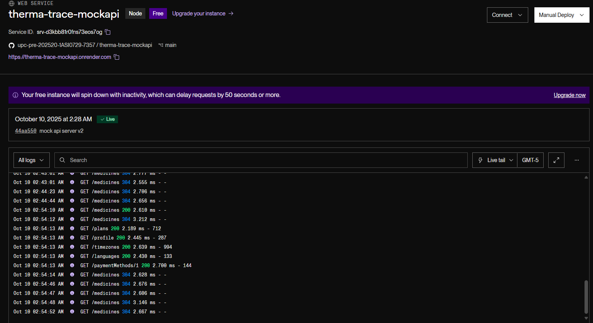
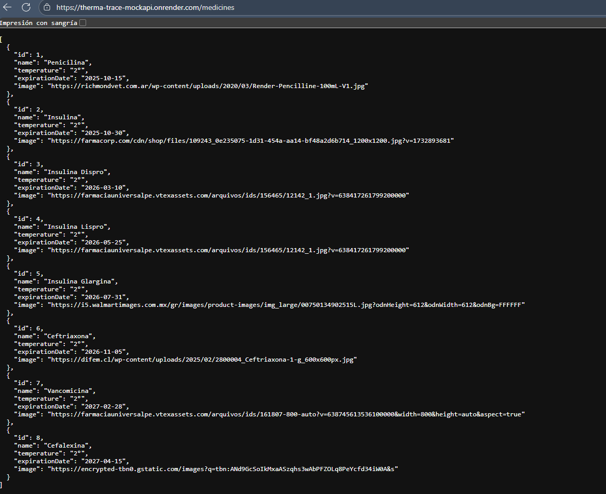
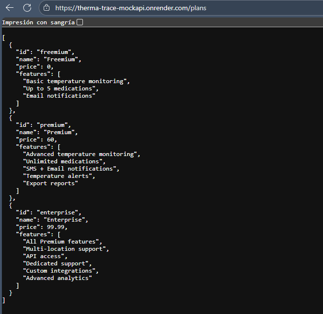
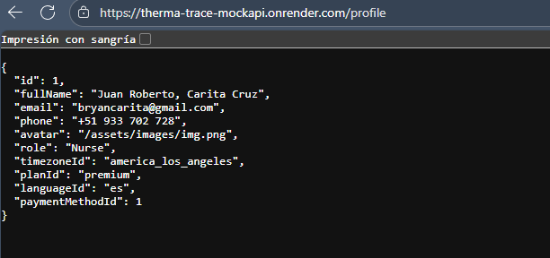
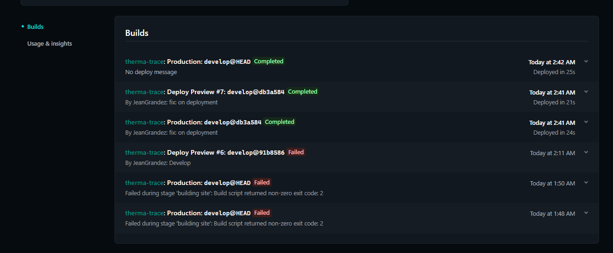
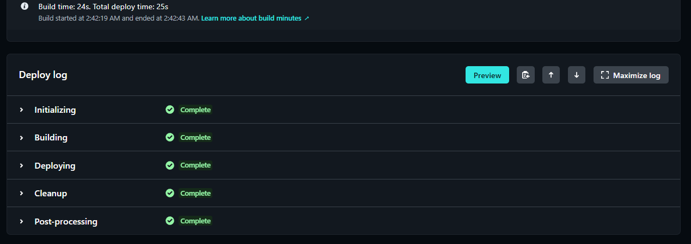
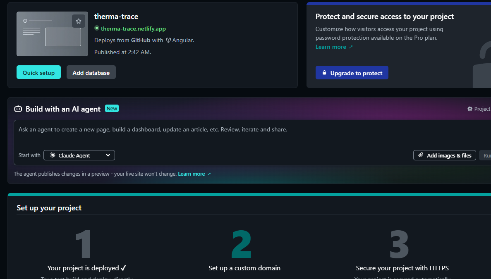
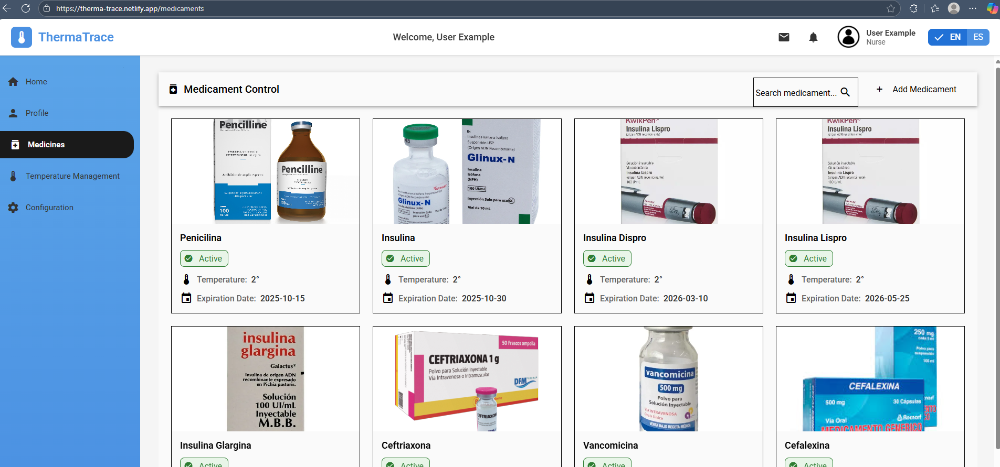
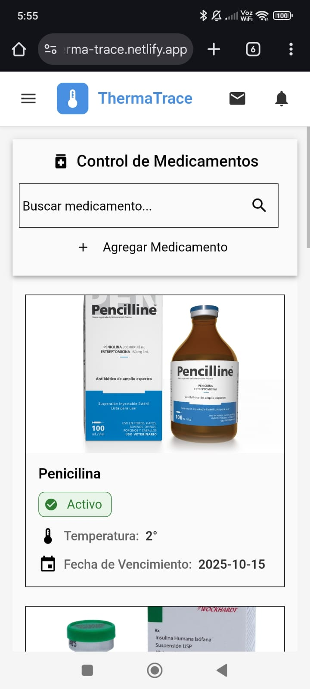
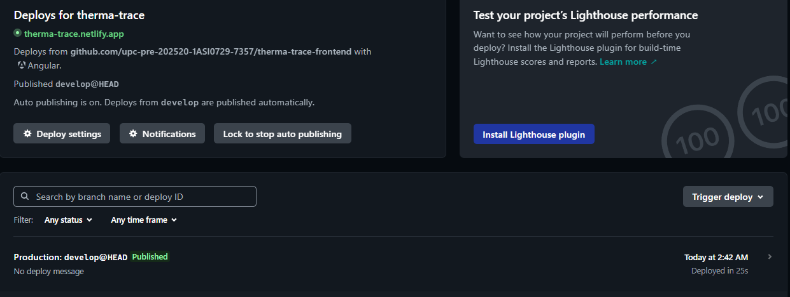

<p align="center">
    </img><br>
    <strong>Universidad Peruana de Ciencias Aplicadas</strong><br>
    <strong>Facultad: Ingeniería</strong><br>
    <strong>Carrera: Ingeniería de Software</strong><br>
    <strong>Periodo: 202520</strong><br>
    <strong>Codigo de curso: 1ASI0729</strong><br>
    <strong>Nombre del curso: Desarrollo de Aplicaciones Open Source - NRC: 7357</strong><br>
    <strong>Profesor: Rafael Oswaldo Castro Veramendi </strong><br>
    
    <br>Informe de trabajo final
</p>


**Project Management**


#### Nombre del startup: **IoTracker**
#### Nombre del producto: **ThermaTrace**


| Member                       | Code       |
|------------------------------|------------|
| Ordoñez Ricaldi, Axel        | U202216827 |
| Panta Castro, Fabrizio Martin| U20231A810 |
| Grandez Mansilla, Jean Pierre| U202212484 |
| Espinoza Quijandria, Oscar   | u202311842 |
| Espinoza Paredes, Frezzia Eldaa Isabel  | u815121 |


<br> Noviembre 2025
 


| Version | Fecha      | Autor                                 | Descripcion de Modificacion                                                                                                                                                                                                                                                                                            |
|---------|------------|---------------------------------------|--------------------------------------------------------------------------------------------------------------------------------------------------------------------------------------------------------------------------------------------------------------------------------------------------------|
| 0.0     | 28/08/2025 | IoTrack                               | Se crea el documento.                                                                                                                                                                                                                                                                                              |
| 0.1     | 30/08/2025 | Axel Ordoñez Ricaldi                  | Se agregaron las imágenes y se elaboró la descripción de cada participante, junto con una presentación general de la startup dentro del perfil.                                                                                                                          |  
| 0.2     | 01/09/2025 | Axel Ordoñez Ricaldi                  | Se realizó el primer avance del Capítulo 1, que abarca el desarrollo inicial de los antecedentes y la problemática, junto con la elaboración del Lean UX Problem Statement, el registro de Assumptions y la formulación de los Hypothesis Statements.                                                                                                                      |
| 0.3     | 05/09/2025 | Oscar Leonardo Espinoza Quijandria    | Se revisó y actualizó el Capítulo 1, incorporando la sección del Lean UX Process y asegurando coherencia y claridad en el contenido. Asimismo, se integraron los aportes de los colaboradores y finalmente se subió el informe a la rama develop.                                                                                                                         |
| 0.4     | 08/09/2025 | Oscar Leonardo Espinoza Quijandria    | Se avanzó en el desarrollo del Capítulo 2, incorporando el análisis competitivo y la documentación de las entrevistas, que incluyó su diseño, registro y análisis. Además, se dejó constancia del progreso en el needfinding dentro del informe.                                                                                                                         |
| 0.5     | 12/09/2025 | Frezzia Eldaa Isabel Espinoza Paredes | Se completó el Capítulo 2 con la finalización del needfinding, el desarrollo del Big Picture EventStorming y la creación del Ubiquitous Language. Posteriormente, se revisó y editó todo el capítulo para garantizar coherencia y claridad. Finalmente, el informe actualizado fue subido a la rama develop.                                                                                        |
| 0.6     | 15/09/2025 | Frezzia Eldaa Isabel Espinoza Paredes | Se avanzó en el desarrollo del Capítulo 3, identificando las épicas que servirán de base para las user stories. Además, se registró el progreso de dichas historias de usuario y se incorporó el impact map correspondiente.                                                                                                                 |
| 0.7     | 17/09/2025 | Jean Pierre Grandez Mansilla          | Se completó el desarrollo del Capítulo 3, integrando el avance del product backlog y el trabajo colaborativo realizado en Trello. Asimismo, se fusionó la rama correspondiente al Capítulo 3 con la rama develop.                                                                                                                         |
| 0.8     | 18/09/2025 | Fabrizio Panta Castro                 | Se avanzó en el desarrollo del Capítulo 4, enfocado en el diseño del producto a través de lineamientos visuales, arquitectura de información y propuestas UI/UX. Este trabajo incluyó guías de estilo, wireframes, mock-ups y flujos de interacción que garantizan consistencia, usabilidad y coherencia en la solución tecnológica.                                                     |
| 0.9     | 20/09/2025 | Fabrizio Panta Castro                 | Se completó el desarrollo del Capítulo 4, consolidando el diseño del producto a través de prototipos, arquitectura de software, diagramas orientados a objetos y diseño de base de datos, asegurando coherencia estructural y soporte técnico para la implementación de la solución. Finalmente, se fusionó la rama correspondiente al Capítulo 4 con la rama develop.                                      |
| 1.0     | 21/09/2025 | Jean Pierre Grandez Mansilla          | Se avanzó y concluyó el desarrollo del Capítulo 5, abarcando la configuración del entorno de desarrollo, la gestión del código fuente y el despliegue de la solución tecnológica. Asimismo, se documentó el progreso de los sprints, junto con las evidencias de desarrollo, pruebas y despliegue del software. Finalmente, se fusionó la rama correspondiente al Capítulo 5 con la rama develop. |


# Project Report Collaboration Insights
[URL del repositorio](https://github.com/upc-pre-202520-1ASI0729-7357/report)

(Imagenes de los commits cada entrega)


# Contenido


[Registro de Versiones del Informe](#registro-de-versiones-del-informe)

[Project Report Collaboration Insights](#project-report-collaboration-insights)

[Student Outcome](#student-outcome)

[Capítulo I: Introducción](#capítulo-i-introducción)

[1.1 Startup Profile](#11-startup-profile)  
[1.1.1. Descripción de la Startup](#111-descripción-de-la-startup)  
[1.1.2. Perfiles de integrantes del equipo](#112-perfiles-de-integrantes-del-equipo)  

[1.2. Solution Profile](#12-solution-profile)  
[1.2.1 Antecedentes y problemática](#121-antecedentes-y-problemática)  
[1.2.2 Lean UX Process.](#122-lean-ux-process)  
[1.2.2.1. Lean UX Problem Statements.](#1221-lean-ux-problem-statements)  
[1.2.2.2. Lean UX Assumptions.](#1222-lean-ux-assumptions)  
[1.2.2.3. Lean UX Hypothesis Statements.](#1223-lean-ux-hypothesis-statements)  
[1.2.2.4. Lean UX Canvas.](#1224-lean-ux-canvas)  

[1.3. Segmentos objetivo.](#13-segmentos-objetivo)  

[2.3. Needfinding](#23-needfinding)  
[2.3.1. User Personas](#231-user-personas)  
[2.3.2. User Task Matrix](#232-user-task-matrix)  
[2.3.3. User Journey Mapping](#233-user-journey-mapping)  
[2.3.4. Empathy Mapping](#234-empathy-mapping)  
[2.3.5. As-is Scenario Mapping](#235-as-is-scenario-mapping) 

[2.4. Ubiquitous Language](#24-ubiquitous-language)  

[Capítulo III: Requirements Specificatio](#capítulo-iii-requirements-specification)  

[3.1. To-Be Scenario Mapping](#31-to-be-scenario-mapping)    
[3.2. User Stories](#32-user-stories)  
[3.3. Impact Mapping](#33-impact-mapping)  
[3.4. Product Backlog](#34-product-backlog)  

[Capítulo IV: Product Desig](#capítulo-iv-product-design)  

[4.1. Style Guidelines](#41-style-guidelines)  
[4.1.1. General Style Guidelines](#411-general-style-guidelines)  
[4.1.2. Web Style Guidelines](#412-web-style-guidelines)  

[4.2. Information Architecture](#42-information-architecture)  
[4.2.1. Organization Systems](#421-organization-systems)  
[4.2.2. Labeling Systems](#422-labeling-systems)  
[4.2.3. SEO Tags and Meta Tag](#423-seo-tags-and-meta-tags)  
[4.2.4. Searching Systems](#424-searching-systems)   
[4.2.5. Navigation Systems](#425-navigation-systems)  

[4.3. Landing Page UI Design](#43-landing-page-ui-design)   
[4.3.1. Landing Page Wireframe](#431-landing-page-wireframe)  
[4.3.2. Landing Page Mock-up](#432-landing-page-mock-up) 

[4.4. Web Applications UX/UI Design](#44-web-applications-uxui-design)  
[4.4.1. Web Applications Wireframes](#441-web-applications-wireframes)  
[4.4.2. Web Applications Wireflow Diagrams](#442-web-applications-wireflow-diagrams)  
[4.4.2. Web Applications Mock-ups](#442-web-applications-mock-ups)   
[4.4.3. Web Applications User Flow Diagrams](#443-web-applications-user-flow-diagrams)  

[4.5. Web Applications Prototyping](#45-web-applications-prototyping)  

[4.6. Domain-Driven Software Architecture](#46-domain-driven-software-architecture)  
[4.6.1. Software Architecture Context Diagram](#461-software-architecture-context-diagram)  
[4.6.2. Software Architecture Container Diagrams](#462-software-architecture-container-diagrams)  
[4.6.3. Software Architecture Components Diagrams](#463-software-architecture-components-diagrams)  

[4.7. Software Object-Oriented Design](#47-software-object-oriented-design)  
[4.7.1. Class Diagrams](#471-class-diagrams)  
[4.7.2. Class Dictionary](#472-class-dictionary)  

[4.8. Database Design](#48-database-design)  
[4.8.1. Database Diagram](#481-database-diagram)  

[Capítulo V: Product Implementation, Validation & Deploymen](#capítulo-v-product-implementation-validation--deployment)  

[5.1. Software Configuration Management](#51-software-configuration-management)  
[5.1.1. Software Development Environment Configuration](#511-software-development-environment-configuration)  
[5.1.2. Source Code Management](#512-source-code-management)  
[5.1.3. Source Code Style Guide & Conventions](#513-source-code-style-guide--conventions)  
[5.1.4. Software Deployment Configuration](#514-software-deployment-configuration)  

[5.2. Landing Page, Services & Applications Implementation](#52-landing-page-services--applications-implementation)  
[5.2.X. Sprint ](#52x-sprint-n)  
[5.2.X.1. Sprint Planning n](#52x1-sprint-planning-n)  
[5.2.X.2. Sprint Backlog n](#52x2-sprint-backlog-n)  
[5.2.X.3. Development Evidence for Sprint Review](#52x3-development-evidence-for-sprint-review)  
[5.2.X.4. Testing Suite Evidence for Sprint Review](#52x4-testing-suite-evidence-for-sprint-review)  
[5.2.X.5. Execution Evidence for Sprint Review](#52x5-execution-evidence-for-sprint-review)  
[5.2.X.6. Services Documentation Evidence for Sprint Review](#52x6-services-documentation-evidence-for-sprint-review)  
[5.2.X.7. Software Deployment Evidence for Sprint Review](#52x7-software-deployment-evidence-for-sprint-review)  
[5.2.X.8. Team Collaboration Insights during Sprint](#52x8-team-collaboration-insights-during-sprint)  

[5.3. Validation Interviews](#53-validation-interviews)  
[5.3.1. Diseño de Entrevistas](#531-diseño-de-entrevistas)  
[5.3.2. Registro de Entrevistas](#532-registro-de-entrevistas)  
[5.3.3. Evaluaciones según heurísticas](#533-evaluaciones-según-heurísticas)  

[5.4. Video About-the-Product](#54-video-about-the-product)  

[Conclusiones](#conclusiones)  
[Conclusiones y recomendaciones](#conclusiones-y-recomendaciones)  
[Video About-the-Team](#video-about-the-team)  
[Bibliografía](#bibliografía)  
[Anexos](#anexos)  

# Student Outcome

| **Criterio Específico** | **Acciones Realizadas** | **Conclusiones** |
|--------------------------|-------------------------------------------------------------------------------------------------------------------------------------------------------------------------------------------------------------------------------------------------------------------------------------------------------------------------------------------------------------------------------------------------------------------------------------------------------------------------------------------------------------------------------------------------------------------------------------------------------------------------------------------------------------------------------------------------------------------------------------------------------------------------------------------------------------------------------------------------------------------------------------------------------------------------------------------------------------------------------------------------------------------------------------------------------------------------------------------------------------------------------------------------------------------------------------------------------------------------------------------------------------------------------------------------------------------------------------------------------------------------------------------------------------------------------------------------------------------------------------------------------------------------------------------------------------------------------------------------------------------------------------------------------------------------------------------------------------------------------------------------------------------------------------------------------------------------------------------------------------------------------------------------------------------------------------------------------------------------------------------------------------------------------------------------------------------------------------------------------------------------------------------------------------------------------------------------------------------------------------------------------------------------------------------------------------------------------------------------------------------------------------------------------------------------------------------------------------------------------------------------------------------------------------------------------------------------------------------------------------------------------------------------------------------------------------------------------------------------------------------------------------------------------------------------------------------------------------------------------------------------------------------------------------------------------------------------------------------------------------------------------------------------------------------------------------------------------------------------------------------------------------------------------------------------------------------------------------------------------------------------------------------------------------------|----------------------------|
| **Comunica por escrito con efectividad a diferentes rangos de audiencia.** | **Axel Randall Ordoñez Ricaldi:**<br>**Acciones TB1:** Redactó de manera clara y estructurada la documentación del perfil de la Startup, incluyendo la descripción de ThermaTrace, el problem statement bajo Lean UX, y el product backlog con historias de usuario detalladas. Su escritura técnica facilitó la comprensión del alcance del proyecto tanto para el equipo como para stakeholders externos.<br><br>**Acciones TP1:** Durante el Sprint 2, documenté por escrito el módulo de Medicaments en el Sprint Backlog 2, detallando las tareas de implementación del catálogo con cards de medicamentos (T22-T26), incluyendo descripciones técnicas precisas de cada funcionalidad. Elaboré mensajes de commit descriptivos siguiendo convenciones Conventional Commits (feat:, fix:, docs:) que facilitaron la trazabilidad del desarrollo. Redacté la documentación técnica del formulario de agregar medicamentos con cálculo automático de status, explicando la lógica de negocio y validaciones implementadas. Contribuí a la sección 5.2.2.4 (Development Evidence for Sprint Review) documentando los commits más relevantes del bounded context de Medicaments.<br><br>**Acciones TB2:** Durante el Sprint 3, desarrollé y documenté el módulo **Medicaments** en el backend bajo **Spring Boot**, implementando los endpoints CRUD (GET, POST, PUT, DELETE) conectados a la base de datos **MySQL**. Redacté descripciones técnicas sobre la lógica de negocio, validaciones de datos, excepciones controladas y pruebas con Postman. Además, generé documentación en **Swagger** explicando cada endpoint y su propósito. Los mensajes de commit siguieron las convenciones **Conventional Commits**, manteniendo trazabilidad clara del desarrollo.<br><br>**Fabrizio Martin Panta Castro:**<br>**Acciones TB1:** Redactó la documentación de entrevistas, style guidelines, information architecture y landing page UI design con un nivel de detalle técnico apropiado para diseñadores y desarrolladores. Su comunicación escrita en el reporte técnico demostró dominio de terminología UX/UI y capacidad de síntesis.<br><br>**Acciones TP1:** En el Sprint 2, documenté por escrito el módulo de Configuration en el Sprint Backlog 2, especificando las tareas de desarrollo de componentes de preferencias y seguridad (T27-T30) con descripciones claras y estimaciones precisas. Elaboré commits con mensajes descriptivos que documentan cada avance en la implementación de formularios de configuración y servicios de persistencia. Redacté la documentación de preferencias del sistema (idioma, zona horaria, notificaciones) y la sección de seguridad, explicando la arquitectura de servicios y la integración con JSON Server. Mi comunicación escrita en el código (comentarios técnicos, JSDoc) facilitó la comprensión de la lógica implementada por otros miembros del equipo.<br><br>**Acciones TB2:** Durante el Sprint 3, desarrollé el módulo **Configuration & Preferences** en **Spring Boot**, documentando la implementación de endpoints REST para la configuración del idioma, zona horaria, notificaciones y seguridad del sistema. Redacté los servicios de persistencia en **MySQL**, asegurando la trazabilidad y documentación de las operaciones CRUD. Agregué comentarios técnicos detallados en el código, describiendo las capas del dominio y los controladores REST. Documenté los endpoints en Swagger e integré los commits con convenciones descriptivas.<br><br>**Jean Pierre Grandez Mansilla:**<br>**Acciones TB1:** La elaboración de wireframes y mockups de la landing page, junto con la coordinación mediante llamadas grupales y trabajo en Miro, evidencian mi capacidad de aplicar metodologías ágiles y herramientas digitales para el trabajo colaborativo. Estas actividades me permitieron no solo plasmar la propuesta visual alineada a los User Personas y al branding, sino también integrar las contribuciones del equipo para consolidar un flujo coherente de investigación, diseño y comunicación de resultados.<br><br>**Acciones TP1:** Durante el Sprint 2, lideré la documentación escrita de la arquitectura base del proyecto en el Sprint Backlog 2, detallando las tareas de configuración del proyecto Angular 20, routing, layout y shared components (T01-T09) con descripciones técnicas precisas. Elaboré la sección 5.2.2.1 (Sprint Planning 2) con formato profesional y nivel de detalle apropiado para stakeholders técnicos y no técnicos. Redacté la documentación del sistema de internacionalización (i18n), explicando la configuración de @angular/localize, archivos de traducción (en.json, es.json) y el componente language switcher. Documenté el proceso de deployment en Netlify en la sección 5.2.2.7, incluyendo configuraciones técnicas (netlify.toml), pasos detallados y evidencias visuales. Elaboré mensajes de commit siguiendo convenciones que facilitan la comprensión del historial del proyecto.<br><br>**Acciones TB2:** Durante el Sprint 3, lideré la documentación y configuración general del **backend de ThermaTrace**, estructurando el proyecto bajo arquitectura **DDD (Domain Driven Design)**. Documenté la creación de entidades, controladores, servicios y repositorios **JPA**. Redacté la conexión con **MySQL**, configuraciones de `application.yml`, e integración con **Swagger**. Además, elaboré la guía técnica interna del backend, describiendo la estructura modular del proyecto y la función de cada capa. Mis commits fueron redactados con convenciones **Conventional Commits** para mantener un historial claro y ordenado.<br><br>**Oscar Espinoza Quijandria:**<br>**Acciones TB1:** Durante el desarrollo del Trabajo Base 1 (TB1) asumí un rol central en la implementación técnica del proyecto. Me encargué de la construcción de la Landing Page de ThermaTrace, aplicando los lineamientos de UX/UI definidos en equipo y asegurando la integración de las secciones principales (Home, About, Pricing, Team, Features). Además, lideré el desarrollo del Sprint Backlog 1, organizando las tareas, estimando esfuerzos y validando los entregables de cada integrante. Complementariamente, elaboré los diagramas de clases y de base de datos en PlantUML, lo que permitió estructurar de forma clara la arquitectura del sistema y su modelo de información. Estas contribuciones aseguraron que el equipo contara con una base técnica sólida para continuar el desarrollo en las siguientes iteraciones.<br><br>**Acciones TP1:** En el Sprint 2, documenté por escrito el módulo Dashboard/Home en el Sprint Backlog 2, detallando las tareas de implementación de métricas, visualización de temperatura y gráficos (T10-T15) con descripciones técnicas claras y estimaciones precisas. Elaboré commits con mensajes descriptivos que documentan la integración de Chart.js, servicios de dashboard y componentes de visualización. Redacté la documentación técnica de la arquitectura del dashboard, explicando la estructura de componentes, servicios y la conexión con JSON Server. Contribuí a la sección 5.2.2.5 (Execution Evidence for Sprint Review) con descripciones detalladas de las vistas implementadas y funcionalidades del dashboard. Mi comunicación escrita en el código (comentarios, naming conventions) facilitó la mantenibilidad y comprensión del módulo por parte del equipo.<br><br>**Acciones TB2:** Durante el Sprint 3, desarrollé y documenté el módulo **Dashboard & Metrics** en el backend, implementando endpoints REST para la obtención de estadísticas, registros históricos y alertas. Documenté cada endpoint en **Swagger**, explicando su estructura, parámetros y respuestas JSON. Además, elaboré pruebas funcionales con Postman, documentando resultados y tiempos de respuesta. Mis commits y documentación técnica aseguraron la trazabilidad y comprensión del módulo dentro del backend.<br><br>**Frezzia Eldaa Isabel Espinoza Paredes:**<br>**Acciones TB1:** [Pendiente de completar por la integrante]<br><br>**Acciones TP1:** Durante el Sprint 2, documenté por escrito el módulo User/Profile en el Sprint Backlog 2, especificando las tareas de desarrollo del componente de perfil, formulario de edición y servicios (T16-T20) con descripciones claras y estimaciones de esfuerzo precisas. Elaboré mensajes de commit descriptivos que documentan la implementación de formularios reactivos con validaciones, servicios de usuario y mensajes de feedback. Redacté la documentación técnica del módulo de perfil, explicando la arquitectura de componentes, formularios reactivos con Angular Forms, y la integración con JSON Server para operaciones CRUD. Contribuí a la documentación del Student Outcome y secciones técnicas del reporte, demostrando capacidad de redacción técnica adaptada a diferentes audiencias (equipo técnico, product owner, evaluadores académicos). | **Conclusión grupal TB1:**<br>El equipo demostró capacidad de comunicación escrita efectiva en la documentación del TB1, produciendo textos técnicos claros, estructurados y adaptados a diferentes audiencias (stakeholders técnicos y no técnicos). La documentación del perfil de la startup, análisis de requerimientos, diseño UX/UI y arquitectura técnica evidenció dominio de terminología especializada y capacidad de síntesis.<br><br>**Conclusión grupal TP1:**<br>Durante el Sprint 2, el equipo consolidó sus habilidades de comunicación escrita técnica, produciendo documentación de alta calidad en múltiples formatos: Sprint Backlog detallado con estimaciones precisas, mensajes de commit siguiendo convenciones (Conventional Commits), documentación técnica de módulos (Dashboard, Profile, Medicaments, Configuration, Layout), código fuente con comentarios claros y naming conventions consistentes, y secciones del reporte técnico (Sprint Planning, Development Evidence, Execution Evidence, Deployment Evidence, Team Collaboration Insights). La comunicación escrita fue efectiva para diferentes audiencias: compañeros de equipo (code reviews, pull requests), product owner (user stories, acceptance criteria), y evaluadores académicos (reporte técnico completo). La calidad de la documentación facilitó la colaboración distribuida y la trazabilidad del desarrollo del frontend de ThermaTrace en Angular 20.<br><br>**Conclusión grupal TB2:**<br>Durante el Sprint 3, el equipo demostró dominio en la comunicación escrita técnica para el desarrollo del backend de ThermaTrace, documentando con precisión los endpoints, servicios, controladores y entidades implementadas. Los commits descriptivos, la integración con Swagger y las pruebas en Postman garantizaron una trazabilidad completa y comprensión uniforme entre los miembros del equipo. La documentación generada refleja consistencia, claridad y profesionalismo, cumpliendo con los estándares de desarrollo backend bajo arquitectura DDD y Clean Architecture. |


# Capítulo I: Introducción
## 1.1. Startup Profile
### 1.1.1. Descripción de la Startup

Nuestra startup nace con un propósito claro: garantizar que los medicamentos sensibles se conserven siempre en las condiciones adecuadas, evitando riesgos para la salud y pérdidas económicas por fallas en la cadena de frío. Creemos que el acceso a tratamientos seguros no debe depender de controles manuales poco fiables, sino de herramientas tecnológicas simples y confiables.
Nuestra plataforma digital ofrece un sistema intuitivo para monitorear, registrar y recibir alertas sobre la temperatura de refrigeración de medicamentos en tiempo real. A través de una experiencia visual y clara, los usuarios pueden supervisar el estado de sus equipos de refrigeración desde cualquier lugar, detectar desviaciones a tiempo y contar con reportes automáticos para auditorías y cumplimiento normativo.
El sistema está diseñado pensando en farmacias, hospitales, clínicas y cadenas de distribución, que requieren un control constante y trazable de sus inventarios médicos. Inicialmente, ofrecemos una versión web con datos simulados para demostrar la experiencia de uso y el valor de la solución, con la visión de integrar sensores IoT, aplicaciones móviles y tecnologías adicionales en fases posteriores.
Nuestra propuesta de valor combina seguridad, simplicidad y confiabilidad. Queremos que supervisar la cadena de frío sea tan fácil como abrir una aplicación, reduciendo riesgos, mejorando la eficiencia operativa y fortaleciendo la confianza de pacientes e instituciones.

**Misión:** Democratizar el acceso a sistemas de monitoreo avanzados que aseguren la conservación óptima de medicamentos, protegiendo la salud de las personas y reduciendo pérdidas en el sector salud.

**Visión:** Convertirnos en un referente global en soluciones de trazabilidad y monitoreo inteligente, impulsando un modelo de salud más seguro, eficiente y tecnológicamente conectado.

Más que una plataforma, queremos ser un aliado estratégico para las instituciones de salud, construyendo un ecosistema donde la tecnología no sea un lujo, sino una garantía de confianza y bienestar para todos.


#### 1.1.2. Perfiles de integrantes del equipo
| Miembros del equipo                                                                                                                                                                                                                    | Codigo Estudiante | Carrera                | Conocimientos / Habilidades                                                                                                                                                                                                      |
|----------------------------------------------------------------------------------------------------------------------------------------------------------------------------------------------------------------------------------------|-------------------|------------------------|----------------------------------------------------------------------------------------------------------------------------------------------------------------------------------------------------------------------------------|
| Axel Randall Ordoñez Ricaldi 	                                      | U202216827        | Ingenieria de software | C++, React, Vue, Angular, C#, SQL, MongoDB, Python. Paciencia y buen trabajo en equipo                                                                                                                                           |
| Panta Castro, Fabrizio Martin   | U20231A810        | Ingeniería de Software | SQL, Python, Flutter, Vue, C++. Compañerismo y responsable con las entregas.                                                                                                                                                     |
| Oscar Espinoza Quijandria                                                                            | U202311842        | Ing. Software          | Lenguajes: js py c# c++ pearl. Base de datos : SqlServer, Mysql, Sqlite, Mongodb . Frameworks: Angular, Vue, .net Core, Django. Soy alguien al que le gusta trabajar en equipo, soy perceverante y me gusta dar todo de mi mismo |
| Jean Pierre Grandez Mansilla                                                            | U202212484        | Ing. de Software       | JS, Python, React, C#, SQL, AWS, NextJ, MongoDB. Entusiasta por la tecnología y dispuesto a aprender.                                                                                                                            |
|                                                                                                                                                                                                                                        |                   |                        |                                                                                                                                                                                                                                  |

## 1.2. Solution Profile
### 1.2.1 Antecedentes y problemática
En los últimos años, el sector salud ha enfrentado crecientes desafíos relacionados con la conservación y distribución segura de medicamentos sensibles, especialmente aquellos que requieren estrictos controles de temperatura, como vacunas, insulinas y productos biológicos. La pandemia de COVID-19 puso de relieve la importancia de la cadena de frío, evidenciando que un fallo en el control de condiciones de almacenamiento puede tener consecuencias graves en la efectividad de los tratamientos y en la seguridad de los pacientes.

A nivel global, las tecnologías de monitoreo en tiempo real y trazabilidad mediante IoT han comenzado a consolidarse como herramientas clave para garantizar la calidad de los fármacos y cumplir con las normativas sanitarias. Sin embargo, en gran parte de Latinoamérica —y particularmente en el Perú—, la adopción de estas soluciones sigue siendo limitada. Los factores que explican esta brecha son la dependencia de controles manuales poco confiables, los altos costos de implementación de sistemas avanzados y la falta de plataformas intuitivas que simplifiquen el proceso para farmacias, hospitales y centros de distribución.

Actualmente, muchas instituciones del sector salud carecen de mecanismos integrados para monitorear la temperatura en tiempo real. Cuando existen, suelen estar restringidos a grandes cadenas farmacéuticas o clínicas privadas con mayor presupuesto, dejando de lado a la mayoría de farmacias independientes, boticas locales y clínicas de menor escala. Esto genera un riesgo constante: pérdidas económicas por medicamentos dañados, incumplimiento de normativas y, lo más crítico, amenazas directas a la salud de los pacientes.

La problematica se puede resumir en los siguientes puntos:

- **Dependencia de controles manuales poco confiables:** la mayoría de farmacias, hospitales y clínicas registran temperaturas en planillas físicas o sistemas aislados, lo que incrementa el riesgo de errores humanos y fallos de supervisión.

- **Accesibilidad limitada:** las soluciones tecnológicas de monitoreo existentes suelen estar dirigidas a grandes instituciones con alta capacidad de inversión, dejando excluidas a farmacias y centros pequeños.

- **Falta de trazabilidad y reportes automáticos:** los sistemas tradicionales no permiten generar registros auditables ni reportes en tiempo real, dificultando el cumplimiento de normas regulatorias y procesos de fiscalización sanitaria.

- **Altos costos de implementación:** integrar sensores avanzados o plataformas propietarias implica inversiones significativas en hardware, licencias y soporte técnico especializado, lo que limita su adopción masiva.

- **Impacto en la salud y en la economía:** las fallas en la cadena de frío no solo provocan pérdidas económicas por medicamentos dañados, sino que también pueden poner en riesgo la seguridad de los pacientes al administrar productos en mal estado.

En este contexto surge la necesidad de contar con soluciones accesibles, seguras y confiables que permitan democratizar el monitoreo de la cadena de frío, ofreciendo a las instituciones de salud herramientas simples para garantizar la trazabilidad y seguridad en el almacenamiento de medicamentos.

**1. What (¿Qué?)**

El sector salud enfrenta dificultades para garantizar la correcta conservación de medicamentos sensibles que requieren cadena de frío. Actualmente, muchas farmacias, hospitales, clínicas y centros de distribución dependen de controles manuales poco confiables, como registros en planillas o verificaciones esporádicas, que no permiten un monitoreo continuo ni la detección oportuna de desviaciones de temperatura. Las soluciones existentes suelen ser complejas o costosas, restringidas a grandes instituciones, dejando sin alternativas accesibles a la mayoría de actores del sistema.

**2. Why (¿Por qué?)**

Esto ocurre porque los métodos tradicionales presentan limitaciones significativas: los registros manuales son propensos a errores humanos, las soluciones de monitoreo actuales implican altos costos de hardware, licencias y soporte, y la mayoría carece de automatización para emitir alertas en tiempo real o generar reportes auditables. Como consecuencia, las instituciones del sector salud quedan expuestas a pérdidas económicas por medicamentos dañados y, lo más grave, a riesgos sanitarios para los pacientes.

**3. Who (¿Quién?)**

El problema afecta directamente a farmacias y boticas, que requieren monitoreo constante de inventarios pequeños pero sensibles; a hospitales y clínicas, que manejan grandes volúmenes de medicamentos críticos bajo presión de auditorías; y a centros de distribución y laboratorios farmacéuticos, que necesitan trazabilidad durante transporte y almacenamiento. De forma indirecta, impacta también en los pacientes, quienes pueden recibir tratamientos comprometidos por fallas en la cadena de frío.

**4. Where (¿Dónde?)**

La problemática se manifiesta en toda la cadena de suministro y almacenamiento de medicamentos: en farmacias locales con recursos limitados para implementar tecnología, en hospitales y clínicas que deben cumplir protocolos de bioseguridad y auditorías regulatorias, y en centros de distribución que requieren garantizar condiciones adecuadas desde el origen hasta la entrega final.

**5. When (¿Cuándo?)**

Este problema es actual y cada vez más urgente, ya que la demanda de medicamentos biológicos y tratamientos refrigerados crece constantemente. La pandemia de COVID-19 visibilizó la necesidad de cadenas de frío confiables y trazables, y hoy, en un contexto donde la digitalización y la seguridad del paciente son prioridades, seguir dependiendo de controles manuales representa un riesgo inaceptable.

**6. How (¿Cómo?)**

La situación se refleja en errores frecuentes por registros manuales incompletos o tardíos, en la ausencia de alertas en tiempo real que permitan acciones preventivas, en las dificultades para cumplir auditorías sanitarias por falta de reportes históricos confiables y en la exclusión de pequeños actores del sector, que no pueden acceder a soluciones diseñadas para instituciones de gran escala y alto presupuesto.

**7. How much (¿Cuánto?)**

El costo de esta problemática es elevado: la Organización Mundial de la Salud estima que más del 25 % de las vacunas a nivel global se pierde por fallas en la cadena de frío; una desviación de temperatura puede significar pérdidas de miles de dólares en inventario para una farmacia u hospital; y los sistemas de monitoreo actuales requieren inversiones que ascienden a decenas de miles de dólares, inaccesibles para instituciones pequeñas o medianas, sin garantizar siempre escalabilidad ni simplicidad en su uso.


### 1.2.2 Lean UX Process.
#### 1.2.2.1. Lean UX Problem Statements.
Nuestra startup es una plataforma digital que permite a farmacias, hospitales, clínicas y centros de distribución garantizar la conservación adecuada de medicamentos sensibles mediante un sistema de monitoreo en tiempo real, accesible e intuitivo. Buscamos democratizar el acceso a tecnologías de cadena de frío seguras y confiables, reduciendo riesgos para la salud, pérdidas económicas y barreras técnicas en el sector salud.

**Contexto:** Nuestra plataforma está diseñada para supervisar equipos de refrigeración de forma remota, generando alertas inmediatas ante desviaciones de temperatura y reportes automáticos para auditorías. El objetivo es ofrecer una herramienta sencilla y confiable que ayude a instituciones de salud a cumplir normativas sanitarias y a proteger la calidad de sus inventarios médicos.

**Observación del problema:** Sin embargo, hemos identificado que muchas instituciones aún dependen de controles manuales poco confiables o de soluciones tecnológicas costosas y complejas, lo que limita la adopción de sistemas efectivos. Farmacias pequeñas y clínicas locales carecen de opciones accesibles, mientras que hospitales y centros de distribución enfrentan dificultades para garantizar trazabilidad y auditoría en toda la cadena de frío. Estas observaciones provienen de estudios del sector, organismos internacionales y entrevistas con actores de salud, quienes señalan la necesidad de soluciones simples y adaptables.

**Impacto:** Esta situación genera pérdidas económicas considerables por medicamentos dañados, incumplimiento de requisitos regulatorios y, lo más grave, riesgos para la salud de los pacientes al administrar tratamientos comprometidos. Además, la falta de accesibilidad tecnológica profundiza la brecha entre instituciones grandes y pequeñas, afectando la equidad en el acceso a medicamentos seguros y disminuyendo la confianza en los servicios de salud.

**Necesidad insatisfecha:** Actualmente, las instituciones requieren soluciones integradas, accesibles y fáciles de implementar que permitan monitorear y auditar la cadena de frío de manera continua y confiable. Al mismo tiempo, necesitan plataformas intuitivas que reduzcan la dependencia de registros manuales y soporte técnico especializado, optimizando la eficiencia operativa y garantizando la seguridad de los medicamentos.

**Pregunta de mejora:** ¿Cómo podríamos simplificar y democratizar el monitoreo de la cadena de frío en el sector salud para que farmacias y hospitales adopten estas soluciones de forma accesible, incrementando así la seguridad de los pacientes, la eficiencia operativa y la confiabilidad en la conservación de medicamentos?

#### 1.2.2.2. Lean UX Assumptions.
En la fase inicial de desarrollo de nuestra plataforma para el sector salud, hemos identificado y estructurado un conjunto de supuestos siguiendo la metodología Lean UX. Estos supuestos representan nuestras creencias iniciales sobre quiénes son nuestros usuarios, cuáles son sus necesidades prioritarias, cómo funcionará el modelo de negocio, qué resultados esperamos alcanzar y cuáles son las funcionalidades clave que permitirán validar la propuesta de valor. Formalizar estas creencias nos permitirá enfocar el diseño y desarrollo en la validación temprana, minimizar riesgos y garantizar que la estrategia del producto esté alineada con las necesidades reales de farmacias, hospitales, clínicas y centros de distribución.

Los supuestos se han clasificado en cinco categorías principales para una mejor estructuración:

- **User Assumptions:** Nuestras creencias sobre las necesidades, motivaciones y comportamientos de farmacias, hospitales, clínicas y centros de distribución al buscar soluciones de monitoreo de cadena de frío accesibles, confiables y fáciles de usar.

- **User Outcome Assumptions:** Los beneficios tangibles y mejoras en eficiencia, seguridad, cumplimiento regulatorio y satisfacción que anticipamos que experimenten los usuarios al integrar la plataforma en sus procesos.

- **Business Assumptions:** Hipótesis sobre la viabilidad y escalabilidad del modelo de negocio en el sector salud, considerando dinámicas de adopción tecnológica, regulaciones y alianzas estratégicas.

- **Business Outcome Assumptions:** Los resultados medibles que proyectamos generar para la startup, como aumento de ingresos recurrentes, reducción de costos operativos, diferenciación en el mercado y fortalecimiento de la retención de clientes.

- **Feature Assumptions:** Nuestras creencias sobre cómo funcionalidades específicas de la plataforma (ej. monitoreo en tiempo real, alertas automáticas, reportes para auditorías, integración con IoT) resolverán problemas críticos de los usuarios y validarán nuestras hipótesis de negocio.

Estos supuestos formarán la base de nuestra estrategia de diseño y validación continua, guiando la evolución de la plataforma hacia una solución que realmente democratice el acceso a tecnologías de conservación segura de medicamentos.

**User Assumptions**
- Creemos que el 70% de las farmacias pequeñas y clínicas locales buscan soluciones de monitoreo accesibles y fáciles de usar, porque actualmente carecen de alternativas tecnológicas confiables que no requieran inversión elevada.

- Creemos que el 85% de los hospitales y centros de distribución valoran la trazabilidad completa de la cadena de frío, porque el cumplimiento normativo y la auditoría son críticos en sus operaciones.

- Creemos que el 60% de los responsables de farmacia priorizan recibir alertas inmediatas ante desviaciones de temperatura, ya que los controles manuales generan errores humanos y pérdidas.

- Creemos que el 75% de los usuarios no técnicos (farmacéuticos, asistentes, personal de enfermería) necesitan interfaces simples e intuitivas, porque no cuentan con formación en sistemas tecnológicos avanzados.

- Creemos que el 50% de las instituciones medianas y grandes están dispuestas a migrar de sistemas manuales a plataformas digitales si estas reducen el riesgo de sanciones regulatorias y pérdidas económicas.

**User Outcome Assumptions**
- Creemos que si los usuarios tienen un sistema de monitoreo en tiempo real, entonces reducirán en al menos 30% las pérdidas por medicamentos dañados durante los primeros seis meses.

- Creemos que si la plataforma genera reportes automáticos de cumplimiento, entonces al menos el 65 % de las instituciones los usarán como evidencia principal en auditorías.

- Creemos que si los usuarios reciben alertas preventivas, entonces la confianza en la seguridad de sus inventarios médicos aumentará en un 40% en encuestas de satisfacción.

- Creemos que si las farmacias pequeñas tienen acceso a una solución accesible, entonces su adopción de monitoreo digital se incrementará en un 50% en el primer año.

**Business Assumptions**
- Creemos que el 60% de los ingresos provendrá de suscripciones mensuales de farmacias, clínicas y hospitales, mientras que el 40% vendrá de contratos con centros de distribución y alianzas con proveedores de salud.

- Creemos que la demanda inicial se concentrará en farmacias y clínicas pequeñas, porque son las más afectadas por pérdidas y la falta de cumplimiento regulatorio.

- Creemos que un modelo SaaS con planes escalonados (básico, profesional y enterprise) será viable, ya que permite adaptarse a las necesidades de diferentes tamaños de instituciones.

- Creemos que las regulaciones sanitarias cada vez más estrictas impulsarán la adopción de nuestra plataforma como una herramienta necesaria para el sector salud.

- Creemos que podremos establecer al menos 5 alianzas estratégicas con distribuidores de equipos de refrigeración e IoT, lo que nos permitirá acelerar la penetración de mercado.

**Business Outcome Assumptions**
- Creemos que si la plataforma es adoptada por al menos 100 farmacias y clínicas en el primer año, entonces generaremos un flujo recurrente de ingresos que garantizará la sostenibilidad inicial.

- Creemos que si reducimos los incidentes de pérdida de medicamentos en al menos un 30%, entonces aumentaremos la retención de clientes en un 70% tras el primer año.

- Creemos que si las instituciones logran cumplir más fácilmente con normativas, entonces incrementaremos nuestra tasa de conversión de pruebas piloto a contratos pagos en un 25%.

- Creemos que si cerramos alianzas con distribuidores de equipos, entonces reduciremos el costo de adquisición de clientes (CAC) en un 20% gracias a ventas indirectas.

**Feature Assumptions**
- Creemos que un panel de monitoreo en tiempo real permitirá a los usuarios supervisar fácilmente múltiples equipos, logrando que el 80 % lo consulte diariamente en el primer mes.

- Creemos que la funcionalidad de alertas automáticas reducirá incidentes críticos, con el 70% de los usuarios configurando alertas personalizadas en los primeros 30 días.

- Creemos que los reportes automáticos descargables serán usados como evidencia en auditorías, alcanzando al 60% de uso en instituciones con regulaciones estrictas.

- Creemos que la integración con sensores IoT mejorará la confiabilidad del sistema, logrando que el 50% de los clientes adopten esta opción en el primer año.

- Creemos que una interfaz intuitiva y multiusuario reducirá la dependencia de soporte técnico, alcanzando que el 40% de los problemas se resuelvan vía autoservicio (FAQs o chatbot).
#### 1.2.2.3. Lean UX Hypothesis Statements.

- **Accesibilidad para pequeñas farmacias y clínicas**
Creemos que las farmacias y clínicas pequeñas adoptarán nuestra plataforma porque podrán monitorear la cadena de frío de manera accesible y sin necesidad de personal especializado en TI. Sabremos que hemos tenido éxito cuando al menos el 50% de los clientes iniciales sean instituciones pequeñas que antes usaban controles manuales.

- **Confianza y reducción de riesgos en hospitales y centros de distribución**
Creemos que los hospitales y centros de distribución valorarán la plataforma porque les permitirá garantizar trazabilidad y auditoría en todo momento. Sabremos que hemos tenido éxito cuando al menos el 70% de los usuarios indiquen en encuestas que confían más en la conservación de medicamentos tras tres meses de uso

- **Ahorro de tiempo en gestión operativa**
Creemos que la automatización de reportes reducirá significativamente el tiempo invertido en controles manuales. Sabremos que hemos tenido éxito cuando los usuarios reporten una reducción del 40% en el tiempo destinado a registros manuales en las primeras 6 semanas.

- **Prevención de pérdidas económicas**
Creemos que las alertas en tiempo real disminuirán las pérdidas de medicamentos dañados. Sabremos que hemos tenido éxito cuando los usuarios reporten al menos un 30% de reducción en pérdidas por fallas de conservación tras seis meses de uso.

- **Democratización de la tecnología**
Creemos que un modelo de precios flexible permitirá que instituciones pequeñas y grandes adopten la plataforma sin barreras económicas significativas.
Sabremos que hemos tenido éxito cuando al menos el 60% de nuestros clientes correspondan a instituciones con presupuestos reducidos.

- **Escalabilidad en el sector salud**
Creemos que nuestra solución podrá ser escalada desde farmacias hasta hospitales y cadenas de distribución sin necesidad de personalización costosa. Sabremos que hemos tenido éxito cuando logremos contratos con al menos tres tipos de instituciones diferentes en el primer año.

- **Crecimiento sostenido en la adopción**
Creemos que al ofrecer una solución accesible y confiable, lograremos un crecimiento continuo en clientes. Sabremos que hemos tenido éxito cuando alcancemos una tasa de retención superior al 70% y un crecimiento mensual del 15% en usuarios activos durante el primer año.

- **Generación de confianza en el mercado**
Creemos que ser percibidos como una herramienta que facilita el cumplimiento normativo aumentará nuestra credibilidad en el sector salud. Sabremos que hemos tenido éxito cuando al menos el 50% de los clientes indiquen que nos eligieron por apoyo en auditorías y normativas.

- **Alertas inmediatas como diferenciador**
Creemos que las notificaciones en tiempo real serán el factor clave de diferenciación frente a controles manuales o sistemas costosos. Sabremos que hemos tenido éxito cuando al menos el 80% de los usuarios configuren y respondan a una alerta en el primer mes.

- **Reportes automáticos para auditorías**
Creemos que la generación de reportes automáticos simplificará la preparación para auditorías sanitarias. Sabremos que hemos tenido éxito cuando el 70% de los usuarios utilicen los reportes generados por la plataforma en auditorías reales.

- **Interfaz intuitiva**
Creemos que una interfaz simple permitirá que personal no técnico pueda manejar el sistema sin capacitaciones extensas. Sabremos que hemos tenido éxito cuando al menos el 60% de los nuevos usuarios logren configurar un equipo de refrigeración sin solicitar soporte.

#### 1.2.2.4. Lean UX Canvas.


## 1.3. Segmentos objetivo.
| | Segmento 1 | Segmento 2  |
| - | - |-|
| Variables                 | Hospitales | Farmacias |
| Geográfica                | Principalmente en áreas urbanas y semiurbanas de Perú y Latinoamérica, donde existe mayor concentración de hospitales públicos y privados que manejan altos volúmenes de medicamentos sensibles. | Ubicadas en zonas urbanas y suburbanas, incluyendo distritos céntricos y barrios residenciales con alta demanda de medicamentos, especialmente en farmacias independientes y cadenas locales. |
| Demográfica               | Edad de directores y responsables: 35-60 años; Género: Mixto; Educación: Profesionales con estudios en medicina, farmacia o gestión hospitalaria; Ingresos: Institucionales (presupuestos medios y altos); Estado civil variado. | Propietarios o administradores de farmacias de 28-50 años; Género: Mixto; Educación: Técnicos en farmacia, farmacéuticos o administradores; Ingresos: Medio; Estado civil variado; generalmente familias o negocios familiares. |
| Psicológica               | Orientados al cumplimiento normativo y la seguridad del paciente. Valoran soluciones confiables, escalables y auditables que garanticen trazabilidad completa. Personalidad práctica, orientada a procesos y resultados, con alta responsabilidad en la gestión de inventarios. | Buscan accesibilidad y simplicidad en la gestión. Valoran la facilidad de uso, el ahorro de tiempo y la reducción de pérdidas económicas. Prefieren soluciones intuitivas y de bajo costo que no requieran conocimientos técnicos avanzados. |
| Función de comportamiento | Alta frecuencia en la necesidad de generar reportes auditables, trazabilidad completa de inventarios y cumplir protocolos regulatorios estrictos. Fidelidad a soluciones que reduzcan riesgos de sanciones y mejoren eficiencia operativa. Barreras: costos de integración tecnológica y resistencia al cambio organizacional. | Uso frecuente de herramientas básicas de control. Adoptan nuevas tecnologías si son intuitivas y económicas. Alta motivación por prevenir pérdidas y mejorar la rentabilidad. Barreras: limitaciones presupuestarias y escasa capacitación tecnológica del personal. |

---

# Capítulo II: Requirements Elicitation & Analysis
## 2.1. Competidores.

Se han identificado los siguientes competidores en el mercado de soluciones de monitoreo de cadena de frío para el sector salud:

- **Competidor 1: Sensitech**
  - **Descripción:** Sensitech es una empresa global que ofrece dispositivos de monitoreo en tiempo real, dataloggers desechables y reutilizables, y una plataforma de visibilidad llamada ColdStream®, que integra datos tanto en almacenamiento como en transporte.
- **Competidor 2: Exolinked**
  - **Descripción:** Exolinked es una empresa latinoamericana enfocada en soluciones IoT de cadena de frío. Su plataforma digital permite monitorear en tiempo real temperatura, humedad y consumo energético, centralizando los datos en la nube y generando alarmas automáticas cuando se detectan desviaciones predefinidas.
- **Competidor 3: Netux**
  - **Descripción:** Netux se especializa en tecnologías para el sector salud. Desarrolla un sistema de monitoreo en tiempo real que recopila variables críticas en refrigeración de medicamentos y vacunas, integrando datos en la nube para ofrecer trazabilidad completa, reportes automáticos e informes auditables.
### 2.1.1. Análisis competitivo.

| Competitive Analysis Landscape                          |                                                                                                                                                                                                                                                                                                                                                                                                                                 |
| ------------------------------------------------------- |---------------------------------------------------------------------------------------------------------------------------------------------------------------------------------------------------------------------------------------------------------------------------------------------------------------------------------------------------------------------------------------------------------------------------------|
| ¿Por qué llevar a cabo este análisis?                   | Este análisis nos permite identificar a nuestros principales competidores que ya ofrecen soluciones digitales e IoT de monitoreo de la cadena de frío farmacéutica en Latinoamérica y a nivel global.<br/> Así podemos contrastar nuestra propuesta de valor, sobre el segmento objetivo y el posicionamiento local para poder desarrollar una solución que se destaque en el mercado y se diferencie de nuestros competidores. |


|                         |                             | **Nuestra Startup**                                                                                                                                                            | **Exolinked (LatAm)**                                                                                                 | **Netux (Col/LatAm)**                                                                                                             | **Sensitech (Global)**                                                                                                                          | 
|-------------------------|-----------------------------|--------------------------------------------------------------------------------------------------------------------------------------------------------------------------------|-----------------------------------------------------------------------------------------------------------------------|-----------------------------------------------------------------------------------------------------------------------------------|-------------------------------------------------------------------------------------------------------------------------------------------------|
| **PERFIL**              | Overview                    | Plataforma **web** para monitoreo en tiempo real de medicamentos, con **alertas** y **reportes automáticos**. Foco inicial: **Perú/LatAm**, farmacias y clínicas subatendidas. | Empresa IoT de LatAm que ofrece **monitoreo de cadena de frío** (T°, HR, energía) con datos en la nube y **alarmas**. | Empresa colombiana especializada en **salud**, con **sistema de monitoreo** de T° para vacunas, medicamentos y bancos de sangre.  | Multinacional Carrier con soluciones **end-to-end** para farma, usando **monitores en tiempo real** y plataforma **ColdStream®**.               |
| **PERFIL**              | Ventaja competitiva (valor) | **Simplicidad + accesibilidad**. Reportes alineados a **auditorías** y precios bajos.                                                                                          | **Protocolos de implementación claros**, escalabilidad IoT, consultoría en integración HW+SW.                         | **Vertical en salud**, reportes auditables listos para farmacias, clínicas y hospitales.                                          | **Cumplimiento global (GxP, 21 CFR, EU)** y trazabilidad **integral** en transporte y almacenamiento.                                           |
| **Perfil de Marketing** | Mercado objetivo            | Farmacias, boticas, clínicas, hospitales, centros de distribución.                                                                                                             | Sectores de logística, retail y salud que requieren trazabilidad.                                                     | Hospitales, clínicas, farmacias y bancos de sangre en LatAm.                                                                      | Empresas farmacéuticas, distribuidoras y operadores logísticos a nivel global.                                                                  |
| **Perfil de Marketing** | Estrategia de marketing     | Go-to-market local con **alianzas en Perú**, inbound con foco en **cumplimiento MINSA y DIGEMID**.                                                                             | Marketing consultivo y B2B, con **casos de uso** y servicios personalizados.                                          | Marketing orientado a **salud** (vacunas, medicamentos), casos clínicos y regulación.                                             | **Enterprise marketing** con whitepapers, casos globales y venta corporativa.                                                                   |
| **Perfil de Producto**  | Productos & servicios       | Plataforma SaaS (dashboard, alertas, reportes). Roadmap IoT y app móvil.                                                                                                       | Monitoreo de T°, HR, consumo energético. Plataforma cloud + alarmas.                                                  | Monitoreo T° en tiempo real, trazabilidad, geolocalización, reportes automáticos.                                                 | Monitores/dataloggers en tiempo real, **ColdStream®**, reportes de cumplimiento.                                                                |
| **Perfil de Producto**  | Precios & costos            | Modelo SaaS accesible para presupuestos limitados de farmacias y hospitales peruanos                                                                                           | SaaS + HW bajo cotización.                                                                                            | SaaS + HW bajo cotización.                                                                                                        | Enterprise HW + SaaS, bajo cotización.                                                                                                          |
| **Perfil de Producto**  | Canales (Web/Móvil)         | Web responsive, app móvil futura, distribución directa + alianzas farmacéuticas locales.                                                                                       | Web (cloud) + IoT.                                                                                                    | Web (nube), apps y módulos en salud.                                                                                              | Web (plataforma enterprise).                                                                                                                    |
| **Análisis SWOT**       | Fortalezas                  | Nuestra solución se enfoca cubrir las necesidades del sector farmaceutico Peruano sin competencia directa.                                                                     | Experiencia en IoT multisector, protocolos claros de implementación, escalabilidad en variables (T°, HR, energía).    | Cuentan con un enfoque total en salud, casos reales en vacunas y medicamentos, además de reportes auditables .                    | Son una solución consolidada y reconocida a nivel global además de contar con mas de 20 años en el mercado.                                     |
| **Análisis SWOT**       | Debilidades                 | Recursos limitados para poder realizar un MVP con hardware propio y sin financiamiento para generar campañas para atraer usuarios de interés.                                  | Menor especialización 100% en farma (se reparte entre logística y retail).                                            | No son tan accesibles de cara a sus clientes dado que tiene un enfoque en farmaceuticas grandes ajustadas a cada tipo de cliente. | Costos elevados y una complejidad elevada para la integración en la mayoría de su público objetivo.                                             |
| **Análisis SWOT**       | Oportunidades               | Un potencial crecimiento en la transformación digital en el sector salud y sin competencia directa que abarque el mercado Peruano.                                             | Expandir oferta verticalizada a salud; consolidar presencia regional con partners.                                    | Expandir su cobertura a farmacias y clínicas pequeñas para ofrecerles soluciones más asequibles y ganando gran parte del mercado. | Contratos directos con ministerios de salud o partnerships con clínicas reconocidas.                                                            |  
| **Análisis SWOT**       | Amenazas                    | El ingreso de competidores consolidados en el rubro al sector peruano, modificaciones en la normativa del sector farmaceutico en el Perú.                                      | Nuevas startups especializadas en farmacia que ofrezcan soluciones más simples y económicas.                          | Soluciones con mayor acercamiento a un público menor pero con propuestas de menor costo para estandarizarse en el mercado.        | Soluciones más ligeras pero más faciles de integrar a sus clientes y con un costo menor con las mismas funcionalidades o propuesta de solución. |


### 2.1.2. Estrategias y tácticas frente a competidores.

Para destacar nuestra startup en el competitivo mercado de soluciones de monitoreo de cadena de frío para el sector salud, hemos desarrollado una serie de estrategias y tácticas específicas que nos permitirán diferenciarnos efectivamente de nuestros competidores. Estas acciones están diseñadas para resaltar nuestras fortalezas, abordar nuestras debilidades, aprovechar las oportunidades del mercado y mitigar las amenazas potenciales.

- **Diferenciación por Simplicidad y Accesibilidad**
  - Desarrollar una plataforma intuitiva y fácil de usar, con un enfoque en la experiencia del usuario (UX) que permita a personal no técnico gestionar el monitoreo sin necesidad de capacitación extensa.
  - Implementar un modelo de precios escalonado que ofrezca planes accesibles para pequeñas farmacias y clínicas, facilitando la adopción inicial y reduciendo barreras económicas.

- **Enfoque en el Mercado Local**
  - Establecer alianzas estratégicas con asociaciones farmacéuticas y proveedores de salud locales para aumentar la visibilidad y credibilidad en el mercado peruano.
  - Adaptar la plataforma para cumplir con las normativas locales del MINSA y DIGEMID, asegurando que nuestra solución esté alineada con los requisitos regulatorios específicos del sector salud en Perú.

- **Valor Añadido a través de Funcionalidades Clave**
    - Desarrollar funcionalidades específicas como alertas en tiempo real y reportes automáticos alineados a auditorías, que respondan directamente a las necesidades críticas de nuestros usuarios.
    - Integrar capacidades de monitoreo IoT en el roadmap de desarrollo, permitiendo una escalabilidad futura que pueda competir con soluciones más complejas.

## 2.2. Entrevistas.

En esta sección se detallan las entrevistas realizadas a los segmentos objetivo identificados previamente, con el fin de comprender mejor sus necesidades, comportamientos y expectativas respecto a soluciones de monitoreo de cadena de frío en el sector salud.
### 2.2.1. Diseño de entrevistas.

Se han diseñado entrevistas semiestructuradas para dos segmentos objetivo principales, con el objetivo de profundizar con sus necesidades y validar nuestras hipótesis iniciales.

- Segmento 1 (Hospitales):
  - Jefe/a de Farmacia Hospitalaria 
  - Responsable de Almacén/Logística Farmacéutica 
  - Ing. Biomédico / Mantenimiento (frío)

- Segmento 2 (Farmacias):
  - Propietario/a o Administrador/a de farmacia/bótica 
  - Químico Farmacéutico/a responsable 
  - Asistente de farmacia (usuario operativo)

**Preguntas generales:**

1. ¿Cuál es su nombre? 
2. ¿Qué edad tiene? 
3. ¿A qué se dedica? 
4. ¿[Opinion de idea de propuesta]? 

**Entrevistas usuario segmento objetivo 1 (Hospitales)**

1. ¿Cómo gestionan actualmente el monitoreo de la cadena de frío en su institución?
2. ¿Con qué frecuencia enfrentan problemas relacionados con la conservación de medicamentos sensibles?
3. ¿Qué tan importante es para ustedes contar con reportes automáticos para auditorías regulatorias?
4. ¿Estarían dispuestos a adoptar una solución digital si fuera accesible y fácil de usar?
5. ¿Cuáles son las principales barreras que enfrentan para implementar nuevas tecnologías en su institución?
6. ¿Han tenido experiencias previas con soluciones de monitoreo digital? Si es así, ¿cuáles fueron los principales desafíos?
7. ¿De qué manera una solución de monitoreo en tiempo real podría mejorar sus operaciones diarias?
8. ¿Qué características consideran imprescindibles en una plataforma de este tipo?
9. ¿Cómo manejan las alertas o desviaciones en la temperatura actualmente?
10. ¿Qué tan relevante es para ustedes la integración con dispositivos IoT?
   
**Entrevistas usuario segmento objetivo 2 (Farmacias)**

1. ¿Cómo realizan el control de la cadena de frío en su farmacia?
2. ¿Con qué frecuencia enfrentan pérdidas de medicamentos debido a fallas en la conservación?
3. ¿Consideran que una solución digital podría ayudar a reducir estas pérdidas?
4. ¿Qué tan fácil o difícil sería para su personal adoptar una nueva tecnología?
5. ¿Cuáles son las principales preocupaciones al implementar un sistema de monitoreo digital?
6. ¿Han utilizado alguna vez soluciones tecnológicas para el monitoreo de temperatura?
7. ¿Qué beneficios esperarían obtener de una plataforma de monitoreo en tiempo real?
8. ¿Qué características serían esenciales para que consideren usar dicha plataforma?
9. ¿Cómo reaccionarían ante alertas automáticas de desviaciones de temperatura?
10. ¿Estarían interesados en una solución que ofrezca reportes automáticos para auditorías?

### 2.2.2. Registro de entrevistas.


**Segmento 1**  

Nombre: Daniel del Castillo

Edad: 26 años

Ocupación: Enfermero

  
[Entrevista Eduardo](https://upcedupe-my.sharepoint.com/:v:/g/personal/u202212484_upc_edu_pe/EdVUKA-zVg9Js4EQocCBz7cBZ_RROWHLt8e-DzDUZFek4g?e=ewaU61)

**Resumen de la entrevista:**

Daniel nos comenta que en el hospital que trabaja ellos se abastecen de un cuarto de almacen frío que es compartido con otros departamentos, y que ellos no gestionan el control de la temperatura directamente dado que cuentan con un térmostato que les proporciona el área de mantenimiento. Nos comenta que no tienen un registro formal de las temperaturas, y que en caso de una desviación, ellos mismos se encargan de reportarlo al área de mantenimiento para que puedan revisar el equipo.
Nos menciona que generalmente no tienen problemas con los equipos de frío, pero que en una ocasión tuvieron un problema con un congelador que afectó a las vacunas, y que tuvieron que desechar todo el lote. Nos comenta que no tienen reportes formales para auditorías, y que en caso de una inspección, ellos mismos se encargan de proporcionar la información necesaria.
También nos comenta que él está dispuesto a optar por una solución digital si es accesible y fácil de usar, pero que le preocupa la resistencia al cambio del personal y la falta de capacitación técnica. Nos menciona que una solución de monitoreo en tiempo real podría mejorar sus operaciones diarias al reducir el riesgo de pérdidas y garantizar la seguridad de los medicamentos.
Además, comenta que anteriormente intentaron implementar un sistema de monitoreo digital, pero que tuvieron problemas con la integración y el costo, y que finalmente decidieron no continuar con el proyecto. Nos menciona que las características imprescindibles para una plataforma de este tipo serían la facilidad de uso, la generación automática de reportes y sobre todo que era demasiado general respecto a lo que debería ser una solución específica para el sector salud.
Daniel considera que la integración con dispositivos IoT sería relevante, pero que dependería del costo y la facilidad de implementación, sobre las funcionalidades clave, el nos menciona que el servicio debe ser funcional las 24 horas dado que ellos trabajan en turnos y necesitan monitorear la cadena de frío en todo momento, incluso preferiría no tener que acercarse al equipo de frío para revisar la temperatura, y que le gustaría recibir alertas automáticas en caso de desviaciones para poder actuar rápidamente.


**Segmento 1**  
Nombre: Eduardo Ventura
Edad: 23 años 
Ocupación: Responsable de almacén de farmacia hospitalaria
  
[Entrevista Eduardo](https://upcedupe-my.sharepoint.com/:v:/g/personal/u202212484_upc_edu_pe/EdVUKA-zVg9Js4EQocCBz7cBZ_RROWHLt8e-DzDUZFek4g?e=ewaU61)

**Resumen de la entrevista:**
Eduardo nos menciona que actualmente ellos realizan el monitoreo de la cadena de frío de manera manual, utilizando termómetros y registros en papel. Nos comenta que enfrentan problemas ocasionales con la conservación de medicamentos sensibles, especialmente durante los fines de semana cuando el personal es reducido.
Considera que los reportes automaticos serían muy útiles para facilitar las auditorías regulatorias, ya que actualmente dedican mucho tiempo a preparar la documentación necesaria. Nos menciona que estarían dispuestos a adoptar una solución digital si fuera accesible y fácil de usar, pero que les preocupa la resistencia al cambio del personal y la falta de capacitación técnica.
Sin embargo, nos comenta que han tenido experiencias previas con soluciones de monitoreo digital, pero que enfrentaron desafíos relacionados con la integración con sus sistemas existentes y el costo de implementación. Nos menciona que una solución de monitoreo en tiempo real podría mejorar sus operaciones diarias al reducir el riesgo de pérdidas y garantizar la seguridad de los medicamentos.
Considera que se implementaran alertas via SMS o correo electrónico para notificar desviaciones de temperatura, lo que les permitiría actuar rápidamente y minimizar el impacto en la conservación de los medicamentos.


**Segmento 2**  
Nombre: Fernando Zamora
Edad: 26 años 
Ocupación: Administrador de farmacia

[Entrevista Fernando](https://upcedupe-my.sharepoint.com/:v:/g/personal/u202212484_upc_edu_pe/EdVUKA-zVg9Js4EQocCBz7cBZ_RROWHLt8e-DzDUZFek4g?e=ewaU61)

**Resumen de la entrevista:**

Fernando nos comenta que en su farmacia ellos realizan el control de la cadena de frío utilizando termómetros y registros en papel. Fernando cree que los reportes automáticos serían muy útiles para facilitar las auditorías regulatorias, ya que actualmente dedican mucho tiempo a preparar la documentación necesaria.
Nos menciona que estarían dispuestos a adoptar una solución digital si fuera accesible y fácil de usar, pero que les preocupa la resistencia al cambio del personal y la falta de capacitación técnica.
Sin embargo, nos comenta que no han tenido experiencias previas con soluciones de monitoreo digital, pero que están abiertos a explorar nuevas tecnologías si pueden demostrar un valor claro para su operación.
Pero está abierto a explorar nuevas tecnologías si pueden demostrar un valor claro para su operación. Nos menciona que una solución de monitoreo en tiempo real podría mejorar sus operaciones diarias al reducir el riesgo de pérdidas y garantizar la seguridad de los medicamentos.

**Segmento 2**  
Nombre: Mateo Casa
Edad: 30 años
Ocupación: Técnico en farmacia

[Entrevista Fernando](https://upcedupe-my.sharepoint.com/:v:/g/personal/u202212484_upc_edu_pe/EdVUKA-zVg9Js4EQocCBz7cBZ_RROWHLt8e-DzDUZFek4g?e=ewaU61)

**Resumen de la entrevista:**
Mateo al ser un técnico en farmacia, nos comenta que él es el encargado de realizar el control de la cadena de frío en la farmacia donde trabaja. Nos menciona que actualmente utilizan termómetros y registros en papel para monitorear la temperatura de los equipos de frío.
Nos comenta que enfrentan problemas ocasionales con la conservación de medicamentos sensibles, especialmente durante los fines de semana cuando el personal es reducido.
Opina que la propuesta de valor de la plataforma es interesante, pero que le preocupa la resistencia al cambio del personal y la falta de capacitación técnica. Nos menciona que una solución de monitoreo en tiempo real podría mejorar sus operaciones diarias al reducir el riesgo de pérdidas y garantizar la seguridad de los medicamentos.


**Segmento 2**  
Nombre: Joseph Pillaca
Edad: 26 años
Ocupación: Químico farmacéutico

[Entrevista Fernando](https://upcedupe-my.sharepoint.com/:v:/g/personal/u202212484_upc_edu_pe/EdVUKA-zVg9Js4EQocCBz7cBZ_RROWHLt8e-DzDUZFek4g?e=ewaU61)

**Resumen de la entrevista:**
Joseph nos dice que hacen controles manuales para su cadena de frío, pero que son calibrados y que cumplen con las normativas del sector salud. Nos comenta que enfrentan problemas ocasionales con la conservación de medicamentos sensibles, especialmente durante los fines de semana cuando el personal es reducido.
Los controles se hacen al inicio de la jornada y al final, y que en caso de una desviación, ellos mismos se encargan de reportarlo al área de mantenimiento para que puedan revisar el equipo.
Nos menciona que una solución de monitoreo en tiempo real podría mejorar sus operaciones diarias al reducir el riesgo de pérdidas y garantizar la seguridad de los medicamentos.
Él usa un control digital, pero que no está conectado a internet, y que le gustaría recibir alertas automáticas en caso de desviaciones para poder actuar rápidamente.
Usa equipos de frío que son alquilados, y que le gustaría que la solución sea compatible con los equipos que ellos usan actualmente.


### 2.2.3. Análisis de entrevistas.
En este apartado se presenta un análisis detallado de las entrevistas realizadas a los segmentos objetivo, identificando patrones, necesidades comunes y diferencias clave entre los grupos entrevistados.

**Segmento 1 – Hospitales (Jefe de Farmacia, Responsable de Almacén, Enfermería)**


- **Método actual:** Predominan los controles manuales (termómetros, planillas en papel o Excel). La responsabilidad recae en áreas de farmacia, almacén o mantenimiento.
- **Problemas recurrentes:**
    - Reportes manuales no estandarizados, que consumen tiempo y dificultan auditorías.
    - Resistencia al cambio y falta de capacitación técnica en el personal.
    - Eventos críticos como fallas en congeladores han llevado a pérdidas de vacunas y medicamentos sensibles.
- **Necesidades:**
    - Reportes automáticos para auditorías regulatorias (DIGEMID/MINSA).
    - **Alertas en tiempo real (SMS, correo o notificaciones) que permitan actuar de inmediato.
    - Monitoreo 24/7, sin depender de turnos o presencia física frente al equipo.
- **Apertura tecnológica:** Disposición a adoptar soluciones digitales si son accesibles, fáciles de usar y específicas para el sector salud (no genéricas).

**Segmento 2 – Farmacias Independientes (Administrador, Técnico, Químico Farmacéutico)**


- **Método actual:** Uso de registros manuales en papel o Excel; algunos cuentan con controles digitales, pero no conectados a internet.
- **Problemas recurrentes:**
    - Pérdidas económicas por medicamentos dañados o vencidos.
    - Dependencia de proveedores locales para reponer inventario.
    - **Reclamos de clientes que afectan la reputación.
    - Falta de reportes auditables para SUNAT u otras inspecciones.
- **Necesidades:**
    - Una plataforma sencilla que automatice registros y genere reportes de forma clara.
    - Compatibilidad con equipos de refrigeración existentes, incluso alquilados.
    - Alertas inmediatas para evitar pérdidas y reforzar confianza con clientes.
- **Apertura tecnológica:** Mayor cautela al invertir en nuevas soluciones, pero reconocen el valor si se traduce en reducción de pérdidas y eficiencia operativa.


**Patrones comunes entre ambos segmentos**

- Fuerte dependencia de procesos manuales, con riesgo de errores humanos.
- Alta carga administrativa para preparar reportes en auditorías.
- Reconocimiento de que un sistema digital con alertas en tiempo real y reportes automáticos puede mejorar sus operaciones.
- Preocupación por la capacitación y la resistencia del personal frente a nuevas tecnologías.


**Principales diferencias**

- **Hospitales:** Se enfocan en cumplimiento normativo y trazabilidad, con énfasis en auditorías y reportes para DIGEMID/MINSA.
- **Farmacias:** Se enfocan en la reducción de pérdidas económicas y satisfacción del cliente, con reportes más orientados a SUNAT y gestión operativa.
- **Hospitales:** Tienen experiencias previas con soluciones digitales, pero enfrentaron problemas de integración y costos.
- **Farmacias:** Menor exposición a tecnologías de monitoreo, aunque muestran interés si la solución es compatible con sus equipos actuales y fácil de adoptar.


**Conclusión del análisis:**  
Ambos segmentos coinciden en que una solución digital de monitoreo en tiempo real, con alertas inmediatas y generación automática de reportes, sería de alto valor. Sin embargo, las motivaciones difieren: en **hospitales**, el foco está en **cumplimiento normativo y seguridad clínica**, mientras que en **farmacias**, el énfasis está en **reducir pérdidas económicas y mejorar la confianza del cliente**.


## 2.3. Needfinding.

En esta sección se presentan las herramientas y técnicas utilizadas para identificar y comprender las necesidades de los usuarios en relación con la solución propuesta.

### 2.3.1. User Personas.

Se han desarrollado dos user personas representativas de los segmentos objetivo identificados previamente, basadas en la información recopilada durante las entrevistas y el análisis de mercado.

**Segmento 1 (Jefe de Farmacia Hospitalaria):**  


**Segmento 2(Administrador de una Farmacia independiente):**


### 2.3.2. User Task Matrix.
| --- | ------                                  | Segmento 1  | Jefe de Farmacia Hospitalaria    | Segmento 2  | Administrador de Farmacia Independiente    |
| --- | --------------------------------------- | ----------- | -------------------------------- | ----------- | ------------------------------------------ |
| ID  | Título                                  | Importancia | Frecuencia                       | Importancia | Frecuencia                                 |
| U01 | Planificar & configurar equipos de frío | Alta        | Media (mensual/trimestral)       | Media       | Baja (al inicio, luego esporádico)         |
| U02 | Medir & registrar T°/HR                 | Alta        | Alta (varias veces al día)       | Alta        | Alta (2–3 veces al día)                    |
| U03 | Revisar registros & detectar desvíos    | Alta        | Alta (diaria)                    | Alta        | Media (cuando hay sospechas)               |
| U04 | Responder a alertas de desviación       | Alta        | Media (eventual pero crítica)    | Alta        | Media (eventual pero crítica)              |
| U05 | Documentar incidentes                   | Alta        | Media (cada incidente/auditoría) | Media       | Baja (solo en inspecciones puntuales)      |
| U06 | Preparar reportes para auditorías       | Alta        | Media (mensual/trimestral)       | Media       | Baja (ocasional, en inspecciones)          |
| U07 | Mantener equipos / calibración          | Media       | Media (programado por biomédico) | Baja        | Baja (cuando falla el equipo)              |
| U08 | Capacitar personal                      | Media       | Baja (semestral/anual)           | Baja        | Baja (informal, al ingresar personal)      |
| U09 | Coordinar compras                       | Media       | Media (mensual)                  | Alta        | Media (mensual, impacto directo en costos) |
| U10 | Gestionar inspecciones                  | Alta        | Media (varias veces al año)      | Alta        | Media (DIGEMID u otras inspecciones)       |

### 2.3.3. User Journey Mapping.

**Segmento 1:**


**Segmento 2:**


### 2.3.4. Empathy Mapping.
**Segmento 1:**


**Segmento 2:**

### 2.4 Big Picture Event Storming.

En esta sección se presenta el Big Picture Event Storming, una técnica colaborativa utilizada para mapear y comprender los procesos clave y eventos relacionados con la solución propuesta.


- **Big Picture Event Storming del Segmento 1:**
    - Etapas del proceso:
    - Domains Events
    - Actors
    - Actions/Commands
    - Risks
    - External Systems
    - Opportunities

**Identificación de los Domain Events:**


**Asociación de Actores:**


**Definición de Actions/Commands:**


**Mapeo de External Systems:**


**Identificación de Riesgos:**


**Detección de Oportunidades:**


- **Big Picture Event Storming del Segmento 2:**
    - Etapas del proceso:
    - Domains Events
    - Actors
    - Actions/Commands
    - Risks
    - External Systems
    - Opportunities

**Identificación de los Domain Events:**


**Asociación de Actores:**


**Definición de Actions/Commands:**


**Mapeo de External Systems:**


**Identificación de Riesgos:**


**Detección de Oportunidades:**


## 2.5. Ubiquitous Language.

El lenguaje ubicuo nos permite que todos los miembros del equipo, clientes y actores del sector salud se comuniquen utilizando un mismo vocabulario sin ambigüedad. Este glosario recoge los términos clave del dominio de la cadena de frío farmacéutica y del monitoreo digital, asegurando claridad en el diseño, desarrollo y uso de la plataforma.

```
Cadena de frío: Conjunto de procesos que aseguran que medicamentos sensibles se mantengan en rangos de temperatura adecuados desde la producción hasta su administración al paciente.

Datalogger: Dispositivo electrónico que registra datos de temperatura y humedad en intervalos regulares, utilizado para monitorear condiciones ambientales.

Reporte de cumplimiento: Documento generado automáticamente que registra y evidencia las condiciones de conservación de medicamentos, utilizado en auditorías y fiscalizaciones.

Temperatura crítica: Rango específico de temperatura que debe mantenerse para garantizar la eficacia y seguridad de ciertos medicamentos y vacunas.

Seguridad del inventario: Estado en el que los medicamentos se mantienen en condiciones óptimas, garantizando que son seguros y eficaces para los pacientes.

Sensor IoT: Dispositivo electrónico conectado a internet que mide variables como temperatura y humedad, transmitiendo datos en tiempo real a la plataforma.

Registro de incidentes: Documento o historial que recoge todas las desviaciones de temperatura, acciones correctivas y resultados de las mismas.

Acción preventiva: Medida tomada para evitar pérdidas de medicamentos o sanciones regulatorias ante una alerta temprana de desviación.

Acción correctiva: Medida tomada después de un incidente para mitigar sus consecuencias, como transferir medicamentos a otro equipo de frío.

Autoridad regulatoria: Entidad encargada de fiscalizar el cumplimiento de las normativas sanitarias (ej. MINSA, DIGEMID en Perú).

```

---

# Capítulo III: Requirements Specification
## 3.1. User Stories.

| Epic/Story ID | Titulo                                         | "Descripcion"                                                                                                                                               | Criterios de Aceptación                                                                                                                                                                                                                                                                                                                                                                                                                                                                                                                                                                                                                                                                                                                                                                                                         | Relacionado con (Epic ID) |
|---------------|------------------------------------------------|-------------------------------------------------------------------------------------------------------------------------------------------------------------|---------------------------------------------------------------------------------------------------------------------------------------------------------------------------------------------------------------------------------------------------------------------------------------------------------------------------------------------------------------------------------------------------------------------------------------------------------------------------------------------------------------------------------------------------------------------------------------------------------------------------------------------------------------------------------------------------------------------------------------------------------------------------------------------------------------------------------|---------------------------|
| E01           | Monitoreo en tiempo real                       | Como farmaceutico del sistema, quiero supervisar la temperatura de los refrigeradores en tiempo real, para asegurar la conservación adecuada de los medicamentos. |                                                                                                                                                                                                                                                                                                                                                                                                                                                                                                                                                                                                                                                                                                                                                                                                                                 |                           |
| E02           | Alertas y notificaciones                       | Como farmaceutico del sistema, quiero recibir alertas inmediatas ante desviaciones de temperatura, para reaccionar a tiempo y evitar pérdidas o riesgos.    |                                                                                                                                                                                                                                                                                                                                                                                                                                                                                                                                                                                                                                                                                                                                                                                                                                 |                           |
| E03           | Reportes y cumplimiento                        | Como personal de hospital, quiero generar reportes automáticos, para cumplir con auditorías y normativa sanitaria.                                          |                                                                                                                                                                                                                                                                                                                                                                                                                                                                                                                                                                                                                                                                                                                                                                                                                                 |                           |
| E04           | Experiencia de uso (UI/UX)                     | Como personal de hospital, quiero una experiencia clara y simple, para entender fácilmente el estado de mis equipos.                                        |                                                                                                                                                                                                                                                                                                                                                                                                                                                                                                                                                                                                                                                                                                                                                                                                                                 |                           |
| E05           | Landing Page                                   | Como visitante, quiero acceder a una landing page informativa, para conocer la propuesta de valor, misión y visión de la startup.                           |                                                                                                                                                                                                                                                                                                                                                                                                                                                                                                                                                                                                                                                                                                                                                                                                                                 |                           |
| E06           | API REST                                       | Como developer, quiero contar con un API REST, para integrar los datos del sistema con aplicaciones externas.                                               |                                                                                                                                                                                                                                                                                                                                                                                                                                                                                                                                                                                                                                                                                                                                                                                                                                 |                           |
| E07           | Registro en la Aplicación                      | Como visitante del sitio, quiero registrarme en la aplicación, para acceder a las funcionalidades de monitoreo de medicamentos.                             |                                                                                                                                                                                                                                                                                                                                                                                                                                                                                                                                                                                                                                                                                                                                                                                                                                 |                           |
| E08           | Internacionalización                           | Como usuario, quiero poder encontrar más de un idioma disponible, para elegir el de mi preferencia y comprender mejor los servicios de la aplicación.       |                                                                                                                                                                                                                                                                                                                                                                                                                                                                                                                                                                                                                                                                                                                                                                                                                                 |                           |
| US01          | Sección "Sobre Nosotros"                       | Como visitante del sitio, quiero acceder a la secciónde "sobre nosotros", para conocer acerca de la startup y los integrantes de la start up.               | **Escenario 1:** <br>Dado que el visitante está explorando la landing page, Cuando llega a la sección “Sobre Nosotros”, Entonces debe visualizar una descripción breve de la historia de la startup, su equipo y valores.                                                                                                                                                                                                                                                                                                                                                                                                                                                                                                                                                                                                       | E05                       |
| US02          | Sección testimonios de clientes                | Como visitante del sitio, quiero acceder a la sección de testimonios, para conocer la experiencia de otros clientes.                                        | **Escenario 1:** <br>Dado que el visitante accede al sitio web, Cuando consulta la sección de testimonios, Entonces visualiza opiniones de clientes. <br> **Escenario 2:** Dado que existen varios testimonios disponibles, Cuando el visitante desea revisar más testimonios, Entonces el sistema le muestra todos los testimonios.                                                                                                                                                                                                                                                                                                                                                                                                                                                                                            | E05                       |
| US03          | Acceso a información de contacto               | Como visitante del sitio, quiero acceder fácilmente a la información de contacto, para comunicarme en caso de dudas.                                        | **Escenario 1:** <br>Dado que el visitante accede a la landing page, Cuando consulta la sección de contacto, Entonces visualiza información clara como correo y teléfono, Y puede identificar rápidamente los medios de comunicación disponibles.                                                                                                                                                                                                                                                                                                                                                                                                                                                                                                                                                                               | E05                       |
| US04          | Visualización de servicios                     | Como visitante del sitio, quiero conocer los servicios que ofrece la startup, para entender su propuesta de valor.                                          | **Escenario 1:** <br>Dado que el visitante accede a la landing page, Cuando navega a la sección de servicios, Entonces visualiza una lista de los servicios principales. <br> **Escenario 2:** Dado que el visitante accede a la landing page, Cuando quiere conocer más sobre un servicio de su interés, Entonces selecciona la opción “ver más”, Y se muestra un texto más completo sobre el servicio seleccionado.                                                                                                                                                                                                                                                                                                                                                                                                           | E05                       |
| US05          | Opción de registro                             | Como visitante del sitio, quiero registrarme en la aplicación, para tener acceso a las funcionalidades de monitoreo de medicamentos.                        | **Escenario 1:** <br>Dado que el visitante accede a la landing page, Cuando se dirige a la parte superior de la página y selecciona la opción registrarse, Entonces la aplicación lo redirige al formulario de registro.                                                                                                                                                                                                                                                                                                                                                                                                                                                                                                                                                                                                        | E07                       |
| US06          | Preguntas frecuentes (FAQ)                     | Como visitante del sitio, quiero consultar una sección de preguntas frecuentes, para resolver dudas comunes sin necesidad de contactar a la startup.        | **Escenario 1:** <br>Dado que el visitante accede a la landing page, Cuando entra a la sección de preguntas frecuentes, Entonces puede desplegar las respuestas a cada pregunta común. <br> **Escenario 2:** Dado que el visitante accede a la sección de preguntas frecuentes, Cuando revisa la lista de preguntas disponibles, Entonces el sistema debe mostrar múltiples preguntas frecuentes, Y cada pregunta debe poder expandirse para visualizar su respuesta correspondiente.                                                                                                                                                                                                                                                                                                                                           | E05                       |
| US07          | Internacionalización landing page              | Como visitante del sitio, quiero poder encontrar más de un idioma disponible, para elegir el de mi preferencia.                                             | **Escenario 1:** <br>Dado que el visitante accede a la landing page, Cuando selecciona un idioma distinto, Entonces todo el contenido de la landing page debe mostrarse automáticamente en el idioma seleccionado. <br> **Escenario 2:** Dado que el visitante seleccionó un idioma previamente, Cuando vuelve a ingresar al sitio, Entonces la landing page debe mostrarse en el último idioma elegido, sin necesidad de volver a configurarlo.                                                                                                                                                                                                                                                                                                                                                                                | E08                       |
| US08          | Registro de cuenta                             | Como personal de hospital, quiero crear una cuenta en la plataforma, para acceder a las funcionalidades y gestionar el monitoreo de mis medicamentos.       | **Escenario 1:** <br>Dado que el personal de hospital dispone de la información requerida para registrarse, Cuando completa el proceso de registro con información válida, Entonces la cuenta se crea correctamente, Y el farmaceutico recibe confirmación de registro, Y puede iniciar sesión para acceder a la plataforma. <br> **Escenario 2:** Dado que el farmaceutico ingresa información incompleta o inválida, Cuando intenta registrar su cuenta, Entonces el sistema muestra un mensaje de error sobre los campos incorrectos, Y la cuenta no se crea hasta que la información sea válida.                                                                                                                                                                                                                            | E07                       |
| US09          | Visualización de temperatura actual            | Como farmaceutico, quiero ver la temperatura en tiempo real de cada refrigerador, para asegurar que se mantiene en el rango adecuado.                       | **Escenario 1:** <br>Dado que un refrigerador está operativo, Cuando el farmaceutico accede al panel de monitoreo, Entonces visualiza la temperatura actual registrada por el sistema.                                                                                                                                                                                                                                                                                                                                                                                                                                                                                                                                                                                                                                          | E01                       |
| US10          | Historial de temperaturas                      | Como farmaceutico, quiero consultar el historial de temperaturas, para verificar la estabilidad del almacenamiento de medicamentos.                         | **Escenario 1:** <br>Dado que existen registros históricos, Cuando el farmaceutico consulta un rango de fechas, Entonces el sistema muestra las temperaturas registradas en ese rango.                                                                                                                                                                                                                                                                                                                                                                                                                                                                                                                                                                                                                                          | E01                       |
| US11          | Alertas en tiempo real                         | Como farmaceutico, quiero recibir alertas inmediatas cuando la temperatura se sale del rango permitido, para reaccionar a tiempo.                           | **Escenario 1:** <br>Dado que un refrigerador supera el rango permitido, Cuando ocurre la desviación, Entonces el sistema envía una alerta inmediata al farmaceutico mediante notificación.                                                                                                                                                                                                                                                                                                                                                                                                                                                                                                                                                                                                                                     | E02                       |
| US12          | Generación de reportes automáticos             | Como personal de hospital, quiero generar reportes automáticos de temperaturas, para cumplir con los requisitos de auditoría.                               | **Escenario 1:** <br>Dado que existen registros de monitoreo, Cuando el farmaceutico solicita un reporte mensual, Entonces el sistema genera un archivo descargable con la información consolidada.                                                                                                                                                                                                                                                                                                                                                                                                                                                                                                                                                                                                                             | E03                       |
| US13          | Creación de cuentas de usuario                 | Como personal de hospital, quiero crear cuentas para mi personal, para que cada miembro tenga acceso con permisos adecuados.                                | **Escenario 1:** <br>Dado que el person del hospital accede al módulo de gestión, Cuando registra un nuevo farmaceutico, Entonces el sistema crea la cuenta con el rol asignado.                                                                                                                                                                                                                                                                                                                                                                                                                                                                                                                                                                                                                                                | E07                       |
| US14          | Panel de inicio intuitivo                      | Como personal de hospital, quiero un panel de inicio simple y claro, para entender rápidamente el estado de mis refrigeradores.                             | **Escenario 1:** <br>Dado que el person del hospital inicia sesión, Cuando accede al panel principal, Entonces visualiza un resumen con el estado de todos sus equipos de refrigeración.                                                                                                                                                                                                                                                                                                                                                                                                                                                                                                                                                                                                                                        | E01                       |
| US15          | Integración con sensores IoT                   | Como personal de hospital, quiero que la aplicación reciba datos automáticamente de sensores IoT, para no depender de registros manuales.                   | **Escenario 1:** <br>Dado que un sensor IoT está vinculado, Cuando transmite datos, Entonces la aplicación actualiza la temperatura automáticamente en tiempo real.                                                                                                                                                                                                                                                                                                                                                                                                                                                                                                                                                                                                                                                             | E07                       |
| US16          | Notificaciones de mantenimiento                | Como farmaceutico, quiero recibir avisos sobre mantenimientos programados, para anticipar ajustes en mis espacios.                                          | **Escenario 1:** <br>Dado que el farmaceutico tiene un mantenimiento asignado, Cuando selecciona la opción de notificaciones, Entonces se muestran los datos de la fecha del mantenimiento. <br> **Escenario 2:** Dado que el sistema registra un mantenimiento, Cuando el farmaceutico accede a sus notificaciones, Entonces recibe una alerta que incluye la fecha, hora y descripción del mantenimiento programado.                                                                                                                                                                                                                                                                                                                                                                                                          | E02                       |
| US17          | Personalización de notificaciones              | Como farmaceutico, quiero configurar qué tipo de notificaciones deseo recibir, para evitar información irrelevante.                                         | **Escenario 1:** <br>Dado que el farmaceutico accede a la sección "Preferencias de notificaciones", Cuando desmarca la opción "Notificaciones de promociones", Entonces el sistema guarda el cambio Y ya no se muestran notificaciones de promociones. <br> **Escenario 2:** Dado que el farmaceutico prefiere recibir notificaciones únicamente por correo electrónico, Cuando selecciona "Correo electrónico" y desactiva "Notificaciones", Entonces el sistema actualiza la configuración Y todas las notificaciones llegan solo por correo electrónico.                                                                                                                                                                                                                                                                     | E02                       |
| US18          | Actualización de datos personales              | Como farmaceutico, quiero modificar mi información básica, para mantener mi perfil actualizado.                                                             | **Escenario 1:** <br>Dado que el farmaceutico accede a su perfil, Cuando modifica algún detalle de su información y selecciona guardar cambios, Entonces la aplicación registra los cambios. <br> **Escenario 2:** Dado que el farmaceutico accede a su perfil, Cuando introduce un formato inválido en un campo obligatorio, Entonces la aplicación muestra un mensaje de error indicando el formato incorrecto Y no permite guardar los cambios hasta que la información sea válida.                                                                                                                                                                                                                                                                                                                                          | E04                       |
| US19          | Configuración de preferencias                  | Como farmaceutico, quiero definir mis preferencias, para personalizar mi experiencia en la plataforma.                                                      | **Escenario 1:** <br>Dado que el farmaceutico prefiere recibir notificaciones solo por correo electrónico, Cuando accede a la sección "Preferencias" y desactiva la opción "Notificaciones", Entonces el sistema guarda los cambios Y a partir de ese momento las notificaciones llegan únicamente a su correo registrado. <br> **Escenario 2:** Dado que la propietaria desea usar la plataforma en inglés, Cuando elige "Inglés" en el campo "Idioma" dentro de las preferencias, Entonces la interfaz se actualiza inmediatamente Y todo el contenido de la plataforma se muestra en inglés.                                                                                                                                                                                                                                 | E04                       |
| TS01          | Crear ruta segura y mostrar datos de monitoreo | Como desarrollador, quiero proteger la ruta del dashboard de monitoreo para que solo los farmaceuticos autenticados puedan visualizarla.                    | **Escenario 1:** <br> Dado que un cliente realiza una petición GET `/api/dashboard` sin credenciales válidas, <br> Cuando el cliente realiza la petición, <br> Entonces el sistema responde con 401 Unauthorized. <br><br> **Escenario 2:** <br> Dado que un farmaceutico autenticado con rol autorizado posee un token válido, <br> Cuando solicita GET `/api/dashboard`, <br> Entonces el sistema responde con 200 OK y devuelve un JSON con los datos de monitoreo (temperatura, timestamp, sensor_id). <br><br> **Escenario 3:** <br> Dado que un farmaceutico autenticado sin el rol requerido intenta acceder al dashboard, <br> Cuando solicita GET `/api/dashboard`, <br> Entonces el sistema responde con 403 Forbidden.                                                                                               | E06                       |
| TS02          | Registro de sensores IoT                       | Como desarrollador, quiero registrar un nuevo sensor IoT a través del API, para gestionar los dispositivos que se conectan al sistema.                      | **Escenario 1:** <br> Dado que un cliente autorizado envía POST `/api/sensors` con payload válido, <br> Cuando la API procesa la solicitud, <br> Entonces el sistema crea el sensor en la base de datos y responde con 201 Created incluyendo el id del sensor. <br><br> **Escenario 2:** <br> Dado que el payload contiene un serial ya registrado, <br> Cuando se intenta crear el sensor, <br> Entonces el sistema responde con 409 Conflict indicando duplicado. <br><br> **Escenario 3:** <br> Dado que el payload omite campos obligatorios o contiene formatos inválidos, <br> Cuando se intenta crear el sensor, <br> Entonces el sistema responde con 400 Bad Request y detalles de validación.                                                                                                                        | E06                       |
| TS03          | Modificar información de sensor                | Como desarrollador, quiero actualizar la información de un sensor IoT, para reflejar cambios en sus atributos o ubicación.                                  | **Escenario 1:** <br> Dado que existe un sensor con id `{sensorId}` y el cliente autorizado envía PATCH `/api/sensors/{sensorId}` con datos válidos, <br> Cuando la API procesa la actualización, <br> Entonces el sistema actualiza los campos correspondientes y responde con 200 OK devolviendo el recurso actualizado. <br><br> **Escenario 2:** <br> Dado que no existe un sensor con id `{sensorId}`, <br> Cuando se intenta actualizar, <br> Entonces el sistema responde con 404 Not Found. <br><br> **Escenario 3:** <br> Dado que el cliente carece de permisos para modificar el sensor, <br> Cuando envía la petición de actualización, <br> Entonces el sistema responde con 403 Forbidden.                                                                                                                        | E06                       |
| TS04          | Asignar sensores a un refrigerador             | Como desarrollador, quiero asignar un sensor IoT a un refrigerador específico, para asociar los datos al equipo correcto.                                   | **Escenario 1:** <br> Dado que existen `sensorId` y `fridgeId` válidos y el cliente autorizado envía POST `/api/fridges/{fridgeId}/assign-sensor` con `sensorId`, <br> Cuando la API procesa la solicitud, <br> Entonces el sistema crea la relación sensor→refrigerador, persiste el cambio y responde con 200 OK confirmando la asociación. <br><br> **Escenario 2 (reasignación):** <br> Dado que el `sensorId` ya está asociado a otro refrigerador, <br> Cuando se solicita asignarlo a `fridgeId` y la política permite reasignación, <br> Entonces el sistema actualiza la asociación y responde con 200 OK reflejando la nueva relación. <br><br> **Escenario 3 (IDs inválidos):** <br> Dado que `sensorId` o `fridgeId` no existen, <br> Cuando se intenta asignar, <br> Entonces el sistema responde con 404 Not Found. | E06                       |
| TS05          | Implementar endpoint de alertas                | Como desarrollador, quiero implementar un endpoint para generar y consultar alertas, para que los farmaceuticos reciban notificaciones en tiempo real.      | **Escenario 1:** <br> Dado que un evento de temperatura excede umbral y el sistema envía POST `/api/alerts` con datos válidos, <br> Cuando la API procesa la solicitud, <br> Entonces el sistema persiste la alerta y responde con 201 Created con el id de alerta. <br><br> **Escenario 2:** <br> Dado que existen alertas para `fridgeId`, <br> Cuando un cliente autorizado solicita GET `/api/alerts?fridgeId={id}`, <br> Entonces el sistema responde con 200 OK y un JSON con la lista de alertas ordenadas por fecha. <br><br> **Escenario 3:** <br> Dado que la petición de creación contiene datos inválidos, <br> Cuando se procesa la petición, <br> Entonces el sistema responde con 400 Bad Request.                                                                            | E06                       |
| TS06          | Documentar API con Swagger                     | Como desarrollador, quiero documentar todos los endpoints del sistema con Swagger, para facilitar la integración con aplicaciones externas.                 | **Escenario 1:** <br> Dado que la aplicación está desplegada en entorno de desarrollo, <br> Cuando el desarrollador accede a `/swagger` o `/swagger-ui.html`, <br> Entonces la UI de Swagger está disponible y muestra todos los endpoints documentados. <br><br> **Escenario 2 (openapi):** <br> Dado que se añade un nuevo endpoint y la documentación se actualiza, <br> Cuando se vuelve a generar la especificación OpenAPI, <br> Entonces el nuevo endpoint aparece en la documentación                                                                                                                                                                                                                                                                                                                                   | E06                       |


## 3.2. Impact Mapping.

El Impact Mapping es una metodología visual que permite conectar los objetivos estratégicos del negocio con las acciones concretas de los usuarios y las funcionalidades del producto digital. Mediante un esquema jerárquico en forma de árbol, esta técnica muestra cómo las metas comerciales se traducen en cambios de comportamiento esperados en los actores clave y en entregables que hacen posible dichos cambios.

En el caso del presente proyecto, se utilizó esta herramienta para estructurar de manera clara la relación entre los objetivos estratégicos de conservación óptima de medicamentos, los User Personas previamente definidos (Renato Ventura y José Fernández), y las funcionalidades necesarias para garantizar seguridad, cumplimiento normativo y eficiencia operativa. El trabajo incluyó:

Business Goals orientados a resultados reales en salud y operaciones: metas específicas, medibles y con impacto tangible, como reducir pérdidas económicas por fallas de temperatura, asegurar el cumplimiento regulatorio y disminuir el estrés operativo en farmacias y hospitales.
Actores principales, representados por Renato Ventura (Jefe de Farmacia Hospitalaria) y José Fernández (Administrador de Farmacia Local), definidos a partir de sus necesidades operativas, limitaciones técnicas y responsabilidades normativas dentro del ecosistema de salud.
Impactos esperados, expresados como conductas observables y medibles que cada actor debe adoptar para contribuir al objetivo central (ejemplo: “Renato genera reportes automáticos para auditoría sin intervención manual” o “José responde a alertas de temperatura en menos de 10 minutos”).
Deliverables funcionales, que son las características del producto diseñadas para provocar esos impactos: como alertas en tiempo real, dashboards intuitivos, reportes auditables con un clic, integración con sensores IoT y configuración personalizada de notificaciones.
El mapa fue diseñado siguiendo un enfoque centrado en el usuario del sector salud, priorizando simplicidad, confiabilidad y accesibilidad. Se utilizaron prácticas visuales colaborativas que facilitan la alineación entre las metas de negocio, las necesidades reales de los profesionales de la salud y el desarrollo técnico de la solución, asegurando que cada funcionalidad construida tenga un propósito claro y un impacto medible en la conservación segura de medicamentos sensibles.

**Business Goal 1:**<br> Asegurar la conservación óptima de medicamentos sensibles en hospitales y farmacias, reduciendo pérdidas económicas y cumpliendo normativas regulatorias, mediante un sistema de monitoreo accesible, confiable e intuitivo.

Este objetivo representa el núcleo estratégico y fundacional de la propuesta de valor de la startup. No se trata solo de una meta operativa, sino del propósito mismo que da sentido al producto: proteger la salud de los pacientes y la integridad de los tratamientos, evitando que medicamentos vitales se deterioren por fallas en la cadena de frío. Se centra en resolver un problema crítico del sistema de salud —la falta de monitoreo confiable y automatizado— mediante una solución tecnológica diseñada para ser adoptada sin fricción por instituciones de todos los tamaños.

Lograr este objetivo no solo es medible —a través de indicadores como reducción porcentual de medicamentos descartados, número de auditorías aprobadas sin observaciones, o tiempo promedio de respuesta a alertas— sino que también es urgente y socialmente relevante. Responde a la necesidad de transformar una tarea manual, propensa al error y con alto riesgo sanitario, en un proceso automatizado, trazable y confiable. Garantizar la conservación óptima no es un lujo: es una obligación ética y regulatoria.

Asimismo, este Business Goal está profundamente alineado con las actividades y motivaciones de los principales actores identificados —Renato Ventura (Jefe de Farmacia Hospitalaria) y José Fernández (Administrador de Farmacia Local)—, quienes, a través de comportamientos clave como supervisar en tiempo real la temperatura de sus refrigeradores, generar reportes automáticos para inspecciones, responder proactivamente a alertas y compartir resultados de eficiencia con sus equipos o colegas, se convierten en agentes activos de la seguridad del paciente y la sostenibilidad económica de sus instituciones.

En otras palabras, este objetivo busca demostrar que la tecnología, cuando está bien diseñada y centrada en el usuario real, no solo soluciona un problema operativo, sino que salva vidas, reduce costos y fortalece sistemas. Motiva a profesionales de la salud a dejar atrás los registros en papel y las revisiones manuales, para adoptar una herramienta que les da control, tranquilidad y respaldo técnico —convirtiéndose, naturalmente, en promotores de una cultura de prevención y excelencia en la gestión de medicamentos sensibles.


**Business Goal 2:**<br> Asegurar la conservación óptima de medicamentos sensibles en hospitales y farmacias, reduciendo pérdidas económicas y cumpliendo normativas regulatorias, mediante un sistema de monitoreo accesible, confiable e intuitivo.

Este objetivo representa el núcleo estratégico y fundacional de la propuesta de valor de la startup. No se trata solo de una meta operativa, sino del propósito mismo que da sentido al producto: proteger la salud de los pacientes y la integridad de los tratamientos, evitando que medicamentos vitales se deterioren por fallas en la cadena de frío. Se centra en resolver un problema crítico del sistema de salud —la falta de monitoreo confiable y automatizado— mediante una solución tecnológica diseñada para ser adoptada sin fricción por instituciones de todos los tamaños.

Lograr este objetivo no solo es medible —a través de indicadores como reducción porcentual de medicamentos descartados, número de auditorías aprobadas sin observaciones, o tiempo promedio de respuesta a alertas— sino que también es urgente y socialmente relevante. Responde a la necesidad de transformar una tarea manual, propensa al error y con alto riesgo sanitario, en un proceso automatizado, trazable y confiable. Garantizar la conservación óptima no es un lujo: es una obligación ética y regulatoria.

Asimismo, este Business Goal está profundamente alineado con las actividades y motivaciones de los principales actores identificados —Renato Ventura (Jefe de Farmacia Hospitalaria) y José Fernández (Administrador de Farmacia Local)—, quienes, a través de comportamientos clave como supervisar en tiempo real la temperatura de sus refrigeradores, generar reportes automáticos para inspecciones, responder proactivamente a alertas y compartir resultados de eficiencia con sus equipos o colegas, se convierten en agentes activos de la seguridad del paciente y la sostenibilidad económica de sus instituciones.

En otras palabras, este objetivo busca demostrar que la tecnología, cuando está bien diseñada y centrada en el usuario real, no solo soluciona un problema operativo, sino que salva vidas, reduce costos y fortalece sistemas. Motiva a profesionales de la salud a dejar atrás los registros en papel y las revisiones manuales, para adoptar una herramienta que les da control, tranquilidad y respaldo técnico —convirtiéndose, naturalmente, en promotores de una cultura de prevención y excelencia en la gestión de medicamentos sensibles.


## 3.3. Product Backlog.
A continuación, se presenta el Product Backlog del proyecto: una lista priorizada de historias de usuario y tareas técnicas para desarrollar nuestra plataforma de monitoreo de la cadena de frío farmacéutica. Cada ítem incluye identificación, descripción y estimación en puntos de historia, alineado con nuestro objetivo de proteger medicamentos mediante tecnología simple, segura y en tiempo real.

Utilizamos Trello para gestionar el backlog de forma visual y colaborativa, organizando las tareas en columnas por etapa de desarrollo. Esto nos permite mantener el foco en lo que más importa para farmacias, clínicas y distribuidores: alertas oportunas, trazabilidad y cumplimiento normativo — sin perder agilidad ni claridad en el proceso.

Link de colaboración en trello: https://goo.su/3eGJh


| #Orden | User Story ID | Titulo                                         | Descripción                                                                                                                                            | Story Points (1/2/3/5/8) |
|--------|---------------|------------------------------------------------|--------------------------------------------------------------------------------------------------------------------------------------------------------|--------------------------|
| 1      | US01          | Sección "Sobre Nosotros"                       | Como visitante del sitio, quiero acceder a la secciónde "sobre nosotros", para conocer acerca de la startup y los integrantes de la start up.          | 3                        |
| 2      | US02          | Sección testimonios de clientes                | Como visitante del sitio, quiero acceder a la sección de testimonios, para conocer la experiencia de otros clientes.                                   | 3                        |
| 3      | US03          | Acceso a información de contacto               | Como visitante del sitio, quiero acceder fácilmente a la información de contacto, para comunicarme en caso de dudas.                                   | 3                        |
| 4      | US04          | Visualización de servicios                     | Como visitante del sitio, quiero conocer los servicios que ofrece la startup, para entender su propuesta de valor.                                     | 3                        |
| 5      | US05          | Opción de registro                             | Como visitante del sitio, quiero registrarme en la aplicación, para tener acceso a las funcionalidades de monitoreo de medicamentos.                   | 3                        |
| 6      | US06          | Preguntas frecuentes (FAQ)                     | Como visitante del sitio, quiero consultar una sección de preguntas frecuentes, para resolver dudas comunes sin necesidad de contactar a la startup.   | 3                        |
| 7      | US07          | Internacionalización landing page              | Como visitante del sitio, quiero poder encontrar más de un idioma disponible, para elegir el de mi preferencia.                                        | 5                        |
| 8      | US08          | Registro de cuenta                             | Como personal de hospital, quiero crear una cuenta en la plataforma, para acceder a las funcionalidades y gestionar el monitoreo de mis medicamentos.  | 3                        |
| 9      | US09          | Visualización de temperatura actual            | Como farmaceutico, quiero ver la temperatura en tiempo real de cada refrigerador, para asegurar que se mantiene en el rango adecuado.                  | 3                        |
| 10     | US10          | Historial de temperaturas                      | Como farmaceutico, quiero consultar el historial de temperaturas, para verificar la estabilidad del almacenamiento de medicamentos.                    | 5                        |
| 11     | US11          | Alertas en tiempo real                         | Como farmaceutico, quiero recibir alertas inmediatas cuando la temperatura se sale del rango permitido, para reaccionar a tiempo.                      | 5                        |
| 12     | US12          | Generación de reportes automáticos             | Como personal de hospital, quiero generar reportes automáticos de temperaturas, para cumplir con los requisitos de auditoría.                          | 5                        |
| 13     | US13          | Creación de cuentas de usuario                 | Como personal de hospital, quiero crear cuentas para mi personal, para que cada miembro tenga acceso con permisos adecuados.                           | 5                        |
| 14     | US14          | Panel de inicio intuitivo                      | Como personal de hospital, quiero un panel de inicio simple y claro, para entender rápidamente el estado de mis refrigeradores.                        | 5                        |
| 15     | US15          | Integración con sensores IoT                   | Como personal de hospital, quiero que la aplicación reciba datos automáticamente de sensores IoT, para no depender de registros manuales.              | 3                        |
| 16     | US16          | Notificaciones de mantenimiento                | Como farmaceutico, quiero recibir avisos sobre mantenimientos programados, para anticipar ajustes en mis espacios.                                     | 3                        |
| 17     | US17          | Personalización de notificaciones              | Como farmaceutico, quiero configurar qué tipo de notificaciones deseo recibir, para evitar información irrelevante.                                    | 8                        |
| 18     | US18          | Actualización de datos personales              | Como farmaceutico, quiero modificar mi información básica, para mantener mi perfil actualizado.                                                        | 5                        |
| 19     | US19          | Configuración de preferencias                  | Como farmaceutico, quiero definir mis preferencias, para personalizar mi experiencia en la plataforma.                                                 | 3                        |
| 21     | TS01          | Crear ruta segura y mostrar datos de monitoreo | Como desarrollador, quiero proteger la ruta del dashboard de monitoreo para que solo los farmaceuticos autenticados puedan visualizarla.               | 8                        |
| 22     | TS02          | Registro de sensores IoT                       | Como desarrollador, quiero registrar un nuevo sensor IoT a través del API, para gestionar los dispositivos que se conectan al sistema.                 | 8                        |
| 23     | TS03          | Modificar información de sensor                | Como desarrollador, quiero actualizar la información de un sensor IoT, para reflejar cambios en sus atributos o ubicación.                             | 3                        |
| 24     | TS04          | Asignar sensores a un refrigerador             | Como desarrollador, quiero asignar un sensor IoT a un refrigerador específico, para asociar los datos al equipo correcto.                              | 3                        |
| 25     | TS05          | Implementar endpoint de alertas                | Como desarrollador, quiero implementar un endpoint para generar y consultar alertas, para que los farmaceuticos reciban notificaciones en tiempo real. | 8                        |
| 26     | TS06          | Documentar API con Swagger                     | Como desarrollador, quiero documentar todos los endpoints del sistema con Swagger, para facilitar la integración con aplicaciones externas.            | 5                        |

# Capítulo IV: Product Design
## 4.1. Style Guidelines.
### 4.1.1. General Style Guidelines.
#### **Tipografía**
La tipografía seleccionada para nuestro proyecto es **Roboto**, una fuente ampliamente utilizada en entornos digitales gracias a su excelente legibilidad y estética moderna. Su diseño equilibrado combina formas geométricas con trazos amigables, lo que transmite cercanía sin perder profesionalismo. Al ser versátil, Roboto funciona tanto en títulos como en cuerpos de texto, asegurando coherencia visual en diferentes plataformas.

Las jerarquías tipográficas se establecieron con tamaños bien diferenciados: desde 0.75rem (12px) para textos auxiliares o detalles informativos, hasta 2.25rem (36px) para encabezados principales. Esta escala facilita una lectura ordenada y clara, permitiendo resaltar la información más importante sin perder armonía.

La elección de Roboto, además de responder a criterios de legibilidad y accesibilidad, refleja un enfoque contemporáneo y adaptable a medios digitales e impresos, reforzando la identidad visual de nuestro trabajo.

#### **Colores**
La elección de la paleta de colores en nuestro proyecto obedece a una estrategia visual cuidadosamente planificada, orientada a reflejar tecnología, confianza y sofisticación, valores fundamentales en la propuesta de CcaritaTech.

- **Landing Page** <br>


En la sección de inicio, se utiliza un degradado entre el **azul brillante (#389DFB)** y el **verde agua (#69E8CC)**. Esta combinación transmite frescura, dinamismo y modernidad, generando un impacto visual inmediato que invita al usuario a explorar la interfaz. El degradado no solo aporta profundidad y movimiento, sino que también refuerza una identidad vibrante y tecnológica.

Para los íconos, se emplean dos tonos complementarios: el **azul claro (#50ACF9)** y el **verde turquesa (#48E6D0)**. Estos colores mantienen coherencia con el degradado principal, asegurando consistencia visual en la navegación. Su viveza facilita la rápida identificación de elementos interactivos, reforzando una experiencia intuitiva y atractiva.

En los botones y textos destacados dentro de ellos, se recurre al **azul intenso (#389DFB)** junto con un tono más profundo, el **azul marino (#0F52A3)**. El primero garantiza que los botones resalten como llamadas a la acción principales, mientras que el segundo asegura legibilidad en textos pequeños, otorgando claridad y profesionalismo. Esta dupla crea jerarquía visual, diferenciando acciones prioritarias de textos de apoyo.

Respecto a la tipografía en contraste con los fondos, se utiliza el **negro absoluto (#000000)** sobre superficies blancas, logrando máxima claridad y seriedad en los mensajes. A la inversa, cuando el fondo es azul, el **blanco puro (#FFFFFF)** se reserva para los textos, asegurando un contraste fuerte y una lectura fluida en cualquier dispositivo. Esta combinación clásica aporta balance, elegancia y enfoque.

En el footer, se incorpora el **azul oscuro casi negro (#031F40)**. Este color establece una base sólida y sobria en la parte inferior de la interfaz, transmitiendo estabilidad y cierre visual. Además, diferencia claramente el área de navegación secundaria, aportando orden y reforzando la identidad profesional del diseño.

Finalmente, la selección coordinada de estos colores genera una estética coherente, moderna y funcional. Los tonos principales transmiten energía y frescura, mientras que los contrastes garantizan legibilidad y jerarquía. El uso estratégico de acentos y fondos asegura que la experiencia sea clara, atractiva y alineada con los valores de innovación y accesibilidad de nuestro proyecto.

#### **Lenguaje**
En ThermaTrace, utilizaremos un lenguaje que refleje nuestra misión de proteger la salud mediante la conservación óptima de medicamentos sensibles. Queremos conectar tanto con profesionales de la salud como con instituciones del sector, transmitiendo confianza, claridad y compromiso a través de cada mensaje. La comunicación será un puente entre la tecnología y las personas, mostrando que la innovación puede ser cercana, accesible y confiable:

1. **Profesional pero accesible:** Nos dirigimos a un público que exige precisión y confiabilidad, como hospitales, farmacias, clínicas y cadenas de distribución. Por ello, hablaremos con un tono experto en tecnología aplicada a la cadena de frío, pero sin caer en tecnicismos innecesarios. Queremos que cualquier usuario, independientemente de su nivel técnico, pueda comprender fácilmente cómo funciona la solución y el valor que aporta.

2. **Formal pero humano:** Entendemos que trabajamos en un entorno crítico para la vida de las personas. Por eso, nuestra comunicación refleja seriedad y responsabilidad, pero sin perder cercanía. Nos proponemos hablar con calidez y empatía, transmitiendo la seguridad de que detrás de cada herramienta tecnológica hay un aliado comprometido con la salud y el bienestar de los pacientes.

3. **Respetuoso y empático:** Sabemos que los usuarios tienen diferentes necesidades, desde un farmacéutico que controla un pequeño refrigerador hasta un administrador de una red hospitalaria. Nos comunicaremos con respeto hacia cada uno de ellos, reconociendo la diversidad de contextos y acompañándolos con un lenguaje inclusivo y considerado, que fomente confianza y colaboración.

4. **Inspirador y optimista:** Creemos que la tecnología puede transformar la gestión de la cadena de frío en salud. Por eso, hablaremos con entusiasmo y visión de futuro, mostrando cómo nuestra solución contribuye a un sistema más seguro, eficiente y conectado. Queremos inspirar a nuestros usuarios a confiar en que supervisar la conservación de medicamentos puede ser tan sencillo como abrir una aplicación, garantizando seguridad y tranquilidad.


### 4.1.2. Web Style Guidelines.
#### **Descripción General**
Este diseño corresponde a la aplicación web de ThermaTrace, una plataforma tecnológica enfocada en garantizar la correcta conservación de medicamentos sensibles a la temperatura. La interfaz incluye una pantalla de inicio que refleja un estilo visual moderno y profesional, apoyado en una paleta de colores frescos y confiables como los azules y verdes, que transmiten seguridad e innovación. Asimismo, se emplea una tipografía clara y legible que refuerza la identidad accesible y tecnológica de la marca, asegurando una experiencia intuitiva para profesionales de la salud y administradores de cadena de frío. 

**Header:**
- Logo (esquina superior izquierda)
- Menú de navegación con las opciones: Home, About, Features, Pricing y Team.
- Selector de idioma (inglés y español).


<br>

**Home:**
- Presentamos una solución de monitoreo en tiempo real para el almacenamiento seguro de medicamentos.
- También contamos con dos botones claros para guiar al usuario (CTAs):
    - **“Request a Demo”:** Para una demostración personalizada del producto.
    - **"Learn More":** Para los que necesitan más información.


<br>

**About:**
- Esta sección se presentar la empresa ThermaTrace y su propuesta de valor en el sector farmacéutico.
- Se habla de beneficios clave para los clientes:
    - Mantener el cumplimiento normativo 
    - Reducir el desperdicio de medicamentos 
    - Garantizar la seguridad del paciente 
    - Sistema de alertas instantáneas


<br>

**Features:**
- En esta sección se presentan las características principales de la solución de monitoreo de cadena de frío de ThermaTrace.
- Características técnicas en secciones destacadas, la información central se presenta en tarjetas, cada uno explicando un beneficio específico:
    - Alertas en tiempo real 
    - Historial de temperatura 
    - Reportes de cumplimiento
    - Acceso multiplataforma
- También se cuenta con un llamado a la acción final (CTA):
    - **“Request a Demo”:** Para una demostración personalizada del producto.
    - **"Learn More":** Para los que necesitan más información.


<br>

**Pricing:**
- En esta sección se presentan los planes de precios y suscripción de la plataforma, diseñados para adaptarse a diferentes escalas de proyectos.
- Se presentan tres planes escalonados con diferentes niveles de funcionalidad y precio:
    - **Freemium ($0/mes):** Plan para clínicas pequeñas que comienzan, hasta 2 puntos de monitoreo.
    - **Premium ($60/mes):** Plan para farmacias y centros médicos, hasta 15 puntos de monitoreo.
    - **Enterprise (Personalizado):** Plan para redes hospitalarias o laboratorios, con puntos de monitoreo ilimitado.
- También contamos con dos botones claros para guiar al usuario (CTAs):
    - **"Get Started":** Para planes Freemium y Premium
    - **"Contact Us":** Para el plan Enterprise


<br>

**Team:**
- En esta sección se presentan a los cinco miembros que trabajamos en ThermaTrace, en las tarjetas podemos ver las fotos de los miembros junto a una pequeña descripción de cada uno de ellos.


<br>

**Footer:**
- Esta sección es el pie de página del sitio web, proporcionando información esencial de la marca y acceso clave.
- Presenta el nombre **"ThermaTrace™"** con símbolo de marca registrada.
- También se cuenta con un llamado a la acción final (CTA):
    - **“Request a Demo”:** Para una demostración personalizada del producto.


<br>


## 4.2. Information Architecture.
UX Heuristics & Principles Evaluation<br>
Usability – Inclusive Design – Information Architecture<br>
CARRERA: Ingeniería de Software<br>
CURSO: Desarrollo de Aplicaciones Open Source<br>
NRC: 7357<br>
PROFESOR: Rafael Oswaldo Castro Veramendi<br>
SITE o APP A EVALUAR: ThermaTrace

TAREAS A EVALUAR:<br>
El alcance de esta evaluación contempla el análisis de la usabilidad en la ejecución de las siguientes tareas:

Segmento Objetivo #1: Hospitales
- **Monitorear equipos de refrigeración:** Claridad y facilidad de uso del panel en tiempo real.
- **Configurar alertas automáticas:** Simplicidad en la personalización de umbrales y notificaciones.
- **Generar reportes para auditorías:** Accesibilidad y precisión de los reportes automáticos descargables.
- **Supervisar múltiples áreas:** Capacidad de visualizar y diferenciar varios equipos o unidades de almacenamiento en un solo panel.

Segmento Objetivo #2: Farmacias
- **Revisar estado de la temperatura:** Rapidez y claridad en la visualización del estado actual de los medicamentos.
- **Recibir alertas en tiempo real:** Facilidad para comprender y responder a notificaciones críticas.
- **Registrar nuevos equipos:** Sencillez en la incorporación de un nuevo refrigerador o congelador al sistema.
- **Acceder a historial básico:** Disponibilidad y claridad en la consulta de registros recientes de temperatura.


### 4.2.1. Organization Systems.
En el diseño de interfaces digitales orientadas a la experiencia del usuario, el Organization System constituye un elemento central de la arquitectura de información, pues define cómo se estructuran, agrupan y presentan los contenidos dentro de una plataforma. Su objetivo principal es garantizar que la navegación sea intuitiva, reduciendo la carga cognitiva y permitiendo que los usuarios accedan de manera clara y rápida a los elementos más relevantes de la propuesta de valor.

En el caso de ThermaTrace, la landing page implementa un sistema de organización jerárquico-temático, en el que la información se distribuye en bloques progresivos que responden a las prioridades de comunicación. En la parte superior, se destacan las llamadas a la acción principales (“Request a Demo” y “Learn More”), acompañadas de un enunciado breve y contundente que sintetiza la propuesta de valor: garantizar la conservación segura de medicamentos mediante monitoreo en tiempo real.

Posteriormente, se despliega una sección que refuerza la credibilidad y el propósito del startup, explicando los beneficios clave para hospitales, farmacias y centros de distribución. A continuación, se organiza un bloque dedicado a las funcionalidades principales (alertas en tiempo real, historial de temperatura, reportes de cumplimiento y acceso web), presentadas en tarjetas visuales que facilitan la exploración rápida.

El sistema de organización se complementa con una sección de planes de precios, estructurada de forma comparativa para que diferentes segmentos (farmacias pequeñas, clínicas, hospitales o redes de distribución) identifiquen fácilmente la opción que mejor se ajusta a sus necesidades. Finalmente, el footer agrupa accesos secundarios (información legal, enlaces a redes sociales y contacto), reforzando la estructura jerárquica y asegurando que el usuario pueda orientarse en cualquier momento de la navegación.


### 4.2.2. Labeling Systems.
En el marco del diseño de la arquitectura de información, los Labeling Systems cumplen la función de comunicar de forma clara, coherente y predecible los elementos de interacción presentes en la interfaz. En ThermaTrace, cada etiqueta textual empleada en botones, menús, enlaces y secciones tiene como propósito guiar al usuario de manera intuitiva a lo largo de la landing page, facilitando la comprensión inmediata de la propuesta de valor y apoyando la toma de decisiones. Esta sección analiza el sistema de etiquetado implementado en la Landing Page, evaluando la pertinencia del lenguaje empleado según principios de UX y usabilidad.

La siguiente tabla resume las etiquetas implementadas, su ubicación y su función en la experiencia de usuario:

| Etiqueta | Ubicación/Componente | Función |
|----------|----------------------|---------|
| Home | Header | Retorno directo a la página principal. Breve y estándar en interfaces web. |
| Features | Header | Acceso a las funcionalidades clave (monitoreo, alertas, reportes). Lenguaje claro y técnico sin ser complejo. |
| Pricing | Header | Acceso a los planes de suscripción. Etiqueta corta, reconocida y orientada a decisión. |
| About | Header | Describe la misión y visión de ThermaTrace. Genera confianza y contexto. |
| Request a Demo | Hero Section (CTA principal) | Llamada a la acción central. Imperativo que motiva la interacción inmediata. |
| Learn More | Hero Section (CTA principal) | Enlace hacia una explicación más detallada de la solución. Conciso y neutro. |
| Benefits | Sección informativa | Lista de ventajas competitivas para hospitales y farmacias. Claro y directo. |
| Choose your Plan | Sección de precios (CTA) | Motiva la selección de un plan. Lenguaje imperativo y orientado a la acción. |
| Follow Us | Footer / Redes Sociales | Agrupa enlaces a redes sociales. Convencional y de fácil identificación. |
| ThermaTrace | Marca | Nombre distintivo en mayúsculas. Funciona como ancla visual y de identidad. |

El sistema de etiquetado en la landing page de ThermaTrace demuestra una aplicación consistente de buenas prácticas en arquitectura de información. Las etiquetas seleccionadas utilizan un lenguaje simple, familiar y orientado a la acción, lo que permite al usuario comprender rápidamente la propuesta de valor y navegar sin fricciones. Además, se observa coherencia semántica entre el header, el cuerpo de la página y el footer, reforzada con frases imperativas y sustantivos comunes que favorecen la escaneabilidad. Este Labeling System fortalece la accesibilidad cognitiva del sitio y garantiza una experiencia clara, confiable y profesional para los distintos segmentos objetivos.


### 4.2.3. SEO Tags and Meta Tags
Los meta tags y etiquetas SEO representan un componente esencial en la estructura de cualquier página web, ya que permiten definir cómo será interpretado, indexado y presentado el contenido por parte de los motores de búsqueda, así como por las redes sociales al momento de compartir enlaces. Aunque no son visibles directamente para los usuarios, cumplen un papel determinante en el posicionamiento del sitio, en la claridad con la que comunica su propuesta y en la manera en que se muestra en diferentes plataformas digitales.

En el caso de la landing page de ThermaTrace, se han implementado meta etiquetas específicas que contribuyen a mejorar tanto la visibilidad como la coherencia de la marca en entornos digitales. El meta title resume en pocas palabras la esencia del producto, destacando la solución de monitoreo inteligente de temperatura aplicada al sector farmacéutico. A su vez, la meta description expone de manera concisa los beneficios clave de la plataforma, como la seguridad de los medicamentos, el cumplimiento regulatorio y el seguimiento en tiempo real, incentivando al usuario a visitar la página.

#### 1. Index
La página principal de ThermaTrace integra etiquetas esenciales que aseguran su correcta visualización y compatibilidad en distintos dispositivos. La declaración ```<meta charset="UTF-8" />``` define la codificación de caracteres para evitar errores en la interpretación del contenido, mientras que ```<meta name="viewport" content="width=device-width, initial-scale=1.0"/>``` garantiza un diseño responsivo adaptable a móviles y computadoras. Además, la etiqueta ```<title>ThermaTrace</title>``` comunica la identidad del sitio en navegadores y motores de búsqueda, y el enlace a la hoja de estilos externos (styles.css) permite mantener un diseño coherente y escalable.


### 4.2.4. Searching Systems.

Al ingresar a la landing page de ThermaTrace, el usuario se encuentra con una interfaz clara y directa, diseñada para comunicar de inmediato la propuesta de valor de la plataforma. En la parte superior, la navegación está organizada con botones visibles como “Request a Demo” y “Learn More”, que funcionan como accesos principales y guían al visitante hacia la acción deseada sin generar confusión.

La estructura de la página se apoya en un recorrido progresivo: primero se presenta un mensaje inicial que resume el propósito de la plataforma, el monitoreo inteligente de temperatura para garantizar la conservación de medicamentos, seguido de bloques informativos que explican sus beneficios y funcionalidades. Posteriormente, el usuario puede desplazarse hacia secciones complementarias como planes de precios, FAQ o contacto, reforzadas tanto en el header como en el footer para garantizar accesibilidad en cualquier punto de la navegación.


### 4.2.5. Navigation Systems.
La navegación es un elemento central en el diseño de interfaces web, ya que define el recorrido del usuario y asegura que pueda acceder a la información clave de forma clara y eficiente. En la landing page de ThermaTrace, el sistema de navegación se ha diseñado bajo principios de jerarquía visual, simplicidad funcional y adaptabilidad, con el fin de comunicar la propuesta de valor desde el primer contacto y guiar al visitante hacia acciones concretas como solicitar una demostración o conocer más sobre la plataforma.

ThermaTrace implementa un sistema de navegación global, horizontal y persistente, ubicado en la parte superior del sitio. Este sistema está compuesto actualmente por los siguientes elementos esenciales:
- **Home:** vinculado al logotipo de la marca, permite retornar a la página principal desde cualquier sección.
- **About:** ofrece información institucional sobre la plataforma, su propósito y visión.
- **Feautures:** describe las funcionalidades más importantes, como las alertas en tiempo real, los reportes automáticos y la trazabilidad de la cadena de frío.
- **Pricing:** presenta los distintos planes y modelos de precios adaptados a farmacias, clínicas y hospitales.
- **Team:** muestra al equipo detrás del proyecto, generando confianza y cercanía con los usuarios.

El diseño del header se presenta con un fondo claro y tipografía de alto contraste, lo que garantiza buena legibilidad y consistencia visual. El logotipo, ubicado a la izquierda, funciona como ancla semántica hacia la página principal, mientras que los enlaces centrales organizan la navegación informativa. A la derecha,los botones de cambio de idioma que se resaltan visualmente mediante color y peso tipográfico, reforzando su carácter de acción prioritaria dentro del flujo de interacción.

El sistema de navegación se ha desarrollado bajo un enfoque mobile-first, adaptándose automáticamente a distintas resoluciones de pantalla. En móviles, el menú horizontal se transforma en un menú tipo hamburguesa, que organiza los cinco elementos en un panel desplegable, manteniendo la coherencia y accesibilidad del recorrido.

Finalmente, la navegación de ThermaTrace cumple con principios de usabilidad clave:
- **Claridad:** los enlaces están claramente etiquetados con términos familiares para los usuarios.
- **Consistencia:** el menú permanece idéntico en toda la landing page.
- **Jerarquía:** el logotipo y el acceso a las secciones principales se destacan de forma estratégica.
- **Retroalimentación visual:** los enlaces presentan cambios de estado (hover/focus), reforzando la interacción.


## 4.3. Landing Page UI Design.
La sección de Landing Page UI Design tiene como propósito definir, estructurar y validar la interfaz visual de la página principal de ThermaTrace, asegurando que los usuarios comprendan la propuesta de valor desde el primer contacto. En esta etapa se elaboraron wireframes los cuales permitieron organizar los contenidos clave como la presentación del sistema, la sección de beneficios, el desglose de características principales, los planes de precios y el equipo de desarrollo, complementados con un footer que integra enlaces de contacto y redes sociales.

Posteriormente, se desarrollaron mockups de alta fidelidad que aplican un diseño minimalista y tecnológico, con una paleta cromática sobria y tipografía legible, garantizando coherencia visual, jerarquía clara y consistencia entre dispositivos. Además, el diseño considera principios de accesibilidad como etiquetas semánticas, contraste adecuado y disposición adaptable a distintos tamaños de pantalla.


### 4.3.1. Landing Page Wireframe.
[Link ded Figma]<https://shorturl.at/Ugeev>

#### 1. Home

<br>


### 4.3.2. Landing Page Mock-up.
[Link ded Figma]<https://shorturl.at/Ugeev>

#### 1. Home

<br>


## 4.4. Web Applications UX/UI Design.
La sección de Diseño UX/UI de Aplicaciones Web en ThermaTrace se centra en la definición de interfaces y experiencias digitales que transmitan confianza, innovación y facilidad de uso en el monitoreo térmico. El proceso abarca desde la conceptualización de las vistas principales hasta la estructuración de flujos de navegación.

En esta primera fase, se elaboraron mockups de alta fidelidad que responden a la identidad visual definida para la marca, aplicando un estilo tecnológico y minimalista que refuerza la seriedad y precisión del proyecto. La organización de los elementos se diseñó con base en los flujos de usuario establecidos, asegurando que cada sección, Home, About, Features, Pricing y Team, tenga un propósito claro y facilite una experiencia intuitiva.

La navegación está construida bajo principios de accesibilidad y usabilidad, con una barra superior persistente, contrastes adecuados y disposición responsive que permite una visualización óptima en dispositivos móviles y de escritorio. Además, se ha contemplado la internacionalización (i18n) como parte de la estrategia de expansión futura.

En fases posteriores, se prevé la integración del backend mediante servicios RESTful y la creación de prototipos navegables para validar interacciones clave con usuarios reales. Este enfoque garantiza que la solución digital de ThermaTrace no solo sea atractiva a nivel visual, sino también robusta, inclusiva y alineada con las expectativas de su público objetivo.


### 4.4.1. Web Applications Wireframes.


### 4.4.2. Web Applications Wireflow Diagrams.
**Login / Create Account**

**1. Login:**
- El personal del hospital o de la farmacia introduce su correo empresarial y contraseña.
- Selecciona la opción “Login” para ingresar a la plataforma.

**Create Account:**
- En caso de ser un nuevo usuario, completa un formulario con datos de la institución (hospital o farmacia), representante responsable y correo corporativo.
- Selecciona “Create” para registrar la cuenta en el sistema.

**Acción esperada:** Autenticarse correctamente y acceder al Dashboard principal de gestión.<br><br>

**2. Dashboard**
- Una vez autenticado, el usuario accede al panel central de control, que incluye un menú lateral persistente con accesos a secciones clave:
    - Home
    - Profile
    - Medications
    - Temperature Management
    - Configuration
- Este espacio funciona como punto de partida para navegar y gestionar la información clínica y farmacéutica.

**Acción esperada:** Ubicarse rápidamente y seleccionar la sección que se requiere supervisar o administrar.<br><br>

**3. Profile**
- Permite a hospitales y farmacias visualizar y actualizar la información de su cuenta: datos de contacto, plan activo, zona horaria e idioma de la aplicación.
- Incluye opciones de personalización y gestión del perfil institucional.

**Acción esperada:** Mantener actualizados los datos de la institución y ajustar las preferencias de uso según el contexto operativo.<br><br>

**4. Medications**
- En esta sección se despliega un catálogo de medicamentos registrados en la institución.
- Los fármacos se presentan en tarjetas visuales que facilitan la consulta rápida y la organización del inventario.

**Acción esperada:** Visualizar, gestionar o crear proyectos residenciales vinculados a la constructora.<br><br>

**5. Temperature Management**
- Aquí los usuarios acceden a una tabla de monitoreo de temperaturas asociadas a medicamentos sensibles.
- Se presentan datos como nombre del responsable, proyecto o área asociada, estado actual y acciones disponibles.
- ncluye el botón “+ Add Medication” para registrar nuevos medicamentos que requieran supervisión térmica.

**Acción esperada:** Supervisar y mantener un control riguroso de la temperatura, garantizando la conservación adecuada de los fármacos.<br><br>

**6. Configuration**
- El módulo de configuración permite administrar aspectos relacionados con notificaciones, seguridad y soporte.
- Incluye opciones como cambio de contraseña, gestión de sesiones activas, autenticación en dos pasos y guías de ayuda.

**Acción esperada:** Personalizar el uso de la plataforma y asegurar un entorno confiable y seguro para hospitales y farmacias<br><br>

[Web Applications Wireflow Diagrams] <https://shorturl.at/brHvb><br>


### 4.4.2. Web Applications Mock-ups.


### 4.4.3. Web Applications User Flow Diagrams.

En el Happy Path se modeló el flujo ideal que sigue este tipo de usuario desde el menú Home hasta la consulta del estado de los componentes de uno de sus clientes. El recorrido inicia en el menú Home, donde el médico o farmacéutico encuentra accesos a los menús Profile, Medicaments, Temperature Management y Configuration. Al ingresar a Temperature Management, se muestra un listado de medicinas con información básica, como temperatura, fecha de expiración y opciones de acciones. Finalmente, al seleccionar una de estas opciones, el usuario puede visualizar las distintas acciones disponibles.

**Happy Path:**


**Unhappy Path:**


## 4.5. Web Applications Prototyping.
En esta etapa se presentan los prototipos de la aplicación web ThermaTrace, diseñados para navegadores de escritorio. El enfoque está en simular los flujos principales de cada segmento objetivo, garantizando una experiencia clara y funcional en pantallas grandes.

**Segmento Personal de Salud**

Los profesionales sanitarios utilizan la plataforma para supervisar medicamentos sensibles, controlar condiciones de almacenamiento y configurar alertas personalizadas.

- Desde el menú Home, acceden a un Dashboard con información general del estado de los medicamentos y gráficos sobre próximas fechas de expiración.

- La barra lateral incluye cinco menús principales: Home, Profile, Medicaments, Temperature Management y Configuration.

- En Medicaments, se despliega la lista de fármacos registrados con datos como nombre, fecha de vencimiento y estado (vigente, próximo a expirar o expirado). El usuario puede agregar nuevos medicamentos, editarlos o consultar detalles adicionales.

- En Temperature Management, se muestra el estado de los medicamentos con respecto a la temperatura requerida. Si algún dispositivo presenta una anomalía, el sistema ofrece opciones de gestión o muestra un aviso de error en caso de restricciones.

**Segmento Farmacéuticas**

Las farmacéuticas requieren garantizar la conservación adecuada de los medicamentos en toda su cadena de almacenamiento, así como prevenir pérdidas económicas por fallas en la cadena de frío.

- El recorrido inicia en Home, donde se muestra un Dashboard con métricas globales de stock, reportes de caducidad y notificaciones sobre incidencias críticas.

- En este caso, el menú lateral incluye cuatro opciones: Home, Profile, Temperature Management y Configuration.

- En Temperature Management, la farmacéutica puede visualizar la lista completa de medicamentos con información clave como temperatura actual, estado de validez y fecha de expiración. Además, el sistema permite generar alertas de riesgo, configurar parámetros de almacenamiento y recibir advertencias en caso de fallos en los dispositivos de monitoreo.

**Conclusión**

Con estos flujos, los prototipos muestran cómo cada tipo de usuario —personal de salud y farmacéuticas— interactúa con ThermaTrace, asegurando una navegación coherente y adaptada a sus necesidades específicas.

A continuación se presenta el video con los prototipos navegables: https://goo.su/SS12G8<br>
Link de desarrollo de Figma: https://goo.su/GgGEsmJ


## 4.6. Domain-Driven Software Architecture.

### 4.6.1. Design-Level EventStorming.
El evento storming presentado ilustra el flujo de valor en la gestión de medicamentos sensibles dentro de farmacias, destacando los principales actores, eventos de dominio, problemas actuales y oportunidades de mejora.

En el recorrido se observa cómo intervienen distintos roles —proveedor local, técnico de farmacia, administrador de farmacia, cliente, y contador externo— para garantizar la trazabilidad de los medicamentos desde la recepción, almacenamiento y monitoreo, hasta la auditoría y reportes normativos.

Los eventos clave abarcan situaciones críticas como el registro manual de inventarios, la verificación de stock en refrigeradores, la detección de productos caducados, reclamos de clientes y la reposición urgente a proveedores. Estas actividades hoy en día dependen de procesos manuales que generan riesgos de errores, sanciones y pérdidas económicas.

El mapa también evidencia oportunidades de mejora que el sistema ThermaTrace busca cubrir, tales como:

Automatizar el monitoreo de temperatura y stock en tiempo real.

Generar alertas inmediatas ante desviaciones o caducidad.

Optimizar la trazabilidad digital para auditorías sanitarias.

Simplificar la preparación de reportes regulatorios.

Gracias a este análisis, se identifican los puntos críticos del proceso actual y se definen los beneficios de digitalizar y automatizar la cadena de frío, asegurando tanto la seguridad de los medicamentos como la eficiencia operativa de las farmacias.


### 4.6.2. Software Architecture Context Diagram.
El diagrama de contexto muestra la vista más general de ThermaTrace, destacando a sus actores principales y cómo se relacionan con la plataforma. En este nivel aparecen dos roles clave: las Pharmaceutical Companies, que utilizan ThermaTrace para garantizar la conservación y trazabilidad de medicamentos sensibles durante la distribución; y el Hospital Staff, que accede al sistema para supervisar las condiciones de refrigeración y asegurar la disponibilidad de tratamientos en entornos clínicos.

Aunque sus objetivos son distintos, ambos se conectan a la misma plataforma, que hace posible que los medicamentos se mantengan en condiciones óptimas de seguridad, reduciendo riesgos para la salud y evitando pérdidas económicas por fallas en la cadena de frío.

Este modelo refuerza la misión de ThermaTrace: democratizar el acceso a herramientas tecnológicas simples y confiables para el monitoreo de medicamentos. Además, gracias a su diseño modular y escalable, la plataforma puede adaptarse a diferentes instituciones del sector salud y escenarios de distribución sin perder su esencia.
<br>


### 4.6.3. Software Architecture Container Diagrams.
El diagrama de contenedores profundiza en la estructura interna del sistema y muestra cómo está organizado ThermaTrace en términos de sus principales componentes de ejecución. La aplicación se compone de tres contenedores principales: la Landing Page, la Web App en SPA y el API Backend. Cada uno cumple un rol específico dentro del modelo de negocio.

La Landing Page funciona como el punto de entrada, presentando la propuesta de valor de ThermaTrace y explicando cómo la plataforma ayuda a garantizar la conservación adecuada de medicamentos sensibles. Desde allí, los usuarios —ya sean Pharmaceutical Companies o Hospital Staff— pueden acceder a la Web App, una interfaz de una sola página (SPA) que concentra las funcionalidades principales: monitoreo en tiempo real de refrigeradores, gestión de alertas por desviaciones de temperatura, generación de reportes automáticos y administración de usuarios.

Esta SPA se conecta con un API Backend central, responsable de coordinar las operaciones entre los distintos módulos de la plataforma, como la recolección de datos de sensores, el procesamiento de telemetría, la detección de anomalías y la gestión de notificaciones.

Gracias a este diseño modular, ThermaTrace mantiene una separación clara entre la experiencia de usuario y la lógica de negocio, lo que permite escalar sus capacidades, integrar nuevas tecnologías como IoT, y reducir el tiempo de despliegue de mejoras y nuevas funcionalidades.
<br>


### 4.6.4. Software Architecture Components Diagrams.
El diagrama de componentes profundiza aún más en la vista del sistema, enfocándose en la arquitectura interna del API Backend de ThermaTrace. Aquí se muestra cómo las responsabilidades de la lógica de negocio se dividen en distintos controladores, servicios y repositorios, lo que garantiza una separación clara de preocupaciones y un código más mantenible.

Los controladores (AuthController, UserController, MonitoringController, AlertController y ReportController) actúan como punto de entrada desde la SPA, procesando las solicitudes de los usuarios y redirigiéndolas hacia los servicios correspondientes.

Los servicios concentran la lógica de negocio y representan los diferentes contextos funcionales de la plataforma:

-　AuthService gestiona la autenticación y el control de accesos.

-　UserService administra perfiles de usuarios y sus preferencias.

-　MonitoringService procesa los datos de telemetría y valida las condiciones de refrigeración.

-　AlertService aplica reglas de negocio para la detección de anomalías y generación de alertas.

-　ReportService elabora reportes automáticos y paneles de auditoría para asegurar el cumplimiento normativo.

Cada servicio se apoya en un repositorio especializado que gestiona la persistencia en la base de datos (UserRepository, MonitoringRepository, AlertRepository, ReportRepository).

Finalmente, todos los repositorios interactúan con el contenedor externo de base de datos (MySQL), donde se almacenan los datos de usuarios, registros de monitoreo, alertas y reportes.
<br>


## 4.7. Software Object-Oriented Design.
### 4.7.1. Class Diagrams.


## 4.8. Database Design.
### 4.8.1. Database Diagram.


# Capítulo V: Product Implementation, Validation & Deployment
## 5.1. Software Configuration Management.
La gestion de la configuración del software es un proceso esencial para garantizar la integridad y coherencia del producto a lo largo de su ciclo de vida. En este capítulo, se detallan las prácticas y herramientas utilizadas para gestionar eficazmente la configuración del software en el proyecto ThermaTrace.

### 5.1.1. Software Development Environment Configuration.

**Project Management**

- Discord:

Se utiliza Discord como plataforma principal de comunicación y coordinación del equipo. Aquí se llevan a cabo reuniones, discusiones y se comparten actualizaciones del proyecto.

- Trello:

Trello se emplea para la gestión de tareas y seguimiento del progreso del proyecto. Se crean tableros, listas y tarjetas para organizar las actividades y asignarlas a los miembros del equipo.

**Requirements Management**
- Miro:
Utilizamos Miro para la gestión y visualización de requisitos. Esta herramienta permite crear diagramas, mapas mentales y flujos de trabajo que facilitan la comprensión y el seguimiento de los requisitos del proyecto.

- UXPressia:

Utilizamos UXPressia para crear mapas de empatía, customer journeys y otros artefactos de experiencia de usuario que ayudan a definir y gestionar los requisitos desde la perspectiva del usuario.

- Structurizr:
Utilizamos Structurizr para modelar y documentar la arquitectura del software, lo que ayuda a gestionar los requisitos técnicos y de diseño del proyecto.

**Product UX/UI Desingn**

- Figma:
Utilizamos Figma para el diseño de la interfaz de usuario y la experiencia de usuario (UX/UI). Esta herramienta permite la colaboración en tiempo real y facilita la creación de prototipos interactivos.

- LucidChart:
LucidChart se utiliza para crear diagramas de flujo, wireframes y otros elementos visuales que apoyan el diseño UX/UI del producto.

**Software Development**
- HTML5:
Usamos HTML5 como el lenguaje de marcado principal para estructurar el contenido de las páginas web del proyecto.

- CSS:
CSS se utiliza para diseñar y estilizar las páginas web, asegurando una apariencia atractiva y coherente con la identidad visual del proyecto.

- Javascript:
Utilizamos JavaScript para agregar interactividad y funcionalidades dinámicas a las páginas web del proyecto.

- WebStorm:
Utilizamos WebStorm como entorno de desarrollo integrado (IDE) para escribir, depurar y probar el código del proyecto.

### 5.1.2. Source Code Management.
El proyecto ThermaTrace, una solución digital orientada a hospitales y farmacias, se desarrolla bajo un enfoque profesional que prioriza la calidad, la seguridad de los datos y la escalabilidad del sistema. La arquitectura se fundamenta en principios de diseño modular y la metodología de Clean Architecture, lo que garantiza una separación clara de responsabilidades, la reutilización de componentes y la facilidad de mantener y evolucionar la plataforma en el tiempo. Este enfoque permite integrar nuevos módulos relacionados con el control de temperatura, gestión de inventario y trazabilidad de medicamentos sin comprometer la estabilidad general del sistema.

Para el desarrollo frontend, el equipo utiliza un entorno moderno optimizado para la creación de interfaces intuitivas y accesibles, que ofrecen a los médicos y farmaceuticos una experiencia ágil y clara. La interfaz está diseñada para priorizar la visualización de datos críticos como reportes de temperatura, estado del inventario y alertas de seguridad, aplicando principios de usabilidad y accesibilidad que garantizan su correcto uso en contextos de alta exigencia como hospitales y cadenas de farmacias. Además, la organización modular de los componentes permite mantener la coherencia visual y facilitar futuras ampliaciones en la experiencia de usuario.

En cuanto a la estructura técnica, se adoptan buenas prácticas de colaboración en equipo, control de versiones y automatización de flujos de trabajo, lo cual asegura uniformidad y calidad en el código. Se incorporan metodologías ágiles para iterar en el diseño y validación de prototipos con usuarios reales, verificando que los flujos de interacción respondan a las necesidades específicas de las instituciones de salud. Con ello, ThermaTrace no solo se consolida como una herramienta tecnológica robusta, sino también como una plataforma confiable que fortalece la seguridad en la gestión de medicamentos y optimiza los procesos internos en hospitales y farmacias.

Finalmente, se mantiene un repositorio denominado upc-pre-202520-1ASI0729-7357 (https://github.com/upc-pre-202520-1ASI0729-7357), donde se concentran versiones exploratorias y entornos de prueba orientados a hospitales y farmacias. Este repositorio funciona como espacio experimental para validar nuevas funcionalidades relacionadas con la gestión de temperatura, trazabilidad de medicamentos y optimización de inventarios, antes de su incorporación al sistema central de producción. Además, permite realizar pruebas funcionales y demostraciones internas con usuarios clave, asegurando que las mejoras propuestas respondan a las necesidades reales del sector salud.


<br>

### 5.1.3. Source Code Style Guide & Conventions.

El mantenimiento de un estilo de código estandarizado y una arquitectura bien definida es fundamental para garantizar la escalabilidad, mantenibilidad y colaboración efectiva en el desarrollo de ThermaTrace. En este proyecto se han adoptado convenciones de codificación y lineamientos de arquitectura que aseguran calidad técnica, legibilidad y consistencia en todos los módulos, alineándose con prácticas recomendadas de la industria y metodologías modernas de ingeniería de software.

**Arquitectura y organización del sistema**

Desde el punto de vista arquitectónico, se emplea el modelo C4 de Simon Brown, que permite describir el sistema en distintos niveles: contexto, contenedor, componente y código. Este enfoque facilita la comunicación entre perfiles técnicos y no técnicos, permitiendo que tanto desarrolladores como stakeholders de hospitales y farmacias comprendan la lógica del sistema. La organización sigue principios de Domain-Driven Design (DDD) y Clean Architecture, lo que asegura una clara separación entre presentación, aplicación, dominio e infraestructura. Gracias a esta estructura, se logra un bajo acoplamiento, pruebas más efectivas y flexibilidad para incorporar nuevas funcionalidades como módulos de trazabilidad, control de temperatura en tiempo real o gestión de inventarios críticos.

**Frontend: Angular**

En el frontend, se utiliza Angular como framework principal, con una arquitectura basada en módulos y componentes reutilizables. La estructura generada por el Angular CLI facilita la estandarización entre miembros del equipo. La nomenclatura sigue convenciones claras: clases en PascalCase y archivos en kebab-case. Además, se aplican prácticas recomendadas como:

- Detección de cambios con OnPush.
- Separación entre lógica y presentación.
- Inyección de dependencias vía constructor.
- Internacionalización con @angular/localize, gestionando archivos JSON de idioma.

**Alineación con guías de estilo estándar**

Aunque el detalle completo de las guías externas (como la Google HTML/CSS Style Guide o la Angular Style Guide) no se incluye de manera exhaustiva en el reporte, la organización y convenciones observadas en el código de ThermaTrace demuestran una alineación con estas prácticas. El uso del inglés en nombres de variables, funciones y componentes asegura coherencia internacional, mientras que la aplicación de linting automatizado refuerza la mantenibilidad y la calidad del sistema.

### 5.1.4. Software Deployment Configuration.
Para gestionar el desarrollo de ThermaTrace de manera colaborativa, el equipo empleó la funcionalidad de forks en GitHub. Cada integrante creó un fork del repositorio principal alojado en la cuenta oficial, asignando un nombre identificador. Esta práctica permitió a los miembros del grupo disponer de un entorno propio donde experimentar, probar nuevas funciones o realizar ajustes sin comprometer directamente la estabilidad del código base.

Una vez creado, el fork quedaba disponible en el perfil de cada colaborador como una copia independiente del repositorio original, lista para ser modificada y sincronizada según el avance del proyecto. Este flujo de trabajo garantizó la seguridad e integridad del repositorio upstream, mientras fomentaba la autonomía individual y la organización del equipo, asegurando que todas las mejoras o correcciones pasaran por un proceso de validación antes de incorporarse oficialmente al sistema central de ThermaTrace.


## 5.2. Landing Page, Services & Applications Implementation.
## 5.2.1. Sprint 1
### 5.2.1.1. Sprint Planning 1.

El Sprint Planning 1 establece la organización inicial del equipo para desarrollar el MVP de ThermaTrace. Se definen el objetivo del Sprint, las User Stories que serán trabajadas, la capacidad del equipo, y los entregables esperados. Este proceso permite una planificación clara y el alineamiento de todo el equipo hacia un mismo objetivo para la entrega de valor.

| Field | Information |
|:------|:------------|
| **Sprint #** | Sprint 1 |
| **Date** | 2025-09-05 |
| **Time** | 05:00 PM |
| **Location** | Virtual (Discord y Zoom) |
| **Prepared By** | Espinoza Quijandria, Oscar Leonardo |
| **Attendees (to planning meeting)** | Oscar Espinoza, Fabrizio Panta, Axel Ordoñez, Jean Grandez, Frezzia Espinoza |
| **Sprint n – 1 Review Summary** | Not applicable (First Sprint of the Mascota Match project) |
| **Sprint n – 1 Retrospective Summary** | Not applicable (First Sprint of the Mascota Match project). |
| **Sprint n Goal** | Finalize the first version of Therma Trace, including the sections of Home, features, precing , Team and about.<br><br>**Sprint Goal:**<br>Our focus is on launching ThermaTrace MVP.<br>We believe it delivers essential functionality and first user experience.<br>This will be confirmed when users can register, navigate, consult services, choose a plan successfully. |
| **Sprint n Velocity** | 23 Story Points |
| **Sprint Goal & User Stories** | **User Stories:**<br> HU1, HU2, HU3, HU4 , HU5, HU6, HU7 |
| **Sum of Story Points** | **23 Story Points** |

### 5.2.1.2. Aspect Leaders and Collaborators

Para asegurar una ejecución eficiente del Sprint 1, se definieron líderes y colaboradores responsables de las principales áreas del proyecto. Cada miembro del equipo lidera o apoya aspectos específicos como el desarrollo de páginas, integración de funcionalidades, diseño visual y animaciones. Esta matriz garantiza una asignación clara de tareas y fomenta el trabajo colaborativo.

| Team Member      | GitHub Username |  Index | languageSwitcher  | Layout  | Base | Components| 
|------------------|-----------------|---|---|---|---|---|
| Oscar Espinoza   | Carbocnito5443  | L | C | C | C | C | 
| Axel Ordoñez     | noomzzzzz       | C | L | C | C | C | 
| Jean Grandez     | JeanGrandez     | C | C | L | C | C | 
| Fabrizio Panta   | F4brizio24      | C | C | C | L | C | 
| Frezzia Espinoza |                 | C | C | C | C | L | 

### 5.2.1.3. Sprint Backlog 1
El Sprint Backlog 1 consolida todas las funcionalidades principales de ThermaTrace, enfocándose en completar toda la experiencia de usuario inicial: About, Home, Pricing, Team, Features.

| Historia de Usuario | Tarea ID | Descripción de la Tarea | Duración Estimada | Responsable | Estado |
|---------------------|----------|--------------------------|-------------------|-------------|--------|
| HU1 | T01 | Implementar sección **Home** con encabezado, logo y menú de navegación responsive. | 6h | Oscar | Done |
| HU2 | T02 | Desarrollar sección **About** con misión, visión, historia de la startup y valores del equipo. | 4h | Axel | Done |
| HU3 | T03 | Construir sección **Pricing** con tarjetas de planes (Basic, Pro, Enterprise), estilos y botón de registro. | 5h | Jean | Done |
| HU4 | T04 | Diseñar sección **Team** con fotos, nombres, roles y enlaces de contacto de los integrantes. | 5h | Fabrizzio | Done |
| HU5 | T05 | Crear sección **Features** listando los servicios principales con íconos, descripciones y opción “ver más”. | 4h | Frezzia | Done |
| HU6 | T06 | Implementar sección **FAQ** con acordeón desplegable para resolver dudas frecuentes. | 3h | Oscar | Done |
| HU6 | T07 | Añadir funcionalidad de **Internacionalización (i18n)** en la landing page (ES/EN), guardando preferencia de idioma. | 3h | Oscar | Done |


### 5.2.1.4. Development Evidence for Sprint Review.


| Repository   | Branch               | Commit ID | Commit Message                  | Commit Message Body | Committed on Date     |
|--------------|----------------------|-----------|----------------------------------|----------------------|------------------------|
| ThermaTrace  | feature/index             | 298c45a   | feat: add index.html         | -                    | 21 de septiembre de 2025    |
| ThermaTrace  | feature/components             | e856efe   | feat: add components.css                | -                    | 21 de septiembre de 2025    |
| ThermaTrace  | feature/layout             | d08a274   | feat: add layout.css             | -                    | 21 de septiembre de 2025    |
| ThermaTrace  | feature/base             | b8fe11d   | feat: add base.css            | -                    | 21 de septiembre de 2025    |
| ThermaTrace  | feature/LenguageSwitcher             | afe5753   | feat: add LenguageSwitcher.js                | -                    | 21 de septiembre de 2025    |
|

## Detalles
Cada feature fue desarrollado en una branch diferente siguiendo buenas prácticas de control de versiones y trabajo en equipo. Se utilizaron mensajes de commit descriptivos y cada cambio fue verificado.

### 5.2.1.5. Execution Evidence for Sprint Review.

Durante el Sprint 1, el equipo ejecutó las tareas de desarrollo de la Landing Page de MascotaMatch siguiendo el plan establecido. Se completó el objetivo de crear, implementar y desplegar la página con una estructura HTML básica, diseño UX/UI optimizado y estilos responsivos, todo dentro del plazo asignado.


-Enlace al Landing Page desplegado: <https://upc-pre-202520-1asi0729-7357.github.io/LANDING-PAGE-/>

### 5.2.1.6. Services Documentation Evidence for Sprint Review.

Durante el Sprint 1, el equipo de ThermaTrace se enfocó en el desarrollo de la Landing Page del proyecto, por lo que no se implementaron ni consumieron servicios (APIs) en esta etapa. La documentación de servicios se realizará en futuros sprints, conforme se avance en el desarrollo del backend y las funcionalidades dinámicas de la aplicación.

### 5.2.1.7. Software Deployment Evidence for Sprint Review.

En el Sprint 1 se realizó el lanzamiento de la primera versión del Landing Page, la cual fue publicada mediante GitHub Pages. A continuación, se muestran las evidencias correspondientes al despliegue.

Cómo acceder a la landing page:


### 5.2.1.8. Team Collaboration Insights during Sprint.

En el Sprint 1, el equipo se centró en el desarrollo, implementación y despliegue de la Landing Page de MascotaMatch. El trabajo se distribuyó de manera colaborativa, con cada miembro asumiendo responsabilidades en áreas clave como el desarrollo de la estructura HTML, el diseño de la interfaz y la experiencia de usuario, y la creación de estilos responsivos. Además, algunos miembros se encargaron del control de versiones y del despliegue en GitHub Pages.

La comunicación fue constante a través de plataforma usada: Discord, WhatsApp, Slack; y utilizamos herramientas como Trello, GitHub Projects para gestionar tareas y hacer seguimiento de los avances. La colaboración fue eficiente y fluida, pero se identificó la necesidad de mejorar la planificación temporal para optimizar la entrega de futuros sprints.

| Repository     | Branch     | Commit ID      | Commit Message                     | Commit Message Body                                        | Committed on Date     |
|----------------|------------|----------------|-------------------------------------|-------------------------------------------------------------|------------------------|
| ThermaTrace   | feature/index      | a1c3f4e     | feat: add landing page view                | Implementación de la vista de bienvenida personalizada       | 21 de septiembre de 2025    |
| ThermaTrace   | feature/components    | b7d8e2c     | feat: add Styles css            | Creación del módulo de edición de perfil con campos dinámicos| 21 de septiembre de 2025    |
| ThermaTrace   | feature/layout    | c2e9a8d     | feat: Styles css                 | Diseño e implementación de la sección de servicios           | 21 de septiembre de 2025    |
| ThermaTrace   | feature/base        | d4b7f3a     | feat: Styles css                | Incorporación de los tres planes de suscripción con botones  | 21 de septiembre de 2025    |
| ThermaTrace  | feature/LenguageSwitcher         | e5f6b0d     | feat: Cambio de idioma                     | Desarrollo de la sección FAQ con preguntas frecuentes        | 21 de septiembre de 2025    |
| ThermaTrace   | deploy | f9c2a1b     | chore: deploy to GitHub Pages      | Despliegue de la landing actualizada en entorno de producción| 21 de septiembre de 2025    |


## 5.2.2. Sprint 2

En esta sección se registra y explica el avance en términos de producto y trabajo colaborativo para el Sprint 2, enfocado en el desarrollo del 70% del frontend de ThermaTrace utilizando Angular 20. Se implementan los bounded contexts principales: Dashboard, User (Profile), Medicaments, Configuration, junto con la estructura base del proyecto, layout, shared components, internacionalización (i18n) y mock API con JSON Server. Este sprint no incluye autenticación IAM, permitiendo acceso directo a la aplicación web.

### 5.2.2.1. Sprint Planning 2

El Sprint Planning 2 establece la organización del equipo para desarrollar el 70% del frontend de la aplicación web ThermaTrace en Angular 20. Se definen los bounded contexts a implementar, las responsabilidades de cada miembro, y los entregables esperados para alcanzar una versión funcional y desplegable de la plataforma en Netlify.

| **Sprint #**                           | **Sprint 2**                                                                                                                                                                                                                                                                                                                                                                                                                                                                                                                                                                                                                                                                                                      |
|:---------------------------------------|:------------------------------------------------------------------------------------------------------------------------------------------------------------------------------------------------------------------------------------------------------------------------------------------------------------------------------------------------------------------------------------------------------------------------------------------------------------------------------------------------------------------------------------------------------------------------------------------------------------------------------------------------------------------------------------------------------------------|
| **Sprint Planning Background**         |                                                                                                                                                                                                                                                                                                                                                                                                                                                                                                                                                                                                                                                                                                                   |
| **Date**                               | 2025-10-09                                                                                                                                                                                                                                                                                                                                                                                                                                                                                                                                                                                                                                                                                                        |
| **Time**                               | 06:00 PM                                                                                                                                                                                                                                                                                                                                                                                                                                                                                                                                                                                                                                                                                                          |
| **Location**                           | Virtual (Discord y Zoom)                                                                                                                                                                                                                                                                                                                                                                                                                                                                                                                                                                                                                                                                                          |
| **Prepared By**                        | Grandez Mansilla, Jean Pierre                                                                                                                                                                                                                                                                                                                                                                                                                                                                                                                                                                                                                                                                                     |
| **Attendees (to planning meeting)**    | Oscar Espinoza, Fabrizio Panta, Axel Ordoñez, Jean Grandez, Frezzia Espinoza                                                                                                                                                                                                                                                                                                                                                                                                                                                                                                                                                                                                                                      |
| **Sprint 2 – 1 Review Summary**        | En el Sprint 1 se logró implementar y desplegar exitosamente la Landing Page de ThermaTrace con las secciones Home, About, Features, Pricing, Team y FAQ. Se implementó internacionalización (ES/EN) y se desplegó en GitHub Pages. El feedback del product owner fue positivo, destacando la claridad del diseño y la facilidad de navegación. Los usuarios objetivo (hospitales y farmacias) validaron la propuesta de valor presentada. Se identificó la necesidad de iniciar el desarrollo del frontend de la aplicación web para permitir la gestión real de medicamentos y monitoreo de temperatura.                                                                                                        |
| **Sprint 2 – 1 Retrospective Summary** | El equipo identificó como aciertos la buena comunicación, distribución equitativa de tareas y el cumplimiento de los plazos establecidos. Como oportunidades de mejora se destacó la necesidad de establecer convenciones de código más claras desde el inicio del proyecto Angular, realizar más code reviews durante el desarrollo y documentar mejor los componentes compartidos. Para el Sprint 2 se acordó implementar pair programming en tareas de arquitectura base, establecer checkpoints diarios de 15 minutos, y utilizar un style guide de Angular desde el inicio.                                                                                                                                  |
| **Sprint 2 Goal & User Stories**       |                                                                                                                                                                                                                                                                                                                                                                                                                                                                                                                                                                                                                                                                                                                   |
| **Sprint 2 Goal**                      | **Our focus is on** implementing the core frontend architecture and 70% of the main features of ThermaTrace web application using Angular 20, including Dashboard, Profile, Medicaments catalog, and Configuration module.<br>**We believe it delivers** a functional, navigable, and visually consistent user interface with internationalization support to hospitals and pharmacies staff.<br>**This will be confirmed when** users can navigate through the dashboard viewing key metrics, manage their profile information, visualize and add medications to the catalog, and configure system preferences successfully in a deployed environment on Netlify with both Spanish and English language support. |
| **Sprint 2 Velocity**                  | **45 Story Points**                                                                                                                                                                                                                                                                                                                                                                                                                                                                                                                                                                                                                                                                                               |
| **Sum of Story Points**                | **42 Story Points**                                                                                                                                                                                                                                                                                                                                                                                                                                                                                                                                                                                                                                                                                               |

**User Stories incluidas en Sprint 2:**
- US09: Visualización de temperatura actual (3 SP)
- US14: Panel de inicio intuitivo (5 SP)
- US18: Actualización de datos personales (5 SP)
- US19: Configuración de preferencias (3 SP)
- Tareas técnicas: Layout & Shared Components (8 SP), Routing & Navigation (5 SP), i18n Configuration (3 SP), JSON Server Setup (4 SP), Medicaments Module (6 SP)

### 5.2.2.2. Aspect Leaders and Collaborators

Para asegurar una ejecución eficiente del Sprint 2, se definieron líderes y colaboradores responsables de los principales bounded contexts y aspectos técnicos del proyecto. Los aspectos principales incluyen: la estructura base del proyecto y layout (Layout & Shared), el panel principal con métricas (Dashboard/Home), el perfil de usuario (User/Profile), el catálogo de medicamentos (Medicaments), la configuración del sistema (Configuration), y la internacionalización con routing (i18n & Routing). Cada miembro del equipo lidera un aspecto específico mientras colabora en otros para garantizar integración y coherencia en todo el frontend.

| **Team Member** | **GitHub Username** | **Layout & Shared** | **Dashboard/Home** | **User/Profile** | **Medicaments** | **Configuration** | **i18n & Routing** |
|------------------|---------------------|---------------------|--------------------|--------------------|------------------|-------------------|---------------------|
| Grandez Mansilla, Jean Pierre | JeanGrandez | **L** | C | C | C | C | **L** |
| Espinoza Quijandria, Oscar Leonardo | Carbocnito5443 | C | **L** | C | C | C | C |
| Espinoza Samaniego, Frezzia Milagros | FrezziaEspinoza | C | C | **L** | C | C | C |
| Ordoñez Chirinos, Axel Brahan | noomzzzzz | C | C | C | **L** | C | C |
| Panta Salazar, Fabrizio Gabriel | F4brizio24 | C | C | C | C | **L** | C |

**L** = Leader (Líder del aspecto)
**C** = Collaborator (Colaborador)

### 5.2.2.3. Sprint Backlog 2

El Sprint Backlog 2 consolida las funcionalidades principales del frontend de ThermaTrace, enfocándose en completar el 70% de la aplicación web en Angular 20. Se implementan los bounded contexts clave: Dashboard para visualización de métricas, User/Profile para gestión de datos personales, Medicaments para el catálogo de fármacos con capacidad de agregar nuevos medicamentos, Configuration para preferencias del sistema, junto con la estructura base del proyecto, componentes compartidos (Layout/Shared), sistema de routing, internacionalización (i18n) y mock API con JSON Server.


| **User Story** | **Work-Item / Task**                |        |                                                |                                                                                                                                        |                        |                 |
|----------------|-------------------------------------|--------|------------------------------------------------|----------------------------------------------------------------------------------------------------------------------------------------|------------------------|-----------------|
| **Id**         | **Title**                           | **Id** | **Title**                                      | **Description**                                                                                                                        | **Estimation (Hours)** | **Assigned To** | **Status** |
| -              | Base Architecture                   | T01    | Configurar proyecto Angular 20                 | Inicializar proyecto con Angular CLI v20, configurar estructura de carpetas según bounded contexts, instalar dependencias base         | 3h                     | Jean            | Done |
| -              | Base Architecture                   | T02    | Configurar routing principal                   | Definir rutas principales de la aplicación, configurar lazy loading para módulos                                                       | 4h                     | Jean            | Done |
| -              | Layout & Shared                     | T03    | Crear componente Header                        | Implementar header con logo, navegación y selector de idioma                                                                           | 4h                     | Jean            | Done |
| -              | Layout & Shared                     | T04    | Crear componente Sidebar                       | Desarrollar sidebar con menú de navegación a Dashboard, Profile, Medicaments, Configuration                                            | 5h                     | Jean            | Done |
| -              | Layout & Shared                     | T05    | Crear componente Footer                        | Implementar footer con información de copyright y enlaces                                                                              | 2h                     | Jean            | Done |
| -              | Layout & Shared                     | T06    | Crear Layout principal                         | Integrar Header, Sidebar, Footer en un layout reutilizable                                                                             | 3h                     | Jean            | Done |
| -              | Internationalization                | T07    | Configurar i18n con @angular/localize          | Setup de internacionalización para español e inglés                                                                                    | 4h                     | Jean            | Done |
| -              | Internationalization                | T08    | Crear archivos de traducción                   | Generar archivos de traducción en.json y es.json con textos de la aplicación                                                           | 3h                     | Jean            | Done |
| -              | Internationalization                | T09    | Implementar language switcher                  | Crear servicio y componente para cambio de idioma dinámico                                                                             | 3h                     | Jean            | Done |
| US14           | Panel de inicio intuitivo           | T10    | Crear módulo Dashboard                         | Configurar módulo Dashboard con routing lazy loading                                                                                   | 2h                     | Oscar           | Done |
| US14           | Panel de inicio intuitivo           | T11    | Diseñar vista principal del Dashboard          | Implementar layout del dashboard con grid responsive                                                                                   | 4h                     | Oscar           | Done |
| US14           | Panel de inicio intuitivo           | T12    | Crear componente de métricas clave             | Desarrollar cards para mostrar resumen de refrigeradores, medicamentos y alertas                                                       | 5h                     | Oscar           | Done |
| US09           | Visualización de temperatura actual | T13    | Crear componente de temperatura en tiempo real | Mostrar temperatura actual por refrigerador con indicadores visuales                                                                   | 4h                     | Oscar           | Done |
| US14           | Panel de inicio intuitivo           | T14    | Implementar gráficos de temperatura            | Integrar librería de charts (Chart.js o ng2-charts) para visualización de datos históricos                                             | 6h                     | Oscar           | Done |
| US14           | Panel de inicio intuitivo           | T15    | Crear servicio Dashboard                       | Implementar servicio para obtener datos del dashboard desde JSON Server                                                                | 3h                     | Oscar           | Done |
| US18           | Actualización de datos personales   | T16    | Crear módulo User/Profile                      | Configurar módulo User con routing lazy loading                                                                                        | 2h                     | Frezzia         | Done |
| US18           | Actualización de datos personales   | T17    | Crear componente Profile                       | Desarrollar vista de perfil con información del usuario                                                                                | 3h                     | Frezzia         | Done |
| US18           | Actualización de datos personales   | T18    | Desarrollar formulario de edición de perfil    | Implementar formulario reactivo con validaciones para nombre, email, teléfono, institución                                             | 5h                     | Frezzia         | Done |
| US18           | Actualización de datos personales   | T19    | Implementar servicio de User                   | Crear servicio para obtener y actualizar datos del perfil desde JSON Server                                                            | 3h                     | Frezzia         | Done |
| US18           | Actualización de datos personales   | T20    | Agregar validaciones y mensajes de feedback    | Implementar validaciones de formulario y mensajes de éxito/error                                                                       | 3h                     | Frezzia         | Done |
| -              | Medicaments Module                  | T21    | Crear módulo Medicaments                       | Configurar módulo Medicaments con routing lazy loading                                                                                 | 2h                     | Axel            | Done |
| -              | Medicaments Module                  | T22    | Desarrollar listado de medicamentos            | Implementar grid de cards con datos de medicamentos (imagen, nombre, estado, fecha de expiración)                                      | 5h                     | Axel            | Done |
| -              | Medicaments Module                  | T23    | Crear componente card de medicamento           | Desarrollar card component mostrando imagen, nombre, status, expiration date y botón "More details"                                    | 4h                     | Axel            | Done |
| -              | Medicaments Module                  | T24    | Crear componente de detalle de medicamento     | Mostrar información completa de un medicamento en vista de detalle                                                                     | 4h                     | Axel            | Done |
| -              | Medicaments Module                  | T25    | Implementar formulario de agregar medicamento  | Crear formulario reactivo para agregar medicamento con campos: nombre, fecha de expiración, imagen URL, y cálculo automático de status | 5h                     | Axel            | Done |
| -              | Medicaments Module                  | T26    | Implementar servicio de Medicaments            | Conectar con JSON Server para CRUD básico de medicamentos (GET, POST)                                                                  | 3h                     | Axel            | Done |
| US19           | Configuración de preferencias       | T27    | Crear módulo Configuration                     | Configurar módulo Configuration con routing lazy loading                                                                               | 2h                     | Fabrizio        | Done |
| US19           | Configuración de preferencias       | T28    | Desarrollar componente de preferencias         | Implementar vista con opciones de idioma, zona horaria y notificaciones                                                                | 5h                     | Fabrizio        | Done |
| US19           | Configuración de preferencias       | T29    | Crear componente de seguridad                  | Implementar sección para cambio de contraseña y sesiones activas                                                                       | 4h                     | Fabrizio        | Done |
| US19           | Configuración de preferencias       | T30    | Implementar servicio de Configuration          | Crear servicio para guardar y recuperar preferencias                                                                                   | 3h                     | Fabrizio        | Done |

LINK TRELLO: https://trello.com/invite/b/6848e2b60ba3f36ce32a8389/ATTIcb7029afd0faa3f55865b2e86411ed5aC8661FBD/mi-tablero-de-trello


### 5.2.2.4. Development Evidence for Sprint Review

Durante el Sprint 2, el equipo implementó los principales bounded contexts del frontend de ThermaTrace utilizando Angular 20. Se desarrolló la estructura base del proyecto con arquitectura modular, implementando los módulos Dashboard, User (Profile), Medicaments y Configuration. Se configuró el sistema de internacionalización (i18n) con soporte para español e inglés, se crearon los componentes compartidos del layout (header, sidebar, footer), y se estableció la conexión con JSON Server como mock API para simular el backend. A continuación se presentan los commits más relevantes relacionados con la implementación de cada módulo y funcionalidad.

| Repository | Branch | Commit Id | Commit Message | Commit Message Body | Committed on (Date) |
|-------------|---------|------------|----------------|----------------------|---------------------|
| therma-trace-frontend | feature/shared-components | 1883ed8 | chore: add dependencies for Angular Material and internationalization | - | 09/10/2025 |
| therma-trace-frontend | feature/shared-components | 791d9b8 | feat: configure i18n with English and Spanish translations | - | 09/10/2025 |
| therma-trace-frontend | feature/shared-components | 6209670 | feat: add base entity interface for domain layer | - | 09/10/2025 |
| therma-trace-frontend | feature/shared-components | f89906f | feat: implement language switcher component with EN/ES toggle | - | 09/10/2025 |
| therma-trace-frontend | feature/shared-components | 73483a1 | feat: implement responsive top bar with notifications and user info | - | 09/10/2025 |
| therma-trace-frontend | feature/shared-components | c7fc0da | feat: implement sidebar navigation with responsive design and i18n | - | 09/10/2025 |
| therma-trace-frontend | feature/shared-components | 3ff2811 | feat: implement main layout with responsive sidenav | - | 09/10/2025 |
| therma-trace-frontend | feature/shared-components | e6a5858 | feat: add home and 404 views with routing configuration | - | 09/10/2025 |
| therma-trace-frontend | feature/shared-components | 80ce1c1 | style: add global styles and Material Icons fonts | - | 09/10/2025 |
| therma-trace-frontend | feature/shared-components | 1529416 | fix: refactor on sidebar styles | - | 09/10/2025 |
| therma-trace-frontend | feature/home | 7351361 | feat: add home view components | - | 10/10/2025 |
| therma-trace-frontend | feature/home | 8c1ddd0 | feat: add funcionalidad del server | - | 10/10/2025 |
| therma-trace-frontend | feature/home | c3c9c0e | feat: add i18n internacionalización | - | 10/10/2025 |
| therma-trace-frontend | feature/profile | 047da31 | feat: added shared infrastructure and base classes for Domain | - | 09/10/2025 |
| therma-trace-frontend | feature/profile | 2c1a32b | feat: add environment configuration for Mock API | - | 09/10/2025 |
| therma-trace-frontend | feature/profile | 34e4ed9 | feat: add profile module | - | 09/10/2025 |
| therma-trace-frontend | feature/profile | 8f15855 | feat: add shared components view for payment and confirmation modals | - | 09/10/2025 |
| therma-trace-frontend | feature/profile | 7f42526 | feat: add translations for profile feature | - | 09/10/2025 |
| therma-trace-frontend | feature/profile | 7572752 | feat: add environment configuration for Mock API | - | 09/10/2025 |
| therma-trace-frontend | feature/temperature | 59eb1de | merge: branch 'develop' into feature/temperature | - | 09/10/2025 |
| therma-trace-frontend | feature/temperature | 43955e2 | merge: pull request #2 from pre-202520-1A501729-7357/feature/profile | - | 09/10/2025 |
| therma-trace-frontend | feature/temperature | e26a6be | feat: add routing for temperature management and medicament control components; enhance language initialization logic | - | 09/10/2025 |
| therma-trace-frontend | feature/temperature | 664deb8 | feat: add temperature management components including form, table, and toolbar with styles | - | 09/10/2025 |
| therma-trace-frontend | feature/temperature | 6526367 | feat: add medicament card, form, grid, and toolbar components with styles | - | 09/10/2025 |
| therma-trace-frontend | feature/temperature | 7aa3986 | feat: add confirm, empty, error, and loading state components | - | 09/10/2025 |
| therma-trace-frontend | feature/temperature | f4a809d | feat: update language files and enhance language switcher functionality | - | 09/10/2025 |
| therma-trace-frontend | feature/temperature | b5e6c41 | feat: add medicament control component with loading, error, and empty states | - | 09/10/2025 |
| therma-trace-frontend | feature/temperature | 81a36a6 | feat: implement temperature management component with loading, error, and empty states | - | 09/10/2025 |
| therma-trace-frontend | feature/temperature | 9e7fd8d | feat: add TemperatureMedicineStore for managing temperature medicines | - | 09/10/2025 |
| therma-trace-frontend | feature/temperature | 1941ffa | feat: add MedicamentStore for managing medicament state and CRUD operations | - | 09/10/2025 |
| therma-trace-frontend | feature/temperature | 38d54d8 | feat: add MedicamentApiService for CRUD operations on medicaments | - | 09/10/2025 |
| therma-trace-frontend | feature/temperature | d4f48fe | feat: add MedicamentApiService and TemperatureMedicineApiService for CRUD operations | - | 09/10/2025 |
| therma-trace-frontend | feature/temperature | 49a22b5 | feat: add Medicament entity and request interfaces | - | 09/10/2025 |
| therma-trace-frontend | feature/temperature | df06d29 | feat: add initial db.json with profile, timezones, alerts, and medicines data | - | 09/10/2025 |
| therma-trace-frontend | feature/temperature | bc4b4ef | feat: add TemperatureMedicine entity and request interfaces | - | 09/10/2025 |
| therma-trace-frontend | feature/temperature | 7572752 | feat: add environment configuration for Mock API | - | 09/10/2025 |

### 5.2.2.5. Execution Evidence for Sprint Review

Durante el Sprint 2, el equipo ejecutó exitosamente las tareas de desarrollo del frontend de ThermaTrace en Angular 20, cumpliendo con el objetivo de implementar el 70% de la aplicación web. Se completaron todos los bounded contexts principales: Dashboard con visualización de métricas y gráficos de temperatura, User/Profile para gestión de datos personales, Medicaments con catálogo completo de fármacos y capacidad de agregar nuevos medicamentos, y Configuration para preferencias del sistema. Se implementó la estructura base con layout responsive, internacionalización completa (ES/EN), y se desplegó la aplicación en Netlify con conexión a JSON Server como mock API.

A continuación se presentan las principales vistas implementadas:

**Vista 1: Dashboard Principal**


**Vista 2: Dashboard - Gráficos de Temperatura**


**Vista 3: User Profile - Visualización**


**Vista 4: User Profile - Edición**


**Vista 5: Medicaments - Catálogo (Grid de Cards)**


**Vista 6: Medicaments - Edición**


**Vista 7: Medicaments - Agregar Medicamento**


**Vista 8: Temperature Management - Status**


**Vista 9: Temperature Management - Edición**


**Vista 10: Configuration**


**Vista 11: Responsive - Mobile View**


**Vista 12: Internacionalización - English Version**
- Versión de la pagina en inglés, con todos los textos traducidos y cambio dinámico de idioma.

- Versión de la pagina en español, vista del Dashboard principal.


**Video demostrativo del Sprint 2:**

Enlace al video: [Video About the product]()

El video muestra la navegación completa por todas las vistas implementadas, cambio de idioma dinámico, interacción con formularios, visualización de gráficos, agregar medicamentos con cálculo automático de status, y funcionalidades responsivas.

**Enlace a la aplicación desplegada en Netlify:**

URL: [https://therma-trace.netlify.app/](https://therma-trace.netlify.app/)

### 5.2.2.6. Services Documentation Evidence for Sprint Review

Durante el Sprint 2, el equipo de ThermaTrace se enfocó principalmente en el desarrollo del frontend en Angular 20. No se implementaron Web Services backend en este sprint, ya que el alcance se limitó al 70% del frontend utilizando JSON Server como mock API para simular las respuestas del backend. La documentación de Web Services con OpenAPI se realizará en sprints posteriores cuando se implemente el backend real con Spring Boot.

Para este Sprint, se configuró JSON Server con endpoints mock que permiten el desarrollo y testing del frontend de manera independiente. A continuación se detallan los endpoints utilizados:


**Capturas de interacción con JSON Server:**









**Repositorio del Mock API:**

URL del repositorio: [Repositorio del mock API](https://github.com/upc-pre-202520-1ASI0729-7357/therma-trace-mockapi)

**Commits relacionados con la documentación:**

| **Repository** | **Branch** | **Commit Id** | **Commit Message** | **Committed on (Date)** |
|----------------|------------|---------------|-------------------|------------------------|
| therma-trace-frontend | feature/shared-components | e3a8c51 | feat: configure JSON Server | 09/10/2025 |
| therma-trace-frontend | feature/shared-components | f7b2d94 | feat: create mock database with sample data | 09/10/2025 |
| therma-trace-frontend | feature/shared-components | a2b9e45 | docs: add API endpoints documentation | 09/10/2025 |

**Nota:** La documentación completa de Web Services con especificación OpenAPI/Swagger se incluirá en el Sprint 3, cuando se desarrolle el API Backend real.

### 5.2.2.7. Software Deployment Evidence for Sprint Review

Durante el Sprint 2 se realizó el despliegue completo del frontend de ThermaTrace en Netlify, configurando el proceso de deployment automático desde el repositorio de GitHub. El deployment incluye la aplicación Angular 20 compilada con soporte para internacionalización (i18n) en español e inglés. A continuación se detallan los pasos realizados y la evidencia del proceso de despliegue.

**Proceso de Deployment realizado:**

1. **Creación de cuenta en Netlify**
  - Se creó una cuenta de equipo en Netlify para ThermaTrace
  - Se vinculó la cuenta con el repositorio de GitHub de la organización



2. **Configuración del proyecto Angular para producción**
  - Se configuró el archivo `angular.json` con optimizaciones para producción
  - Se creó el archivo `netlify.toml` en la raíz del proyecto con la siguiente configuración:

```toml
[build]
  publish = "dist/therma-trace-frontend"
  command = "ng build --configuration production"

[[redirects]]
  from = "/*"
  to = "/index.html"
  status = 200
```

3. **Vinculación del repositorio con Netlify**
  - Se conectó el repositorio `therma-trace-frontend` con Netlify
  - Se configuró el branch `develop` como rama de producción para deployment automático


4. **Configuración de variables de entorno**
  - Se configuraron las variables de entorno necesarias para la aplicación en Netlify:
    - `API_URL`: URL del JSON Server (mock API)
    - `PRODUCTION`: true


5. **Primer deployment**
  - Se realizó el primer deployment ejecutando el build command
  - Se verificó que todos los assets se generaron correctamente
  - Build time: ~3 minutos



6. **Configuración de dominio**
  - Se asignó el dominio generado automáticamente por Netlify
  - URL del sitio: `https://therma-trace.netlify.app/` 



7. **Verificación del deployment**
  - Se accedió a la aplicación desplegada y se verificó el funcionamiento correcto
  - Se probó la navegación entre módulos: Home, Profile, Medicaments, Configuration
  - Se verificó el cambio de idioma (i18n) entre español e inglés
  - Se comprobó la responsividad en diferentes dispositivos
  - Se probó la funcionalidad de agregar medicamentos con cálculo automático de status





8. **Configuración de deployment automático**
  - Se configuró Netlify para realizar deployment automático con cada push a la rama `develop`
  - Se configuraron deploy previews para pull requests


**URL de la aplicación desplegada:**

- **Producción:** https://therma-trace.netlify.app/
- **Badge de estado:** 

**Evidencia de deployments:**


**Commits relacionados con deployment:**

| **Repository** | **Branch** | **Commit Id** | **Commit Message** | **Committed on (Date)** |
|----------------|------------|---------------|-------------------|------------------------|
| therma-trace-frontend | develop | a4c9e68 | feat: configure Netlify deployment | 09/10/2025 |
| therma-trace-frontend | develop | b8d5f31 | feat: add netlify.toml configuration | 09/10/2025 |
| therma-trace-frontend | main | c1e6a74 | chore: deploy to Netlify production | 09/10/2025 |

### 5.2.2.8. Team Collaboration Insights during Sprint

Durante el Sprint 2, el equipo trabajó de manera colaborativa en el desarrollo del frontend de ThermaTrace, con cada miembro liderando un bounded context específico mientras colaboraba en otros aspectos del proyecto. La comunicación fue constante a través de Discord para reuniones diarias y WhatsApp para coordinaciones rápidas. Se utilizó Trello para la gestión de tareas y GitHub para el control de versiones, siguiendo la metodología GitFlow con feature branches.

**Distribución del trabajo:**

- **Jean Grandez:** Lideró la arquitectura base del proyecto, configuración del layout y shared components (feature/shared-components), implementación de i18n y routing, setup de JSON Server, y configuración del deployment en Netlify. Colaboró en la integración de todos los módulos.

- **Oscar Espinoza:** Lideró el desarrollo del módulo Dashboard/Home (feature/home), implementando las vistas principales, componentes de métricas, gráficos de temperatura y servicios de conexión con el mock API. Colaboró en la definición de estilos globales.

- **Frezzia Espinoza:** Lideró el desarrollo del módulo User/Profile (feature/profile), creando los componentes de visualización y edición de perfil, formularios reactivos con validaciones, y servicios de usuario. Colaboró en el testing de componentes.

- **Axel Ordoñez:** Lideró el desarrollo del módulo Medicaments (feature/medicaments), implementando el catálogo de medicamentos con cards mostrando imagen/nombre/status/fecha de expiración, formulario para agregar medicamentos con cálculo automático de status, y vistas de detalle. Colaboró en la definición de modelos de datos compartidos.

- **Fabrizio Panta:** Lideró el desarrollo del módulo Configuration (feature/configuration), creando las vistas de preferencias y seguridad, y servicios de configuración. Colaboró en la implementación de guards y interceptors.

## 5.2.3. Sprint Planning 3

El Sprint Planning 3 establece la organización del equipo para completar el desarrollo del **backend** de la aplicación web **ThermaTrace**, alcanzando el 80 % de las funcionalidades principales de los bounded contexts: autenticación, usuarios, sensores IoT, medicamentos y alertas.  
Se definen los bounded contexts a implementar, las responsabilidades de cada miembro y los entregables esperados para alcanzar una versión funcional y desplegable en **Render con MySQL y JWT Security**.

| **Sprint #** | **Sprint 3** |
|---------------|--------------|
| **Sprint Planning Background** | El equipo continúa con la arquitectura modular del proyecto, ahora enfocándose en los servicios backend. Se implementa el enfoque **DDD (Domain-Driven Design)** con paquetes por contexto (Auth, User, Medicaments, Sensors, Alerts, Configuration). |
| **Date** | 2025-11-15 |
| **Time** | 06:00 PM |
| **Location** | Virtual (Discord y Zoom) |
| **Prepared By** | Grandez Mansilla, Jean Pierre |
| **Attendees (to planning meeting)** | Oscar Espinoza, Fabrizio Panta, Axel Ordoñez, Jean Grandez, Frezzia Espinoza |
| **Sprint 3 – Review Summary** | Durante el Sprint 2 se completó exitosamente el frontend de ThermaTrace con Angular 20 y su despliegue en Netlify. En este Sprint 3, el enfoque se trasladó al **backend**, implementando la arquitectura base de **Spring Boot**, integración con **MySQL**, y simulación de datos mediante **JSON Server** para pruebas locales.<br><br>Los avances incluyen:<br>• Creación de endpoints REST para **Users, Medicaments, Sensors y Alerts**.<br>• Implementación de **autenticación JWT** para rutas seguras (**TS01**).<br>• Registro de sensores IoT mediante API (**TS02**).<br>• Documentación automática con **Swagger/OpenAPI (TS06)**.<br>• Integración y pruebas unitarias con datos persistentes en MySQL.<br><br>Los entregables fueron validados correctamente desde el frontend, confirmando la comunicación entre Angular y el backend vía API REST. |
| **Sprint 3 – Retrospective Summary** | **Aciertos:**<br>• Integración estable entre frontend y backend.<br>• Correcta configuración de MySQL y despliegue en Render.<br>• Fluida comunicación y commits organizados por ramas.<br><br>**Oportunidades de mejora:**<br>• Aumentar la cobertura de pruebas unitarias y documentación de controladores.<br>• Mejorar manejo de errores global con `ResponseEntityExceptionHandler`.<br><br>**Acciones acordadas:**<br>• Implementar métricas de rendimiento (**Actuator**).<br>• Configurar CI/CD con GitHub Actions.<br>• Mantener commits diarios y revisiones cruzadas. |
| **Sprint 3 Goal** | **Our focus is** on implementing 80 % of the backend functionality of ThermaTrace, providing secure RESTful APIs for authentication, sensors management, medicaments catalog, and real-time alerts.<br><br>**We believe it delivers** a reliable, modular, and scalable backend aligned with DDD principles, ensuring smooth integration with the Angular frontend.<br><br>**This will be confirmed when** the frontend successfully consumes endpoints for authentication, CRUD operations, alerts, and IoT data synchronization from the deployed backend on Render. |
| **Sprint 3 Velocity** | 48 Story Points |
| **Sum of Story Points** | 47 Story Points |
| **User Stories incluidas en Sprint 3** | • **TS01:** Crear ruta segura y mostrar datos de monitoreo mediante JWT. (8 SP)<br>• **TS02:** Registro de sensores IoT a través del API. (8 SP)<br>• **TS03:** Modificar información de sensor IoT. (5 SP)<br>• **TS04:** Asignar sensores a refrigeradores. (3 SP)<br>• **TS05:** Implementar endpoint de alertas. (8 SP)<br>• **TS06:** Documentar todos los endpoints con Swagger/OpenAPI. (5 SP)<br>• **US18:** Actualización de datos personales (5 SP)<br>• **US19:** Configuración de preferencias (3 SP)<br>• **US13:** Creación y gestión de cuentas de usuario (2 SP) |
---

## 5.2.3.2 Aspect Leaders and Collaborators

| **Team Member** | **GitHub Username** | **Auth / Security** | **Users** | **Sensors** | **Medicaments** | **Alerts** | **Configuration** |
|:----------------|:--------------------|:--------------------:|:----------:|:-------------:|:----------------:|:------------:|:------------------:|
| Grandez Mansilla, Jean Pierre | JeanGrandez | C | C | C | **L** | C | C |
| Espinoza Quijandría, Oscar Leonardo | Carboncito5443 | **L** | C | C | C | C | C |
| Espinoza Samaniego, Frezzia Milagros | FrezziaEspinoza | C | **L** | C | C | C | C |
| Ordóñez Chirinos, Axel Brahan | noomzzzzz | C | C | **L** | C | C | C |
| Panta Salazar, Fabrizio Gabriel | F4brizio24 | C | C | C | C | **L** | **L** |

> **L = Leader (Líder del aspecto)** **C = Collaborator (Colaborador)**

---

## 5.2.3.3 Sprint Backlog 3

| **User Story** | **Id** | **Título** | **Descripción** | **Estimación (Hours)** | **Asignado a** |
|:----------------|:------:|:------------|:----------------|:----------------------:|:---------------|
| TS01 | T31 | Implementar seguridad JWT | Configurar Spring Security y JWT para autenticación y autorización de usuarios. | 6 h | Oscar |
| TS01 | T32 | Endpoint protegido `/monitor` | Crear endpoint con acceso restringido para farmacéuticos autenticados. | 4 h | Oscar |
| TS02 | T33 | Registrar sensores IoT | Implementar endpoint POST `/sensors` para registrar sensores en MySQL. | 5 h | Axel |
| TS03 | T34 | Actualizar información de sensor | Implementar PUT `/sensors/{id}` para actualizar información y estado. | 4 h | Axel |
| TS04 | T35 | Asignar sensor a refrigerador | Crear servicio para asociar sensor con ID de refrigerador. | 3 h | Axel |
| TS05 | T36 | Endpoint de alertas | Crear endpoints GET/POST `/alerts` para registrar y consultar alertas. | 5 h | Fabrizio |
| TS06 | T37 | Configurar Swagger/OpenAPI | Documentar todos los endpoints REST en Swagger UI. | 3 h | Jean |
| US13 | T38 | CRUD usuarios | Implementar CRUD completo de usuarios con roles. | 6 h | Frezzia |
| US18 | T39 | Actualización de perfil | Endpoint PATCH `/users/profile` para editar información personal. | 4 h | Frezzia |
| US19 | T40 | Configuración de preferencias | Endpoint `/config/preferences` para actualizar idioma, zona horaria y notificaciones. | 3 h | Fabrizio |
| – | T41 | Integración MySQL | Configurar conexión persistente con base de datos MySQL y repositorios JPA. | 4 h | Jean |
| – | T42 | Pruebas y despliegue | Testear y desplegar backend en Render. | 4 h | Equipo |

---

## 5.2.3.4 Development Evidence for Sprint Review

Durante el Sprint 3, se implementaron los principales **bounded contexts del backend** utilizando **Spring Boot 3.3.0**, con arquitectura modular y conexión a MySQL.  
Se configuró **JWT Security**, CRUD completo para las entidades principales, y se documentó la API en **Swagger UI**.  
A continuación, se presentan los commits más relevantes:

| **Repository** | **Branch** | **Commit Id** | **Commit Message** | **Commit Message Body** | **Committed on (Date)** |
|:----------------|:------------|:---------------|:-------------------|:-------------------------|:-------------------------|
| therma-trace-backend | feature/auth-security | a81f2c7 | `feat: implement JWT authentication and refresh token` | Added login/register endpoints with JWT validation. | 15/11/2025 |
| therma-trace-backend | feature/sensors-module | c39b5fa | `feat: add sensors CRUD and repository layer` | Created endpoints for registering and updating IoT sensors. | 15/11/2025 |
| therma-trace-backend | feature/alerts-module | d5e3a4c | `feat: implement alerts endpoint with real-time notifications` | Added controller and service for managing alerts. | 15/11/2025 |
| therma-trace-backend | feature/swagger-docs | e91d234 | `chore: add Swagger configuration for REST documentation` | Exposed OpenAPI UI for all endpoints. | 15/11/2025 |
| therma-trace-backend | feature/mysql-integration | f02b1de | `fix: configure MySQL connection and JPA entities` | Updated application.properties for Render deployment. | 15/11/2025 |


### 5.2.3.4. Development Evidence for Sprint Review.

## Detalles
Cada feature fue desarrollado en una branch diferente siguiendo buenas prácticas de control de versiones y trabajo en equipo. Se utilizaron mensajes de commit descriptivos y cada cambio fue verificado.


### 5.2.3.5. Execution Evidence for Sprint Review.

Durante el Sprint 3, el equipo ejecutó las tareas de desarrollo de la Landing Page de MascotaMatch siguiendo el plan establecido. Se completó el objetivo de crear, implementar y desplegar la página con una estructura HTML básica, diseño UX/UI optimizado y estilos responsivos, todo dentro del plazo asignado.


### 5.2.3.6. Services Documentation Evidence for Sprint Review.

Para esta entrega se desplegaron los servicios REST del backend de ThermaTrace en Render, incluyendo la documentación automática generada con Swagger/OpenAPI. A continuación se presentan las evidencias correspondientes a la documentación de los endpoints implementados durante el Sprint 3.

URL del Swagger UI desplegado: [URL del Swagger UI](https://therma-trace-backend.onrender.com/swagger-ui/index.html#/)


ENDPOINTS DOCUMENTADOS:

- **Authentication / Security:**
  - POST `/auth/login` - Autenticación de usuario y generación de JWT.
  - POST `/auth/register` - Registro de nuevos usuarios.

- **Profiles / Users:**
  - GET `/users/{id}` - Obtener información de usuario por ID.
  - PATCH `/users/profile` - Actualizar datos personales del usuario.

- **Auxiliariy Data**:
  - GET `/config/preferences` - Obtener y actualizar preferencias del usuario.
  - GET `/config/language` - Obtener lista de idiomas soportados.
  - GET `/config/timezones` - Obtener lista de zonas horarias.
  - POST `/config/plans` - Configurar preferencias de notificaciones.

- **Medicines:**
  - GET `/medicines` - Listar todos los medicamentos.
  - POST `/medicines` - Agregar nuevo medicamento.
  - PUT `/medicines/{id}` - Actualizar información de medicamento.
  - DELETE `/medicines/{id}` - Eliminar medicamento por ID.

- **Medicines Monitoring**:
    - GET `/medicine-monitoring` - Obtener datos de monitoreo de temperatura (protegido).
    - POST `/medicine-monitoring` - Registrar datos de monitoreo.
    - GET `/medicine-monitoring/alerts` - Obtener alertas generadas.
    - DELETE `/medicine-monitoring/alerts/{id}` - Eliminar alerta por ID.

### 5.2.3.7. Software Deployment Evidence for Sprint Review.

En el Sprint 3 se realizó el lanzamiento de la primera versión del BackEnd, la cual fue publicada mediante GitHub Pages. A continuación, se muestran las evidencias correspondientes al despliegue.


### 5.2.3.8 Team Collaboration Insights during Sprint

Durante el Sprint 3, el equipo trabajó de manera colaborativa en el desarrollo del **backend de ThermaTrace**, con cada miembro liderando un bounded context específico mientras colaboraba en otros aspectos del proyecto.  
La comunicación fue constante a través de **Discord** para reuniones diarias y **WhatsApp** para coordinación rápida.  
Se utilizó **Trello** para la gestión de tareas y **GitHub** para el control de versiones, siguiendo la metodología **GitFlow** con feature branches.

**Distribución del trabajo:**

- **Jean Grandez:**  
  Lideró la **arquitectura base del backend**, configuración de paquetes DDD y conexión con **MySQL**.  
  Implementó la **documentación con Swagger/OpenAPI (feature/swagger-docs)** y la integración con **Render**.  
  Colaboró en la configuración de entidades JPA y en la estructuración de controladores principales.

- **Oscar Espinoza:**  
  Lideró la **implementación de seguridad JWT (feature/auth-security)**, incluyendo endpoints de login, registro y validación de tokens.  
  Desarrolló el endpoint protegido `/monitor` y apoyó en la verificación de roles y permisos.  
  Colaboró en la integración del módulo de usuarios con los servicios de autenticación.

- **Frezzia Espinoza:**  
  Lideró el **módulo de usuarios (feature/users)**, implementando CRUD completo y actualización de perfil mediante endpoints REST.  
  Desarrolló los servicios de edición de usuario y validaciones en los DTOs.  
  Colaboró en la integración de respuestas HTTP y pruebas unitarias con JUnit.

- **Axel Ordóñez:**  
  Lideró el **módulo de sensores IoT (feature/sensors-module)**, desarrollando endpoints para el registro, modificación y asignación de sensores.  
  Implementó servicios para asociar sensores con refrigeradores y conexión con la base de datos.  
  Colaboró en la estructura de entidades del dominio y validaciones de entrada.

- **Fabrizio Panta:**  
  Lideró el **módulo de alertas y configuración (feature/alerts-module y feature/configuration)**, implementando endpoints para gestión de alertas en tiempo real y preferencias del sistema.  
  Desarrolló la lógica para manejo de notificaciones y parámetros configurables de usuario.  
  Colaboró en la integración final y despliegue del backend en Render.


## 5.3. Validation Interviews.
### 5.3.1. Diseño de Entrevistas.

Se realizaron entrevistas semiestructuradas con los **mismos segmentos objetivo** definidos en la fase inicial del proyecto, para obtener retroalimentación directa sobre el **rendimiento funcional y valor percibido de ThermaTrace** en el contexto real de uso.

**Segmento 1 (Hospitales):**
- Jefe/a de Farmacia Hospitalaria  
- Responsable de Almacén/Logística Farmacéutica  
- Ingeniero Biomédico / Mantenimiento (frío)  

**Segmento 2 (Farmacias):**
- Propietario/a o Administrador/a de farmacia/bótica  
- Químico Farmacéutico/a responsable  
- Asistente de farmacia (usuario operativo)  

---

### Preguntas generales:

1. ¿Podría indicar su nombre y cargo actual?  
2. ¿Cuánto tiempo lleva desempeñándose en su puesto?  
3. ¿En qué tipo de institución trabaja (hospital público, privado o farmacia independiente)?  
4. ¿Conocía previamente el proyecto ThermaTrace antes de probar la plataforma?  
5. ¿Cómo describiría su primera impresión al utilizar la aplicación?

---

### Entrevistas usuario segmento objetivo 1 (Hospitales)

1. ¿Qué tan intuitiva le resultó la interfaz del panel principal (Dashboard) para visualizar las temperaturas?  
2. ¿Considera que la integración con sensores IoT funcionó de manera confiable y precisa durante las pruebas?  
3. ¿Qué tanto le facilitó el sistema la **gestión y supervisión de refrigeradores hospitalarios** respecto al método tradicional?  
4. ¿En qué medida los **reportes automáticos** contribuyen a optimizar los procesos de auditoría o trazabilidad?  
5. ¿Hubo alguna dificultad técnica o de conectividad durante el uso de la plataforma?  
6. ¿Qué funciones o módulos considera más útiles (usuarios, medicamentos, alertas, reportes, configuración)?  
7. ¿Qué tan útil le resultó la función de **alertas en tiempo real** frente a desviaciones de temperatura?  
8. ¿Percibe que la solución es adaptable a su flujo de trabajo diario dentro del hospital?  
9. ¿Qué mejoras sugeriría en futuras versiones de la aplicación backend o frontend?  
10. ¿Recomendaría la implementación de ThermaTrace en otras áreas o instituciones hospitalarias?

---

### Entrevistas usuario segmento objetivo 2 (Farmacias)

1. ¿Qué tan fácil fue registrar medicamentos y monitorear su estado mediante la aplicación?  
2. ¿La interfaz de usuario le resultó clara para identificar la temperatura de los equipos en tiempo real?  
3. ¿Considera que el sistema ayuda a reducir el riesgo de pérdida de medicamentos por fallas de refrigeración?  
4. ¿Qué tan útil encontró la funcionalidad de **reportes automáticos y alertas de temperatura**?  
5. ¿Le resultó sencillo modificar configuraciones, idioma o preferencias dentro de la plataforma?  
6. ¿Percibe que la aplicación se adapta al flujo operativo de su farmacia (turnos, almacenamiento, roles de usuario)?  
7. ¿Experimentó algún problema técnico o lentitud en la respuesta del sistema?  
8. ¿Qué aspectos considera más valiosos en la experiencia de uso (velocidad, diseño, precisión de datos, accesibilidad)?  
9. ¿Qué nivel de confianza le genera el sistema al gestionar información sensible como medicamentos refrigerados?  
10. ¿Qué sugerencias o mejoras agregaría para optimizar la experiencia del usuario farmacéutico?

---
### 5.3.2. Registro de entrevistas.

#### Segmento 1  
**Nombre:** Daniel del Castillo  
**Edad:** 26 años  
**Ocupación:** Enfermero  

  
[Entrevista Eduardo](https://upcedupe-my.sharepoint.com/:v:/g/personal/u202212484_upc_edu_pe/EdVUKA-zVg9Js4EQocCBz7cBZ_RROWHLt8e-DzDUZFek4g?e=ewaU61)

**Resumen de la entrevista:**  
Daniel comenta que tras probar la aplicación ThermaTrace en su hospital, la experiencia fue positiva, destacando principalmente la **facilidad de uso del panel principal** y la claridad con que se muestran las alertas de temperatura.  
Menciona que la **interfaz es intuitiva y rápida**, permitiendo visualizar el estado de los refrigeradores sin necesidad de ingresar a múltiples menús.  
Considera que el sistema le facilita la supervisión diaria y reduce la dependencia del área de mantenimiento, ya que puede detectar desviaciones de temperatura y **recibir notificaciones en tiempo real**, lo que mejora la capacidad de respuesta ante emergencias.  
Además, señala que la **generación automática de reportes** representa una ventaja significativa frente al método manual que utilizaban anteriormente.  
Sugiere, sin embargo, que se agreguen más indicadores de estado y métricas comparativas históricas para analizar tendencias de temperatura.  
Concluye que el sistema le resulta confiable, estable y aplicable para su entorno hospitalario.

---

#### Segmento 1  
**Nombre:** Eduardo Ventura  
**Edad:** 23 años  
**Ocupación:** Responsable de almacén de farmacia hospitalaria  

  
[Entrevista Eduardo](https://upcedupe-my.sharepoint.com/:v:/g/personal/u202212484_upc_edu_pe/EdVUKA-zVg9Js4EQocCBz7cBZ_RROWHLt8e-DzDUZFek4g?e=ewaU61)

**Resumen de la entrevista:**  
Eduardo señala que el uso de ThermaTrace ha simplificado notablemente el proceso de monitoreo de cadena de frío en su almacén, ya que el sistema centraliza toda la información y elimina la necesidad de registros en papel.  
Resalta la **precisión de los sensores IoT** y la facilidad para interpretar los gráficos del dashboard.  
Indica que la **función de alertas automáticas** por desviación de temperatura es una de las más útiles, ya que permite reaccionar de forma inmediata y prevenir pérdidas de medicamentos.  
Comenta que el despliegue en la nube y la posibilidad de acceder desde distintos dispositivos les da flexibilidad para monitorear el estado de los refrigeradores fuera del horario laboral.  
Como sugerencia, menciona que sería conveniente incluir **niveles de permiso diferenciados** para cada usuario, de modo que el personal técnico solo acceda a la información que le corresponde.

---

#### Segmento 2  
**Nombre:** Fernando Zamora  
**Edad:** 26 años  
**Ocupación:** Administrador de farmacia  


[Entrevista Fernando](https://upcedupe-my.sharepoint.com/:v:/g/personal/u202212484_upc_edu_pe/EdVUKA-zVg9Js4EQocCBz7cBZ_RROWHLt8e-DzDUZFek4g?e=ewaU61)

**Resumen de la entrevista:**  
Fernando comenta que la implementación de ThermaTrace en su farmacia le permitió **automatizar el control de la cadena de frío** y reducir errores humanos asociados al registro manual.  
Destaca que la plataforma es clara y fácil de utilizar incluso para personal sin experiencia previa en sistemas digitales.  
Señala que las **alertas en tiempo real y los reportes automáticos** mejoraron la trazabilidad de los productos y facilitaron las inspecciones sanitarias.  
Considera que la función más valiosa es la **visualización del estado de refrigeradores** desde el panel principal, lo que le permite tomar decisiones rápidas.  
Menciona que la estabilidad del sistema en la nube ha sido adecuada y que le gustaría que futuras versiones incluyan una opción de exportar reportes directamente a formatos compatibles con DIGEMID y SUNAT.

---

#### Segmento 2  
**Nombre:** Mateo Casa  
**Edad:** 30 años  
**Ocupación:** Técnico en farmacia  


[Entrevista Fernando](https://upcedupe-my.sharepoint.com/:v:/g/personal/u202212484_upc_edu_pe/EdVUKA-zVg9Js4EQocCBz7cBZ_RROWHLt8e-DzDUZFek4g?e=ewaU61)

**Resumen de la entrevista:**  
Mateo comenta que ThermaTrace le ha facilitado el control operativo de la temperatura diaria de los equipos de refrigeración.  
Señala que la **interfaz gráfica es intuitiva** y que la posibilidad de acceder al sistema desde un celular o laptop agiliza su trabajo.  
Resalta la precisión del monitoreo en tiempo real y la confiabilidad de las alertas.  
Menciona que antes debía realizar registros manuales con termómetros y ahora puede **consultar valores históricos** para cada refrigerador, lo que reduce tiempos de control.  
Sugiere incorporar una función que permita **etiquetar equipos críticos** o asignar colores por prioridad para mejorar la identificación visual dentro del panel.

---

#### Segmento 2  
**Nombre:** Joseph Pillaca  
**Edad:** 26 años  
**Ocupación:** Químico farmacéutico  


[Entrevista Fernando](https://upcedupe-my.sharepoint.com/:v:/g/personal/u202212484_upc_edu_pe/EdVUKA-zVg9Js4EQocCBz7cBZ_RROWHLt8e-DzDUZFek4g?e=ewaU61)

**Resumen de la entrevista:**  
Joseph destaca que ThermaTrace ha aportado una mejora sustancial en la **trazabilidad de los medicamentos refrigerados**, eliminando la dependencia de hojas físicas.  
Menciona que el sistema es estable, las lecturas de temperatura son precisas y las notificaciones automáticas resultan confiables.  
Resalta que el módulo de reportes le permite exportar información útil para auditorías y control interno, ahorrando tiempo en la preparación de documentación.  
Aprecia la posibilidad de monitorear remotamente sin necesidad de estar conectado físicamente a los equipos.  
Sugiere como mejora integrar un **módulo de inventario vinculado con las alertas de temperatura**, para relacionar cada lote con su estado de conservación y detectar riesgos antes de tiempo.

---

En esta sección se presenta un análisis detallado de las entrevistas realizadas tras la implementación de la plataforma **ThermaTrace**, con el propósito de identificar percepciones comunes, beneficios observados y oportunidades de mejora.

---

#### Segmento 1 – Hospitales (Enfermería, Almacén, Logística Farmacéutica)

**Percepción general:**  
Los entrevistados perciben a ThermaTrace como una herramienta confiable, fácil de usar y de rápida adaptación.  
El sistema ha facilitado la **supervisión continua de equipos de refrigeración**, reduciendo el tiempo invertido en tareas manuales.

**Beneficios principales observados:**  
- Alertas automáticas precisas que permiten actuar ante desviaciones de temperatura.  
- Reportes digitales útiles para auditorías y controles internos.  
- Acceso remoto al panel desde distintos dispositivos.  
- Interfaz intuitiva y aprendizaje rápido por parte del personal operativo.  

**Oportunidades de mejora:**  
- Incluir métricas comparativas históricas y gráficos por periodo.  
- Añadir roles diferenciados de acceso para mejorar la seguridad del sistema.  
- Integrar módulos adicionales de mantenimiento preventivo.

---

#### Segmento 2 – Farmacias Independientes (Administrador, Técnico, Químico Farmacéutico)

**Percepción general:**  
El grupo destaca que la aplicación ha permitido **reducir errores humanos** y **mejorar la trazabilidad de medicamentos sensibles**.  
Los usuarios valoran la facilidad de uso y la presentación visual de los datos en el dashboard.

**Beneficios principales observados:**  
- Reportes automáticos descargables en PDF y Excel.  
- Monitoreo en tiempo real con alertas visuales y auditivas.  
- Reducción de pérdidas económicas por fallas de refrigeración.  
- Mayor organización y transparencia frente a auditorías.  

**Oportunidades de mejora:**  
- Integrar módulo de inventario conectado a alertas de temperatura.  
- Compatibilidad con sistemas de reporte para DIGEMID y SUNAT.  
- Incorporar personalización visual (etiquetas, colores y prioridad por equipos).

---

#### Patrones comunes en ambos segmentos

- Alta satisfacción con la **precisión del monitoreo** y las alertas automáticas.  
- Consideran que la aplicación mejora la **eficiencia operativa** y reduce errores.  
- Valoran la posibilidad de generar reportes digitales para inspecciones.  
- Perciben que la herramienta es escalable y aplicable a diferentes entornos del sector salud.  

#### Principales diferencias

- Hospitales destacan la importancia de los reportes de auditoría y trazabilidad institucional.  
- Farmacias valoran más la **usabilidad y rapidez** del sistema para operaciones diarias.  
- En hospitales, la adopción depende de la coordinación con mantenimiento; en farmacias, del administrador.  

---

**Conclusión del análisis:**  
Las entrevistas posteriores al despliegue demuestran que **ThermaTrace es percibido como una solución efectiva, confiable y escalable**, que mejora la trazabilidad, reduce tiempos de supervisión y fortalece el control térmico de medicamentos.  
Los usuarios de ambos segmentos coinciden en que el sistema representa un **avance tecnológico significativo** frente a los métodos manuales tradicionales.


**Conclusión general:**  
Los resultados de estas entrevistas permitirán **evaluar la efectividad del sistema ThermaTrace en contexto real**, identificando percepciones de usabilidad, eficiencia y valor agregado tanto en hospitales como en farmacias.  
Esta retroalimentación será clave para definir **mejoras técnicas, de interfaz y de integración IoT** en los próximos sprints del proyecto.

### 5.3.3. Evaluaciones según heurísticas.


| **HEURÍSTICA** | **EVALUACIÓN** | **NOTA** |
|:-------------------------------------------|:----------------:|:------------------------------------------------------------------------------------------------------------------------------------------------------------------------------------------------------------------------------------------------------------------------------------------------------------------------------------|
| **Visibilidad del estado del sistema** | ✅ | Los usuarios perciben que el sistema comunica claramente el estado de los refrigeradores mediante indicadores visuales y alertas en tiempo real. El dashboard actualiza los datos automáticamente, lo que refuerza la confianza y reduce la incertidumbre durante la supervisión. |
| **Coincidencia entre el sistema y el mundo real** | ✅ | La terminología y los íconos utilizados coinciden con el lenguaje técnico del personal de salud (temperatura, alerta, equipo activo/inactivo). Esto facilita la comprensión inmediata de las funciones y evita confusiones en la operación diaria. |
| **Control y libertad del farmacéutico** | ⚠️ | El sistema permite navegar libremente entre módulos y cancelar acciones sin perder datos, pero los usuarios sugieren incluir **niveles de acceso diferenciados** según el rol (administrador, técnico, farmacia) para mejorar la gestión de permisos. |
| **Consistencia y estándares** | ✅ | La interfaz mantiene coherencia visual en todos los módulos (Usuarios, Sensores, Alertas, Reportes). Los colores, tipografía y estilo de botones son uniformes, lo que genera familiaridad y reduce errores al interactuar con el sistema. |
| **Prevención de errores** | ⚠️ | Las alertas automáticas ayudan a evitar pérdidas por fallas térmicas, aunque aún no existen validaciones avanzadas que prevengan configuraciones erróneas o duplicadas en el registro de sensores. Se recomienda incluir confirmaciones y mensajes de advertencia previos a cambios críticos. |
| **Mostrar antes que recordar** | ✅ | La información clave (temperaturas, estado de equipos, alertas activas) está siempre visible en el **dashboard principal**, evitando que el usuario tenga que memorizar o buscar información en múltiples menús. |
| **Flexibilidad y eficiencia de uso** | ✅ | El sistema ofrece acceso desde múltiples dispositivos (PC, laptop, tablet) y genera reportes automáticos, permitiendo al usuario adaptar su flujo de trabajo. La carga es rápida y las acciones se completan con pocos clics. |
| **Diseño estético y minimalista** | ✅ | La interfaz es clara y ordenada, con uso equilibrado del color y jerarquía visual adecuada. Los usuarios valoran su diseño profesional y la facilidad de interpretación de gráficos e indicadores. |
| **Comunicar errores con facilidad** | ⚠️ | Los mensajes de error básicos cumplen su función, pero podrían incorporar **sugerencias contextuales** o pasos de solución rápida. Esto facilitaría la resolución de incidencias sin asistencia técnica externa. |
| **Ayuda y documentación** | ⚠️ | El sistema incluye tooltips y etiquetas descriptivas, pero carece de un módulo de ayuda estructurado. Se recomienda incorporar una guía rápida o sección de soporte accesible desde el menú principal para fortalecer la autoasistencia del usuario. |


## 5.4. Video About-the-Product.
[URL del video about the product](https://upcedupe-my.sharepoint.com/:v:/g/personal/u202212484_upc_edu_pe/IQDr4ZasiJ57QLkTi2dPD5lOAUhwFLvOXQBtbtj4f1O1CCw?e=RNZ4ia)
# Conclusiones

En el desarrollo de ThermaTrace, los segmentos objetivos (hospitales y farmacias) nos ayudaron a comprender lo que los profesionales de la salud esperan de una solución de monitoreo de cadena de frío. Esto nos permitió identificar las características clave que deben incluirse en la plataforma para responder a sus necesidades reales. Gracias a ello, se diseñó una propuesta práctica y confiable que contribuye a reducir riesgos, optimizar la gestión de medicamentos y asegurar el cumplimiento normativo.

El diseño de entrevistas fue esencial para recopilar información valiosa sobre los problemas y desafíos actuales en la conservación de medicamentos. Nos permitió conocer en detalle cómo se realizan hoy los procesos de control, las limitaciones del monitoreo manual y la disposición de los usuarios a adoptar soluciones digitales. Esta información sirvió de base para validar nuestras hipótesis y ajustar los requerimientos del producto.

Asimismo, el análisis de competidores y la construcción de herramientas colaborativas como el Big Picture Event Storming y el Impact Mapping hicieron posible visualizar de manera clara los procesos críticos, los puntos de dolor y las oportunidades de mejora. Esto permitió definir un backlog priorizado y alineado tanto a las necesidades de los usuarios como a los objetivos estratégicos del negocio.

En conjunto, el proyecto nos permitió consolidar un modelo de solución digital que aporta valor tangible a hospitales y farmacias, ofreciendo una plataforma accesible, intuitiva y confiable que asegura la conservación de medicamentos sensibles y fortalece la seguridad del paciente.

# Conclusiones y recomendaciones.

## Conclusiones

1. **Validación del problema:**  
   Se confirmó que la falta de monitoreo confiable en la cadena de frío es un problema crítico que impacta tanto en la seguridad de los pacientes como en la economía de hospitales y farmacias. Los procesos manuales actuales generan pérdidas, riesgos sanitarios y sobrecarga administrativa.

2. **Alineamiento con Problem Statements e Hypotheses:**
    - Los Problem Statements fueron validados en relación con pérdidas económicas y dificultades normativas.
    - Los Hypotheses sobre adopción tecnológica se validaron parcialmente: los usuarios muestran interés, pero condicionado a facilidad de uso, accesibilidad en costos y capacitación adecuada.

3. **Resultados de validaciones:**
    - Las funciones más valoradas por los usuarios fueron **alertas inmediatas**, **monitoreo en tiempo real** y **reportes automáticos**.
    - La integración con infraestructura existente se identificó como un requisito esencial para lograr adopción.
    - Se cumplieron criterios de éxito vinculados a reducción de pérdidas y cumplimiento regulatorio.

4. **Impacto esperado:**  
   El proyecto **ThermaTrace** tiene potencial de posicionarse como una solución diferenciada en el sector salud, ofreciendo simplicidad, confiabilidad y escalabilidad. El desarrollo de un MVP enfocado en funcionalidades críticas es el siguiente paso lógico y validado.

---

## Recomendaciones

1. **Desarrollar un MVP** que priorice:
    - Monitoreo en tiempo real.
    - Alertas inmediatas.
    - Reportes automáticos.
    - Panel intuitivo y multidioma.

2. **Roadmap:**
    - Corto plazo: lanzamiento de MVP y pruebas piloto.
    - Mediano plazo: personalización, mejor UX y compatibilidad ampliada.
    - Largo plazo: escalamiento regional y mantenimiento predictivo.

3. **Capacitación y adopción:**  
   Diseñar programas de formación para reducir resistencia al cambio.

4. **Monetización:**  
   Implementar modelo freemium: plan básico para farmacias pequeñas y plan premium hospitalario.

5. **Alianzas estratégicas:**  
   Colaborar con proveedores de equipos y distribuidores farmacéuticos para acelerar adopción y confianza del mercado.

# Video About-the-Team.
[URL del video about the team](https://www.example.com)


