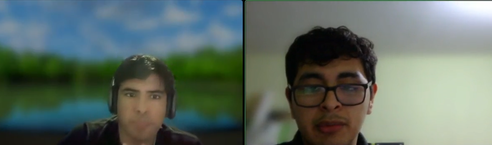

# <center>COURSE PROJECT</center>

<p align="center">
    <strong>Universidad Peruana de Ciencias Aplicadas</strong><br>
    </img><br>
    <strong>Ingeniería de Software</strong><br>
    <strong>Desarrollo de Aplicaciones Open Source - 7357</strong><br>
    <strong>Profesor: Rafael Oswaldo Castro Veramendi </strong><br>
    <br>INFORME TRABAJO FINAL
</p>

<center>

#### Startup: **--**
#### Product: **--**

</center>

### <center>Team  Members:</center>
<center>

| Member                       | Code       |
|------------------------------|------------|
| Axel Ordoñez Ricaldi         | U202216827 |
| Fabrizio Martin Panta Castro | U20231A810 |
| Jean Pierre Grandez Mansilla | U202212484 |
|                              |            |
|                              |            |
|                              |            |

<br> Setiembre 2025
</center>  

# Registro de Versiones del Informe
<center>

| Version | Fecha | Autor | Descripcion de Modificacion |
| ----------- | ----------- | ----------- | ----------- |
| 0.0 | 30/08/2025 |Grupo 1 |Se crea el documento |  

</center>

# Project Report Collaboration Insights
[URL del repositorio](https://www.example.com)

(Imagenes de los commits cada entrega)


# Contenido


[Registro de Versiones del Informe](#registro-de-versiones-del-informe)

[Project Report Collaboration Insights](#project-report-collaboration-insights)

[Student Outcome](#student-outcome)

[Capítulo I: Introducción](#capítulo-i-introducción)

[1.1 Startup Profile](#11-startup-profile)  
[1.1.1. Descripción de la Startup](#111-descripción-de-la-startup)  
[1.1.2. Perfiles de integrantes del equipo](#112-perfiles-de-integrantes-del-equipo)  

[1.2. Solution Profile](#12-solution-profile)  
[1.2.1 Antecedentes y problemática](#121-antecedentes-y-problemática)  
[1.2.2 Lean UX Process.](#122-lean-ux-process)  
[1.2.2.1. Lean UX Problem Statements.](#1221-lean-ux-problem-statements)  
[1.2.2.2. Lean UX Assumptions.](#1222-lean-ux-assumptions)  
[1.2.2.3. Lean UX Hypothesis Statements.](#1223-lean-ux-hypothesis-statements)  
[1.2.2.4. Lean UX Canvas.](#1224-lean-ux-canvas)  

[1.3. Segmentos objetivo.](#13-segmentos-objetivo)  

[Capítulo II: Requirements Elicitation & Analysi](#capítulo-ii-requirements-elicitation--analysis)  

[2.1. Competidores](#21-competidores)  
[2.1.1. Análisis competitivo](#211-análisis-competitivo)  
[2.1.2. Estrategias y tácticas frente a competidores](#211-análisis-competitivo)  

[2.2. Entrevistas](#22-entrevistas)  
[2.2.1. Diseño de entrevistas](#221-diseño-de-entrevistas)  
[2.2.2. Registro de entrevistas](#222-registro-de-entrevistas)  
[2.2.3. Análisis de entrevistas](#223-análisis-de-entrevistas)  

[2.3. Needfinding](#23-needfinding)  
[2.3.1. User Personas](#231-user-personas)  
[2.3.2. User Task Matrix](#232-user-task-matrix)  
[2.3.3. User Journey Mapping](#233-user-journey-mapping)  
[2.3.4. Empathy Mapping](#234-empathy-mapping)  
[2.3.5. As-is Scenario Mapping](#235-as-is-scenario-mapping) 

[2.4. Ubiquitous Language](#24-ubiquitous-language)  

[Capítulo III: Requirements Specificatio](#capítulo-iii-requirements-specification)  

[3.1. To-Be Scenario Mapping](#31-to-be-scenario-mapping)    
[3.2. User Stories](#32-user-stories)  
[3.3. Impact Mapping](#33-impact-mapping)  
[3.4. Product Backlog](#34-product-backlog)  

[Capítulo IV: Product Desig](#capítulo-iv-product-design)  

[4.1. Style Guidelines](#41-style-guidelines)  
[4.1.1. General Style Guidelines](#411-general-style-guidelines)  
[4.1.2. Web Style Guidelines](#412-web-style-guidelines)  

[4.2. Information Architecture](#42-information-architecture)  
[4.2.1. Organization Systems](#421-organization-systems)  
[4.2.2. Labeling Systems](#422-labeling-systems)  
[4.2.3. SEO Tags and Meta Tag](#423-seo-tags-and-meta-tags)  
[4.2.4. Searching Systems](#424-searching-systems)   
[4.2.5. Navigation Systems](#425-navigation-systems)  

[4.3. Landing Page UI Design](#43-landing-page-ui-design)   
[4.3.1. Landing Page Wireframe](#431-landing-page-wireframe)  
[4.3.2. Landing Page Mock-up](#432-landing-page-mock-up) 

[4.4. Web Applications UX/UI Design](#44-web-applications-uxui-design)  
[4.4.1. Web Applications Wireframes](#441-web-applications-wireframes)  
[4.4.2. Web Applications Wireflow Diagrams](#442-web-applications-wireflow-diagrams)  
[4.4.2. Web Applications Mock-ups](#442-web-applications-mock-ups)   
[4.4.3. Web Applications User Flow Diagrams](#443-web-applications-user-flow-diagrams)  

[4.5. Web Applications Prototyping](#45-web-applications-prototyping)  

[4.6. Domain-Driven Software Architecture](#46-domain-driven-software-architecture)  
[4.6.1. Software Architecture Context Diagram](#461-software-architecture-context-diagram)  
[4.6.2. Software Architecture Container Diagrams](#462-software-architecture-container-diagrams)  
[4.6.3. Software Architecture Components Diagrams](#463-software-architecture-components-diagrams)  

[4.7. Software Object-Oriented Design](#47-software-object-oriented-design)  
[4.7.1. Class Diagrams](#471-class-diagrams)  
[4.7.2. Class Dictionary](#472-class-dictionary)  

[4.8. Database Design](#48-database-design)  
[4.8.1. Database Diagram](#481-database-diagram)  

[Capítulo V: Product Implementation, Validation & Deploymen](#capítulo-v-product-implementation-validation--deployment)  

[5.1. Software Configuration Management](#51-software-configuration-management)  
[5.1.1. Software Development Environment Configuration](#511-software-development-environment-configuration)  
[5.1.2. Source Code Management](#512-source-code-management)  
[5.1.3. Source Code Style Guide & Conventions](#513-source-code-style-guide--conventions)  
[5.1.4. Software Deployment Configuration](#514-software-deployment-configuration)  

[5.2. Landing Page, Services & Applications Implementation](#52-landing-page-services--applications-implementation)  
[5.2.X. Sprint ](#52x-sprint-n)  
[5.2.X.1. Sprint Planning n](#52x1-sprint-planning-n)  
[5.2.X.2. Sprint Backlog n](#52x2-sprint-backlog-n)  
[5.2.X.3. Development Evidence for Sprint Review](#52x3-development-evidence-for-sprint-review)  
[5.2.X.4. Testing Suite Evidence for Sprint Review](#52x4-testing-suite-evidence-for-sprint-review)  
[5.2.X.5. Execution Evidence for Sprint Review](#52x5-execution-evidence-for-sprint-review)  
[5.2.X.6. Services Documentation Evidence for Sprint Review](#52x6-services-documentation-evidence-for-sprint-review)  
[5.2.X.7. Software Deployment Evidence for Sprint Review](#52x7-software-deployment-evidence-for-sprint-review)  
[5.2.X.8. Team Collaboration Insights during Sprint](#52x8-team-collaboration-insights-during-sprint)  

[5.3. Validation Interviews](#53-validation-interviews)  
[5.3.1. Diseño de Entrevistas](#531-diseño-de-entrevistas)  
[5.3.2. Registro de Entrevistas](#532-registro-de-entrevistas)  
[5.3.3. Evaluaciones según heurísticas](#533-evaluaciones-según-heurísticas)  

[5.4. Video About-the-Product](#54-video-about-the-product)  

[Conclusiones](#conclusiones)  
[Conclusiones y recomendaciones](#conclusiones-y-recomendaciones)  
[Video About-the-Team](#video-about-the-team)  
[Bibliografía](#bibliografía)  
[Anexos](#anexos)  

# Student Outcome
|Criterio Especifico|Acciones Realizadas|Conclusiones|
|-|-|-|
|Participa en equipos multidisciplinarios con eficacia, eficiencia y objetividad, en el marco de un proyecto en soluciones de ingeniería de software.|Compañero1:<br> *TB1:*  Su texto *TB2:* texto etc.. |Su texto de conclusion|
|Conoce al menos un sector empresarial o dominio de aplicación de soluciones de software.|Compañero1:<br> *TB1:*  Su texto<br> *TB2:* texto etc.. |Su texto de conclusion|
# Capítulo I: Introducción
## 1.1. Startup Profile
### 1.1.1. Descripción de la Startup

Nuestra startup nace con un propósito claro: garantizar que los medicamentos sensibles se conserven siempre en las condiciones adecuadas, evitando riesgos para la salud y pérdidas económicas por fallas en la cadena de frío. Creemos que el acceso a tratamientos seguros no debe depender de controles manuales poco fiables, sino de herramientas tecnológicas simples y confiables.
Nuestra plataforma digital ofrece un sistema intuitivo para monitorear, registrar y recibir alertas sobre la temperatura de refrigeración de medicamentos en tiempo real. A través de una experiencia visual y clara, los usuarios pueden supervisar el estado de sus equipos de refrigeración desde cualquier lugar, detectar desviaciones a tiempo y contar con reportes automáticos para auditorías y cumplimiento normativo.
El sistema está diseñado pensando en farmacias, hospitales, clínicas y cadenas de distribución, que requieren un control constante y trazable de sus inventarios médicos. Inicialmente, ofrecemos una versión web con datos simulados para demostrar la experiencia de uso y el valor de la solución, con la visión de integrar sensores IoT, aplicaciones móviles y tecnologías adicionales en fases posteriores.
Nuestra propuesta de valor combina seguridad, simplicidad y confiabilidad. Queremos que supervisar la cadena de frío sea tan fácil como abrir una aplicación, reduciendo riesgos, mejorando la eficiencia operativa y fortaleciendo la confianza de pacientes e instituciones.

**Misión:** Democratizar el acceso a sistemas de monitoreo avanzados que aseguren la conservación óptima de medicamentos, protegiendo la salud de las personas y reduciendo pérdidas en el sector salud.

**Visión:** Convertirnos en un referente global en soluciones de trazabilidad y monitoreo inteligente, impulsando un modelo de salud más seguro, eficiente y tecnológicamente conectado.

Más que una plataforma, queremos ser un aliado estratégico para las instituciones de salud, construyendo un ecosistema donde la tecnología no sea un lujo, sino una garantía de confianza y bienestar para todos.


#### 1.1.2. Perfiles de integrantes del equipo
|Miembros del equipo | Codigo Estudiante | Carrera | Conocimientos / Habilidades |
|-|-|-|-|
|Compañero 1 	|U20...|Ingenieria de software|C++, piton .etc|

## 1.2. Solution Profile
### 1.2.1 Antecedentes y problemática
En los últimos años, el sector salud ha enfrentado crecientes desafíos relacionados con la conservación y distribución segura de medicamentos sensibles, especialmente aquellos que requieren estrictos controles de temperatura, como vacunas, insulinas y productos biológicos. La pandemia de COVID-19 puso de relieve la importancia de la cadena de frío, evidenciando que un fallo en el control de condiciones de almacenamiento puede tener consecuencias graves en la efectividad de los tratamientos y en la seguridad de los pacientes.

A nivel global, las tecnologías de monitoreo en tiempo real y trazabilidad mediante IoT han comenzado a consolidarse como herramientas clave para garantizar la calidad de los fármacos y cumplir con las normativas sanitarias. Sin embargo, en gran parte de Latinoamérica —y particularmente en el Perú—, la adopción de estas soluciones sigue siendo limitada. Los factores que explican esta brecha son la dependencia de controles manuales poco confiables, los altos costos de implementación de sistemas avanzados y la falta de plataformas intuitivas que simplifiquen el proceso para farmacias, hospitales y centros de distribución.

Actualmente, muchas instituciones del sector salud carecen de mecanismos integrados para monitorear la temperatura en tiempo real. Cuando existen, suelen estar restringidos a grandes cadenas farmacéuticas o clínicas privadas con mayor presupuesto, dejando de lado a la mayoría de farmacias independientes, boticas locales y clínicas de menor escala. Esto genera un riesgo constante: pérdidas económicas por medicamentos dañados, incumplimiento de normativas y, lo más crítico, amenazas directas a la salud de los pacientes.

La problematica se puede resumir en los siguientes puntos:

- **Dependencia de controles manuales poco confiables:** la mayoría de farmacias, hospitales y clínicas registran temperaturas en planillas físicas o sistemas aislados, lo que incrementa el riesgo de errores humanos y fallos de supervisión.

- **Accesibilidad limitada:** las soluciones tecnológicas de monitoreo existentes suelen estar dirigidas a grandes instituciones con alta capacidad de inversión, dejando excluidas a farmacias y centros pequeños.

- **Falta de trazabilidad y reportes automáticos:** los sistemas tradicionales no permiten generar registros auditables ni reportes en tiempo real, dificultando el cumplimiento de normas regulatorias y procesos de fiscalización sanitaria.

- **Altos costos de implementación:** integrar sensores avanzados o plataformas propietarias implica inversiones significativas en hardware, licencias y soporte técnico especializado, lo que limita su adopción masiva.

- **Impacto en la salud y en la economía:** las fallas en la cadena de frío no solo provocan pérdidas económicas por medicamentos dañados, sino que también pueden poner en riesgo la seguridad de los pacientes al administrar productos en mal estado.

En este contexto surge la necesidad de contar con soluciones accesibles, seguras y confiables que permitan democratizar el monitoreo de la cadena de frío, ofreciendo a las instituciones de salud herramientas simples para garantizar la trazabilidad y seguridad en el almacenamiento de medicamentos.

**1. What (¿Qué?)**

El sector salud enfrenta dificultades para garantizar la correcta conservación de medicamentos sensibles que requieren cadena de frío. Actualmente, muchas farmacias, hospitales, clínicas y centros de distribución dependen de controles manuales poco confiables, como registros en planillas o verificaciones esporádicas, que no permiten un monitoreo continuo ni la detección oportuna de desviaciones de temperatura. Las soluciones existentes suelen ser complejas o costosas, restringidas a grandes instituciones, dejando sin alternativas accesibles a la mayoría de actores del sistema.

**2. Why (¿Por qué?)**

Esto ocurre porque los métodos tradicionales presentan limitaciones significativas: los registros manuales son propensos a errores humanos, las soluciones de monitoreo actuales implican altos costos de hardware, licencias y soporte, y la mayoría carece de automatización para emitir alertas en tiempo real o generar reportes auditables. Como consecuencia, las instituciones del sector salud quedan expuestas a pérdidas económicas por medicamentos dañados y, lo más grave, a riesgos sanitarios para los pacientes.

**3. Who (¿Quién?)**

El problema afecta directamente a farmacias y boticas, que requieren monitoreo constante de inventarios pequeños pero sensibles; a hospitales y clínicas, que manejan grandes volúmenes de medicamentos críticos bajo presión de auditorías; y a centros de distribución y laboratorios farmacéuticos, que necesitan trazabilidad durante transporte y almacenamiento. De forma indirecta, impacta también en los pacientes, quienes pueden recibir tratamientos comprometidos por fallas en la cadena de frío.

**4. Where (¿Dónde?)**

La problemática se manifiesta en toda la cadena de suministro y almacenamiento de medicamentos: en farmacias locales con recursos limitados para implementar tecnología, en hospitales y clínicas que deben cumplir protocolos de bioseguridad y auditorías regulatorias, y en centros de distribución que requieren garantizar condiciones adecuadas desde el origen hasta la entrega final.

**5. When (¿Cuándo?)**

Este problema es actual y cada vez más urgente, ya que la demanda de medicamentos biológicos y tratamientos refrigerados crece constantemente. La pandemia de COVID-19 visibilizó la necesidad de cadenas de frío confiables y trazables, y hoy, en un contexto donde la digitalización y la seguridad del paciente son prioridades, seguir dependiendo de controles manuales representa un riesgo inaceptable.

**6. How (¿Cómo?)**

La situación se refleja en errores frecuentes por registros manuales incompletos o tardíos, en la ausencia de alertas en tiempo real que permitan acciones preventivas, en las dificultades para cumplir auditorías sanitarias por falta de reportes históricos confiables y en la exclusión de pequeños actores del sector, que no pueden acceder a soluciones diseñadas para instituciones de gran escala y alto presupuesto.

**7. How much (¿Cuánto?)**

El costo de esta problemática es elevado: la Organización Mundial de la Salud estima que más del 25 % de las vacunas a nivel global se pierde por fallas en la cadena de frío; una desviación de temperatura puede significar pérdidas de miles de dólares en inventario para una farmacia u hospital; y los sistemas de monitoreo actuales requieren inversiones que ascienden a decenas de miles de dólares, inaccesibles para instituciones pequeñas o medianas, sin garantizar siempre escalabilidad ni simplicidad en su uso.


### 1.2.2 Lean UX Process.
#### 1.2.2.1. Lean UX Problem Statements.
Nuestra startup es una plataforma digital que permite a farmacias, hospitales, clínicas y centros de distribución garantizar la conservación adecuada de medicamentos sensibles mediante un sistema de monitoreo en tiempo real, accesible e intuitivo. Buscamos democratizar el acceso a tecnologías de cadena de frío seguras y confiables, reduciendo riesgos para la salud, pérdidas económicas y barreras técnicas en el sector salud.

**Contexto:** Nuestra plataforma está diseñada para supervisar equipos de refrigeración de forma remota, generando alertas inmediatas ante desviaciones de temperatura y reportes automáticos para auditorías. El objetivo es ofrecer una herramienta sencilla y confiable que ayude a instituciones de salud a cumplir normativas sanitarias y a proteger la calidad de sus inventarios médicos.

**Observación del problema:** Sin embargo, hemos identificado que muchas instituciones aún dependen de controles manuales poco confiables o de soluciones tecnológicas costosas y complejas, lo que limita la adopción de sistemas efectivos. Farmacias pequeñas y clínicas locales carecen de opciones accesibles, mientras que hospitales y centros de distribución enfrentan dificultades para garantizar trazabilidad y auditoría en toda la cadena de frío. Estas observaciones provienen de estudios del sector, organismos internacionales y entrevistas con actores de salud, quienes señalan la necesidad de soluciones simples y adaptables.

**Impacto:** Esta situación genera pérdidas económicas considerables por medicamentos dañados, incumplimiento de requisitos regulatorios y, lo más grave, riesgos para la salud de los pacientes al administrar tratamientos comprometidos. Además, la falta de accesibilidad tecnológica profundiza la brecha entre instituciones grandes y pequeñas, afectando la equidad en el acceso a medicamentos seguros y disminuyendo la confianza en los servicios de salud.

**Necesidad insatisfecha:** Actualmente, las instituciones requieren soluciones integradas, accesibles y fáciles de implementar que permitan monitorear y auditar la cadena de frío de manera continua y confiable. Al mismo tiempo, necesitan plataformas intuitivas que reduzcan la dependencia de registros manuales y soporte técnico especializado, optimizando la eficiencia operativa y garantizando la seguridad de los medicamentos.

**Pregunta de mejora:** ¿Cómo podríamos simplificar y democratizar el monitoreo de la cadena de frío en el sector salud para que farmacias y hospitales adopten estas soluciones de forma accesible, incrementando así la seguridad de los pacientes, la eficiencia operativa y la confiabilidad en la conservación de medicamentos?

#### 1.2.2.2. Lean UX Assumptions.
En la fase inicial de desarrollo de nuestra plataforma para el sector salud, hemos identificado y estructurado un conjunto de supuestos siguiendo la metodología Lean UX. Estos supuestos representan nuestras creencias iniciales sobre quiénes son nuestros usuarios, cuáles son sus necesidades prioritarias, cómo funcionará el modelo de negocio, qué resultados esperamos alcanzar y cuáles son las funcionalidades clave que permitirán validar la propuesta de valor. Formalizar estas creencias nos permitirá enfocar el diseño y desarrollo en la validación temprana, minimizar riesgos y garantizar que la estrategia del producto esté alineada con las necesidades reales de farmacias, hospitales, clínicas y centros de distribución.

Los supuestos se han clasificado en cinco categorías principales para una mejor estructuración:

- **User Assumptions:** Nuestras creencias sobre las necesidades, motivaciones y comportamientos de farmacias, hospitales, clínicas y centros de distribución al buscar soluciones de monitoreo de cadena de frío accesibles, confiables y fáciles de usar.

- **User Outcome Assumptions:** Los beneficios tangibles y mejoras en eficiencia, seguridad, cumplimiento regulatorio y satisfacción que anticipamos que experimenten los usuarios al integrar la plataforma en sus procesos.

- **Business Assumptions:** Hipótesis sobre la viabilidad y escalabilidad del modelo de negocio en el sector salud, considerando dinámicas de adopción tecnológica, regulaciones y alianzas estratégicas.

- **Business Outcome Assumptions:** Los resultados medibles que proyectamos generar para la startup, como aumento de ingresos recurrentes, reducción de costos operativos, diferenciación en el mercado y fortalecimiento de la retención de clientes.

- **Feature Assumptions:** Nuestras creencias sobre cómo funcionalidades específicas de la plataforma (ej. monitoreo en tiempo real, alertas automáticas, reportes para auditorías, integración con IoT) resolverán problemas críticos de los usuarios y validarán nuestras hipótesis de negocio.

Estos supuestos formarán la base de nuestra estrategia de diseño y validación continua, guiando la evolución de la plataforma hacia una solución que realmente democratice el acceso a tecnologías de conservación segura de medicamentos.

**User Assumptions**
- Creemos que el 70% de las farmacias pequeñas y clínicas locales buscan soluciones de monitoreo accesibles y fáciles de usar, porque actualmente carecen de alternativas tecnológicas confiables que no requieran inversión elevada.

- Creemos que el 85% de los hospitales y centros de distribución valoran la trazabilidad completa de la cadena de frío, porque el cumplimiento normativo y la auditoría son críticos en sus operaciones.

- Creemos que el 60% de los responsables de farmacia priorizan recibir alertas inmediatas ante desviaciones de temperatura, ya que los controles manuales generan errores humanos y pérdidas.

- Creemos que el 75% de los usuarios no técnicos (farmacéuticos, asistentes, personal de enfermería) necesitan interfaces simples e intuitivas, porque no cuentan con formación en sistemas tecnológicos avanzados.

- Creemos que el 50% de las instituciones medianas y grandes están dispuestas a migrar de sistemas manuales a plataformas digitales si estas reducen el riesgo de sanciones regulatorias y pérdidas económicas.

**User Outcome Assumptions**
- Creemos que si los usuarios tienen un sistema de monitoreo en tiempo real, entonces reducirán en al menos 30% las pérdidas por medicamentos dañados durante los primeros seis meses.

- Creemos que si la plataforma genera reportes automáticos de cumplimiento, entonces al menos el 65 % de las instituciones los usarán como evidencia principal en auditorías.

- Creemos que si los usuarios reciben alertas preventivas, entonces la confianza en la seguridad de sus inventarios médicos aumentará en un 40% en encuestas de satisfacción.

- Creemos que si las farmacias pequeñas tienen acceso a una solución accesible, entonces su adopción de monitoreo digital se incrementará en un 50% en el primer año.

**Business Assumptions**
- Creemos que el 60% de los ingresos provendrá de suscripciones mensuales de farmacias, clínicas y hospitales, mientras que el 40% vendrá de contratos con centros de distribución y alianzas con proveedores de salud.

- Creemos que la demanda inicial se concentrará en farmacias y clínicas pequeñas, porque son las más afectadas por pérdidas y la falta de cumplimiento regulatorio.

- Creemos que un modelo SaaS con planes escalonados (básico, profesional y enterprise) será viable, ya que permite adaptarse a las necesidades de diferentes tamaños de instituciones.

- Creemos que las regulaciones sanitarias cada vez más estrictas impulsarán la adopción de nuestra plataforma como una herramienta necesaria para el sector salud.

- Creemos que podremos establecer al menos 5 alianzas estratégicas con distribuidores de equipos de refrigeración e IoT, lo que nos permitirá acelerar la penetración de mercado.

**Business Outcome Assumptions**
- Creemos que si la plataforma es adoptada por al menos 100 farmacias y clínicas en el primer año, entonces generaremos un flujo recurrente de ingresos que garantizará la sostenibilidad inicial.

- Creemos que si reducimos los incidentes de pérdida de medicamentos en al menos un 30%, entonces aumentaremos la retención de clientes en un 70% tras el primer año.

- Creemos que si las instituciones logran cumplir más fácilmente con normativas, entonces incrementaremos nuestra tasa de conversión de pruebas piloto a contratos pagos en un 25%.

- Creemos que si cerramos alianzas con distribuidores de equipos, entonces reduciremos el costo de adquisición de clientes (CAC) en un 20% gracias a ventas indirectas.

**Feature Assumptions**
- Creemos que un panel de monitoreo en tiempo real permitirá a los usuarios supervisar fácilmente múltiples equipos, logrando que el 80 % lo consulte diariamente en el primer mes.

- Creemos que la funcionalidad de alertas automáticas reducirá incidentes críticos, con el 70% de los usuarios configurando alertas personalizadas en los primeros 30 días.

- Creemos que los reportes automáticos descargables serán usados como evidencia en auditorías, alcanzando al 60% de uso en instituciones con regulaciones estrictas.

- Creemos que la integración con sensores IoT mejorará la confiabilidad del sistema, logrando que el 50% de los clientes adopten esta opción en el primer año.

- Creemos que una interfaz intuitiva y multiusuario reducirá la dependencia de soporte técnico, alcanzando que el 40% de los problemas se resuelvan vía autoservicio (FAQs o chatbot).
#### 1.2.2.3. Lean UX Hypothesis Statements.

- **Accesibilidad para pequeñas farmacias y clínicas**
Creemos que las farmacias y clínicas pequeñas adoptarán nuestra plataforma porque podrán monitorear la cadena de frío de manera accesible y sin necesidad de personal especializado en TI. Sabremos que hemos tenido éxito cuando al menos el 50% de los clientes iniciales sean instituciones pequeñas que antes usaban controles manuales.

- **Confianza y reducción de riesgos en hospitales y centros de distribución**
Creemos que los hospitales y centros de distribución valorarán la plataforma porque les permitirá garantizar trazabilidad y auditoría en todo momento. Sabremos que hemos tenido éxito cuando al menos el 70% de los usuarios indiquen en encuestas que confían más en la conservación de medicamentos tras tres meses de uso

- **Ahorro de tiempo en gestión operativa**
Creemos que la automatización de reportes reducirá significativamente el tiempo invertido en controles manuales. Sabremos que hemos tenido éxito cuando los usuarios reporten una reducción del 40% en el tiempo destinado a registros manuales en las primeras 6 semanas.

- **Prevención de pérdidas económicas**
Creemos que las alertas en tiempo real disminuirán las pérdidas de medicamentos dañados. Sabremos que hemos tenido éxito cuando los usuarios reporten al menos un 30% de reducción en pérdidas por fallas de conservación tras seis meses de uso.

- **Democratización de la tecnología**
Creemos que un modelo de precios flexible permitirá que instituciones pequeñas y grandes adopten la plataforma sin barreras económicas significativas.
Sabremos que hemos tenido éxito cuando al menos el 60% de nuestros clientes correspondan a instituciones con presupuestos reducidos.

- **Escalabilidad en el sector salud**
Creemos que nuestra solución podrá ser escalada desde farmacias hasta hospitales y cadenas de distribución sin necesidad de personalización costosa. Sabremos que hemos tenido éxito cuando logremos contratos con al menos tres tipos de instituciones diferentes en el primer año.

- **Crecimiento sostenido en la adopción**
Creemos que al ofrecer una solución accesible y confiable, lograremos un crecimiento continuo en clientes. Sabremos que hemos tenido éxito cuando alcancemos una tasa de retención superior al 70% y un crecimiento mensual del 15% en usuarios activos durante el primer año.

- **Generación de confianza en el mercado**
Creemos que ser percibidos como una herramienta que facilita el cumplimiento normativo aumentará nuestra credibilidad en el sector salud. Sabremos que hemos tenido éxito cuando al menos el 50% de los clientes indiquen que nos eligieron por apoyo en auditorías y normativas.

- **Alertas inmediatas como diferenciador**
Creemos que las notificaciones en tiempo real serán el factor clave de diferenciación frente a controles manuales o sistemas costosos. Sabremos que hemos tenido éxito cuando al menos el 80% de los usuarios configuren y respondan a una alerta en el primer mes.

- **Reportes automáticos para auditorías**
Creemos que la generación de reportes automáticos simplificará la preparación para auditorías sanitarias. Sabremos que hemos tenido éxito cuando el 70% de los usuarios utilicen los reportes generados por la plataforma en auditorías reales.

- **Interfaz intuitiva**
Creemos que una interfaz simple permitirá que personal no técnico pueda manejar el sistema sin capacitaciones extensas. Sabremos que hemos tenido éxito cuando al menos el 60% de los nuevos usuarios logren configurar un equipo de refrigeración sin solicitar soporte.

#### 1.2.2.4. Lean UX Canvas.


## 1.3. Segmentos objetivo.
| | Segmento 1 | Segmento 2  |
| - | - |-|
| Variables                 | Hospitales | Farmacias |
| Geográfica                | Principalmente en áreas urbanas y semiurbanas de Perú y Latinoamérica, donde existe mayor concentración de hospitales públicos y privados que manejan altos volúmenes de medicamentos sensibles. | Ubicadas en zonas urbanas y suburbanas, incluyendo distritos céntricos y barrios residenciales con alta demanda de medicamentos, especialmente en farmacias independientes y cadenas locales. |
| Demográfica               | Edad de directores y responsables: 35-60 años; Género: Mixto; Educación: Profesionales con estudios en medicina, farmacia o gestión hospitalaria; Ingresos: Institucionales (presupuestos medios y altos); Estado civil variado. | Propietarios o administradores de farmacias de 28-50 años; Género: Mixto; Educación: Técnicos en farmacia, farmacéuticos o administradores; Ingresos: Medio; Estado civil variado; generalmente familias o negocios familiares. |
| Psicológica               | Orientados al cumplimiento normativo y la seguridad del paciente. Valoran soluciones confiables, escalables y auditables que garanticen trazabilidad completa. Personalidad práctica, orientada a procesos y resultados, con alta responsabilidad en la gestión de inventarios. | Buscan accesibilidad y simplicidad en la gestión. Valoran la facilidad de uso, el ahorro de tiempo y la reducción de pérdidas económicas. Prefieren soluciones intuitivas y de bajo costo que no requieran conocimientos técnicos avanzados. |
| Función de comportamiento | Alta frecuencia en la necesidad de generar reportes auditables, trazabilidad completa de inventarios y cumplir protocolos regulatorios estrictos. Fidelidad a soluciones que reduzcan riesgos de sanciones y mejoren eficiencia operativa. Barreras: costos de integración tecnológica y resistencia al cambio organizacional. | Uso frecuente de herramientas básicas de control. Adoptan nuevas tecnologías si son intuitivas y económicas. Alta motivación por prevenir pérdidas y mejorar la rentabilidad. Barreras: limitaciones presupuestarias y escasa capacitación tecnológica del personal. |

---

# Capítulo II: Requirements Elicitation & Analysis
## 2.1. Competidores.

Se han identificado los siguientes competidores en el mercado de soluciones de monitoreo de cadena de frío para el sector salud:

- **Competidor 1: Sensitech**
  - **Descripción:** Sensitech es una empresa global que ofrece dispositivos de monitoreo en tiempo real, dataloggers desechables y reutilizables, y una plataforma de visibilidad llamada ColdStream®, que integra datos tanto en almacenamiento como en transporte.
- **Competidor 2: Exolinked**
  - **Descripción:** Exolinked es una empresa latinoamericana enfocada en soluciones IoT de cadena de frío. Su plataforma digital permite monitorear en tiempo real temperatura, humedad y consumo energético, centralizando los datos en la nube y generando alarmas automáticas cuando se detectan desviaciones predefinidas.
- **Competidor 3: Netux**
  - **Descripción:** Netux se especializa en tecnologías para el sector salud. Desarrolla un sistema de monitoreo en tiempo real que recopila variables críticas en refrigeración de medicamentos y vacunas, integrando datos en la nube para ofrecer trazabilidad completa, reportes automáticos e informes auditables.
### 2.1.1. Análisis competitivo.

| Competitive Analysis Landscape                          |                                                                                                                                                                                                                                                                                                                                                                                                                                 |
| ------------------------------------------------------- |---------------------------------------------------------------------------------------------------------------------------------------------------------------------------------------------------------------------------------------------------------------------------------------------------------------------------------------------------------------------------------------------------------------------------------|
| ¿Por qué llevar a cabo este análisis?                   | Este análisis nos permite identificar a nuestros principales competidores que ya ofrecen soluciones digitales e IoT de monitoreo de la cadena de frío farmacéutica en Latinoamérica y a nivel global.<br/> Así podemos contrastar nuestra propuesta de valor, sobre el segmento objetivo y el posicionamiento local para poder desarrollar una solución que se destaque en el mercado y se diferencie de nuestros competidores. |


|                         |                             | **Nuestra Startup**                                                                                                                                                            | **Exolinked (LatAm)**                                                                                                 | **Netux (Col/LatAm)**                                                                                                             | **Sensitech (Global)**                                                                                                                          | 
|-------------------------|-----------------------------|--------------------------------------------------------------------------------------------------------------------------------------------------------------------------------|-----------------------------------------------------------------------------------------------------------------------|-----------------------------------------------------------------------------------------------------------------------------------|-------------------------------------------------------------------------------------------------------------------------------------------------|
| **PERFIL**              | Overview                    | Plataforma **web** para monitoreo en tiempo real de medicamentos, con **alertas** y **reportes automáticos**. Foco inicial: **Perú/LatAm**, farmacias y clínicas subatendidas. | Empresa IoT de LatAm que ofrece **monitoreo de cadena de frío** (T°, HR, energía) con datos en la nube y **alarmas**. | Empresa colombiana especializada en **salud**, con **sistema de monitoreo** de T° para vacunas, medicamentos y bancos de sangre.  | Multinacional Carrier con soluciones **end-to-end** para farma, usando **monitores en tiempo real** y plataforma **ColdStream®**.               |
| **PERFIL**              | Ventaja competitiva (valor) | **Simplicidad + accesibilidad**. Reportes alineados a **auditorías** y precios bajos.                                                                                          | **Protocolos de implementación claros**, escalabilidad IoT, consultoría en integración HW+SW.                         | **Vertical en salud**, reportes auditables listos para farmacias, clínicas y hospitales.                                          | **Cumplimiento global (GxP, 21 CFR, EU)** y trazabilidad **integral** en transporte y almacenamiento.                                           |
| **Perfil de Marketing** | Mercado objetivo            | Farmacias, boticas, clínicas, hospitales, centros de distribución.                                                                                                             | Sectores de logística, retail y salud que requieren trazabilidad.                                                     | Hospitales, clínicas, farmacias y bancos de sangre en LatAm.                                                                      | Empresas farmacéuticas, distribuidoras y operadores logísticos a nivel global.                                                                  |
| **Perfil de Marketing** | Estrategia de marketing     | Go-to-market local con **alianzas en Perú**, inbound con foco en **cumplimiento MINSA y DIGEMID**.                                                                             | Marketing consultivo y B2B, con **casos de uso** y servicios personalizados.                                          | Marketing orientado a **salud** (vacunas, medicamentos), casos clínicos y regulación.                                             | **Enterprise marketing** con whitepapers, casos globales y venta corporativa.                                                                   |
| **Perfil de Producto**  | Productos & servicios       | Plataforma SaaS (dashboard, alertas, reportes). Roadmap IoT y app móvil.                                                                                                       | Monitoreo de T°, HR, consumo energético. Plataforma cloud + alarmas.                                                  | Monitoreo T° en tiempo real, trazabilidad, geolocalización, reportes automáticos.                                                 | Monitores/dataloggers en tiempo real, **ColdStream®**, reportes de cumplimiento.                                                                |
| **Perfil de Producto**  | Precios & costos            | Modelo SaaS accesible para presupuestos limitados de farmacias y hospitales peruanos                                                                                           | SaaS + HW bajo cotización.                                                                                            | SaaS + HW bajo cotización.                                                                                                        | Enterprise HW + SaaS, bajo cotización.                                                                                                          |
| **Perfil de Producto**  | Canales (Web/Móvil)         | Web responsive, app móvil futura, distribución directa + alianzas farmacéuticas locales.                                                                                       | Web (cloud) + IoT.                                                                                                    | Web (nube), apps y módulos en salud.                                                                                              | Web (plataforma enterprise).                                                                                                                    |
| **Análisis SWOT**       | Fortalezas                  | Nuestra solución se enfoca cubrir las necesidades del sector farmaceutico Peruano sin competencia directa.                                                                     | Experiencia en IoT multisector, protocolos claros de implementación, escalabilidad en variables (T°, HR, energía).    | Cuentan con un enfoque total en salud, casos reales en vacunas y medicamentos, además de reportes auditables .                    | Son una solución consolidada y reconocida a nivel global además de contar con mas de 20 años en el mercado.                                     |
| **Análisis SWOT**       | Debilidades                 | Recursos limitados para poder realizar un MVP con hardware propio y sin financiamiento para generar campañas para atraer usuarios de interés.                                  | Menor especialización 100% en farma (se reparte entre logística y retail).                                            | No son tan accesibles de cara a sus clientes dado que tiene un enfoque en farmaceuticas grandes ajustadas a cada tipo de cliente. | Costos elevados y una complejidad elevada para la integración en la mayoría de su público objetivo.                                             |
| **Análisis SWOT**       | Oportunidades               | Un potencial crecimiento en la transformación digital en el sector salud y sin competencia directa que abarque el mercado Peruano.                                             | Expandir oferta verticalizada a salud; consolidar presencia regional con partners.                                    | Expandir su cobertura a farmacias y clínicas pequeñas para ofrecerles soluciones más asequibles y ganando gran parte del mercado. | Contratos directos con ministerios de salud o partnerships con clínicas reconocidas.                                                            |  
| **Análisis SWOT**       | Amenazas                    | El ingreso de competidores consolidados en el rubro al sector peruano, modificaciones en la normativa del sector farmaceutico en el Perú.                                      | Nuevas startups especializadas en farmacia que ofrezcan soluciones más simples y económicas.                          | Soluciones con mayor acercamiento a un público menor pero con propuestas de menor costo para estandarizarse en el mercado.        | Soluciones más ligeras pero más faciles de integrar a sus clientes y con un costo menor con las mismas funcionalidades o propuesta de solución. |


### 2.1.2. Estrategias y tácticas frente a competidores.

Para destacar nuestra startup en el competitivo mercado de soluciones de monitoreo de cadena de frío para el sector salud, hemos desarrollado una serie de estrategias y tácticas específicas que nos permitirán diferenciarnos efectivamente de nuestros competidores. Estas acciones están diseñadas para resaltar nuestras fortalezas, abordar nuestras debilidades, aprovechar las oportunidades del mercado y mitigar las amenazas potenciales.

- **Diferenciación por Simplicidad y Accesibilidad**
  - Desarrollar una plataforma intuitiva y fácil de usar, con un enfoque en la experiencia del usuario (UX) que permita a personal no técnico gestionar el monitoreo sin necesidad de capacitación extensa.
  - Implementar un modelo de precios escalonado que ofrezca planes accesibles para pequeñas farmacias y clínicas, facilitando la adopción inicial y reduciendo barreras económicas.

- **Enfoque en el Mercado Local**
  - Establecer alianzas estratégicas con asociaciones farmacéuticas y proveedores de salud locales para aumentar la visibilidad y credibilidad en el mercado peruano.
  - Adaptar la plataforma para cumplir con las normativas locales del MINSA y DIGEMID, asegurando que nuestra solución esté alineada con los requisitos regulatorios específicos del sector salud en Perú.

- **Valor Añadido a través de Funcionalidades Clave**
    - Desarrollar funcionalidades específicas como alertas en tiempo real y reportes automáticos alineados a auditorías, que respondan directamente a las necesidades críticas de nuestros usuarios.
    - Integrar capacidades de monitoreo IoT en el roadmap de desarrollo, permitiendo una escalabilidad futura que pueda competir con soluciones más complejas.

## 2.2. Entrevistas.

En esta sección se detallan las entrevistas realizadas a los segmentos objetivo identificados previamente, con el fin de comprender mejor sus necesidades, comportamientos y expectativas respecto a soluciones de monitoreo de cadena de frío en el sector salud.
### 2.2.1. Diseño de entrevistas.

Se han diseñado entrevistas semiestructuradas para dos segmentos objetivo principales, con el objetivo de profundizar con sus necesidades y validar nuestras hipótesis iniciales.

- Segmento 1 (Hospitales):
  - Jefe/a de Farmacia Hospitalaria 
  - Responsable de Almacén/Logística Farmacéutica 
  - Ing. Biomédico / Mantenimiento (frío)

- Segmento 2 (Farmacias):
  - Propietario/a o Administrador/a de farmacia/bótica 
  - Químico Farmacéutico/a responsable 
  - Asistente de farmacia (usuario operativo)

**Preguntas generales:**

1. ¿Cuál es su nombre? 
2. ¿Qué edad tiene? 
3. ¿A qué se dedica? 
4. ¿[Opinion de idea de propuesta]? 

**Entrevistas usuario segmento objetivo 1 (Hospitales)**

1. ¿Cómo gestionan actualmente el monitoreo de la cadena de frío en su institución?
2. ¿Con qué frecuencia enfrentan problemas relacionados con la conservación de medicamentos sensibles?
3. ¿Qué tan importante es para ustedes contar con reportes automáticos para auditorías regulatorias?
4. ¿Estarían dispuestos a adoptar una solución digital si fuera accesible y fácil de usar?
5. ¿Cuáles son las principales barreras que enfrentan para implementar nuevas tecnologías en su institución?
6. ¿Han tenido experiencias previas con soluciones de monitoreo digital? Si es así, ¿cuáles fueron los principales desafíos?
7. ¿De qué manera una solución de monitoreo en tiempo real podría mejorar sus operaciones diarias?
8. ¿Qué características consideran imprescindibles en una plataforma de este tipo?
9. ¿Cómo manejan las alertas o desviaciones en la temperatura actualmente?
10. ¿Qué tan relevante es para ustedes la integración con dispositivos IoT?
   
**Entrevistas usuario segmento objetivo 2 (Farmacias)**

1. ¿Cómo realizan el control de la cadena de frío en su farmacia?
2. ¿Con qué frecuencia enfrentan pérdidas de medicamentos debido a fallas en la conservación?
3. ¿Consideran que una solución digital podría ayudar a reducir estas pérdidas?
4. ¿Qué tan fácil o difícil sería para su personal adoptar una nueva tecnología?
5. ¿Cuáles son las principales preocupaciones al implementar un sistema de monitoreo digital?
6. ¿Han utilizado alguna vez soluciones tecnológicas para el monitoreo de temperatura?
7. ¿Qué beneficios esperarían obtener de una plataforma de monitoreo en tiempo real?
8. ¿Qué características serían esenciales para que consideren usar dicha plataforma?
9. ¿Cómo reaccionarían ante alertas automáticas de desviaciones de temperatura?
10. ¿Estarían interesados en una solución que ofrezca reportes automáticos para auditorías?


### 2.2.2. Registro de entrevistas.


**Segmento 1**  

Nombre: Daniel del Castillo

Edad: 26 años

Ocupación: Enfermero

  
[Entrevista Eduardo](https://upcedupe-my.sharepoint.com/:v:/g/personal/u202212484_upc_edu_pe/EdVUKA-zVg9Js4EQocCBz7cBZ_RROWHLt8e-DzDUZFek4g?e=ewaU61)

**Resumen de la entrevista:**

Daniel nos comenta que en el hospital que trabaja ellos se abastecen de un cuarto de almacen frío que es compartido con otros departamentos, y que ellos no gestionan el control de la temperatura directamente dado que cuentan con un térmostato que les proporciona el área de mantenimiento. Nos comenta que no tienen un registro formal de las temperaturas, y que en caso de una desviación, ellos mismos se encargan de reportarlo al área de mantenimiento para que puedan revisar el equipo.
Nos menciona que generalmente no tienen problemas con los equipos de frío, pero que en una ocasión tuvieron un problema con un congelador que afectó a las vacunas, y que tuvieron que desechar todo el lote. Nos comenta que no tienen reportes formales para auditorías, y que en caso de una inspección, ellos mismos se encargan de proporcionar la información necesaria.
También nos comenta que él está dispuesto a optar por una solución digital si es accesible y fácil de usar, pero que le preocupa la resistencia al cambio del personal y la falta de capacitación técnica. Nos menciona que una solución de monitoreo en tiempo real podría mejorar sus operaciones diarias al reducir el riesgo de pérdidas y garantizar la seguridad de los medicamentos.
Además, comenta que anteriormente intentaron implementar un sistema de monitoreo digital, pero que tuvieron problemas con la integración y el costo, y que finalmente decidieron no continuar con el proyecto. Nos menciona que las características imprescindibles para una plataforma de este tipo serían la facilidad de uso, la generación automática de reportes y sobre todo que era demasiado general respecto a lo que debería ser una solución específica para el sector salud.
Daniel considera que la integración con dispositivos IoT sería relevante, pero que dependería del costo y la facilidad de implementación, sobre las funcionalidades clave, el nos menciona que el servicio debe ser funcional las 24 horas dado que ellos trabajan en turnos y necesitan monitorear la cadena de frío en todo momento, incluso preferiría no tener que acercarse al equipo de frío para revisar la temperatura, y que le gustaría recibir alertas automáticas en caso de desviaciones para poder actuar rápidamente.


**Segmento 1**  
Nombre: Eduardo Ventura
Edad: 23 años 
Ocupación: Responsable de almacén de farmacia hospitalaria
  
[Entrevista Eduardo](https://upcedupe-my.sharepoint.com/:v:/g/personal/u202212484_upc_edu_pe/EdVUKA-zVg9Js4EQocCBz7cBZ_RROWHLt8e-DzDUZFek4g?e=ewaU61)

**Resumen de la entrevista:**
Eduardo nos menciona que actualmente ellos realizan el monitoreo de la cadena de frío de manera manual, utilizando termómetros y registros en papel. Nos comenta que enfrentan problemas ocasionales con la conservación de medicamentos sensibles, especialmente durante los fines de semana cuando el personal es reducido.
Considera que los reportes automaticos serían muy útiles para facilitar las auditorías regulatorias, ya que actualmente dedican mucho tiempo a preparar la documentación necesaria. Nos menciona que estarían dispuestos a adoptar una solución digital si fuera accesible y fácil de usar, pero que les preocupa la resistencia al cambio del personal y la falta de capacitación técnica.
Sin embargo, nos comenta que han tenido experiencias previas con soluciones de monitoreo digital, pero que enfrentaron desafíos relacionados con la integración con sus sistemas existentes y el costo de implementación. Nos menciona que una solución de monitoreo en tiempo real podría mejorar sus operaciones diarias al reducir el riesgo de pérdidas y garantizar la seguridad de los medicamentos.
Considera que se implementaran alertas via SMS o correo electrónico para notificar desviaciones de temperatura, lo que les permitiría actuar rápidamente y minimizar el impacto en la conservación de los medicamentos.


**Segmento 2**  
Nombre: Fernando Zamora
Edad: 26 años 
Ocupación: Administrador de farmacia

[Entrevista Fernando](https://upcedupe-my.sharepoint.com/:v:/g/personal/u202212484_upc_edu_pe/EdVUKA-zVg9Js4EQocCBz7cBZ_RROWHLt8e-DzDUZFek4g?e=ewaU61)

**Resumen de la entrevista:**

Fernando nos comenta que en su farmacia ellos realizan el control de la cadena de frío utilizando termómetros y registros en papel. Fernando cree que los reportes automáticos serían muy útiles para facilitar las auditorías regulatorias, ya que actualmente dedican mucho tiempo a preparar la documentación necesaria.
Nos menciona que estarían dispuestos a adoptar una solución digital si fuera accesible y fácil de usar, pero que les preocupa la resistencia al cambio del personal y la falta de capacitación técnica.
Sin embargo, nos comenta que no han tenido experiencias previas con soluciones de monitoreo digital, pero que están abiertos a explorar nuevas tecnologías si pueden demostrar un valor claro para su operación.
Pero está abierto a explorar nuevas tecnologías si pueden demostrar un valor claro para su operación. Nos menciona que una solución de monitoreo en tiempo real podría mejorar sus operaciones diarias al reducir el riesgo de pérdidas y garantizar la seguridad de los medicamentos.

**Segmento 2**  
Nombre: Mateo Casa
Edad: 30 años
Ocupación: Técnico en farmacia

[Entrevista Fernando](https://upcedupe-my.sharepoint.com/:v:/g/personal/u202212484_upc_edu_pe/EdVUKA-zVg9Js4EQocCBz7cBZ_RROWHLt8e-DzDUZFek4g?e=ewaU61)

**Resumen de la entrevista:**
Mateo al ser un técnico en farmacia, nos comenta que él es el encargado de realizar el control de la cadena de frío en la farmacia donde trabaja. Nos menciona que actualmente utilizan termómetros y registros en papel para monitorear la temperatura de los equipos de frío.
Nos comenta que enfrentan problemas ocasionales con la conservación de medicamentos sensibles, especialmente durante los fines de semana cuando el personal es reducido.
Opina que la propuesta de valor de la plataforma es interesante, pero que le preocupa la resistencia al cambio del personal y la falta de capacitación técnica. Nos menciona que una solución de monitoreo en tiempo real podría mejorar sus operaciones diarias al reducir el riesgo de pérdidas y garantizar la seguridad de los medicamentos.


**Segmento 2**  
Nombre: Joseph Pillaca
Edad: 26 años
Ocupación: Químico farmacéutico

[Entrevista Fernando](https://upcedupe-my.sharepoint.com/:v:/g/personal/u202212484_upc_edu_pe/EdVUKA-zVg9Js4EQocCBz7cBZ_RROWHLt8e-DzDUZFek4g?e=ewaU61)

**Resumen de la entrevista:**
Joseph nos dice que hacen controles manuales para su cadena de frío, pero que son calibrados y que cumplen con las normativas del sector salud. Nos comenta que enfrentan problemas ocasionales con la conservación de medicamentos sensibles, especialmente durante los fines de semana cuando el personal es reducido.
Los controles se hacen al inicio de la jornada y al final, y que en caso de una desviación, ellos mismos se encargan de reportarlo al área de mantenimiento para que puedan revisar el equipo.
Nos menciona que una solución de monitoreo en tiempo real podría mejorar sus operaciones diarias al reducir el riesgo de pérdidas y garantizar la seguridad de los medicamentos.
Él usa un control digital, pero que no está conectado a internet, y que le gustaría recibir alertas automáticas en caso de desviaciones para poder actuar rápidamente.
Usa equipos de frío que son alquilados, y que le gustaría que la solución sea compatible con los equipos que ellos usan actualmente.


### 2.2.3. Análisis de entrevistas.
En este apartado se presenta un análisis detallado de las entrevistas realizadas a los segmentos objetivo, identificando patrones, necesidades comunes y diferencias clave entre los grupos entrevistados.

**Segmento 1 – Hospitales (Jefe de Farmacia, Responsable de Almacén, Enfermería)**


- **Método actual:** Predominan los controles manuales (termómetros, planillas en papel o Excel). La responsabilidad recae en áreas de farmacia, almacén o mantenimiento.
- **Problemas recurrentes:**
    - Reportes manuales no estandarizados, que consumen tiempo y dificultan auditorías.
    - Resistencia al cambio y falta de capacitación técnica en el personal.
    - Eventos críticos como fallas en congeladores han llevado a pérdidas de vacunas y medicamentos sensibles.
- **Necesidades:**
    - Reportes automáticos para auditorías regulatorias (DIGEMID/MINSA).
    - **Alertas en tiempo real (SMS, correo o notificaciones) que permitan actuar de inmediato.
    - Monitoreo 24/7, sin depender de turnos o presencia física frente al equipo.
- **Apertura tecnológica:** Disposición a adoptar soluciones digitales si son accesibles, fáciles de usar y específicas para el sector salud (no genéricas).

**Segmento 2 – Farmacias Independientes (Administrador, Técnico, Químico Farmacéutico)**


- **Método actual:** Uso de registros manuales en papel o Excel; algunos cuentan con controles digitales, pero no conectados a internet.
- **Problemas recurrentes:**
    - Pérdidas económicas por medicamentos dañados o vencidos.
    - Dependencia de proveedores locales para reponer inventario.
    - **Reclamos de clientes que afectan la reputación.
    - Falta de reportes auditables para SUNAT u otras inspecciones.
- **Necesidades:**
    - Una plataforma sencilla que automatice registros y genere reportes de forma clara.
    - Compatibilidad con equipos de refrigeración existentes, incluso alquilados.
    - Alertas inmediatas para evitar pérdidas y reforzar confianza con clientes.
- **Apertura tecnológica:** Mayor cautela al invertir en nuevas soluciones, pero reconocen el valor si se traduce en reducción de pérdidas y eficiencia operativa.


**Patrones comunes entre ambos segmentos**

- Fuerte dependencia de procesos manuales, con riesgo de errores humanos.
- Alta carga administrativa para preparar reportes en auditorías.
- Reconocimiento de que un sistema digital con alertas en tiempo real y reportes automáticos puede mejorar sus operaciones.
- Preocupación por la capacitación y la resistencia del personal frente a nuevas tecnologías.


**Principales diferencias**

- **Hospitales:** Se enfocan en cumplimiento normativo y trazabilidad, con énfasis en auditorías y reportes para DIGEMID/MINSA.
- **Farmacias:** Se enfocan en la reducción de pérdidas económicas y satisfacción del cliente, con reportes más orientados a SUNAT y gestión operativa.
- **Hospitales:** Tienen experiencias previas con soluciones digitales, pero enfrentaron problemas de integración y costos.
- **Farmacias:** Menor exposición a tecnologías de monitoreo, aunque muestran interés si la solución es compatible con sus equipos actuales y fácil de adoptar.


**Conclusión del análisis:**  
Ambos segmentos coinciden en que una solución digital de monitoreo en tiempo real, con alertas inmediatas y generación automática de reportes, sería de alto valor. Sin embargo, las motivaciones difieren: en **hospitales**, el foco está en **cumplimiento normativo y seguridad clínica**, mientras que en **farmacias**, el énfasis está en **reducir pérdidas económicas y mejorar la confianza del cliente**.


## 2.3. Needfinding.

En esta sección se presentan las herramientas y técnicas utilizadas para identificar y comprender las necesidades de los usuarios en relación con la solución propuesta.

### 2.3.1. User Personas.

Se han desarrollado dos user personas representativas de los segmentos objetivo identificados previamente, basadas en la información recopilada durante las entrevistas y el análisis de mercado.

**Segmento 1 (Jefe de Farmacia Hospitalaria):**  


**Segmento 2(Administrador de una Farmacia independiente):**


### 2.3.2. User Task Matrix.
| --- | ------                                  | Segmento 1  | Jefe de Farmacia Hospitalaria    | Segmento 2  | Administrador de Farmacia Independiente    |
| --- | --------------------------------------- | ----------- | -------------------------------- | ----------- | ------------------------------------------ |
| ID  | Título                                  | Importancia | Frecuencia                       | Importancia | Frecuencia                                 |
| U01 | Planificar & configurar equipos de frío | Alta        | Media (mensual/trimestral)       | Media       | Baja (al inicio, luego esporádico)         |
| U02 | Medir & registrar T°/HR                 | Alta        | Alta (varias veces al día)       | Alta        | Alta (2–3 veces al día)                    |
| U03 | Revisar registros & detectar desvíos    | Alta        | Alta (diaria)                    | Alta        | Media (cuando hay sospechas)               |
| U04 | Responder a alertas de desviación       | Alta        | Media (eventual pero crítica)    | Alta        | Media (eventual pero crítica)              |
| U05 | Documentar incidentes                   | Alta        | Media (cada incidente/auditoría) | Media       | Baja (solo en inspecciones puntuales)      |
| U06 | Preparar reportes para auditorías       | Alta        | Media (mensual/trimestral)       | Media       | Baja (ocasional, en inspecciones)          |
| U07 | Mantener equipos / calibración          | Media       | Media (programado por biomédico) | Baja        | Baja (cuando falla el equipo)              |
| U08 | Capacitar personal                      | Media       | Baja (semestral/anual)           | Baja        | Baja (informal, al ingresar personal)      |
| U09 | Coordinar compras                       | Media       | Media (mensual)                  | Alta        | Media (mensual, impacto directo en costos) |
| U10 | Gestionar inspecciones                  | Alta        | Media (varias veces al año)      | Alta        | Media (DIGEMID u otras inspecciones)       |

### 2.3.3. User Journey Mapping.

**Segmento 1:**


**Segmento 2:**


### 2.3.4. Empathy Mapping.
**Segmento 1:**


**Segmento 2:**

### 2.4 Big Picture Event Storming.

En esta sección se presenta el Big Picture Event Storming, una técnica colaborativa utilizada para mapear y comprender los procesos clave y eventos relacionados con la solución propuesta.


- **Big Picture Event Storming del Segmento 1:**
    - Etapas del proceso:
    - Domains Events
    - Actors
    - Actions/Commands
    - Risks
    - External Systems
    - Opportunities

**Identificación de los Domain Events:**


**Asociación de Actores:**


**Definición de Actions/Commands:**


**Mapeo de External Systems:**


**Identificación de Riesgos:**


**Detección de Oportunidades:**


- **Big Picture Event Storming del Segmento 2:**
    - Etapas del proceso:
    - Domains Events
    - Actors
    - Actions/Commands
    - Risks
    - External Systems
    - Opportunities

**Identificación de los Domain Events:**


**Asociación de Actores:**


**Definición de Actions/Commands:**


**Mapeo de External Systems:**


**Identificación de Riesgos:**


**Detección de Oportunidades:**


## 2.5. Ubiquitous Language.

El lenguaje ubicuo nos permite que todos los miembros del equipo, clientes y actores del sector salud se comuniquen utilizando un mismo vocabulario sin ambigüedad. Este glosario recoge los términos clave del dominio de la cadena de frío farmacéutica y del monitoreo digital, asegurando claridad en el diseño, desarrollo y uso de la plataforma.

```
Cadena de frío: Conjunto de procesos que aseguran que medicamentos sensibles se mantengan en rangos de temperatura adecuados desde la producción hasta su administración al paciente.

Datalogger: Dispositivo electrónico que registra datos de temperatura y humedad en intervalos regulares, utilizado para monitorear condiciones ambientales.

Reporte de cumplimiento: Documento generado automáticamente que registra y evidencia las condiciones de conservación de medicamentos, utilizado en auditorías y fiscalizaciones.

Temperatura crítica: Rango específico de temperatura que debe mantenerse para garantizar la eficacia y seguridad de ciertos medicamentos y vacunas.

Seguridad del inventario: Estado en el que los medicamentos se mantienen en condiciones óptimas, garantizando que son seguros y eficaces para los pacientes.

Sensor IoT: Dispositivo electrónico conectado a internet que mide variables como temperatura y humedad, transmitiendo datos en tiempo real a la plataforma.

Registro de incidentes: Documento o historial que recoge todas las desviaciones de temperatura, acciones correctivas y resultados de las mismas.

Acción preventiva: Medida tomada para evitar pérdidas de medicamentos o sanciones regulatorias ante una alerta temprana de desviación.

Acción correctiva: Medida tomada después de un incidente para mitigar sus consecuencias, como transferir medicamentos a otro equipo de frío.

Autoridad regulatoria: Entidad encargada de fiscalizar el cumplimiento de las normativas sanitarias (ej. MINSA, DIGEMID en Perú).

```

---

# Capítulo III: Requirements Specification
## 3.1. To-Be Scenario Mapping.

Segmento 1:

| Fases    |  fase 1 as is | fase 2| fase 3|
| -------- | ------- | ---- | ---------------- |
| Doing    | | texto| texto | texto| texto|
| Thinking | | texto| texto | texto| texto|
| Feeling  | | texto| texto | texto| texto|

Segmento 2:
| Fases    |  fase 1 as is | fase 2| fase 3|
| -------- | ------- | ---- | ---------------- |
| Doing    | | texto| texto | texto| texto|
| Thinking | | texto| texto | texto| texto|
| Feeling  | | texto| texto | texto| texto|

## 3.2. User Stories.

| HU0X | Historia Usuario | "Descripcion"  |
|-|-|-|

## 3.3. Impact Mapping.


## 3.4. Product Backlog.

| #Orden | User Story ID | Titulo| Descripción| Story Points (1/2/3/5/8) |
| ------ | ------------- | ----- | ---------- | ------------------------ |
| 1      | HU01          | titulo his | desc  | 5                        |

# Capítulo IV: Product Design
## 4.1. Style Guidelines.
### 4.1.1. General Style Guidelines.
Descripcion del porque estos elementos seran importantes

**Color:** (Descripcion de los colores escogidos y porque)  


**Tipografia:** (Descripcion de la tipografia escogida para el proyecto y porque)

**Branding** (Describir logotipo y porque)

### 4.1.2. Web Style Guidelines.
Descripcion de los elementos que se utilizaran en el web app

**Background:** (primary, secondary, terniary)  

**Text Styles:** (H1, H2, p, a,)  

**Button Styles:** (Button, dropdowns, Switches)

**Icons:** (Fondo blanco con los iconos que vamos a usar)

**Misc** (Cosas como nav var o slideshows que pensemos usar)

## 4.2. Information Architecture.
### 4.2.1. Organization Systems.
Descripcion corta respecto a los sistemas de organizacion que usaremos  (Escoger)
"Hierarchical. This structures advices to present the content in a way to distinguish the level of importance by making use of physical differences, such as size, colour, contrast, alignment etc.

Sequential. Guide users to follow a specific path towards their goal and provide content step-by-step based on the current step. 

Matrix. You can always give the users the option to choose the type of navigation they prefer, i.e. Alphabetical, Chronological, by topic."
### 4.2.2. Labeling Systems.
The labeling system aims at uniting the data effectively and represent them in simple way and avoid confusing great amount of information. A widely adopted way to achieve this is by creating the labels which represent loads of data in few words. 

Como decir "home, about us, etc" basicamente lo que iria en un nav var y asi
### 4.2.3. SEO Tags and Meta Tags

**Meta & SEO (Search Engine Optimization) Tags:**  sirven para que la pagina web sea encontrada facilmente es lo que sale al encontrar la pagina en el buscador (se ponen en el <"head">)
* Titulo: ```<title> ___ </title> ```
* Descripcion: ```<meta name = "description" content = "texto descipcion"/> ```
* Palabras Clave: ```<meta name = "keyword" content = "keyword1, 2 3"/> ```

### 4.2.4. Searching Systems.
**Que se busca?:** Que buscara el usuario  
**Que resultados se mostraran?:** Que se mostrara  
**Interface de busqueda:** Descripcion de como ayuda a encontrar lo deseado 


### 4.2.5. Navigation Systems.
Basicamente aqui definimos como funciona la navegacion del web app
**Hierarchical Navigation System:** Main page a destination pages.
**Global Navigation Systems** (Complemento del Hierachical) Movimiento vertical (te mueves por la pagina)con nav(debe poder regresar a la principal)
**Local Navigation Systems** (vas a otras paginas) (complemento del global nav sistem sub-site) Usas otras paginas
## 4.3. Landing Page UI Design.
### 4.3.1. Landing Page Wireframe.
la pagina donde te registras y ves info del web app (te manda al web app)

Wireframe es todo lo funcional de la pagina

### 4.3.2. Landing Page Mock-up.
Mockup es todo lo relacionado al diseño de la pagina

## 4.4. Web Applications UX/UI Design.
### 4.4.1. Web Applications Wireframes.
lo funcional de cada aspecto del wireframe 

### 4.4.2. Web Applications Wireflow Diagrams.
Wireflow es como se va a navegar por la pagina (boton me lleva a esta pagina y este me regresa)

### 4.4.2. Web Applications Mock-ups.
Diseño en todo aspecto

### 4.4.3. Web Applications User Flow Diagrams.
un flow diagram de como el usuario utilizara la pagina **[PARA CADA USER GOAL]** 

## 4.5. Web Applications Prototyping.
[URL del Prototipo (Hecho en figma)](https://www.example.com)
## 4.6. Domain-Driven Software Architecture.
### 4.6.1. Software Architecture Context Diagram.
1. System Context Diagram: Diagrama que muestra la relacion del aplicativo con los usuarios
se incluyen servicios externos (si hay pocos bounded context se incluyen ahi)

2. Bounded Context Map: Muestra la relacion entre bounded contexts (los bounded context son como una burbuja que encapsula palabras clave en los procesos para poder diferenciarlos [Ej. Bounded context enfocado en las ventas(ventas), otro en revisar el stock(gestion) y otro enfocado en los proveedores (suministros)]) Se hace como un brainstorm y se ve en que pueden conectarse o comunicarse [se usa un circulo entre conexiones lineales (upstream o downstream) para definir comunicacion, algunos context se pueden integrar para representar por ejemplo un share model por database, tambien se mencionan los (third party context para definir los restful apis)]
   
### 4.6.2. Software Architecture Container Diagrams.
1. Bounded Context Deployable / Container Diagrams. Sirve para entender como funciona y el proceso, Se especifican DB's, indexers, Search engine, las Apis que usen los bounded context y se conectan por flechas, las cuales tienen como objetivo explicar la direcion y relacion junto a que se esta enviando/comunicando (TCP) 

### 4.6.3. Software Architecture Components Diagrams.
1. Component diagrams: Estos van a mostrar las ordenes, procesos, mensajes y componentes utilizados en el uso del aplicativo, claro se deben hacer diferentes de estos para cada bounded o USER GOALS
## 4.7. Software Object-Oriented Design.
### 4.7.1. Class Diagrams.
Esta yaselasaben (diagrama de clases)
Clases(name), objetos(nombre-objeto [como objeto]), metodos("Accion") y atributos(Correo, edad,nombre como valor, ID)
### 4.7.2. Class Dictionary.
Inherit (ave(superclase) -> (subclase)canario )
Polymorphism (Ej. funcion de persona hablar() -> Peruano hablar() , Gringo hablar() todos tienen una funcion que contiene persona y van cambiando sus formas)
Abstraction (Ej. Solo muestra el usuario, pero esta su edad, correo y veces usada que uso app en la base de datos (fuera de vista))
Encapsulation (cuando tienes tus variables y metodos en la misma clase las estas encapsulando, aun mas se encapsulan en Private y Public )
## 4.8. Database Design.
### 4.8.1. Database Diagram.
Diagrama de base de datos (la relacion entre clases PK FK el Normalizar tmbn, isiyisi 🕸)
# Capítulo V: Product Implementation, Validation & Deployment
## 5.1. Software Configuration Management.
### 5.1.1. Software Development Environment Configuration.
Especificaciones de donde vamos a hacer el proyecto (vscode supongo)
extensiones tmbn? nose bn q quieren aca
### 5.1.2. Source Code Management.
El gitjab donde tengamos el proyecto
### 5.1.3. Source Code Style Guide & Conventions.
Que usamos con css (en caso usemos software para SASS)
supongo q tmbn cositas de como hacemo el code capas algun tipo de codigo para comunicarse entre comments
### 5.1.4. Software Deployment Configuration.
Configuraciones de donde y como deployeamos el proyecto
## 5.2. Landing Page, Services & Applications Implementation.
### 5.2.X. Sprint n
#### 5.2.X.1. Sprint Planning n.
Explicar como vamos a plannear el sprint?
#### 5.2.X.2. Sprint Backlog n.
 Nica hago la tabla 
#### 5.2.X.3. Development Evidence for Sprint Review.

#### 5.2.X.4. Testing Suite Evidence for Sprint Review.

#### 5.2.X.5. Execution Evidence for Sprint Review.

#### 5.2.X.6. Services Documentation Evidence for Sprint Review.

#### 5.2.X.7. Software Deployment Evidence for Sprint Review.

#### 5.2.X.8. Team Collaboration Insights during Sprint.
 imagenes de colaboraciones github

## 5.3. Validation Interviews.
### 5.3.1. Diseño de Entrevistas.
**Preguntas generales:**

1. ¿Cuál es su nombre? 
2. ¿Qué edad tiene? 
3. ¿A qué se dedica? 
4. ¿[Opinion de idea de propuesta]? 

**Entrevistas usuario segmento 2**
1. ¿Lorem?
2. ¿Lorem?
3. ¿Lorem?
4. ¿Lorem?  
   
**Entrevistas usuario segmento 2**
1. ¿Lorem? 
2. ¿Lorem?
3. ¿Lorem?
4. ¿Lorem? 
### 5.3.2. Registro de Entrevistas.
**Segmento 1**  
Nombre: _____
Edad: _ años 
Ocupación: _____  
  
{texto mucho}

**Segmento 2**  
Nombre: _____
Edad: _ años 
Ocupación: _____  

{texto}
### 5.3.3. Evaluaciones según heurísticas.
| HEURÍSTICA   | EVALUACIÓN ✅❌ | NOTA      |
| --------------------------------------------- | ---------- | --------- |
| Visibilidad del estado del sistema            |            | {texto}   |
| Coincidencia entre el sistema y el mundo real |            | {texto}   |
| Control y libertad del usuario                |            | {texto}   |
| Consistencia y estándares                     |            | {texto}   |
| Prevención de errores                         |            | {texto}   |
| Mostrar antes que recordar                    |            | {texto}   |
| Flexibilidad y eficiencia de uso              |            | {texto}   |
| Diseño estético y minimalista                 |            | {texto}   |
| Comunicar errores con facilidad               |            | {texto}   |
| Ayuda y documentación                         |            | {texto}   |
## 5.4. Video About-the-Product.
[URL del video about the product](https://www.example.com)
# Conclusiones
{texto}
# Conclusiones y recomendaciones.
{texto}
# Video About-the-Team.
[URL del video about the team](https://www.example.com)

# Bibliografía
qoomon. (2021, 11 enero). Conventional Commit Messages. Gist.
Recuperado 20 de junio de 2022, de [LINK](https://gist.github.com/qoomon/5dfcdf8eec66a051ecd85625518cfd13)

LeaseIN. (2018). Importancia de contar con un equipo de soporte
técnico. [Entrada en blog]. Recuperado de:
[LINK](https://leasein.pe/blog/branding-empresarial-importanciasoporte-tecnico/)
``` 
formato

"Apellido", Ini.Ciales. & "otroAutor", O.A. (año). titulo del articulo.
        "nombre del articulo o lo q sea, Volumen(si es que tiene), numero  de pagina"#-#. https//link.org/eeeseneko

```
# Anexos

datos, gráficos, imágenes, esquemas, mapas o referencias de otros autores


